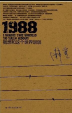

# 封面

# 简介
系列主题：《我想和这个世界谈谈》

在韩寒主编的杂志《独唱团》中连载，这是韩寒预谋已久的一个系列，也是国内首度实际尝试“公路小说”这一概念的第一本——《1988》。

所谓“公路小说”就是以路途为载体反应人生观，现实观的小说。

如果说一件真正的艺术品的面世具有任何重大意义的话，韩寒新书的出版将会在中国创造一个历史事件，文章开头“空气越来越差，我必须上路了。我开着一台1988年出厂的旅行车，在说不清是迷雾还是毒气的夜色里拐上了318国道。”用一部旅行车为载体，通过在路上的见闻、过去的回忆、扑朔迷离的人物关系等各种现实场景，以韩寒本人对路上所见、所闻引发自己的观点，这场真正的旅途在精神层面；如果说似乎逾越了部分法律和道德的界限，但出发点也仅仅是希望在另一侧找到信仰。韩寒是“叛逆的”，他“试图用能给世界一些新意的眼光来看世界。试图寻找令人信服的价值”。他认为这一切通过文学都可以实现，产生了要创造一种批判现有一切社会习俗的“新幻象”的念头——《1988》就此问世。

目前“公路小说”的系列已经开始策划，韩寒的作品首当其冲，韩寒表示将会撰写三部作品与聚石文华联合打造“公路小说”这一品牌。

# 云图

