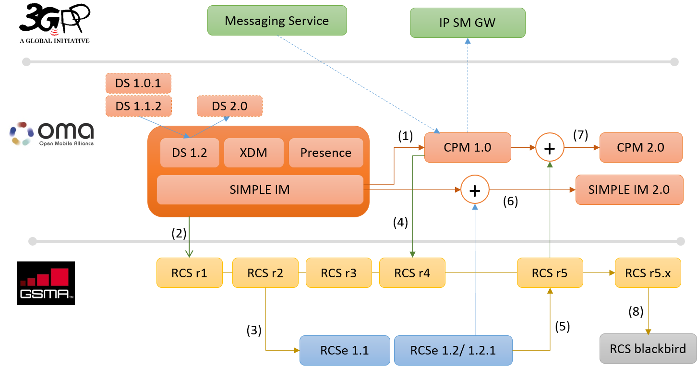

市场需求推动了丰富通信服务技术标准的发展.开放移动联盟（OMA）基于IMS和SIP技术指定了SIMPLE IM和融合IP消息系统（CPM）的技术细节.这种技术的概念反映了2000年代中期左右流行的基于PC的消息传送服务.自2000年代后期左右智能手机时代以来、以运营商为中心的生态系统开始崩溃、许多OTT（Over-The-Top、通信服务）通信服务开始在市场上以其免费短信和语音通话服务起飞、从而威胁到传统 运营商的收入.运营商通过提出GSMA指定的丰富通信套件（RCS）技术来应对这些威胁.RCS的标准仍在不断发展、其中纳入了上市时间服务功能的各种要求、并考虑了商业模式。

# I. 导言

    当GSM协会（GSMA）于2011年4月首次指定富通讯套件演变（RCSe）标准、品牌名称为“Joyn”时、许多全球电信公司预计Joyn可能成为与现有和突出OTT服务、如Whatsapp、Viber、Line等。从运营商的角度来看、这些OTT服务通过搭载电信公司的既有基础设施而大幅增长、他们甚至通过免费提供免费电话服务的收入来源mVoIP和消息服务功能。在韩国、三大电信公司（即SKT、KT和LG U +）于2012年底开始提供Joyn服务、而在欧洲、特别是西班牙和德国、沃达丰和Orange等全球性公司也开始提供相同的服务。从那时起已经差不多三年了。与最初的猜测不同的是、这些国家的Joyn服务并没有得到很大的普及、而OTT服务在市场上稳步增长。这使得大多数尚未开始服务的电信公司仍然犹豫推出自己的服务。即使那些已经提供服务的人也对他们的服务进一步投资犹豫不决。尽管Joyn的普及程度不高、Rich Communication Suite（RCS）技术以及GSMA的相关规范一直在不断发展以跟上市场趋势。本文将略述全球标准方面不断演变的通信技术路线图、这将有助于您更好地了解电信行业如何努力符合市场趋势。

# II. IP消息系统服务的出现以及向融合IP消息系统的演进

   开放移动联盟（OMA）将SIMPLE IM技术指定为早在2000年代中期的第一个基于IP的消息传递技术.SIMPLE IM提供典型的基于SIP的消息功能、例如一对一和群组会话消息（即聊天）。这SIMPLE IM成为通信技术的以下技术标准的基础。自2005年以来、OMA MWG工作组（现称COM WG）开始开发融合IP消息（CPM）技术（图1中的[1]）、该技术采用了SIMPLE IM的许多服务特性和技术.CPM通过将传统消息服务（例如、SMS、MMS、电子邮件等）集成到IP聊天功能、语音流、视频流等新服务中来提供融合通信服务功能.CPM还提供了一些功能、特别针对拥有多台设备的用户、为他们提供融合的通信环境和跨设备的一致用户体验。严格地说、即使在OMA提出OMA CPM之前、融合通信环境和一致的用户体验已经通过基于PC的信使服务（例如ICQ、AOL、MSN信使等）被用户广泛接受。此类第三方服务已经在IP网络之上提供了聊天、状态信息共享、SMS / MMS集成、文件传输、对话历史备份等多项服务。因此、OMA的此类标准活动可以被解释为许多全球运营商为移动环境带来类似用户体验的努力、希望通过提供那些已被证明是成功的服务功能来增加另一个收入来源网络。
Snipaste_2018-05-16_19-16-10.png
# III. OTT vs运营商

  自iPhone在21世纪后期进入市场以来、所有设备制造商开始推出自己的智能手机。这些新型智能手机的到来改变了电信行业生态系统中的许多事情。感谢Apple的AppStore和Google Android Market（现在称为Google Play）、第三方应用程序开发人员可以自己成为服务提供商。以运营商为中心的垂直价值链崩溃、大量第三方服务开始免费开放。许多技术领导者开始声称运营商最终会成为一个愚蠢的管道。由于消费者渴望坚持免费的OTT服务、运营商失去了市场上的谈判权力。有一些企图限制OTT服务的流量。然而、它被网络中立的名称所禁止、被市场和法律所禁止。一些OTT服务、如Viber、Line、Whatsapp成为消息传播市场的英雄、因为它们蓬勃发展。许多成功抢占智能手机时代早期市场的第三方服务开始超越传统运营商。随着OTT突出服务的出现、运营商开始失去传统的关键领域、例如短信和语音通话。成功锁定早期市场的OTT服务提供商由于锁定效应而不断增长。运营商消息业务的收入随着流量而下降。市场上的这些激进变化促使全球运营商聚集到GSMA、寻找抵御OTT服务威胁的方法。他们决定启动GSM协会的RCS项目、以提供丰富的基于IP的通信服务。规定了RCS服务要求、并且OMA SIMPLE IM和CPM采用了许多满足要求的技术细节.RCS规范已经开发并发布到RCS r4.0（图1中的[2]、[4]）。

# IV. JOYN
Snipaste_2018-05-16_19-16-26.png
 RCS r4.0包含OMA SIMPLE IM和CPM的大部分高级功能。然而、没有运营商提出RCS服务、因为他们对服务的益处和可行性持怀疑态度。由于涉及技术困难和各种服务功能、实施RCS r4.0可能看起来过于复杂。虽然运营商正在制定技术标准、并且由于任何原因而不愿意建立RCS服务、但OTT用户的数量在市场上飙升、导致运营商的收入进一步下降。考虑到这种情况、运营商可能会觉得他们需要一个上市时间的服务、这种服务很简单、可以在短时间内建立起来。作为这种讨论的结果、他们想出了一个简单的RCS服务叫做“Joyn”。该服务基于RCSe、最后更新为RCSe r1.2.2（图1中的[3]）.RCSe r1.2.2的主要功能如下：主设备（即PS访问设备）的基于HTTP的配置设置：向RCS设备提供服务相关配置.服务能力发现：查找具有RCS功能的联系人的程序.IP消息系统（即一对一聊天、群聊）存储和转发一对一聊天：如果收件人RCS用户不可用、暂时存储邮件、然后在用户可用时转发邮件.一对一的文件传输基于GSMA的图像共享[IR.79]：与同伴进行语音通话的实时图像共享.基于GSMA的视频共享[IR.74]：与同伴进行语音通话的实时视频共享.社交呈现信息共享（即匿名获取、可选）：查看联系人的社交呈现信息、如肖像图标、自由文本、最爱链接、可用性等。

# V. 在RCS中采用CPM体系结构

在RCS工作之初、GSMA RCS采用了OMA SIMPLE IM架构。当RCS更新到r4.0时、它通过采用OMA CPM更新了架构、该架构在SIMPLE IM架构之上引入了更多组件、即基于网络的消息存储和互操作功能。基于网络的消息存储用于存储RCS用户的对话历史记录、并在用户的多个设备上同步对话历史记录。互通功能用于将诸如SMS和MMS之类的传统消息服务集成到网络侧.OMA CPM中的电子邮件互通功能未包含在RCS中。
Snipaste_2018-05-16_19-17-04.png

# VI. RCS r4和RCSe合并到RCS r5.x中

 GSMA RCS r5基于RCS r4和RCSe r1.2.2（图1中的[5]）。两者的所有技术和服务功能已合并到RCS r5中。截至目前、RCS r5已经发展到RCS r5.4.RCS r5.x打算整合基于IP网络的所有通信功能。诸如SMS和MMS之类的传统消息服务已集成到IP Chat功能中.IP语音/视频呼叫功能与VoLTE服务集成在一起、并支持各种补充业务。所有这些通信服务都通过集成的UX / UI呈现给用户.RCS r5.1的主要特性可概括如下：在RCS r5.1中扩展了配置调配、以适应非PS接入设备和RCS用户的辅助设备。还添加了许多配置参数.独立消息传递提供了与SMS / MMS相同的用户体验、因为两者都是无会话通信。根据要发送的消息的大小、在独立消息中定义了两种模式：Page寻呼模式消息传送（<= 1,300字节）Large大消息模式消息传送（> 1,300字节）IP内的多媒体聊天会话已被允许在RCS r5.1中.RCS用户可以在IP聊天会话中发送多媒体内容。如果多媒体内容大于聊天会话允许的内容、则使用文件传输机制发送。文件传输会话将与现有聊天会话分开、以便并行处理。即使当内容作为文件传送发送并且在单独的会话中时、RCS用户仍然可以在现有聊天会话的相同对话上下文中查看传送的多媒体内容.群聊中的存储和转发提高了群聊过程中消息传递的可靠性。由于连接丢失、电池电量耗尽等原因导致与群组会话非自愿断开的参与者可以在设备重新连接后重新加入群组会话。重新加入的参与者可以接收所有在断开连接时错过的RCS消息（基本存储和转发）。即使是迟到参加集体会议的人也可以收到完整的对话历史记录（完整存储和转发）.Group会话重启（Long Lived Group）捕捉OTT服务中提供的当前用户体验、用户可以通过在存储在本地设备中的会话线程发送任何消息来开始聊天会话。在RCS r5.1中、如果闲置计时器过期、则会发布群聊会话。在群组会话关闭后、只要不删除它、对话历史将保留在参与者的本地设备中。因此、任何用户都可以通过在对话历史记录线程中发送新的聊天消息或文件来重新启动相同的群组会话。为了重新启动组会话、组会话标识应保存在RCS系统中。如果由于相应的组会话标识符已从RCS系统中删除而无法重新启动组会话、RCS客户端可能会自动尝试启动新的组会话.基于HTTP和MSRP的文件传输用于HTTP或MSRP进行文件传输。在使用HTTP的情况下、要发送的文件由发起者上传到网络中的特定内容存储器、并且获得存储的对象的位置URL作为回报。位置URL通过聊天会话或作为独立消息发送给收件人。收件人可以从收到的位置URL中检索文件.文件传输缩略图预览用于在文件传输请求中将缩略图连同其他文件信息（如文件名、文件类型、文件大小等）发送给收件人。接收方RCS用户可以根据此信息确定是否接受文件传输请求.文件传输暂停和恢复用于在文件传输过程中暂停文件传输、并在需要时恢复。由于其他原因、文件传输也可能会意外暂停、例如连接丢失。如果稍后由最终用户恢复文件传输、则可以从暂停的位置传输文件。要在多设备环境中恢复暂停传输、RCS用户需要使用相同的设备。否则、文件传输将从头开始、因为该设备中没有文件片段.文件传输存储和转发用于在收件人不可用时临时存储文件、然后在收件人变为可用时再将其传输.组会话中的文件传输用于在组会话的上下文中传输文件.通过调整RCS用户的位置信息、RCS r5.1丰富了社交存在信息。社交存在信息应该由已经建立了社交存在关系的RCS用户共享.VIP联系人是实时向RCS用户通知其社交呈现信息变化的联系人类型。如果与RCS用户处于社交在线关系的联系人不是VIP联系人、则RCS用户需要对该联系人执行一次性订阅以查看他/她的社交呈现信息.基于网络的个人黑名单可以由RCS用户创建/删除/修改。来自黑名单中的联系人的任何RCS消息或通信尝试都将被阻止.地理位置共享推/拉用于在RCS用户之间共享地理位置信息.RCS用户可以将他/她的位置信息推送到RCS联系人（推送）或请求联系人的位置信息（拉）.内容共享用于在RCS用户之间实时共享图像或视频剪辑。在RCSe中、内容共享功能依赖于现有的语音呼叫会话、这意味着内容共享功能仅在存在语音呼叫会话时才可用。而RCS r5.1中的内容共享功能独立于语音呼叫会话.RCS用户可以使用内容共享服务作为独立的服务功能.基于网络的消息存储用于存储RCS用户的对话历史记录。存储在基于网络的消息存储器中的对话历史可以与RCS用户的一个或多个设备同步。基于网络的消息存储功能为用户提供跨多个设备的一致用户体验.传统消息互通是RCS r5.1的一项支持功能、包括SMS和MMS。鉴于此功能、无论消息类型如何、所有对话历史都集成在同一个对话线程中。IP语音/视频呼叫和VoLTE与IP聊天功能一起集成在RCS r5.1中。

# VII. SIMPLE IM 2.0

   由于开始时RCS采用了OMA SIMPLE IM 1.0、因此RCS已经发展并具有其他功能.OMA SIMPLE IM 2.0有意填补RCS和SIMPLE IM之间的空白（图1中的[6]）.在一对一IM会话内发送即时消息通知提供会话外通知存储和转发在一对一IM内发送的消息和通知

# VIII.CPM 2.0

  CPM 1.0体系结构被RCS r4.0所采用、而RCS r4.0已经发展成适用于RCSe特性的RCS r5.x。与SIMPLE IM 2.0类似、OMA CPM 2.0有意填补RCS和CPM 1.0之间的差距（图1中的[7]）.CPM 2.0还包含了对以前版本的一些澄清.在群组会话中存储和转发支持封闭群组、长期存活群组支持聊天消息的实时录像通过SIMPLE IM 2.0与网络接口（NNI）互通在进行CPM会话时进行文件传输存储并在文件传输中转发文件传输暂停和恢复支持最大文件大小策略支持文件传输中的缩略图预览

# IX. RCS blackbird

按照时间顺序来说、只是在RCS r5.1发布之后才推出了RCS blackbird（图1中的[8]）。然而、从服务特性的角度来看、RCS blackbird是RCSe和RCS r5.x之间的中间版本.RCS黑鹂包括除存在相关功能外的大部分RCSe功能。它还具有RCS r5.x中的许多功能、以提供类似的用户体验。例如、RCS blackbird通过设备内的RCS和SMS / MMS客户端之间的内部互通、在UX / UI级别上集成了传统消息功能。目前、RCS blackbird已经升级到4.0版本。

# X、总结

  RCS服务功能从RCSe发展到RCS blackbird和RCS r5.x. RCSe包含基本的IP聊天功能、RCS blackbird侧重于从UX / UI角度看消息传递和集成通信.RCS r5.x集成了IP聊天、传统消息传递、IP语音/视频通话、VoLTE服务等所有功能、为用户提供统一的用户体验。从功能上看、名为“Joyn”的RCS技术似乎超越了现有的OTT功能。用户在打电话或发短信时可享受与以前的通信服务相同的用户体验、同时基于RCS带给IP网络的优势、丰富用户体验。虽然GSMA正在提供上市时间服务要求、但OMA正在提供技术细节以通过升级SIMPLE IM和CPM来支持这些要求.3GPP正在从核心网的角度与GSMA和OMA合作、考虑技术细节的实施。通过这种方式、许多标准开发组织（SDO）正在彼此协调工作、以提出具有竞争力的通信服务特性和技术。

# 参考
[1] GSMA, “RCS-e Advanced Communications: Services and Client Specifications”, v1.2.2 July
[2] GSMA, “Rich Communication Suite 5.1 Advanced Communications: Services and Client Specifications”, v4.0 November
[3] OMA, “OMA-RD-IM-V2_0-20120731-C”, v2.0 July
[4] OMA, “OMA-RD-CPM-V2_0-20130611-C”, v2.0 June 2013