# 第三章 架构
## 3.1 架构图

本节定义了支持远程配置eUICC所需的功能架构. 该体系结构的基本组成部分包括要执行的功能，角色（Role）和分配的参与者（Actors）. 下图显示了eUICC远程供应系统. 第3.3节和附录A中描述了角色的细节，相关的功能和接口.

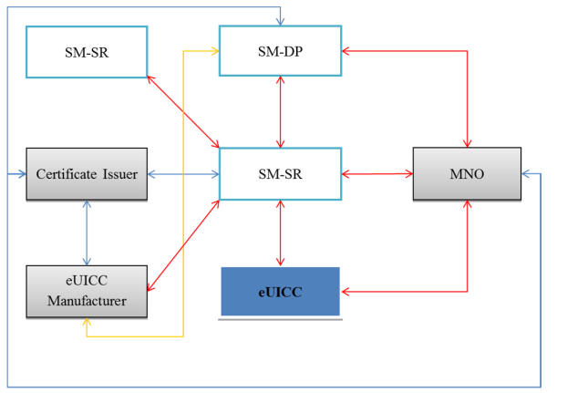

## 3.2卡体系结构
### 3.2.1安全域
GlobalPlatform提供了安全域（SD）的概念.这些是离卡(off-card)实体的卡内(on-card)代表，提供：
- 用于加密密钥的安全存储; 
- 使用（GP）安全通道协议访问离卡实体; 
- 加载应用程序的机制; 
- 应用程序的安全服务.
通过配置密钥（例如用于SCP02 / 03或SCP80 / 81）以及通过将SD与另一个SD关联来配置SD的属性（例如授权或授权管理，DAP验证，令牌管理，全局删除）与其他权利相关联，将SD与其自身相关联（从而移除高级SD的所有管理权），或者为SD及其所有内容分配内存配额.在早期版本中，ISD（发行者安全域）具有几个独特的特权.但是，在最新的GlobalPlatform Card Specification [GPCS]中，它也是通过权限进行配置的，除了在开始之前，没有一个主要的特定功能.这应该使移动网络运营商能够享受到与UICC当前的ISD一样的优势.

前进的方向是：
- 在SD结构上构建eUICC，以及
- 定义其他属性（例如通过权限），以便不同的SD可以表示远程配置profile中各种角色的Actor. 

### 3.2.2卡体系结构
本节描述如何设计Profiles，例如，使用Global Platform Card Specification [GPCS]的概念和信息模型的扩展版本.profile包含在eUICC的安全域（SD）中，从而使SD的安全机制可用.更多信息可以在[GPCS]中找到.下图概述了eUICC的示意图.
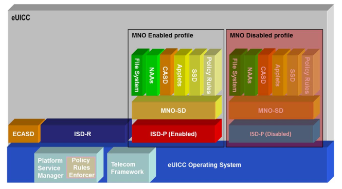

操作系统（OS）包含基本的平台特征，例如支持GlobalPlatform Card Specification [GPCS]中定义的功能.

ECASD（eUICC认证机构安全域）：
- 在制造时在eUICC内创建; 
- 交货后无法删除或禁用; 
- 基于全球平台CASD的概念（见[GPCS]，[AmdA]和[AmdE]）; 
- 由eUICC制造商在颁发前配置; 
- 包含不可修改的eUICC私钥，相关证书，CI的根公钥和用于密钥/证书续订的EUM密钥集; 
- 与提供底层安全OTA通道的ISD-R相关联; 
- 对ISD-P和ISD-R中的新密钥集的建立，但不限于此; 
- 不支持强制DAP验证功能. 

ISD-R和ISD-P是具有特殊功能的安全域. 
ISD-R（ISD-Root）是执行平台管理命令的SM-SR的卡上代表（请参阅第3.3.1.3节中的平台管理功能）. 
ISD-R应：
a）在制造时在eUICC内创建; 
b）与SM-SR相关联; 
c）不被删除或禁用; 
d）使用平台管理证书（[管理]中定义的SCP80或SCP81）向SM-SR提供安全的OTA通道; e）实施支持SM-SR变更的密钥建立协议; f）在profile下载期间提供运输部分的包装和解包服务; g）能够创建具有所需内存配额的新的ISD-Ps（注：内存配额管理有待进一步研究）; h）除ISD-P外无法创建任何SD; 
i）按照政策规定执行平台管理职能; 
j）不能在ISD-P内执行任何操作. 

ISD-P（ISD-Profile）是移动网络运营商的现场代表，或者是MNO授权的SM-DP. 
ISD-P应：
a）在eUICC上成为一个独立的独立实体
b）包含文件系统，NAA和政策规则等profile; c）包含与创建，启用和禁用profile相关的状态机; d）包含用于加载和安装阶段的profile管理的密钥; e）实施密钥建立协议，为ISD-P的个性化生成密钥集; f）能够接收和解密，加载并安装由SMDP创建的Profile; g）安装profile后，能够将自己的状态设置为禁用状态; h）提供SCP03能力以确保与SM-DP的通信; 
i）能够包含CASD.此CASD在profile中是可选的，并且只在profile处于启用状态时才提供服务. 

MNO-SD是MNO的卡上代表.
MNO-SD应：
j）与自身相关联; 
k）包含MNO OTA密钥; l）提供安全的OTA通道（[102225]和[102226]中定义的SCP80或SCP81）; 
m）有能力托管补充安全域.

一旦profile安装在eUICC的ISD-P上，profile和ISD-P应被认为是联合的，此后它就是被管理的ISD-P的状态.在装载和安装阶段，SM-DP执行ISD-P上的profile管理功能（请参阅第3.3.1.2节）.一旦profile启用，MNO-SD由MNO OTA平台管理. MNO-SD以与当前UICC的ISD等效的方式进行管理.

平台服务管理器是提供平台管理功能和策略规则强制机制（策略规则强制实施器）的操作系统服务.它由ISD-R或ISD-P调用，它根据策略规则执行功能（参见第3.6节）.另外，它可以检索可以根据请求与授权实体共享的ISD-P通用信息（即profileID，profile状态）.

电信框架是一项OS服务，为ISD-Ps中托管的NAA提供标准化的网络认证算法.此外，它还提供了使用所需参数配置算法的功能.包含在ISD-P中的是公知的具有应用的卡结构，用于其他实体的SD，文件系统（MF树，ADF等）（根据ETSI TS 102 221 [102221]和3GPP TS 31 102 [31102 ]）和政策规则. 

### 3.2.3 ISD-P的状态图
ISD-P的状态和状态转换如下：
在创建ISD-P并建立密钥后，SM-DP代表MNO创建SD ，应用程序，NAA和文件系统.安装profile时，SM-DP将ISD-P的状态设置为禁用状态，从而有效地将其交给SM-SR进行平台管理.

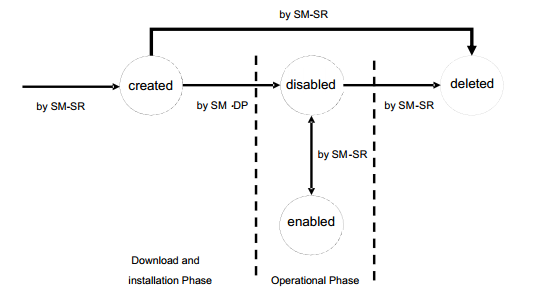

在上图所示的创建状态下，profile被下载并安装在ISD-P中.在创建，禁用或删除状态下，profile对机器不可见以便机器设备

## 3.3相关角色和功能
本节介绍并定义支持远程配置嵌入式UICC所需的相关角色和功能.这些函数描述了角色内部执行哪些操作，或者与架构的另一个角色或实体进行通信时执行了哪些操作.该角色与该角色分配给的业务角色不可知. 

### 3.3.1功能定义
#### 3.3.1.1数据准备功能
##### 3.3.1.1.1非个性化profile创建
非个性化profile创建包括基于MNO profile描述和eUICC目标类型构建非个性化profile. SM-DP使用目标eUICC的EUM提供的服务，脚本，工具或文档生成非个性化profile. SM-DP和EUM之间交换的信息不是标准化的，可能因不同实体而有所不同.假定SM-DP用目标eUICC的样本测试非个性化profile. MNO通过测试使用由SM-DP开发的非个性化profile创建的测试个性化profile个性化的目标eUICC的样本来验证非个性化profile.

##### 3.3.1.1.2profile订购
profile订购包括由SM-DP根据MNO向SM-DP提供的输入数据准备和生成个性化profile的过程.输入数据包括（但不限于）：
- 要生成的profile的数量; 
- IMSI值或范围; 
- ICCID值或范围; 
- 非个性化的profile类型; 
- 有关目标eUICC的信息，例如EID. 
MNO向SM-DP提供输入数据的方式和时间超出范围. 

##### 3.3.1.1.3个性化数据的生成
该功能基于由MNO提供的输入数据（例如，IMSI，ICCID）在安全环境中创建证书和密钥值（例如，NAC，PIN，OTA密钥）. 

##### 3.3.1.1.4profile个性化
SM-DP根据MNO下达的命令将个性化数据插入到非个性化profile中.此功能解决了确保创建的个性化profile只能安装在特定eUICC上的过程. 

##### 3.3.1.1.5 EUM服务，脚本，工具或文档
为允许任何SM-DP在任何eUICC上承担上述功能，EUM提供的服务，脚本，工具或文档必须至少支持以下eUICC属性由MNO交付.某些属性与非个性化profile创建的功能有关，有些属性与profile个性化有关，在某些情况下，它们适用的功能可能取决于特定的eUICC.这些属性包括：
- 要加载的应用程序（和应用程序的分配） - 包括USIM，ISIM，CAT和第三方应用程序SSD; 
- eUICC平台内的算法选择，算法参数分配和算法参数加载; 
- 应用密钥和PIN分配和加载; 
- USIM应用程序文件结构中的可选和可变数据字段; 
- 支持其他应用程序的附加数据字段和文件结构 - 基于SIM和基于设备的应用程序. 

SM-DP和EUM之间交换的信息不是标准化的，可能因不同实体而有所不同.

#### 3.3.1.2profile管理的功能
##### 3.3.1.2.1 eUICC资格验证功能
eUICC资格验证功能包括以下几个方面：
•验证目标eUICC是否正在安装profile. 
•验证eUICC认证. 

##### 3.3.1.2.2profile下载和安装功能
这涉及将个性化profile下载和安装到目标eUICC中. 

##### 3.3.1.2.3profile内容更新功能
这是通过MNO OTA平台实现的. 

##### 3.3.1.2.4策略规则更新功能
这包括策略规则的更新.要更新的策略规则可能是SM-SR中的策略规则，或者是eUICC上的ISD-P中已安装的profile中的策略规则. 

#### 3.3.1.3平台管理功能
##### 3.3.1.3.1 ISD-P创建功能
该功能用于在eUICC中创建ISD-P，以准备要加载的profile内容. 

##### 3.3.1.3.2 ISD-P删除功能
这涉及删除ISD-P. ISD-P删除是ISD-P以及之前加载并安装在eUICC上的内容的永久性删除.只有在禁用状态时才能删除ISD-P（见3.2.3节的状态图）. 

##### 3.3.1.3.3主删除功能
无论profile的策略规则如何，它都会处理删除没有设置回退属性的孤立profile.该功能将删除profile及其ISD-P.只有profile处于禁用状态时才能删除profile. 

##### 3.3.1.3.4profile启用功能
这涉及启用profile.这将使profile中的应用程序和文件可见并可由机器选择，以便机器受到相关访问控制. 

##### 3.3.1.3.5profile禁用功能
这涉及禁用profile.这将使profile中的所有应用程序和文件不可见，并且不被机器选择以加密设备. 

##### 3.3.1.3.6设置回退属性
这涉及对所述eUICC 

##### 3.3.1.3.7传送功能
运输功能的资料（或多个）的回退属性的设置是指SMSR之间的通信信道的建立和eUICC上的ISD-R.此功能也解决了SM-SR和eUICC之间传输通道的安全问题.注意：SM-SR可以通过不同类型的网络系统（如GSM，GPRS，UMTS或EPS）联系机器到机器设备中的eUICC.此外，SM-SR将需要与相关的网络系统进行相应的接口.例如，SM-SR需要使用SMPP才能与SMS通信，或者可能需要连接到IMS网关才能与eUICC建立基于IP的通信.这些通信由活动的订阅提供. 

#### 3.3.1.3.8策略执行功能
介绍eUICC和SM-SR策略规则的实施.

#### 3.3.1.4 eUICC管理的功能
##### 3.3.1.4.1 eUICC注册功能
该功能用于处理SM-SR中的eUICC. 

##### 3.3.1.4.2 SM-SR变更功能
处理eUICC的SM-SR变更. SM-SR变更是将eUICC的EIS从一个SM-SR转移到另一个SM-SR，并在新的SM-SR和eUICC之间在ISD-R中建立新的密钥集. 

#### 3.3.1.5 eUICC功能
##### 3.3.1.5.1回退功能
这涉及启用具有回退属性设置的profile.此功能会自动禁用当前启用的profile并启用配置了“回退属性”的profile.例如，在启用profile的网络连接永久丢失的情况下. 

### 3.3.2为相关角色和角色分配功能
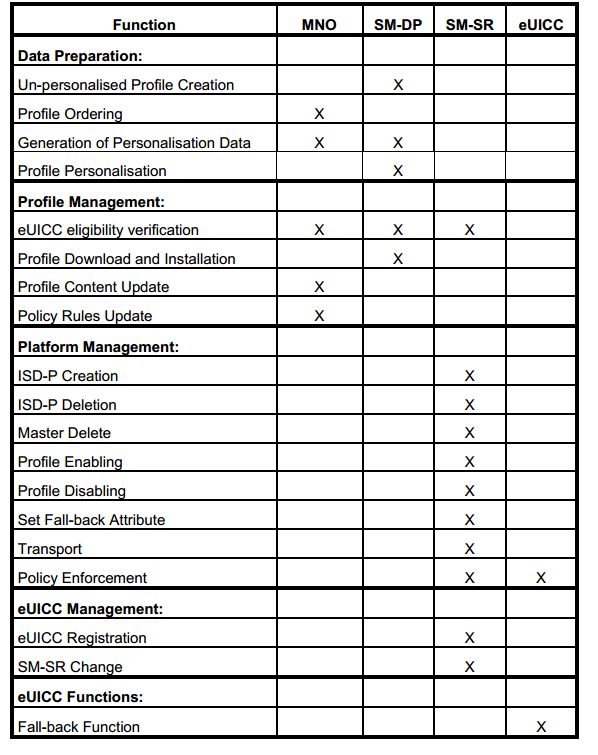 

## 3.4profile描述
### 3.4.1安装在eUICC上的profile的一般内容
以下数据是profile的一部分：•应用程序和（特别是3GPP TS 31.102 [31102]，3GPP TS 31.103 [31103]和ETSI TS 102 221 [102221]）中定义的文件.除上述内容外，以下数据未包含在上述标准中：
•与其相应的网络访问应用程序相关的算法参数（例如Milenage：OPc，ri，ci值）; 
•profile附加的策略规则（POL1）. 

### 3.4.2访问profile的内容
对于机器设备，启用profile相当于UICC.对于一个MNO OTA平台，启用资料相当于一个UICC按照ETSI TS 102 225 [102225]，TS 102 226 [102226]和TS 102 223 [102223].根据profile的其余内容，附加到profile的策略规则POL1通过MNO OTA平台进行管理.根据相关的ETSI和3GPP标准，已启用profile中的小程序将按照与UICC中的小程序相同的方式工作. 

## 3.5程序
本节描述的程序涉及业务环境的角色（例如，客户和服务提供者之间）和远程供应架构的实体（例如，eUICC和SM-SR之间）之间的交互.对于每个程序，描述主要步骤以及相关的“启动条件”和“结束条件”. “开始条件”描述了在执行程序之前必须保留的一组先决条件. “结束条件”描述了一系列结果，这些结果将在程序执行后保留.确定了eUICC和相关profile的配置和生命周期管理的以下主要程序：

### 3.5.1 SMU-SR中的eUICC注册
eUICC是根据给定标准制造的，一般独立于机器对机器设备制造商，移动运营商或服务提供商.机器制造商设备制造商可以选择符合其用途的任何认证的eUICC，并直接从EUM订购它所需的数量.作为生产过程和发货前的强制性步骤，EUM将eUICC注册到选定的SMSR.这意味着在其整个生命周期中相关的相关信息，特别是平台管理证书，供应MSISDN，都存储在SM-SR数据库中.没有这一步，就不可能远程访问eUICC.注意：假设在此阶段eUICC确实包含配给profile并链接到活动的配给订购.如何选择Provisioning运营商，并且EUM与Provisioning MNO之间的相关商业和技术协议的性质超出了本文档的范围.以下表示eUICC信息集的功能表示形式：

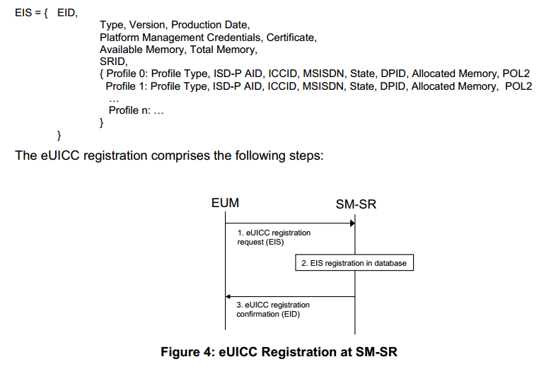
启动条件：
生成eUICC，并在配给运营商的网络中加载并激活配给profile.他们已经过测试并准备发货.每个eUICC都有相应的EIS.
过程：
1. EUM向包含EIS的选定SM-SR发送eUICC注册请求. 
2. SM-SR将EIS存储在其数据库中，并以EID作为关键参数. 
3. SM-SR确认向EUM注册成功.确认消息包含EID.

结束条件：eUICC在SM-SR上注册并准备好下载profile.现在可以将其运送到机器以加工设备制造商.

每个eUICC只能在一个SM-SR上注册. EUM和SM-SR之间的通信链路应是安全的.在器件制造过程中，eUICCs在注册和发货后嵌入到机器到机器设备中. 

### 3.5.2非个性化profile验证（专有）
在eUICC中，UICC的当前功能范围由profile表示.类似于传统UICC的验证，profile应由创建profileSM-DP的实体验证.为了由SM-DP验证profile，应使用与典型UICC类似的程序.其中一个差异是物理测试eUICC只能由SM-DP进行个性化设置.注意：profile验证过程和接口不是标准化的，并且可能在MNO和SM-DP之间不同（profile验证策略，MNO可能执行哪些测试，可能由SM-DP完成，可能会在MNO和SM-DP，这个接口如何保护等）.例如，简档验证过程可以包括以下步骤：开始条件：a. MNO已向SM-DP提供了profile描述，SM-DP已通过单独的过程生成了非个人化profile.b.SM-DP具有特定类型的样本eUICC.
过程：
1. MNO向选定的SM-DP提供测试订阅，以及小应用程序，POL1和profile类型等数据.其他数据，例如密钥或ICCID可由SM-DP生成. 
2. SM-DP创建一个测试个性化profile（非个性化profile，包含从MNO收到的数据），然后将其下载并安装到eUICC样本中. 3. SM-DP执行必要的验证程序来验证eUICC样本和测试个性化profile的组合.结束条件：非个性化profile有效，现在已准备好用于eUICC类型的profile订购步骤. 

### 3.5.3profile排序（专有）
在eUICC中，UICC的当前功能范围由profile表示.正如目前的UICC一样，Profile在MNO的责任下下令.应用相同的程序，唯一的区别在于UICC不是以实物形式生产，而是作为简档保存在SM-DP中.注意：profile订购流程和界面不是标准化的，并且可能因MNO而不同.例如，简档排序可以包括
例如，profile排序可以包括以下步骤：

开始条件：
a. SM-DP根据MNO提供的profile描述创建了非个性化profile.
b.MNO需要一定数量的eUICCprofile. 
C.非个性化profile已使用第3.5.2节中的非个性化profile验证程序在目标eUICC类型上进行了验证.

步骤：
1. MNO向选定的SM-DP提供订单.该订单包含生产数据，例如数量和Start-IMSI，IMSI范围或IMSI列表以及对非个性化profile类型的引用.策略规则的POL1和POL2定义稍后将分别由eUICC和SM-SR应用，也可以在此背景下提供. 
2. 然后SM-DP开始生产，即使用从MNO接收到的数据对profile进行个性化.其他数据，例如密钥或ICCID，可以由SMDP在个性化过程中生成.profile存储在SM-DP中. 
3. 向MNO确认订单完成，包括在MNO后端系统中注册个人档案所需的所有数据.每个profile至少由其ICCID唯一标识. 4. MMNO在相关系统中安装简档，例如HLR，AuC，CRM.这些程序与MNO当前的UICC注册程序没有区别.结束条件：profile的订购数量现在已准备好用于profile下载过程. MNO可以使用相关的运营商凭证. 

### 3.5.4profile下载和安装
为了使机器能够将Device用于通信服务，eUICC必须至少加载一个Operational Profile.通常，这将通过使用由当前启用的profile表示的订阅进行无线传输完成.如果没有启用其他操作profile，则使用配置profile.profile下载和安装过程遵循以下步骤：
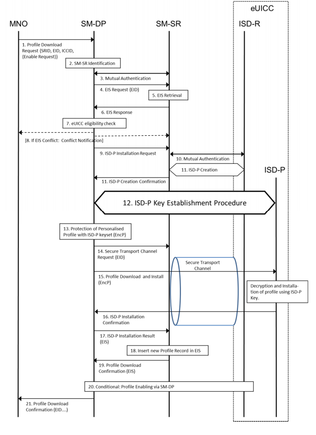

开始条件：
a.客户已经订阅了选定的MNO.
b.目标eUICC的EID和SRID为MNO所知. 
C.使用选定的SM-DP完成profile订购程序. 
d.目标eUICC被集成到一台机器中以加工设备并与SM-SR相关联.即MNO可以通过ICCID激活网络中的相关订阅.

过程：
1. MNO向SM-DP发送profile下载请求.该请求必须包括相关信息，以便识别SM-SR，目标EID和ICCID.移动网络运营商可能会要求SM-DP在下载和安装后启用该profile. 
2. 根据MNO提供的信息，SM-DP识别eUICC当前注册的SM-SR. 
3. SM-SR和SM-DP如果尚未认证，则相互认证. 
4. SM-DP向SM-SR请求由EID识别的特定eUICC的EIS. 
5. 基于EID，SM-SR检索EIS. 
6. SM-SR将来自EIS的相关信息发送给请求的SM-DP.注：说“来自EIS的相关信息”的基本原理是SM-SR不会向SM-DP提供不适用于特定SM-DP的信息. 
7. SM-DP根据从EIS收到的信息检查eUICC的资格（例如类型，证书和存储器）. 
8. 如果在eUICC资格的情况下检测到问题，则SM-DP会中止该过程，并向请求的MNO和SM-SR返回错误消息. 
9. 如果未检测到eUICC资格问题，则SM-DP向SM-SR发出ISD-P的安装请求. 
10. SM-SR和eUICC使用ISD-R中的密钥集，如果尚未认证，则相互认证. 
11. SM-SR联系eUICC上的ISD-R进行ISD-P安装，并在eUICC中创建一个空的ISD-P.这被确认回SM-DP. 
12. SM-DP验证eUICC，并在ISD-P和SM-DP之间建立共享密钥集.密钥建立过程在安全部分4.5中描述. 
13. 现在SM-DP选择个性化profile（例如，基于ICCID或profile类型）并使用新的ISD-P密钥集保护它，产生加密和完整性保护的profileEncP. 
14. SM-DP要求SM-SR在eUICC上的ISD-R和SM-SR之间建立安全传输信道.此安全传输通道用于保护Profile Management命令，而不是Profile本身. 
15. SM-DP通过使用SM-DP与eUICC上新创建的ISD-P之间的安全通道将EncP发送至eUICC，并在已建立的SMSR与安全通道之间的安全传输通道内发起profile下载与安装eUICC上的ISD-R. 
16. eUICC将安装结果和ISD-P的状态发送给SM-DP.profile的MNO所有者决定是否在profile安装结束时
profile的MNO所有者决定，在profile安装结束时，ISD-P中设置的SCP03密钥是否应由SM-DP移除，由SM-DP保留还是移交给MNO.注意：如果MNO决定密钥集由SM-DP保留，则MNO可以指示SM-DP在稍后的时间点切换或删除密钥集. 
17. SM-DP将安装结果和ISD-P的状态发送给SM-SR.此消息包含此profile的相关EIS元素. 
18. SM-SR更新其数据库.如果下载和安装成功，则SM-SR将新的Profile记录插入到EIS中，状态为“已禁用”. 
19. SM-SR确认profile下载和安装状态返回到SM-DP.此消息包含EIS的相关部分. 
20. 如果移动网络运营商要求SM-DP在下载和安装后启用profile，则SM-DP通过SM-DP程序执行profile启用（见3.5.7）. 
21. SM-DP确认下载和安装状态返回MNO.该消息可以包括EID和用于识别profile的信息.

结束条件：
已在MNU的eUICC中创建ISD-P，其中包含禁用或启用状态的profile. SM-SR相应地更新了此eUICC的EIS. MNO可以激活网络中的相关订阅. 

### 3.5.5主删除
此过程将删除没有回退属性的孤立profile，无论profile的策略规则如何.该程序的成功执行需要发起者和SM-DP的授权.注意：需要确定扮演发起人角色的角色.在下面的例子中，我们可以假设发起人将成为获得客户授权的新MNO. 
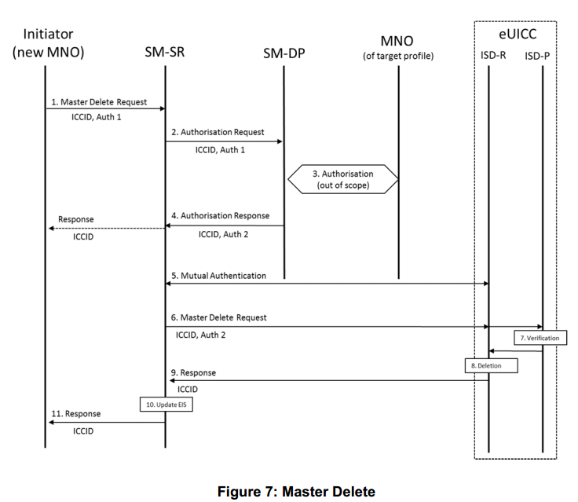

开始条件：
a.在eUICC上有一个孤立的profile，例如，阻止加载另一个profile.
b.无法使用正常ISD-P删除程序删除孤立profile. 
C.发起人决定删除eUICC上的孤立profile. 
d.孤立profile被禁用.

过程：
1. 发起者向SM-SR发送主删除请求.该请求包括目标profile的目标EID和ICCID（或其他唯一标识符）.该请求包括主删除的发起者授权（Auth 1）. 
2. SM-SR将授权请求与发起者授权（Auth 1）一起发送到与目标profile相关联的SM-DP. SM-DP验证授权（验证1）. 
3. SM-DP还向目标profile的MNO所有者请求授权.注意：此接口的定义超出了本文的范围. 4.如果MNO授权删除或MNO没有响应，则SMDP向SM-SR发送包含SM-DP授权（Auth 2）的响应以用于主删除.如果SM-DP没有授予主要删除权限，SM-SR将通知发起者. 5. SM-SR和eUICC使用ISD-R中的密钥集，如果尚未通过身份验证，则彼此进行身份验证. 
6. SM-SR将主删除请求发送给eUICC上的ISD-R.该请求包括目标profile的ICCID（或其他唯一标识符）以及SM-DP的授权（Auth 2）. 
7. 目标profile的ISD-P验证授权，从而验证主删除命令. 
8. ISD-R在没有实施策略规则的情况下删除目标profile和相关的ISD-P. 
9. ISD-R将主删除的状态报告给SM-SR. 
10. SM-SR相应地更新EIS. 
11. SM-SR将主删除的状态报告给启动器.结束条件：目标profile从eUICC中删除. SM-SR中的EIS是最新的. 

### 3.5.6profile启用
两个profile之间的切换可以通过以下专用过程来实现.在这种情况下，请求由MNO直接发送到与目标eUICC相关联的SM-SR. 
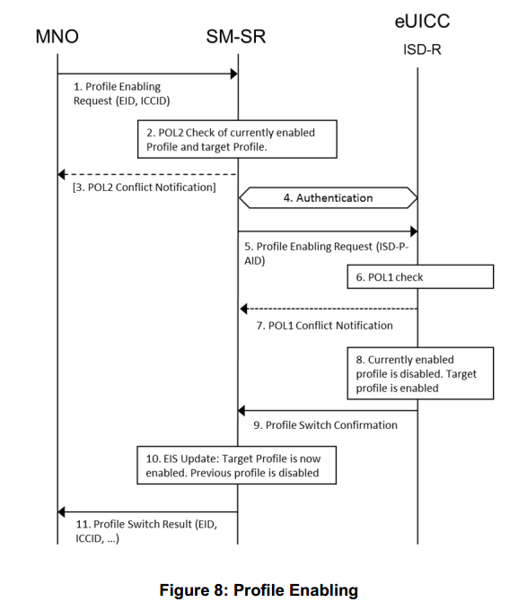

开始条件：
a.目标profile在eUICC上被禁用.其他profile已启用.
b.与目标profile相关的订阅在MNO的网络中处于活动状态. 
C.目标eUICC的EID，与目标简档相关联的SRID以及目标简档的ICCID为MNO所知.

过程：
1. MNO向SM-SR发送profile启用请求.该请求包括目标EID和至少目标profile的ICCID（或其他唯一标识符）. 
2. SM-SR检查当前已启用profile和目标profile的POL2是否允许进行profile切换. 
3. 如果与POL2发生冲突，SM-SR将中止程序并相应地通知相关的MNO. 
4. SM-SR和eUICC使用ISD-R中的密钥集，如果尚未通过身份验证，则彼此进行身份验证.5.如果与POL2没有冲突，则SM-SR向eUICC上的ISD-R发出配置启用请求，包括至少目标profile的ISD-P AID. 
6. eUICC执行POL1检查. 
7. 如果与POL1发生冲突，ISD-R会中止程序并通知SMSR. 
8. 如果与POL1没有冲突，则ISD-R执行profile开关，导致启用目标profile并禁用先前启用的profile. 
9. ISD-R将profile切换结果报告给SM-SR. 10.如果交换机成功，则SM-SR在EIS中记录目标profile已启用且先前的profile已禁用. 11.SM-SR将profile切换结果报告给MNO.这些消息将包括其各自简档的EID和ICCID（或其他唯一标识符）.结束条件：目标profile在eUICC上启用.先前启用的profile被禁用. EIS是最新的. 

### 3.5.7通过SM-DP启用
profile通过以下专用程序可以实现两个profile之间的切换.在这种情况下，MNO向SM-DP发出请求，SM-DP将其转发给与目标eUICC相关联的SM-SR.这样，MNO就不必链接到SMSR，并依靠SM-DP进行连接. 
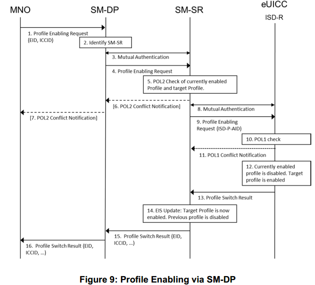

开始条件：
a.目标profile在eUICC上被禁用.其他profile已启用.
b.与目标profile相关的订阅在MNO的网络中处于活动状态. 
C.目标eUICC的EID，目标profile的SRID和ICCID为MNO所知.

过程：
1. MNO向SM-DP发送profile启用请求.该请求包括目标EID和至少目标profile的ICCID（或其他唯一标识符）. 
2. SM-DP识别相关的SM-SR. 
3. SM-SR和SM-DP如果尚未认证，则相互认证. 
4. SM-DP将profile启用请求转发给SM-SR. 
5. SM-SR检查当前启用的profile和目标profile的POL2是否允许profile切换发生. 
6. 如果与POL2发生冲突，SM-SR将中止该程序，并将请求的SM-DP和SM-DP或MNO通知禁用的profile. 
7. 如果与POL2发生冲突，错误消息由SM-DP转发给请求的MNO. 
8. SM-SR和eUICC使用ISD-R中的密钥设置，如果尚未认证，则相互验证. 
9. 如果与POL2没有冲突，则SM-SR向eUICC上的ISD-R发出配置启用请求，包括至少目标profile的ISD-P AID. 
10. eUICC执行POL1检查. 11.如果与POL1发生冲突，ISD-R将中止程序并通知SMSR. 
12. 如果与POL1没有冲突，则ISD-R执行profile开关，导致启用目标profile并禁用先前启用的profile. 
13. ISD-R将profile切换结果报告给SM-SR. 14.如果交换机成功，则SM-SR在EIS中记录目标profile已启用且先前profile已禁用. 
15. SM-SR将profile切换结果报告给请求的SM-DP以及禁用的profile的SM-DP或MNO.这些消息将包括其各自简档的EID和ICCID（或其他唯一标识符）. 16. profile切换结果被转发给请求的MNO.

结束条件：
目标profile在eUICC上启用.先前启用的profile被禁用. EIS是最新的. 

### 3.5.8profile禁用
profile禁用可以通过以下过程来实现.该请求由MNO直接发送到与目标eUICC相关联的SM-SR. 
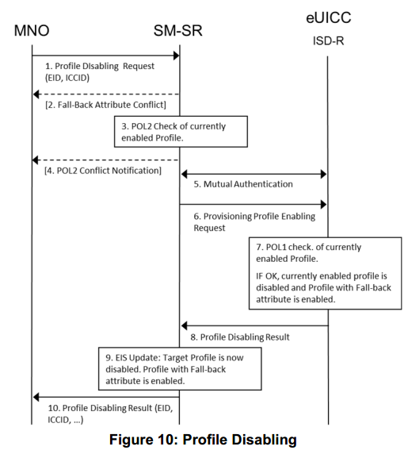

开始条件：
在eUICC上启用目标profile.

过程：
1. MNO向SM-SR发送profile禁用请求.该请求包括目标EID和至少目标profile的ICCID. 
2. 如果用于禁用的目标profile是设置了回退属性的profile，则不会执行profile禁用. 
3. SM-SR检查已启用profile的POL2是否允许禁用profile
4. 如果存在POL2冲突，则SM-SR中止该过程并向MNO发送错误消息. 
5. SM-SR和eUICC使用ISD-R中的密钥集，如果尚未通过身份验证，则彼此进行身份验证. 
6. 如果没有POL2冲突，则SM-SR向具有回退属性集的profile的eUICC上的ISDR发出profile启用请求. 
7. eUICC对当前启用的profile执行内部POL1检查.如果允许，则启用的profile将被禁用，ISD-R将启用配置了“回退属性”的profile. 
8. ISD-R向SM-SR发送profile禁用结果. 
9. 如果禁用成功，则SM-SR在EIS中记录目标profile被禁用. 
10. SM-SR将profile禁用结果报告给MNO.该消息包括profile的EID和ICCID.

结束条件：现在在eUICC上禁用了目标profile，并启用了具有故障预置属性集的profile. 

### 3.5.9 ISD-P删除profile可以被其MNO删除. 
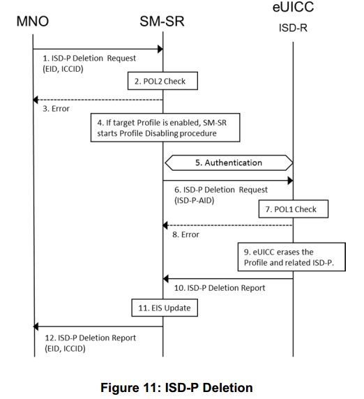

启动条件：
MNO决定永久删除eUICC上的profile.

过程：
1. MNO向SM-SR发送ISD-P删除请求.该请求包括目标profile的目标EID和ICCID（或其他唯一标识符）. 
2. SM-SR检查目标profile的POL2. 
3. 如果与POL2发生冲突，则SM-SR中止该过程并相应地通知MNO 
4. 如果目标profile已启用，则SM-SR启动profile禁用过程. 
5. SM-SR和eUICC使用ISD-R中的密钥集，如果尚未通过身份验证，则彼此进行身份验证. 
6. SM-SR将ISD-P删除请求发送给eUICC上的ISD-R.该请求包括目标profile的ISD-P AID. 
7. eUICC执行POL1检查. 8.如果与POL1发生冲突，ISD-R会中止程序并通知SMSR. 
9. 如果没有冲突，则ISD-R会擦除目标profile和相关的ISD-P. 
10. ISD-R向SM-SR报告ISD-P删除的状态. 
11. SM-SR适当更新EIS. 
12. SM-SR向请求MNO报告ISD-P删除的状态.

结束条件：目标profile从eUICC中删除. SM-SR中的EIS是最新的. 

### 3.5.10通过SM-DP删除
ISD-Pprofile可以由其MNO删除. ISD-P删除将通过SM-DP请求.在这种情况下，MNO不必链接到所有SM-SR，并依靠SM-DP进行连接. 
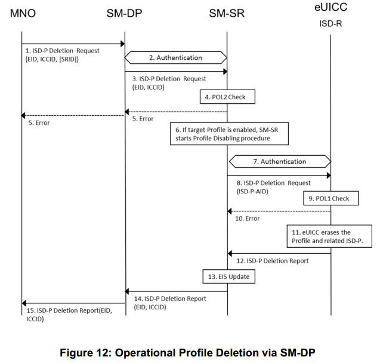

开始条件：
MNO决定永久删除eUICC上的profile.

程序：
1. MNO向SM-DP发送ISD-P删除请求.该请求包括目标profile的目标EID和ICCID（或其他唯一标识符）. MNO也可以提供SRID. 
2. 如果SM-SR和SM-DP尚未通过身份验证，则彼此进行身份验证. 
3. 如果SRID未由MNO提供，则SM-DP识别相关的SM-SR.该请求被传递给专用SM-SR. 
4. SM-SR检查目标profile的POL2. 
5. 如果与POL2发生冲突，SM-SR将中止该过程并相应地通知MNO 
6. 如果启用了目标profile，SM-SR将启动profile禁用过程. 
7. SM-SR和eUICC使用ISD-R中的密钥集，如果尚未认证，则相互验证. 
8. SM-SR向eUICC上的ISD-R发送ISD-P删除请求.该请求包括目标profile的ISD-P AID. 
9. eUICC执行POL1检查. 
10. 如果与POL1发生冲突，ISD-R会中止程序并通知SMSR. 
11. 如果不存在冲突，则ISD-R将删除目标profile和相关的ISD-P. 
12. ISD-R向SM-SR报告ISD-P删除的状态. 
13. SM-SR适当更新EIS. 
14. SM-SR向请求的SM-DP报告ISD-P删除的状态. 
15. SM-DP向请求MNO报告ISD-P删除的状态.结束条件：目标profile从eUICC中删除. SM-SR中的EIS是最新的. 

### 3.5.11 SM-SR更改此程序
假定在执行过程之前，相关eUICC上具有已安装profile的MNO可能会请求通知当前SM-SR（SM-SR1）所做的更改并被允许采取行动，因为它涉及到他们的个人资料的理想处置（例如，什么也不做，更新政策规则，删除个人资料）.在必须改变SM-SR的情况下，各个eUICC的证书必须保密.
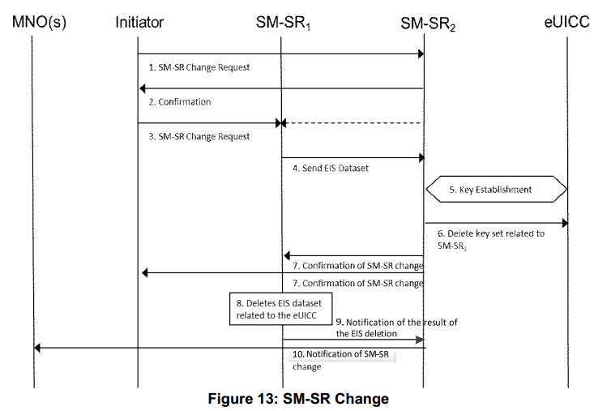

开始条件：
a. eUICC的EID已知b. SM-SR1和SM-SR2的SRID是已知的. 
C. ISD-R使用SM-SR1的钥匙进行个性化设置. 
d. SM-SR的变化是允许的.

过程：
1. 发起者向SM-SR2发送请求以更改SM-SR. 
2. SM-SR2确认它可以接管这个角色. 
3. 发起方或代理发起方的SM-SR2请求从SM-SR1进行更改.
4. SM-SR1将指定EID的EIS数据集发送到SM-SR2. 
5. 通过SM-SR1提供的安全通道，在SM-SR2和ISD-R之间建立新的共享密钥集.关键的建立程序在附件D.2中描述. 
6. 现在SM-SR2可以直接寻址ISD-R，SM-SR2请求eUICC删除与SM-SR1相关的密钥集. 
7. SM-SR2向SM-SR1和发起者发送变更确认. 
8. SM-SR1删除与eUICC相关的EIS数据集. 
9. SM-SR1向e-ICC相关的EIS数据集的删除结果发送通知给SM-SR2. 
10. SM-SR2直接或通过SM-DP向eUICC上的profile的MNO所有者发送通知，通知SM-SR的更改.

结束条件：
a. ISD-R使用目标SM-SR（SM-SR2）的密钥进行个性化设置.
b.eUICC在目标SM-SR（SM-SR2）中注册. 
C. EIS和EID驻留在目标SM-SR（SM-SR2）中. 
d. SM-SR1不再与eUICC相关.即profile的MNO所有者知道这一变化. 

### 3.5.12 ISD-P密钥建立程序
本程序在本文件的第4.5节中定义. 

### 3.5.13回退机制
在机器到机器设备检测到网络连接丢失的情况下，需要切换到具有回退属性集的profile.在这种情况下，eUICC禁用当前启用的profile（profileA）并启用具有回退属性的profile集（profileB）.出于安全原因，如果profileA的POL1规则设置为“禁用不允许”，则eUICC只能切换回profileA，直到profileA的POL1发生更改或使用主删除功能删除profileA.在这种情况下，profileA不能使用正常的删除命令删除.

开始条件：
a.机器设备向eUICC报告网络丢失.
b.如果机器向机器设备报告某些网络连接问题，则eUICC配置为执行回退机制. 
C.具有回退属性集的profile不是当前启用的profile.

过程：
1. eUICC禁用当前已启用的profile（必要时取消POL1）并启用具有回退属性的profile集. 
2. eUICC将已启用profile更改为SM-SR. SM-SR更新EIS. 
3. SM-SR将变更报告给profile的所有者.结束条件：eUICC已启用具有回退属性集的profile，并且SM-SR的EIS是最新的. 

### 3.5.14 eUICC证书验证此程序
定义MNO如何验证eUICC是否通过认证，特别是如果eUICC是根据本规范设计的.

程序：
1. 代表MNO的MNO或SM-DP应能够从以下位置获取eUICC证书：a.存储在eUICC注册的SM-SR中的EIS或b. EUM（注意：该界面超出了本文的范围）. 
2. MNO从eUICC证书中提取EUM信息（例如：证书，SAS认证等）. （注：目前eUICC的SAS认证计划供将来研究使用）. 
3. 利用步骤2中检索到的信息，MNO向SM-SR，EUM或GSMA请求EUM证书. （注意：EUM和GSMA的接口超出了本文的范围）. 
4. MNO验证EUM证书的有效性和签名. 
5. MNO验证eUICC证书的EUM签名.

结束条件：MNU检查了eUICC证书和EUM证书. 

## 3.6策略控制
### 3.6.1规则管理系统概述图
下图表示策略规则管理系统：
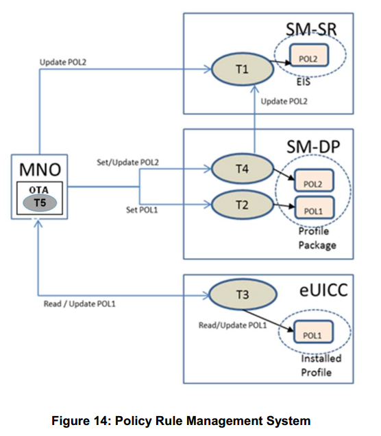 

### 3.6.2策略规则管理
策略控制与profile相关，它是这是MNO要求的，并且是通过使用MNO制定的规则来实现的.此策略控制受单个MNO策略的控制（或管辖权）控制.本政策可能包含执行不同实体的子政策.有两种规则：
•POL1 - 这些规则驻留在profile中，并由eUICC执行. 
•POL2 - 这些规则将存储在SM-SR中并由其执行. MNO将POL2直接发送到SM-SR或通过SM-DP作为元数据附加到profile. POL1和POL2是在不同地点/实体执行的共同MNO政策的代表. POL1和POL2的组合代表适用于profile的MNO和客户之间的合同.在本节中，所有命令都被视为更新;在第一次建立规则时被认为是更新的特例. 

#### 3.6.2.1 SM-SR策略规则管理引擎
SM-SR的策略规则管理引擎在图中标识为“任务1”.任务1接受以下命令：
1）根据MNO请求更新POL2 
2）通过SM-DP按照MNO请求更新POL2任务1根据从SM-DP提供的profile设置POL2.任务1在安装相关profile后立即执行POL2规则.此外，任务1相应地更新相关的EIS.管理eUICC时，SM-SR负责执行POL2规则. 

#### 3.6.2.2 SM-DP策略规则管理引擎
SM-DP的策略规则管理引擎在图中标识为“任务2”和“任务4”.任务2接受以下命令：1）根据MNO请求设置POL1并将其嵌入到profile中.任务4接受来自MNO的以下命令1）“更新POL2”，并且
1）根据MNO请求设置POL1并将其嵌入到profile中.任务4接受来自MNO的以下命令
1）“更新POL2”，并将其传递给SM-SR以更新EIS. 
2）从MNO设置POL2并将其作为元数据附加到profile以传输到SM-SR. 

#### 3.6.2.3 eUICC策略规则管理引擎
eUICC的策略规则管理引擎在图中标识为“任务3”.任务3可以读取驻留在已安装profile中的POL1规则.此外，它在安装相关profile后立即执行POL1规则（请参阅第3.2.2节中的Platform Service Manager角色）.任务3接受以下命令：1）根据MNO请求读取/更新POL1（命令由MNO各自的OTA系统发送）. 

#### 3.6.2.4 OTA策略规则更新机制
对于任务5，使用MNO OTA平台.在这种情况下，它接受来自MNO规则制作者的POL1更新命令，并向eUICC发布POL1更新. 

### 3.6.3策略控制机制
eUICC内的策略控制机制包括：
•在MNO权限下存储在ISD-P内的策略规则; 
•策略规则执行者，这是执行策略执行功能的过程，驻留在平台服务管理器中.
请参见第3.2.2节中的图

#### 3.6.3.1策略规则
在profile的不同状态更改时检查策略规则.它们可能会影响与规则关联的profile的状态以及其他profile的状态.根据规则的性质，策略执行可以在eUICC和/或SM-SR级别进行.只有profile所有者的MNO才能修改策略规则.在eUICC级别，规则是Profile软件包的一部分，并且由eUICC操作系统通过与Platform Service Manager的交互执行.移动网络运营商可以使用他自己的OTA平台更新他的个人资料中的政策规则.更新只能在profile处于启用状态时完成.本文档中定义的强制执行关于远程供应嵌入式SIM卡的合同条款的策略执行机制受制于适用的竞争和监管法律.以下原则适用于合同条款的执行：
•参与运营商不得滥用策略实施机制来阻止或阻碍合法安装，启用，禁用和删除嵌入式SIM上的profile. 
•参与运营商可以执行政策规定，只要这些行为符合适用的竞争和监管法律.定义了以下策略规则：注意：这假定SM-SR通过了MNMA的GSMA认证和信任. 

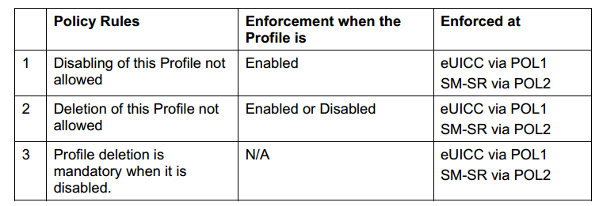 
POL1和POL2的设置可能不一样. POL1和POL2由不同的实体执行（eUICC为POL1; SM-SR为POL2），并将独立实施. POL1和POL2规则的显式设置是MNO的选择（例如，将POL1规则设置为空）. 

#### 3.6.3.2 eUICC策略规则强制实施器功能
策略强制实施器能够读取和执行eUICC上存在的所有
POL1. eUICC可以推翻POL1的唯一情况就是减速机制. 

#### 3.6.3.3 SM-SR策略规则强制实施器功能
SM-SR策略强制实施器能够读取和执行目标eUICC的EIS中包含的策略规则.

