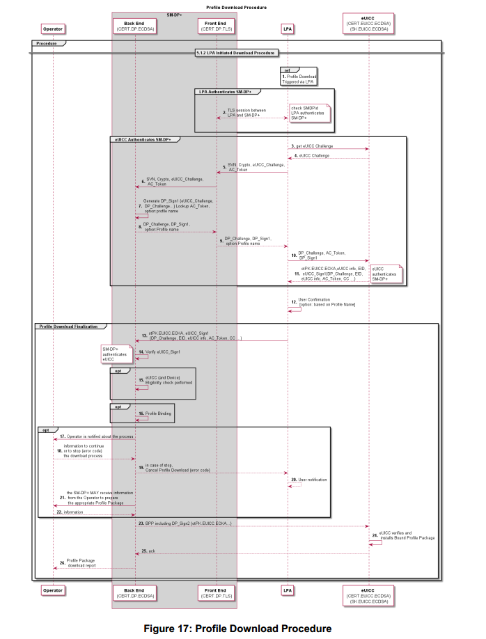
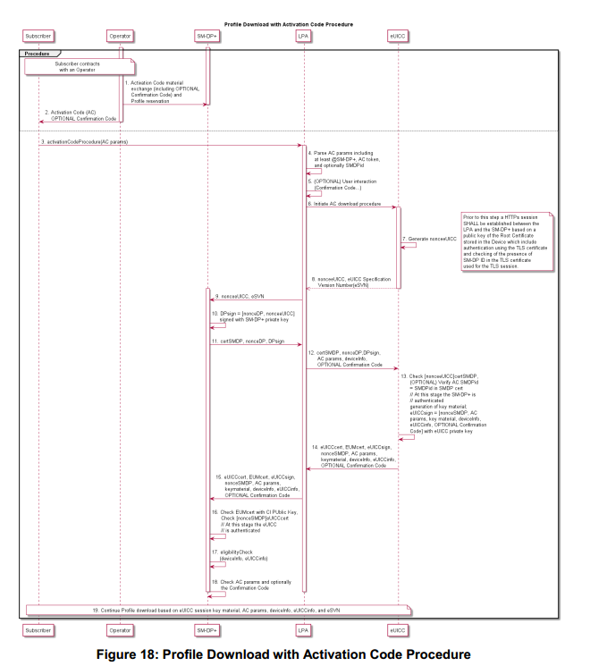
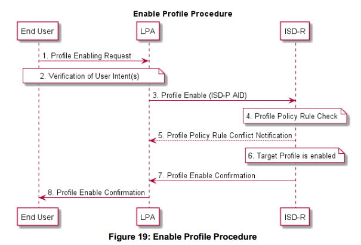
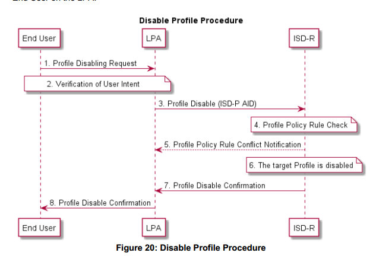
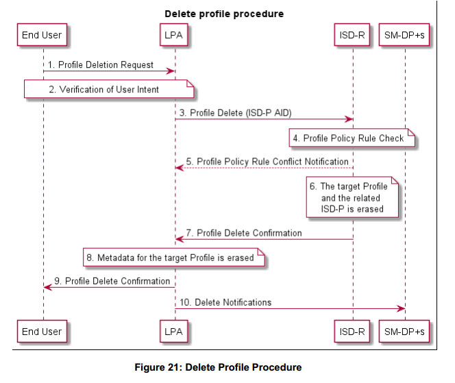
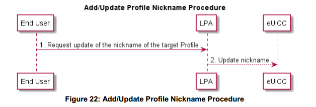
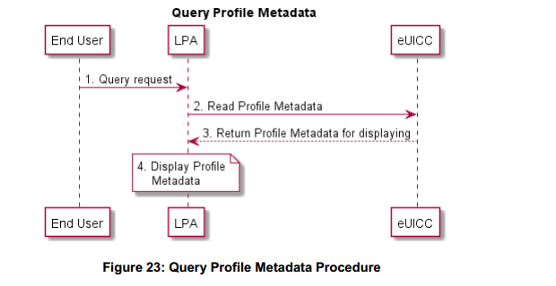
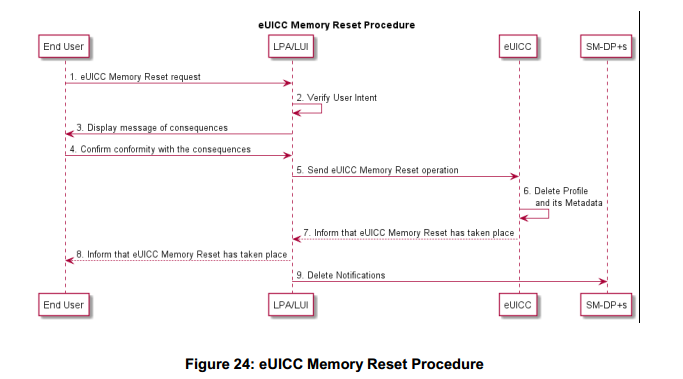
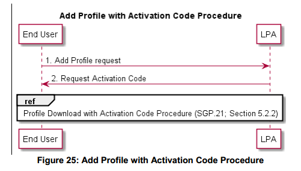
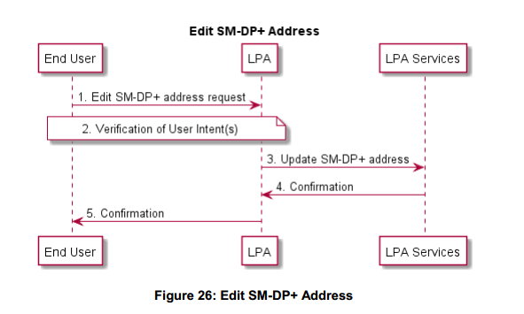

# 5操作程序
## 5.1 LPA启动的下载
### 5.1.1 LPA启动的下载要求
LID1如果激活码尚未提供，则LPA应使用eUICC上填充的任何Root SM-DS或默认SM-DP +地址.
LID2在LID1的上下文中，如果同时填充了根SM-DS和默认SM-DP +地址，则LPA应先联系SM-DP +，然后再联系SM-DS以启动远程SIM配置事务.

5.1.2 LPA启动的下载过程
以下过程描述了属于由LPA启动的profile包下载和安装过程的一部分的事件.

GSMA-SGP-21-第五章学习

开始条件：
a.订户已完成所选运营商/服务提供商优惠的订购流程.
b.与此订阅相关的profile订购过程已完成（即，分配的受保护profile包存储在SM-DP +上）.

程序：
1.LPA启动profile包下载并识别profile存储并可供下载（通过例如URL，QR码，手动输入等）以及提供的其他信息（例如，令牌，SMDPId，确认码）.
2.LPA通过与SM-DP +建立TLS连接来认证SM-DP +，并验证SMDID是否已提供此类信息.3.至4.
LPA得到eUICC挑战
5.至6. LPA将eUICC质询和任何其他相关信息发送至SM-DP +.
7.至9. SM-DP +签署eUICC挑战，并生成一个DP_Challenge发送回eUICC.
10.LPA将SM-DP +和AC令牌收到的资料发送给eUICC; eUICC检查SMDPid并验证SM-DP +.
11.eUICC将包括DP_Challenge，AC令牌，EID及其证书在内的一组签名信息发送回LPA.
12.最终用户确认profile的下载，可选择显示运营商的profile名称.
13.LPA将步骤11中收到的一组信息从eUICC发送到SM-DP +.
14.SM-DP +验证签名; eUICC已通过认证.
15.至16.可选：eUICC资格检查和profile绑定功能由SM-DP +执行.
17.至22.可选
17.将向运营商通知即将下载的profile包.
18.如果操作员已收到通知，可以通过向SM-DP +指示错误代码来请求停止下载过程.
19.如果操作员向SM-DP +发送错误代码，则SM-DP +将停止下载过程并向LPA指示错误代码.
20. LPA通知最终用户一个适当的消息.
21.至22.SM-DP +可以接收来自运营商的信息以准备适当的profile包.
23.至25.绑定的profile包被发送到eUICC并安装在eUICC上.
26.profile包下载报告从SM-DP +发送给运营商.

结束条件：
a.profile在禁用状态下安装在eUICC中

## 5.2使用激活码下载profile
### 5.2.1激活码要求

AC1如果使用，激活码应触发从特定SM-DP +下载绑定profile包.
AC2激活码应包含以下参数：SM-DP +地址激活码令牌（包括可选确认码必需标志）SMDPid（可选）
AC3激活码令牌应能够包含一个参数，该参数指示确认码是否需要.如果需要此确认码，则LPA应要求最终用户输入确认码.SM-DP +在交付绑定profile包之前应验证确认码.注意：如何创建确认码并将其提供给最终用户超出了本规范的范围.
AC4在交付绑定profile包之前，激活代码应由SM-DP +进行验证.
AC5最终用户在LPA中的激活码输入应至少支持手动输入和QR码扫描.
AC6所有激活码程序应作为LPA的一部分原生实施.
AC7激活码程序应有条件地在初始设备设置期间自动提供给最终用户.如果已经设置了profile，则此自动设置不适用.不需要验证确认.注意：例如，这可能不适用于开放市场cellularenabled笔记本电脑.
AC8按照激活码过程，应使用profile包下载程序.
AC9激活码程序应保护用户意图的生态系统安全性，隐私和验证.
AC10激活码程序应仅用于将profile包下载到目标eUICC的唯一目的.激活码程序应防止将IMEI和EID信息发送给未经认证的SM-DP +.
AC11激活码应唯一标识运营商/服务提供商.
AC12对特定SM-DP +进行认证后，对SM-DP +的激活码请求应由LPA用EID进行扩展.

5.2.2使用激活码下载profile过程
激活码过程定义了一项通用功能，允许用户或最终用户代表用户通过请求从设备本身下载操作profile来“激活”设备.

开始条件：
a.认购人已订立认购协议.
b.激活码已经提供给最终用户和可选的确认码（旁道）.

过程：
1.最终用户通过LUI将激活码输入到LPA.
2.LPA解析激活码参数以识别SM-DP +地址，激活码令牌，LPA模式和可选的SMDPid.另外，LPA可以在激活令牌中解析需要确认码的信息.
3.如果激活码令牌中的确认码参数设置为“需要确认码”，则会提示最终用户输入由发卡运营商/服务提供商提供给他们的确认码.
4.激活码下载程序由LPA启动.LPA向eUICC请求nonceeUICC.
5.eUICC创建与支持的eUICC规范版本号（eSVN）关联的nonceeUICC.
6. eUICC将与支持的eSVN相关联的nonceeUICC传输给LPA.
7. LPA将与支持的eSVN关联的nonceeUICC发送到SMDP +.注意：在此步骤之前，应根据存储在设备中的根证书的公钥，在LPA和SM-DP +之间建立一个HTTP会话，其中包括使用TLS证书进行身份验证，并检查是否存在SMDPid用于TLS会话的TLS证书.
8.在接收到nonceeUICC和相关的eSVN后，SM-DP +创建nonceSMDP并签署nonceSMDP和nonceeUICC.
9. SM-DP +将签名的nonceeUICC和nonceSMDP发送给LPA.
10. LPA收集激活码参数以及资格程序和可选的确认码所需的设备信息，并将它们与签名的nonceeUICC和nonceSMDP一起发送给eUICC.
11.eUICC检查附属于nonceeUICC的签名.如果在AC中配置SMDPid，则eUICC检查LPA提供的SMDPid和SM-DP +证书中的SMDPid是否一致.SM-DP +在此阶段由eUICC认证.eUICC生成将用于会话密钥建立的密钥材料.eUICC使用eUICC私钥签署一系列信息，其中包括：
a.nonceSMDP 
b.eUICC为计算绑定profile包的准备计算会话密钥创建的关键材料
c.激活代码参数
d.设备和eUICC信息e.可选地，确认码
12.除了以下之外，eUICC还将签名的一组信息发送给LPA：
a.nonceSMDP
b.eUICC为计算绑定profile包的准备计算会话密钥创建的关键材料
c.激活代码参数
d.设备和eUICC信息
e.包含EID的eUICC证书
f.EUM证书
g.可选的确认码
13.LPA将从eUICC收到的全部信息发送给SMDP +.
14.SM-DP +使用CI公钥检查EUM证书.SM-DP +检查nonceSMDP的签名; eUICC目前正处于SM-DP +认证阶段.
15.SM-DP +根据传输的信息（EID，设备信息，eUICC信息，eSVN）进行资格审查.
16. SM-DP +检查激活码参数和可选的确认码以检索引用的profile包.
17.profile包下载到eUICC：
a.SM-DP +与eUICC建立会话密钥.
b.绑定的profile包基于eUICC会话密钥材料准备并下载并安装在eUICC上.
C.确认成功在eUICC上安装profile，并由SM-DP +通知操作员.
d.eUICC向LPA确认profile在eUICC上的成功安装，通知最终用户状态.

结束条件：
a.绑定的profile包已经下载并安装在处于禁用状态的eUICC上.
b.LPA可能会提供最终用户启用的profile.

## 5.3本地profile管理
### 5.3.1本地profile管理程序
#### 5.3.1.1启用profile
此过程执行目标profile的启用.该请求由最终用户给予LPA.

开始条件：
a.目标profile在eUICC上被禁用.
b.目标profile已由最终用户选择. 
C. LPA向eUICC认证为合法执行本地profile管理.

过程：
1.最终用户在LPA上发出profile启用请求. 
2.用户意图已验证. 
3.LPA将目标profile的profile启用操作发送给eUICC上的ISD-R. 
4.ISD-R检查在目标profile上应用的profile策略规则是否允许启用profile
5.如果与profile策略规则存在冲突，则ISD-R中止该过程并通过LPA通知最终用户. 
6.目标profile已启用. 
7. ISD-R通知LPA启用profile. 
8.最终用户通过LPA通知.

结束条件：
a.目标profile已启用. 

#### 5.3.1.2禁用profile
禁用profile可以通过以下步骤来实现.该请求由LPA上的最终用户提供.

开始条件：
a.目标profile在eUICC上启用.
b.目标profile已由最终用户选择. 
C. LPA向eUICC认证为合法执行本地profile管理.

过程：
1.最终用户在LPA上发出profile禁用请求. 
2.用户意图已验证. 
3.LPA向eUICC上的ISD-R发送profile禁用操作. 
4.ISD-R检查在目标profile上应用的profile策略规则是否允许profile被禁用. 
5.如果与profile策略规则有冲突，ISD-R将中止该过程并通过LPA通知最终用户. 
6. ISD-R禁用目标profile. 
7. ISD-R通知LPA禁用profile. 
8.最终用户通过LPA通知.
结束条件：
a.目标profile被禁用. 

#### 5.3.1.3删除profile
通过以下步骤可以实现profile删除.该请求由LPA上的最终用户提供.

开始条件：
a.目标profile被禁用.
b.目标profile已由最终用户选择
c. LPA向eUICC认证为合法执行本地profile管理.

过程：
1.最终用户在LPA上发出profile删除请求. 
2.用户意图已验证. 
3.LPA将目标profile的profile删除操作发送给eUICC上的ISD-R.该请求包括目标profile的ISD-P AID. 
4.ISD-R检查是否应用profile策略规则允许删除profile. 
5.如果与profile策略规则有冲突，ISD-R将中止该过程并通过LPA通知最终用户. 
6.ISD-R擦除目标profile和相关的ISD-P. 
7.ISD-R通知LPA删除profile. 
8.目标profile的profile元数据被删除. 
9.最终用户通过LPA通知. 
10. LPA向profile中删除profile的通知接收器发送删除通知.

结束条件：
a.目标profile被删除.

#### 5.3.1.4添加/更新profile昵称
添加/更新昵称将允许订户或最终用户将昵称归属到profile以便于使用.请注意，添加或更改昵称不会影响该profile的任何其他数据或其他profile元数据.

开始条件：
a.用户意图已被验证.
b.目标profile已由最终用户选择. 
C. LPA向eUICC认证为合法执行本地profile管理.

过程：
1.最终用户请求更新LPA上的昵称. 
2.LPA使用eUICC中最终用户选择的昵称更新目标profile的profile元数据.

结束条件：
a.profile目标profile的元数据已更新为最终用户选择的昵称. 

#### 5.3.1.5查询profile元数据
此过程将允许最终用户查询最终用户可访问的profile的profile元数据.结果应在查询时在eUICC上显示所选profile的全部（或部分）profile元数据.作为此过程的结果，不会对eUICC上的任何数据进行更改.

开始条件：
a. LPA被认证为eUICC合法执行本地profile管理.
b.最终用户可访问的profile列表由LPA（LUI）显示.

过程：
1.最终用户选择要查询的profile. 
2.LPA收到来自最终用户的查询请求. 
3.LPA向eUICC请求profile元数据. 
4.LPA在LUI上向最终用户显示profile元数据.

结束条件：
a.没有更改profile元数据. 

#### 5.3.1.6 eUICC存储器复位
此过程执行eUICC的eUICC存储器复位，包括其关联的profile元数据.该请求由最终用户给予LPA.注意：执行eUICC的eUICC测试存储器复位也将采用类似的步骤.

开始条件：
a. LPA向eUICC认证为合法执行本地profile管理.
b.eUICC Memory Reset选项由LPA（LUI）显示.

过程：
1.最终用户在LPA（LUI）上发出eUICC存储器重置请求. 
2.用户意图已验证. 
3.LPA（LUI）向最终用户显示'eUICC Memory Reset'的结果消息. 
4.最终用户确认符合对LPA的后果. 
5.LPA向eUICC发送eUICC存储器复位操作. 
6. eUICC即使是包含与其关联的profile元数据的已启用profile，也会删除eUICC上的profile. 
7. eUICC通知LPA eUICC的eUICC存储器复位. 
8.通过LPA（LUI）通知最终用户. 
9. LPA向profile中删除profile的所有通知接收器发送删除通知.

结束条件：a.profile已从eUICC中删除. 

5.3.1.7添加具有激活码的profile
此步骤将允许订户添加单个profile.此过程不会启用下载的profile，也不会禁用已启用的profile.假定网络连接.下载可以通过输入激活码来启动.

开始条件：
a.用户意图已被验证.
b.eUICC允许下载新的profile. 
C. LPA向eUICC认证为合法执行profile下载.
过程：
1.最终用户获得激活码以将profile添加到其设备. 
2.LPA请求最终用户输入激活码. 
3.按照第5.2.2节开始所述的激活码程序下载profile.

结束条件：
a.该profile已安装在最终用户的设备上.
b.profile元数据已从profile更新. 

5.3.1.8编辑SM-DP +地址
此过程将允许最终用户编辑到eUICC的默认SM-DP +地址.

开始条件：
a.LPA中有一个默认的SM-DP +地址.
b.最终用户愿意编辑默认的SM-DP +地址
程序：
1.最终用户通过LPA编辑SM-DP +地址. 
2.需要最终用户的简单确认. 
3.LPA发送默认的SM-DP +地址以存储在LPA服务中. 
4.LPA服务通知LPA存储默认SM-DP +地址. 
5.最终用户通过LPA通知.
结束条件：
a.目标默认SM-DP +地址在LPA服务中编辑.

