# 第四章 远程SIM配置系统架构
本节包含嵌入式UICC的Remote SIM Provisioning系统体系结构的功能描述。
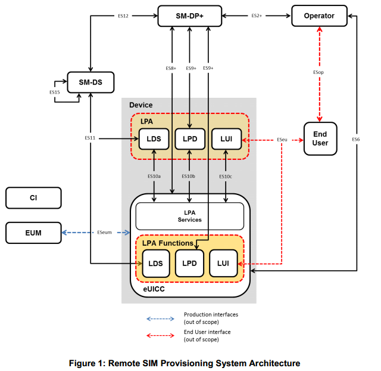

## 4.1 eUICC架构
### 4.1.1 eUICC架构概述
本节介绍eUICC的内部高层架构。 
eUICC体系结构与GSMA远程SIM规范[8]中使用的相似。 
[SGP.02 GSMA Remote SIM Provisioning of Embedded UICC Technical specification]
profile基于GlobalPlatform卡片规范[9]中定义的安全框架进行配置。
[GPC_SPE_034 GlobalPlatform Card Specification with its Amendments]

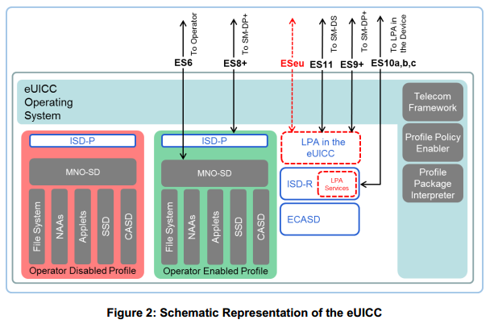

#### 4.1.1.1 ECASD
嵌入式UICC控制权限安全域（ECASD）负责安全存储支持eUICC上所需安全域所需的凭证。在eUICC上只有一个ECASD。如[9]中所述，eUICC制造过程中ECASD应由EUM进行安装和个性化。 ECASD应具有以下属性：
- 用于创建签名的eUICC私钥。 
- 用于eUICC认证的关联证书。 
- 用于验证SM-DP +证书的证书颁发者（CI）根公钥。 
- eUICC制造商（EUM）密钥集，用于密钥/证书更新。
此外，ECASD应提供在密钥建立和eUICC认证期间使用的安全功能。 

#### 4.1.1.2 ISD-R
ISD-R负责创建新的ISD-Ps和所有ISD-Ps的生命周期管理。 

#### 4.1.1.3 ISD-P 
ISD-P是用于托管Profile的安全容器（安全域）。 ISD-P与Profile包解释器协作用于Profile下载和安装，以解码/解释接收到的绑定Profile包。 ISD-P是SM-DP +的卡上代表。

#### 4.1.1.4 MNO-SD 
MNO-SD是运营商的卡上代表。它包含运营商的OverThe-Air（OTA）密钥并提供安全的OTA通道。 

#### 4.1.1.5 profile策略启动器
提供profile策略规则验证和执行的eUICC操作系统（OS）服务。 

#### 4.1.1.6电信框架
电信框架是一种操作系统服务，为ISD-Ps中托管的NAA提供标准化的网络认证算法。此外，它还提供了使用必要参数配置算法的功能。 

#### 4.1.1.7profile包解释器
profile包解释器是一个eUICC操作系统服务，它使用目标eUICC的特定内部格式将profile包数据转换为已安装的profile。 

#### 4.1.1.8 LPA服务
LPA服务提供对LPA功能所需的服务和数据的以下必要访问：
1. 根SM-DS地址。 
2. 可选存储的默认SM-DP +地址。 
3. 促进接收从LPA转移的绑定profile包。 
4. 提供有关已安装profile及其profile元数据的信息。 
5. 提供本地profile管理。 
6. 为LPA提供功能，以对SM-DS进行身份验证和互动。 
7. 确保对EID的访问仅限于LPA。

## 4.2 eUICC需求
EUICC1 eUICC应该是一个由硬件和软件组成的独立的防篡改组件，能够安全地托管应用程序以及机密和加密数据。 

EUICC2可拆卸的eUICC采用标准ETSI规格[2]封装。 

EUICC3 eUICC应该是可移动的或不可移动的。 

EUICC4具有启用profile的eUICC的行为应与UICC相同。 

EUICC5 eUICC应能够包含零个或多个profile。 

EUICC6最多只能在任何时间点启用一个profile。 

EUICC7在eUICC上，NAA USIM或ISIM中的行为应与可移动的UICC NAA USIM或ISIM相同。 注：预期不会更改现有的3GPP / 3GPP2 USIM，CSIM和ISIM规范。 

EUICC8 eUICC应支持Milenage [11]/[12]和TUAK [10]算法集

EUICC9 eUICC的所有权可能随着设备的使用寿命而改变。 

EUICC10如果任何Profile Management操作未成功完成，则eUICC应保持其收到请求之前的状态。 

EUICC11 eUICC应包含在制造过程中安装和个性化的ECASD和ISD-R安全域。 

EUICC12在eUICC生产之后，不可能删除或禁用ECASD。 

EUICC13 ISD-R应负责创建新的ISD-Ps和所有ISD-Ps的生命周期管理。 

EUICC14在[9]中描述的eUICC制造过程中，ISM-R应该由EUM进行安装和个性化。 

EUICC15 eUICC应能够支持eUICC存储器复位。这只能由最终用户请求。 

EUICC16如果eUICC支持测试profile，则eUICC应支持eUICC测试存储器复位。 

EUICC17 eUICC应支持由SIMalliance [5]定义的eUICC Profile Package Interoperable格式。 

EUICC18 ISD-R应该：
- 在制造时在eUICC内创建; 
- 不被删除或禁用; 
- 不能在ISD-P内执行任何操作。 

EUICC19 eUICC可提供LPA功能。 

EUICC20应SM-DP +的要求，ISD-R应由ISD-R创建。 

EUICC21 eUICC和SM-DP +之间的通信应受到真实性，完整性和机密性的保护。 

EUICC22 eUICC不应导出安装在eUICC上的profile。 

EUICC23 eUICC应实施profile的隔离并防止profile在其执行环境之外运行，即profile应在沙箱中运行。 

EUICC24在eUICC上安装时，应确保绑定profile包的完整性。 

EUICC26profile密钥和算法参数不能从eUICC中提取。 

EUICC27所有加密功能应以强大的防篡改方式实施，并能抵抗边信道攻击。 

EUICC28运营商应能够以安全和保密的方式更新eUICC在其profile中的OTA密钥，重用现有的OTA平台机制。 

EUICC29下载的profile包应安装在eUICC处于禁用状态。 

EUICC30 eUICC应始终在SM-DP +或SM-DS每次会话开始时的首次通信中报告其eSVN。

EUICC31 EUM应在用于验证eUICC认证的eUICC中安装eUICC证书。 

EUICC32 EUM应在用于验证eUICC证书的eUICC中安装EUM证书。 

EUICC33 eUICC应具有向SM-DS进行认证的手段。 

EUICC34 eUICC应保护自己免受未经授权的访问。 

EUICC35在profile删除后，eUICC应确保完全删除与profile相关的所有数据。 

EUICC36 eUICC只接受eUICC或设备中的LPA发送的profile管理操作。 

EUICC37 eUICC应拒绝与相应profile的profile策略规则相冲突的任何profile管理命令。 

EUICC38如果任何绑定profile包下载或安装未成功完成，则eUICC应保持其收到请求之前的状态。 

EUICC39 eUICC应支持GlobalPlatform安全元件访问控制[15]。 

EUICC40应该在eUICC中预先设置一个默认的SM-DP +地址。 

EUICC41 eUICC应存储根SM-DS地址。 

EUICC42 eUICC应能够向LPA发送删除通知，通知通知接收方该profile已被删除。 

EUICC43在EUICC42中，如果连接不可用于向通知接收器发送删除通知，每当连接再次可用时，每个通知都应保留并发送。 

EUICC44在eUICC存储器复位的情况下，对于每个已删除的profile也应该执行删除通知过程。 

EUICC45 eUICC应支持一系列标准功能和服务，包括但不限于Java应用程序，USIM工具包功能和GlobalPlatform功能。支持的功能和服务列表（例如API包名称和版本）应在技术规范（SGP.22 [24]）中明确引用。根据附件D中定义的不同嵌入式UICC类别，可以定义/支持不同的一组功能和服务。

EUICC46 eUICC应至少支持以下USIM工具包命令：
- PROVIDE LOCAL INFORMATION，包括以下字段：本地信息，IMEI，网络测量结果，日期和时间，接入技术
- 终端profile
- TERMINAL PROFILE
- ENVELOPE (SMS-PP DOWNLOAD)
- SEND SHORT MESSAGE
- DISPLAY TEXT
- GET INPUT
- RING TONE

EUICC47 eUICC应支持至少两组椭圆曲线参数在eUICC制造过程中由EUM预装，定义见GSMA SGP.22 V2.0 [24]。 

EUICC48每份通知都应有唯一标识，并由eUICC签署。 

EUICC49每条通知（删除，预先删除，禁用）均应重新受到攻击保护并由eUICC签署。 

EUICC50（FFS）可以通过Profile参数请求发送预删除通知，通知发送通知后，eUICC将执行删除操作。 

EUICC51（FFS）在成功尝试预删除通知的情况下，eUICC应删除为其进行通知尝试的profile。如果此通知不成功，但无论如何都将删除profile，则应在通信连接再次可用时立即保留并发送通知。 

EUICC52该profile应能够包含每种通知类型的零个或多个通知接收者列表。

## 4.3 eUICC资格检查
eUICC资格检查使SM-DP +能够使用eUICC发送的信息验证eUICC是否有资格安装profile。 eUICC向SM-DP +发送的用于资格检查目的的信息在此被称为eUICC资格检查信息。 由于Device / eUICC必须支持并作为eUICC资格检查信息集的一部分交付的设备功能，可能需要某些eUICC资格检查参数。 注意：设备功能是指设备提供的设备功能或服务启用功能，它可能对profile的内容或用于下载profile的过程有直接影响，并且需要eUICC的支持。 

### 4.3.1 eUICC资格检查要求
ELG1 eUICC应指明其支持的规格版本。在eUICC资格检查期间，该参数应传送给SM-DP +。 

ELG2 eUICC应在eUICC资格检查信息中包含可用内存。 

ELG3 eUICC应在资格检查信息中声明它是否无法接受其他profile。 

ELG4 eUICC应提供有效的当前证书给由EUM签署的SM-DP +。 

ELG5 eUICC应提供EUM的标识。 

ELG6 eUICC应提供当前的操作系统版本。 

ELG7 UICC应提供与可能需要Profile支持的服务有关的设备使能器信息（例如NFC使能器）。 

ELG8资格检查信息应由eUICC保护，以便将其发送到SM-DP +以保护其完整性和真实性。 

ELG9 eUICC应指示eUICC资格检查信息中支持的应用程序运行时环境版本和库版本。 

ELG10 eUICC应指明eUICC资格检查信息中支持的加密算法及其各自的密钥长度。 

ELG12 eUICC应指出其当前的认证状态。在eUICC资格检查期间，该参数应传送给SM-DP +。 

ELG13如果eUICC支持NFC（例如CAT3），则应表明其支持相关的NFC服务，包括其当前的认证状态。 

ELG14 eUICC应指明其类别（见附件D）。在eUICC资格检查过程中，该参数应发送到SM-DP +。

注：假定EID通常以其他方式与SM-DP +共享，并可用于资格审查程序。

## 4.4设备要求

DEV1设备应符合ETSI TS 102 221 [2]中的终端要求，但本规范中定义的例外情况除外。 

DEV2应该有一种手段让最终用户通过设备软件获取EID。这只能通过LUI来实现。 

DEV3如果eUICC在设备包装内，则EID应在设备包装上以机器可读形式打印。

DEV4配套设备与SM-DP +的承载连接只能由承载可用性决定。注意：伴侣设备可以使用任何可用的连接方法连接到SM-DP +。

DEV5符合GSMA NFC手持设备要求的设备[17]应支持设备应用程序使用的开放移动API [19]与在eUICC上启用的profile中运行的对应应用程序交换数据。 

DEV6在设备中实施远程SIM卡配置规范不会影响3GPP TS 22.022 [16]中定义的SIM锁定机制的潜在用途。 

DEV7当设备同时支持设备中的LPA和eUICC中的LPA时，设备应具有设置哪个LPA应使用的机制（设置或配置参数）。 

DEV8最终用户应能修改DEV7中定义的参数。 

DEV9在eUICC中支持不带LPA的嵌入式UICC的器件，应提供LPA功能。 

DEV10在eUICC中仅支持带LPA的嵌入式UICC的设备，可以提供LPA功能。 

DEV11如果器件支持器件测试模式，器件应支持eUICC测试存储器复位。 eUICC测试存储器复位只能在设备处于设备测试模式时由最终用户请求。 

### 4.4.1设备能力要求
DEVCAP1
应该有一种机制能够为SM-DP +提供设备能力。 

## 4.5器件启动要求
### 4.5.1器件复位
FAC1最终用户可以在不影响eUICC状态的情况下执行任何类型的器件复位。 

FAC2设备应通过安全程序触发/请求eUICC存储器复位。 

FAC3设备应通过安全程序触发/请求eUICC测试存储器复位。 

### 4.5.2 eUICC存储器复位
MEM1 UICC存储器复位应删除eUICC上除标记为永久的预先安装的profile外的所有profile。 

MEM2 eUICC内存复位应删除eUICC上的所有profile，而不管其profile策略规则，但不要删除profile或预安装的测试profile。 

MEM3认证确认应被验证以启动eUICC存储器复位。 

MEM4除MEM3外，还可以使用其他安全手段来执行eUICC存储器复位功能。应用基于LUI的重置功能所提供的相同级别的安全性。用户意图和确认请求应适用。 

### 4.5.3 eUICC测试存储器复位
MEMT1 eUICC测试存储器复位应删除eUICC上的所有发布后安装的测试profile，包括已启用的测试profile（如果有）。 

MEMT2简单确认应验证以启用eUICC测试存储器复位。 

MEMT3如果测试profile不受支持，则不需要eUICC测试存储器复位。

## 4.6profile要求
### 4.6.1测试profile
TPRO1可移动eUICC支持本节中描述的测试profile的要求是可选的。如果测试profile不受支持，则不能将测试profile下载到eUICC中。 

TPRO2测试profile不能使用Operator Credentials对运营商的移动网络进行认证。 eUICC应确保即使认证信息包含在测试profile中，这些profile也不能用于连接到任何运营商的移动网络。 

TPRO3测试profile应该安装在它自己的ISD-P中。 

TPRO4测试profile可以预先安装在eUICC上。

TPRO5当器件处于器件测试模式时，测试profile只能显示和使用。 

TPRO6除eUICC存储器复位操作外，只能在器件测试模式下下载，安装，启用，禁用或删除eUICC中的测试profile。 

TPRO7测试profile与任何其他profile一样，应通过经认证的SM-DP +进行管理。 

TPRO8启用测试profile将覆盖不禁用profile策略规则。 

TPRO9当设备测试模式被禁用时，LPA应禁用任何启用的测试profile。 

TPRO10当测试profile被禁用时，eUICC应启用以前启用的操作profile（如果有）。 

TPRO11设备测试模式激活应从最终用户模糊处理。 

TPRO12退出设备测试模式时，将出现最终用户通知，提示测试仪执行eUICC测试存储器复位。设备可以实现一种连接外部SIM卡的机制，以便在设备修复的情况下进行测试，而不会影响eUICC的状态。 

### 4.6.2授权profile
PPRO1授权profile应基于与profile所述相同的格式结构（图2）。 

PPRO2如果使用当前已启用profile建立连接不成功，那么LPA可以根据最终用户对PPRO6中定义的操作的请求启用配置profile。如果这导致操作profile被禁用，则最终用户应首先同意由启用profile提供的通信丢失。 

PPRO3授权profile及其关联的profile元数据在LUI上对最终用户不可见。

PPRO4最终用户不能选择授权profile。

PPRO5通过最终用户的任何行动，包括使用eUICC存储器复位，授权profile不得被删除。 

PPRO6授权profile只能用于profile下载和相关profile维护功能的预期用途。授权profile不得用作操作profile。 

PPRO7 PPRO6应在RSP架构中强制执行。 

## 4.7profile元数据要求
META1所有profile都应具有关联的profile元数据。 

META2profile元数据应存储在eUICC中。 

META3无论profile的状态如何，profile元数据都可以访问。 

META4profile元数据应包含一个用于服务提供商名称的字段。注意：EFSPN已经在本规范以外的不同环境中使用过，并且可能为空。 

META5profile元数据应包含用于profile的ICCID的字段。 

META6profile元数据应包含profile最终用户昵称的字段。 

META7profile元数据应包含一个字段，用于包含由操作员/服务提供商定义的简档的简短描述。 

META8昵称应由最终用户编辑。 

META9profile元数据应始终提供给LUI。 

META10profile元数据应包含一个可选字段，以允许显示由运营商/服务提供商为相应profile定义的图标。 

META11profile元数据应能够包含与profile关联的profile策略规则的副本。 

META12所有profile应在profile元数据中唯一标识为操作，配置或测试profile。 

META13如果profile已启用，运营商应能够使用ES6界面访问和更新其profile的以下profile元数据：
- 服务提供商名称
- profile的简短描述
- profile的图标

## 4.8 NFC要求
NFC设备和NFC eUICC应符合以下要求列表：

NFC1 NFC设备应符合GSMA TS 26 [17]。 

NFC2安装运营profile后，NFC eUICC应支持SGP.03 GSMA NFC UICC要求规范[20]中规定的所有要求。 

NFC3 NFC设备应按照GlobalPlatform SEAC规范[15]中的规定检索并执行访问控制规则。 

NFC4 eUICC应能够生成操作profile已被删除的证据。 

NFC5所有NFC应用程序和NFC使能应用程序（例如ARA-M，PPSE，CRS，CREL等）附加到操作profile应包含在为profile创建的ISD-P下，可以在MNO-SD下或在SD层次结构，带有具有授权管理权限的自引导SSD。 

NFC6 NFC eUICC解决方案应能够向NFC应用服务提供商保证eUICC和运营profile的组合是值得信赖的。该解决方案应基于CASD，该CASD是SGP.03 [20]规定的操作profile和场景Push 2B和场景3的一部分。 

NFC7如果NFC eUICC符合M4M，则当包含M4M应用程序的profile被禁用时，eUICC应重置与该profile关联的所有M4M虚拟卡。 

NFC8在eUICC资格审查期间，适当的NFC相关认证信息应作为与SM-DP +共享的信息的一部分。 

NFC9 NFC设备应至少具有嵌入式eUICC，或者具备支持与CAT3和SGP.03 [20]兼容的可拆卸eUICC的能力。 

## 4.9订阅管理器数据准备+（SM-DP +）
### 4.9.1 SM-DP +概述
根据运营商的输入/请求，SM-DP +负责创建，生成，管理和保护生成的profile。它还负责在Bound Profile Package包内提供profile，使Bound Profile Package包可用于安全传送。此外，SM-DP +负责请求在将要安装Profile的eUICC中创建ISD-P。 SM-DP +也将成为离卡实体，负责根据请求创建的ISD-P的生命周期管理。这是通过下面列出的不同功能执行的。

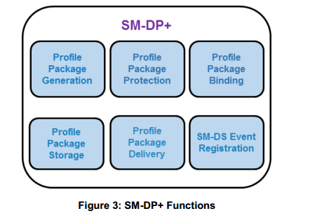

- profile包生成
创建profile包[即 来自Profile Descriptions的个性化profile，包括（IMSI，Ki，ICCID ...）]与运营商达成一致。 这可以是脱机批处理或实时处理。
- profile包保护
根据创建Protected Profile Package包的安全流程来保护每个profile包。
- profile包绑定
使用安全流程将Protected Profile Package包绑定到目标eUICC，从而创建绑定profile包。
- profile包存储
临时存储Protected Profile Package包或绑定的profile包，以便随后传送给eUICC。
- profile包交付
通过LPA安全传输并安装绑定profile包到eUICC。
- SM-DS事件注册
通知SM-DS有关特定eUICC的挂起操作。

### 4.9.2 SM-DP+ 需求
SMDP1 SM-DP +应代表运营商行事。 

SMDP2 SM-DP +应能够启动ISD-P创建请求，作为Bound Profile Package包传送的一部分。 

SMDP3 SM-DP +应建立eUICC的端到端安全通道，以在eUICC上下载和安装Bound Profile Package包。 

SMDP4 SM-DP +应链接Protected Profile Package包，以便仅在相应运营商的请求下才能绑定到特定的eUICC。 

SMDP5 SM-DP +应仅在相应eUICC的请求下从链接的Protected Profile Package创建Bound Profile Package。 

SMDP6 SM-DP +应能够为任何认证的eUICC创建Bound Profile Package包。 

SMDP7只有目标eUICC才能解密由SM-DP +传送的Bound Profile Package包的内容。 

SMDP8profile包仅在完成所有生产步骤，profile包保护和绑定后才能离开SM-DP +。 

SMDP9SM-DP +与LPA之间的通信会话应在执行预期操作后由SM-DP +终止。 

SMDP10 SM-DP +与profile下载和安装中涉及的eUICC之间的端对端通信应受到完整性，真实性和机密性的保护。

SMDP11存储在SM-DP +中的profile包应始终通过加密进行保护。 

SMDP12在SM-DP +上，profile创建和存储基础架构内的备份以及使用的数据应使用安全删除程序（逻辑和物理）丢弃。 

SMDP13 SM-DP + / eUICC通信应包含完美前向保密（PFS）。 

SMDP14用于Bound Profile Package包的传输应在SM-DP +和eUICC之间实现防重放机制。 

SMDP15与SM-DP +的连接应当中止，并且在未能验证连接方的真实性时，由SM-DP +触发明确的错误消息。 （不应向连接方发送消息）

SMDP16经过可配置次数的失败尝试将Bound Profile Package包下载到LPA后，传输加密过程应被更新。如果后续尝试下载Bound Profile Package包失败的次数超过可配置次数，配置事务将被终止，并且应通知运营商。 

SMDP17 SM-DP +应使用互联网协议（如DNSSEC，DNSCurve等）的安全版本。 

SMDP18 SM-DP +应按照SIMalliance [5]定义的eUICCprofile包互操作格式规范来准备profile包。 

SMDP19 SM-DP +应能够按需创建Bound Profile Package包。 

SMDP20 SM-DP +可以批量创建profile包。 

SMDP21 SM-DP +应向操作员发送成功完成的下载和安装profile的确认。 

SMDP22在成功安装profile后，应该有一种机制来消除任何SM-DP +和ISD-P之间的关系。这种机制应由运营商订购或由运营商自行执行。如果使用这种删除机制，则不会有负责管理已安装profile的ISD-P的离卡实体。 

SMDP23 SM-DP +应由其SMDPid全局唯一标识。 

SMDP24 SM-DP +证书应包含SMDPid。 

SMDP25 SM-DP +应能够向运营商发送通知，通知他们特定的Bound Profile Package包下载即将开始。 

SMDP26在下载eUICC Bound Profile Package包之前/之前，SM-DP +应能够向运营商发送eUICC资格检查信息报告和其他相关信息（例如激活码，ICCID等）。 

SMDP27 SM-DP +应能够向SM-DS执行事件注册。 

SMDP28 SM-DP +应能够从备选SM-DS请求不将事件注册传播到根SM-DS。 

SMDP29当从eUICC收到相关的删除通知时，SM-DP +应能够向拥有profile的运营商发送profile删除通知。 

SMDP30 SM-DP +应支持由profile所有者触发的profile包的以下状态：
- profile包下载时不会发布profile包。 
- profile包发布用于profile包下载。 

SMDP31 SM-DP +应能够在profile下载过程中选择椭圆曲线参数。 

SMDP32（FFS）SM-DP +可以对SM-DS（根或备用）进行事件记录查询，以审计其拥有的事件注册。 

SMDP33（FFS）SM-DP +应能够通过ES12接口查询由EID或Event-ID标识的根SM-DS或替代SM-DS上的事件记录。

SMDP34（FFS）对SM-DP +事件记录查询的响应只应在根SM-DS或备选SM-DS验证事件记录所有权的情况下进行。

SMDP35（FFS）SM-DP +事件记录查询的所有权验证应仅针对所持有的事件记录的组件使用请求者地址或提交的事件ID。 

SMDP36 SM-DP +应支持GSMA SGP.22 V2.0 [24]中定义的所有椭圆曲线参数集。 

SMDP37如果Profile包尚未发布供下载，则应通过特定的错误代码通知LPA。 

### 4.9.3 eUICC 上的默认SM-DP +地址
DF1如果在呈现给LUI的AC中存在SM-DP +地址，则eUICC中的默认SM-DP +地址应该被忽略。 

DF2 LPU可访问eUICC中的默认SM-DP +地址，以建立与此SM-DP +的连接。 

DF3 eUICC中的默认SM-DP +地址可以留空。 

DF4如果eUICC中的默认SM-DP +地址为空，则需要在AC中使用SM-DS发现过程或SM-DP +地址来建立目标SM-DP +。 

DF5（FFS）不支持重定向到查询默认的SM-DP +地址。 

## 4.10本地Profile助理（LPA）
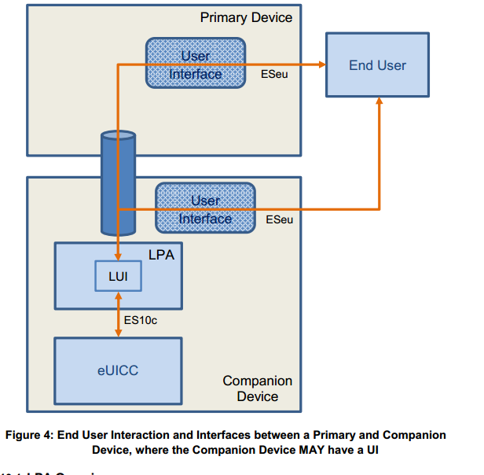

### 4.10.1 LPA概述
该角色既存在于设备中，也与eUICC提供的LPA服务一起存在，并在eUICC中与eUICC提供的LPA功能一起存在。 它提供三种不同的功能，如下所述的本地用户界面（LUI），本地Profile下载（LPD）和本地发现服务（LDS）。 如果没有设备交互，eUICC本身不能提供任何这些功能，交互的具体级别将取决于设备内的功能。 在不同的设备和设备类型中实现这种可变性的方式有待进一步研究。

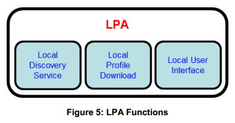

- 本地发现服务（LDS）
如有需要，LDS负责从SM-DS中检索未决的事件记录。
- 本地Profile下载（LPD）
这对于以下两个阶段有效地下载Bound Profile
Package包起到代理作用：
（i）在单次交易中将Bound Profile Package包从SM-DP +下载到LPD;以及
（ii） Bound Profile Package分段到eUICC。 该功能将取决于网络，设备和eUICC功能。
- 本地用户界面（LUI）
该功能允许最终用户在设备上执行本地Profile管理。 用户意图应强制执行。

### 4.10.2 可选的LAP模式
当设备和eUICC中有LPA时，要使用的LPA由设备设置（DEV7）指定：
- LPA in the Device
- LPA in the eUICC

#### 4.10.2.1 LPA in the eUICC
LPA功能是由eUICC提供.
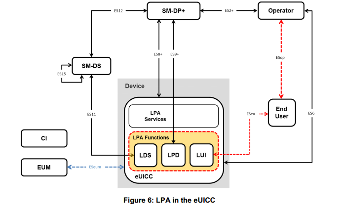

#### 4.10.2.2 LPA in the Device
LPA功能是由设备提供.
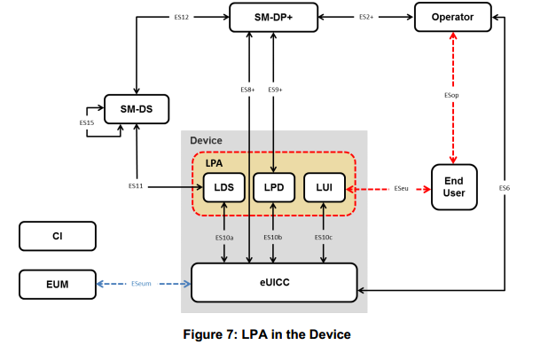

### 4.10.3 LPA需求
LPA1 LPA应负责指示eUICC根据最终用户请求执行本地Profile管理功能。 

LPA2在eUICC之外的任何LPA单元和eUICC之间应实施一种机制，以确保通信不会在LPA所在的任何地方受到威胁。 

LPA3应在LUI和设备上相关的显示或输入应用程序之间实施安全机制。 

LPA4对LUI应用程序的访问应根据当前最佳实践进行保护。这将由Device OS强制执行。 

LPA5所有本地Profile管理操作都需要用户意图。 

LPA6 LUI访问需要用户意图。 

LPA7最终用户应能够轻松访问已安装的Profile列表。 

LPA8 LPA应保护个人资料元数据免受未经授权的访问。 

LPA9本地Profile管理操作'enable'应被支持。此操作应允许最终用户选择Profile。 

LPA10本地Profile管理操作“禁用”应受支持。 

LPA11本地Profile管理操作'删除'应该被支持。此操作应允许最终用户从eUICC中删除已禁用的Profile。最终用户应确认删除Profile后果的消息。认证确认应执行。 

LPA12应支持本地Profile管理操作“查询”。此操作应允许最终用户通过其Profile元数据查看eUICC上安装的操作Profile列表和相关的相关信息。 

LPA13应支持本地Profile管理操作'编辑默认的SM-DP +地址'。该操作应允许最终用户编辑默认的SMDP +地址。简单确认应执行。 

LPA14应支持本地Profile管理操作'eUICC Memory Reset'。该操作应按照第4.5.2节所述执行eUICC存储器复位。最终用户应确认'eUICC存储器复位'的结果信息。认证确认应执行。 

LPA15应支持本地Profile管理操作'eUICC测试存储器复位'。该操作应执行第4.5.3节中所述的eUICC测试存储器复位。简单的确认将被强制执行。 

LPA16应支持本地Profile管理操作的“设置/编辑昵称”。此操作应允许最终用户添加或修改所选Profile的昵称。该操作不应修改服务提供商名称。可以提供在LUI上区分Profile的其他方法。 

LPA17应支持本地Profile管理操作“添加Profile”。此操作应允许LPA下载并安装新的Profile到eUICC。 LPA至少应支持三种机制，具体取决于具有技术能力的设备类型：从默认SM-DP +
通过SM-DS服务发现下载Profile使用激活代码认证确认进行Profile下载，除初始设备设置（LPA62）外应强制执行。 

LPA18 LPA不能由除LPA提供商提供的应用程序之外的任何应用程序访问，仅用于启用LPA的服务和功能。 

LPA19 LPA提供商应执行安全且不可被认可的认证确认。 

LPA20 LPA提供商应在设备上执行安全且不可拦截的简单确认。 

LPA21对LUI的访问应受到认证确认的保护。 

LPA22 LPA21中的机制应由最终用户选择/取消选择。 

LPA23默认情况下会提示LPA21中的机制启用，但可以由最终用户跳过。 

LPA24 LPA及其主机（即设备，如果LPA位于设备中; eUICC，如果LPA位于eUICC中）应实施一种机制，通过经过身份验证的确认来保护LPA访问。这个认证确认可以通过使用设备中实现的机制来实现，例如电话锁码，指纹输入等。

LPA25最终用户应该能够定义专用的个性化用户凭证来访问LPA。 

LPA26如果最终用户选择保护对LUI（LPA23）的访问权限，则操作级别的后续认证确认可以用简单确认来替换。 

LPA27强制执行时，任何确认请求都应允许最终用户取消本地Profile管理操作。 

LPA28可以暴露配套设备的LUI，允许来自主设备上的最终用户界面的输入。 

LPA29当配套设备LUI允许来自主设备的输入时，配套设备LUI应能够限制可应用的操作。例如：不提供eUICC存储器复位; 仅公开'启用'和'禁用'操作。 Profile启用仅在配套设备上未启用Profile的情况下公开。 

LPA30伴随设备的LUI应能够在建立任何接近安全链路（用于从另一设备向LUI的输入）之前向伴随设备请求最终用户发起的动作。 

LPA31由终端用户发起并提供机密性和完整性的点对点接近安全链接应在配套设备和主设备之间为从主设备执行的任何输入建立。 

LPA32当从主设备操作配套设备LUI时，任何必需的用户意图或确认请求只能由配套设备上的LPA执行。物理最终用户输入可以在主设备或伴随设备中完成。

LPA33伴随设备的设备制造商应实施一项安全措施，以确保任何访问LUI的应用程序的完整性和资格。 

LPA34用于用户意图保护的最终用户数据（例如PIN码，指纹）应存储在安全的环境中。 

LPA35 LPA应能够利用任何设备上和现有的互联网连接，例如Wi-Fi或Wi-Fi直连，以接触SM-DP +。通过这种连接，可以建立ES8 +和ES9 +。 

LPA36 LPA应能够通过其他连接机制（例如有线共享，本地共享Wi-Fi连接或蓝牙）利用其他连接机制提供的任何互联网连接，以便接触SM-DP +。通过这种连接，可以建立ES8 +和ES9 +。 

LPA37 LPA应能够确定是否可以通过任何方式连接到SM-DP +。 

LPA38 LPA应能通知最终用户没有连接到互联网，或者没有连接到SM-DP +，以便允许最终用户启用或排除所需的连接。 

LPA39如果分配了权限，LPA只能访问eUICC。 

LPA40设备上只能有一个LPA。 

LPA41 LPA只应执行本规范中描述的操作。 

LPA42 LPA程序不得由任何外部（非LPA）程序调用。 

LPA43安装多个操作Profile时，本地Profile管理操作“启用”应在启动所选Profile的“启用”操作之前首先启动任何已启用Profile的“禁用”操作。 

LPA44 LPA应能读取Profile策略规则。 

LPA45当安装了Profile策略规则的Profile时，在请求最终用户同意的情况下，LPA应向最终用户显示Profile策略规则的结果。此信息应以描述性和非歧视性方式制定（例如，对于“非删除”Profile策略规则：“您将要安装的Profile不能根据您与服务提供商商定的条款删除。 YES / NO）。认证确认应以LPA17中列出的例外执行。 

LPA46在下载新Profile之前，LPA应检查已启用Profile（如果有）是否已启用POL RULE1的条件。如果是这种情况，应该显示一条专用信息，标识最终用户的后果。可能显示的信息示例如下：由于当前启用的Profile无法禁用，因此无法启用新的Profile。 已启用Profile的Profile名称。 有关更多信息，最终用户应联系此Profile的Profile所有者。通过显示此消息，最终用户应能决定是继续下载还是取消操作。该对话可以与常规最终用户意图结合以确认简档下载。 

LPA47主设备的最终用户界面和伴随设备的LUI之间的通信应受到保护（机密性，完整性和认证）。

LPA48如果最终用户退出LPA菜单或在一段时间内未执行操作，以避免滥用为连续的本地Profile管理操作绕过已认证的确认

LPA49确认请求，则应有机制限制LPA26的有效性只要向最终用户明确解释不同的行为，就可以一步完成。例如，在安装新的Profile时，LPA可以建议'添加Profile'和'启用'为一个单一的步骤，只有一个确认（例如“你想在你的设备上安装Profile'ProfileName'并启用它？是/否/仅安装“）

LPA50当在一个单一步骤（LPA49）中实现连续操作时，应用最高级别的确认 - 即在两个操作分别具有已验证和简单确认请求的情况下，单步骤使用已认证的确认请求。 

LPA51本地Profile管理操作'启用'（LPA9），'禁用'（LPA10），'删除'（LPA11）应能够触发通知到被管理的相应Profile的通知接收器，以指示该操作已被执行。这些通知以尽力而为的方式发送，并且不会影响操作。 

LPA52 LPA应通过LUI提供从最终用户到eUICC的可信链路。 

LPA53最终用户应能够配置LPA，使得可以禁用从SM-DS中检索自动事件记录。 

LPA54 LPA应能读取eUICC中配置的任何SM-DS和SM-DP +地址。 

LPA55应该可以检查LPA完整性。如果完整性检查失败，eUICC和LPA之间的通信将不会发生。 

LPA56 LPA完整性应确保在目标平台上使用最佳实践方法。见附录G. 

LPA57 LPA中的轮询机制应有两种类型的触发器：那些基于事件的，以及最终用户发起的。应提供

LPA58用于轮询的基于事件的触发器。至少应包括设备加电;此外可以提供其他触发器。基于事件的触发器可以由最终用户禁用。 

LPA59最终用户启动的轮询触发器应包括：'添加Profile'操作以触发默认SM-DP +（如果已配置）和根SM-DS。 另外，可以提供其他手动触发器。 

LPA61应该实现LPA轮询机制的错误/重试处理。建议最终用户根据需要重试或自动重试。相应的确认需要在重试案例中执行。 

LPA62在初始设备设置期间，如果尚未安装操作Profile，则应按以下顺序执行：1.如果配置了默认的SM-DP +地址，则LPA应联系SM-DP +以检查是否有正在等待的Profile。 2.如果（1）中没有任何Profile正在等待，则应联系根SM-DS地址以检查等待Profile的事件。
简单确认应针对上述程序执行。 

LPA63如果没有默认的SM-DP +地址，最终用户应始终能够通过LPA手动请求检索任何等待的事件记录。注：这可以通过与现有操作的组合来实现 - 例如，按“添加Profile”将联系服务器以检索事件。 

LPA64在启动下载Profile并在下载Profile之前向最终用户显示时，操作员/服务提供商名称应在从SM-DP +到LPA的信令信息中给出。简单的确认将被强制执行。 

LPA65 LPA应当将EID作为文本和定义的可扫描格式（例如QR码）呈现给最终用户。 

LPA66（FFS）对于在组合操作中要禁用并删除的Profile提供唯一可用连接的情况，应在Profile禁用之前发送预删除通知。这种尝试的失败不应该阻止删除或连接拆解。 

LPA67如果SM-DP +停止Profile下载过程，则LPA应能通知最终用户。 

LPA68本地Profile管理操作的自动化应该可以访问，除非在LPA43中描述的情况。

### 4.10.4 LDS需求
LDS1
LDS应能读出EUICC中描述的地址。 并仅使用（se）地址连接到SM-DS

## 4.11订阅管理器 - 发现服务（SM-DS）
### 4.11.1 SM-DS概述
SM-DS的作用是提供允许SM-DP +在任何设备内通知SM-DP +希望进行通信的LDS用它。 SMDS与LDS通信的目的应该是通知LDS一个未决事件。所有用例的操作原理都是一样的。 SM-DP +会将目标设备的事件注册消息发送给SM-DS。在简单部署中，只有根SM-DS在eUICC上配置。根SM-DS地址是唯一的，并填写在eUICC中。目标设备中的LDS使用相同的逻辑位置轮询Root SMDS。当根SM-DS具有目标设备的事件ID时，它将使用SM-DP +地址进行响应，或者如果没有事件ID，响应将为空响应。在具有级联SM-DS的部署中，SM-DP +将向另一个SM-DS发送事件注册，该SM-DS可能未在eUICC上配置为根SM-DS。此替代SM-DS将将事件注册级联到根SM-DS。目标设备中的LDS轮询根SM-DS并将接收替代SM-DS地址。然后它将请求替代SM-DS中的事件，该SM-DS将用SM-DP +地址进行响应。

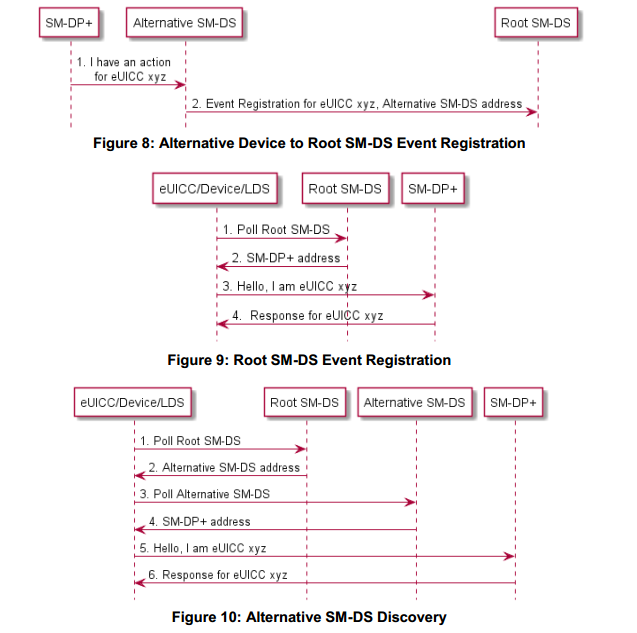

### 4.11.2 SM-DS的实施
eUICC上的两个SM-DS地址配置可能存在：
- 根SM-DS地址
- 可选的SM-DS地址

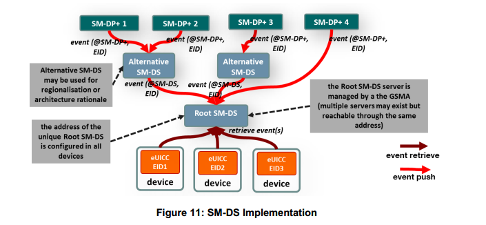

图11显示了这两种配置。 根SM-DS在设备制造时配置并且是不变的。 

### 4.11.3 SM-DS实施指南
在定义技术实现时应考虑以下声明：
- 提供SM-DS服务的竞争环境应该受到该方法的青睐。 
- 不应该有单点失败。 
- 实现应该固有地提供纵向和横向性能/可伸缩性。 
- 根据SGP.02 [8]（GSMA嵌入式SIM for SM-SR）的要求，在特定SM-DS上不需要预先注册设备或eUICC。

4.11.4 SM-DS功能
SM-DS有以下三个功能:
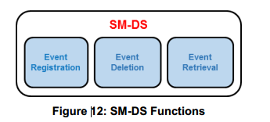

- 活动注册
存储从SM-DP +接收到的事件记录的过程。
- 事件删除
SM-DP +可以删除自己的事件记录的过程。
- 事件检索
提供所有注册的事件记录，根据任何查询的LDS发现请求。

### 4.11.5 SM-DS 需求
SMDS1 SM-DS应使LDS能够发现由SM-DP +（s）或备选SM-DS（s）注册的自己的事件记录。 

SMDS2 SM-DS将无法识别事件的性质。注：事件的性质可能是'可供下载的Profile包'。 

SMDS3所有有效的发现请求和事件注册均应以无歧视的方式进行处理。 

SMDS4 SM-DS只接受来自具有有效证书的任何经授权和认证的SM-DP +（s）的事件注册。 任何具有有效证书的授权和认证SM-DS。 

SMDS5 SM-DS只接受由相应的eUICC通过LDS认证的发现请求。 

SMDS6 SM-DS和SM-DP +以及连接的SM-DS应相互认证。 

SMDS7 SM-DS不可见任何可能用于危害最终用户隐私的数据。 

SMDS8 SM-DS应支持每个eUICC的多个并发事件注册，并应按照与SM-DS（先入先出）相同的顺序向LDS提供所有当前有效的事件记录。 

SMDS9 SM-DS只能存储指定给特定EID的事件记录。 

SMDS10用户特定数据和Profile相关内容不应存储在SM-DS中。 

SMDS11 SM-DS不允许收集任何信息，例如运营商，EID，设备制造商，设备等。

SMDS12 SM-DS应仅返回LDS，与所服务的eUICC相关的事件记录。 

SMDS13 SM-DS不会与Profile包有任何联系，例如不得存储或处理任何Profile包。 

SMDS14无论查询设备的状态如何（即时间和地理位置一致），SM-DS都应提供相同的数据。 

SMDS15 SM-DS不应该严重影响端到端的供应时间。 

SMDS16 SM-DS将提供针对DoS攻击的防御。 

SMDS17所有与SM-DS实体之间以及之间的通信都应加密。 

SMDS18 SM-DP +应能够删除在SM-DS上注册的任何自己的事件记录。 

SMDS19另一种SM-DS应能够删除在根SM-DS上注册的任何自己的事件记录（响应SMDS18中定义的SM-DP +删除操作）。 

SMDS20如果SM-DP +有请求，SM-DS的替代方案应将事件记录传播到根SM-DS。 

SMDS21如果在SM-DS上为一个eUICC注册了多个事件记录，则这些应全部作为单个响应发送。 

SMDS22 SM-DP +应能够通过根SM-DS或通过SM-DP +选择的备选方法向LDS发送事件记录。如果选择了替代方案，则LDS的事件记录应来自此替代SM-DS。 

SMDS23应该有一个独特的根SM-DS。注意：此要求不禁止此根SM-DS的潜在负载平衡。 

SMDS24根SM-DS应由GSMA管理。 

SMDS25（FFS）替代SM-DS可以对根SM-DS进行事件记录查询，以审计其拥有的事件注册。 

SMDS26（FFS）对事件记录查询的SM-DS响应应仅确认事件记录的存在，并且不应包含其他信息。 

SMDS27（FFS）备选SM-DS应能够通过ES15接口查询EID或Event-ID所标识的根SM-DS上事件记录的存在。 

SMDS28（FFS）对SM-DS事件记录查询的响应应仅在响应者验证事件记录所有权时发生。 

SMDS29（FFS）SM-DS事件记录查询的所有权验证应仅针对所持有的事件记录的组件使用请求者地址或提交的事件ID。 

SMDS30（FFS）SM-DS（根或备选方案）可以直接或通过另一个SM-DS通知SM-DP +，通过发布事件记录来解答来自授权LDS的发现请求。 

SMDS31（FFS）SM-DS只应通知事件记录拥有的SM-DP +或SMDS它已回复发现请求。

### 4.11.6事件注册/删除程序
下图显示了使用根SM-DS和替代SM-DS（级联模式）进行部署的过程。
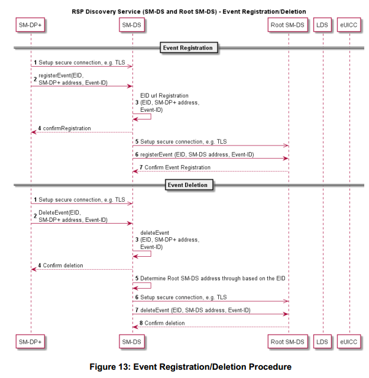

起始条件：
a. SM-DP +具有等待由EID识别的目标eUICC的动作。
程序：
1.SM-DP +与Profile所有者选择的替代SM-DS建立安全连接。
2.SM-DP +通知备选SM-DS有关未决动作。
3.至4.替代SM-DS注册并确认事件注册。
5.替代SM-DS建立到根SM-DS的安全连接。
6.可选SM-DS通知根SM-DS，对于给定的EID，事件记录正在等候替代SM-DS。
7.根SM-DS确认收到的信息。
4.11.7发现请求程序
下图显示了使用替代SM-DS和根SM-DS（级联模式）进行部署的过程。
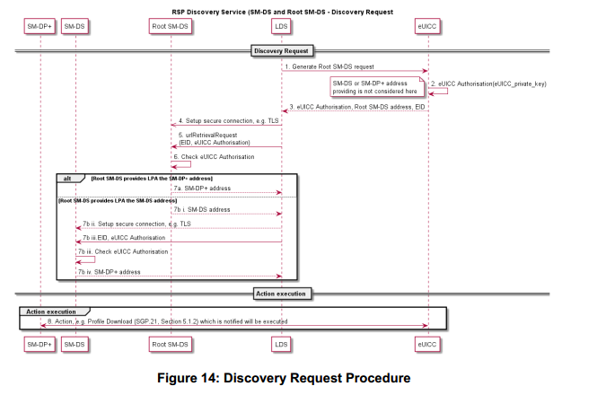

程序：
1.至3.为了生成发现请求，LDS请求eUICC生成包含（至少）eUICC证书并由eUICC签名的eUICC授权。
4.到5.LDS建立到根SM-DS的安全通信。
6.根SM-DS通过检查eUICC授权来验证eUICC的真实性。
7.如果eUICC是可信的并且事件记录正在等待，它会返回：
一个。 SM-DP +的地址，正在等待一个动作。
要么
湾以下其他操作：
I。替代SM-DS的地址，可以检索事件记录。
II。 LDS建立到替代SM-DS的安全连接。
III。替代SM-DS通过检查eUICC授权来验证eUICC的真实性。
IV。如果eUICC是真实的并且已收到事件记录，则它将传回SM-DP +的地址，在该处等待一个动作。
8. LPA建立到SM-DP +的连接，并且可以执行等待操作。

## 4.12 接口
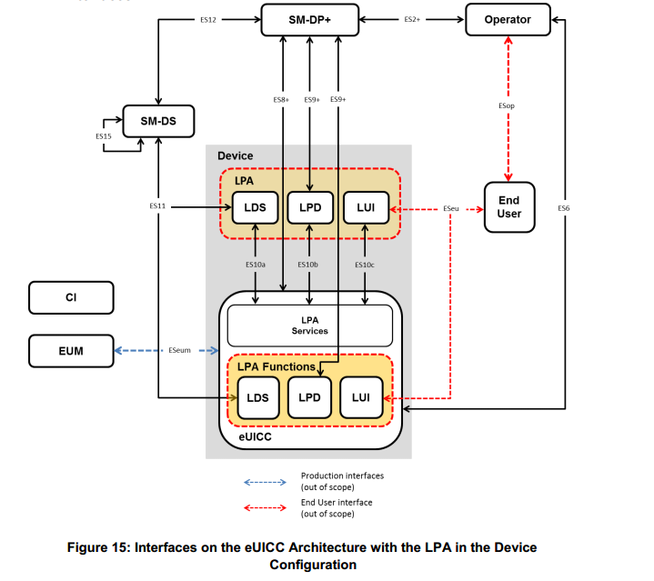

### 4.12.1运营商 - SM-DP +（ES2 +）
运营商使用ES2 +接口为特定eUICC以及其他管理功能订购Profile。
### 4.12.2运营商 - 最终用户（ESop）
这个接口超出了本规范的范围。
### 4.12.3最终用户 - LUI（ESeu）
ESeu是最终用户和LUI之间的接口。
在主/伴随设备场景中，所使用的LUI只能位于伴侣设备或其eUICC内。
ESeu接口用于支持以下要求：
ESeu1本地Profile管理操作只能通过ESeu接口执行。
ESeu2每个本地Profile管理操作应由最终用户明确发起，并由用户意图进行验证。
ESeu3 ESeu接口应支持触发和确认Profile下载和安装操作。

### 4.12.4运营商 - eUICC（ES6）
运营商使用ES6接口通过OTA服务管理运营商服务。
### 4.12.5 SM-DP + - LPD（ES9 +）
ES9 +接口用于为SM-DP +和LPD之间的绑定Profile包提供安全传输。
### 4.12.6 SM-DP + - eUICC（ES8 +）
ES8 +接口在SM-DP +和eUICC之间提供安全的端到端通道，用于在下载和安装期间管理ISD-P和关联的Profile。它是一个提供完美向前保密的界面。
### 4.12.7 SM-DP + - SM-DS（ES12）
ES12接口允许任何SM-DP +发布或删除SMDS上的事件注册。
### 4.12.8 LDS - SM-DS（ES11）
ES11接口允许LDS检索相应eUICC的事件记录。
### 4.12.9 EUM - eUICC（欧洲共同体）
这个接口超出了本规范的范围。
### 4.12.10 LDS - LPA服务（ES10a）
设备中的LPA使用ES10a接口从root用户SM-DS的eUICC以及可选的默认SM-DP +获取配置的地址。

### 4.12.11 LPD - LPA服务（ES10b）
设备中的LPD使用ES10b接口，LPA服务将绑定Profile包传输到eUICC。
### 4.12.12 LUI - LPA服务（ES10c）
ES10c接口用于设备中的LUI与最终用户的本地Profile管理的LPA服务之间。
### 4.12.13 SM-DS - SM-DS（ES15）
在部署级联SM-DS的情况下，ES15接口用于连接SM-DS。
### 4.12.14设备 - SM-DP +（已建立连接）
该连接将通过以下方式提供：
可用的互联网连接或在LPA所在的同一设备上提供的互联网连接
要么通过本地中继连接从另一台设备共享的互联网连接

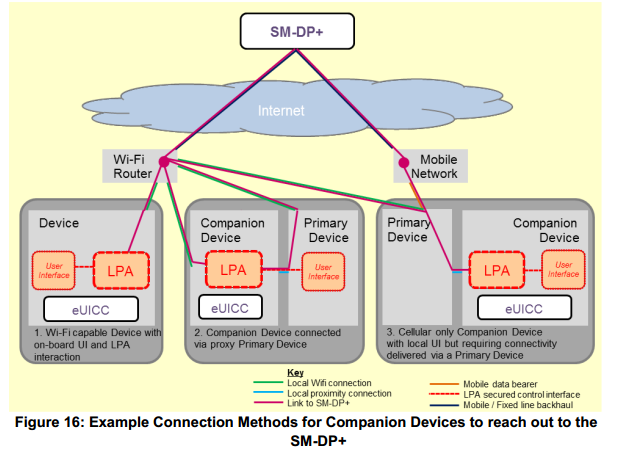

### 4.12.15通用接口要求
INT1 eUICC的所有接口都应指示eSVN。
INT2所有接口的行为应支持指定的eSVN。
INT3在从eUICC到SMDP +的支持eSVN的指示期间，应使用eUICC版本或该过程失败。 见下表。
INT4涉及远程SIM配置的所有通信实体应相互认证。 Device和eUICC在这方面被视为一个实体。
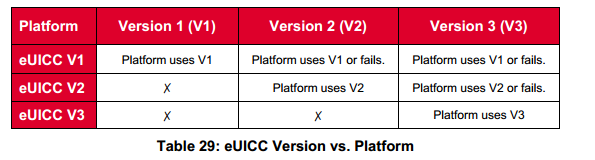

## 4.13Profile策略管理
### 4.13.1简介
Profile策略管理功能提供了一些机制，通过这些机制，服务提供商可以加强向订户提供服务的条件或政策（运营和业务）。在某些情况下，这可能还包括强制执行订户设定的政策。Profile策略管理也可以与其他已有的策略执行技术一起使用，这些技术也需要订户同意。Profile策略管理功能的实现基于两个关键要素。第一个元素是eUICC中包含的Profile Policy Enabler。第二个元素是一组定义的Profile策略规则，这些规则是特定策略的实际执行所必需的。 

### 4.13.2Profile策略管理要求
POL1Profile策略规则只能在Profile中配置。 
POL2每个Profile可能有与其自身相关的Profile策略规则。 
POL3Profile策略规则只适用于包含它的Profile。 
POL4Profile策略实施应在各个实施中保持一致。 
POL5Profile策略执行应能解决任何Profile策略规则冲突.
POL6更新Profile的策略规则应限于Profile所有者。 
POL7用于更新Profile策略规则的机制应为原子。 
POL8Profile策略规则集将可扩展用于将来的版本。 
POL9应该有一个Profile策略规则方案，以允许策略规则的可扩展性，例如如'操作命令，应用范围，资格描述
POL10Profile策略规则应当在尝试Profile状态更改时执行。 
POL11使用Profile策略下载并安装Profile规则'不要禁用'只有当前没有安装其他操作Profile时才可以。 
POL12 LPA和eUICC应阻止下载和安装包含与已安装Profile的Profile策略规则冲突的Profile策略规则的Profile。注意：技术规范应详尽地描述可能发生的每个冲突。 POL13如果Profile已启用，运营商应能够使用ES6接口停用其Profile的Profile策略规则。注意：在ES6接口上激活Profile策略规则是未来版本的潜在功能。 
POL14在Profile与Profile策略规则一起安装之前，最终用户应该能够得到有关Profile策略规则的通知，并且如果得到通知，安装将以最终用户身份验证确认为条件。如果RAT直接允许安装，则可能不需要此提示。 
POL15最终用户同意安装Profile策略规则和Profile下载的请求可以合并为单个提示，因此需要最终用户的单一确认。 
POL16Profile策略规则应由eUICC中的Profile策略启动器强制执行。 
POL17Profile策略启动器应仅支持本规范中定义的Profile策略规则。 
POL18Profile策略启动器应能够支持本规范中定义的所有Profile策略规则。
POL19在所有情况下POLAR POL RULE3都是可执行的，但启用Profile除外。注意：POL RULE3被定义为用于尚未完全定义的特定用例，并且不适用于此版本的规范。 
POL20允许安装具有Profile策略规则的Profile应符合当地法规要求。

### 4.13.3策略规则
POL RULE1应支持Profile策略规则'禁止禁止Profile'。 
POL RULE2应支持Profile策略规则“不允许删除此Profile”。 
POL RULE3Profile策略规则“应该在成功禁用时删除此Profile”应该被支持。注意：POL RULE3被定义为用于尚未完全定义的特定用例，并且不适用于此版本的规范。

### 4.13.4Profile策略启动器要求
POLPPE1规则授权表（RAT）应存储在eUICC的Profile策略启动器中。 
POLPPE2Profile策略启用程序应仅在Profile安装时强制安装RAT的内容（如果有）。 
POLPPE3 RAT应允许多个Profile所有者在Profile中启用Profile策略规则。
POLPPE4 RAT应能够支持特定的配置，允许任何配置文件所有者使用一组或全部配置文件策略规则。 
POLPPE5 RAT只能在发行前或在初始设备设置期间安装，前提是没有安装操作配置文件。 
POLPPE6 RAT不受eUICC Memory Reset功能的影响。 
POLPPE7为了支持可识别的监管要求，RAT应该能够支持特定的配置，该配置可以禁止任何配置文件所有者设置特定的配置文件策略规则。 
POLPPE8如果设置了POLPPE7，则此信息应为SM-DP +与eUICC共享的资格检查信息的一部分。 
POLPPE9如果RAT允许安装配置文件的配置文件策略规则，安装应按照POL14中的规定进行。 
POLPPE10在安装配置文件之前，RAT应能够支持设置以显示配置文件策略规则对最终用户的影响。 
POLPPE11 OEM或EUM应负责提供RAT。 POLPPE12固定RAT应在eUICC中实施。注意：允许的RAT配置在附件H中有详细说明。

## 4.14认证
### 4.14.1 eUICC认证
CERTEU1 EUM应通过GSMA SAS认证[13]。 
CERTEU2 EUM应被要求声明eUICC产品符合GSMA SGP.22 V2.0 [24]。 
CERTEU3 eUICC应根据GSMA（TBD）定义的保护配置文件进行认证。 
CERTEU4 eUICC保护配置文件至少应包含以下要素：平台服务管理器，ISD-R，配置文件存储和配置文件隔离。 
CERTEU5 eUICC保护配置文件应与SGP.05 [21]中定义的eUICC保护配置文件相同。 
CERTEU6 eUICC保护配置文件的评估保证级别应至少（至少）EAL4增加AVA_VAN.5和ALC_DVS.2（EAL 4+）或同等级别。注：FASG需要对保证水平进行研究。 
CERTEU7用于身份验证的eUICC公钥证书应包含EID。 
CERTEU8 eUICC公钥证书应包含产品的技术参考，例如Common Criteria认证报告编号。 
CERTEU9 EUM公钥证书应由GSMA CI签署。 
CERTEU10 eUICC证书应由EUM使用其EUM证书进行签名。 
CERTEU11 eUICC私钥不应该是可修改的。 
CERTEU12如果eUICC私钥是可修改的，则应使用GlobalPlatform规范中定义的机制，使用密钥长度为128位的AES算法对应的最低安全级别。 
CERTEU13 eUICC应该支持一个安全的机制来更新其EUM证书。 
CERTEU14 eUICC应该支持更新其CI公钥的安全机制。 
CERTEU15 eUICC应该支持更新其eUICC证书的安全机制。

### 4.14.2设备符合性
CERTDEV1根据GSMA，对于本地配置文件管理实施的所有部分应该有合规流程。

### 4.14.3 SM-DP +认证
CERTDP1 SM-DP +提供商应被要求声明符合GSMA SGP.22 V2.0 [24]的产品（SM-DP +）。 
CERTDP2 SM-DP +应根据GSMA SAS [22]进行认证。 
CERTDP3 SM-DP +元件应使用硬件安全模块（HSM）进行密码相关操作（密钥存储，派生，加密操作）。注意：这将由SAS文档“根据FIPS 140-2 3级或更高级别认证的HSM”涵盖
CERTDP4 SM-DP +应实现权限隔离（日志，审计，操作和管理）。 
CERTDP5 SM-DP +应实施操作系统强化机制。 
CERTDP6 SM-DP +应实现控制，用户和管理平面的分离。 
CERTDP7 SM-DP +应使用多重身份验证和管理操作。用于存储配置文件的
CERTDP8 SM-DP +硬盘和备份介质将被加密。 
CERTDP9用于与eUICC进行双向认证的SM-DP +证书私钥应根据CERTDP3进行保护并存储在HSM中。 
CERTDP10 SM-DP +应实施速率限制机制以减轻DoS攻击。 
CERTDP11 SM-DP +应记录所有证书认证失败。 
CERTDP12 SM-DP +公钥证书应由GSMA CI签名。

### 4.14.4 SM-DS认证
CERTDS1 SM-DS提供商应被要求声明产品符合GSMA SGP.22 [24]。
CERTDS2 SM-DS应根据相关的GSMA SAS进行认证。 
CERTDS3 SM-DS应实现特权的隔离（日志，审计，操作和管理）。 
CERTDS4 SM-DS应实施操作系统强化机制。 
CERTDS5 SM-DS应实施控制，用户和管理平面的分离。 
CERTDS6 SM-DS应使用多因素身份验证和管理操作。 
CERTDS7 SM-DS硬盘驱动器和备份介质应加密。 
CERTDS8 SM-DS证书应由GSMA CI签署。 

### 4.14.5 LPA认证
CERTLPA1对于与远程SIM供应实体通信的所有LPA元素，应该有一个认证过程。 
CERTLPA2认证过程应确保本地配置文件管理操作仅由授权的LPA元素发送。 
CERTLPA3认证过程应确保存在阻止受损LPA的机制。 
CERTLPA4 LPD应在TLS会话期间对SM-DP +进行身份验证。 
CERTLPA5 LDS应在TLS会话期间对SM-DS进行身份验证。 
CERTLPA6 LPA应仅接受由GSMA CI签署的证书以进行服务器身份验证。 

### 4.14.6公钥证书管理
CERTPK1 eUICC应验证SM-DP +的公钥证书。 
CERTPK2 LPD应验证SM-DP +的公钥证书。 
CERTPK3 LDS应验证SM-DS的公钥证书。 
CERTPK4使用无效公钥证书的SM-DS的LDS身份验证将失败（请参见CERTPK11），并且正在进行的通信应停止。 
CERTPK5使用无效公钥证书的SM-DP +的LPD认证失败（参见CERTPK11CERTPK1），并且正在进行的通信应停止。 
CERTPK6使用无效公钥证书的eUICC的SM-DP +认证应失败（参见CERTPK11），并且正在进行的通信应停止。 
CERTPK7使用无效公钥证书的SM-DP +的eUICC认证应失败（参见CERTPK11），并且正在进行的通信应停止。 
CERTPK8 GSMA CI应当撤销任何实体（SMDP +，SM-DS，EUM）的公钥证书（如果私钥被盗用）。 
CERTPK9 eUICC应能够支持一组GSMA CI。 
CERTPK10在下列情况下，公钥证书应被视为有效：它具有有效签名由GSMA CI或可信任的证书链直至GSMA CI进行签名。证书路径验证应遵循RFC 5280中定义的过程。尚未撤销，且信任链中没有证书已被撤销尚未到期如果这些适用的验证失败，公钥证书应被视为无效。 
CERTPK11 eUICC，LPA，SM-DS和SM-DP +应知晓撤销的公钥证书。
