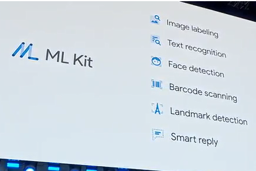

# Google AI
[链接](https://ai.google/)
诊断糖尿病视网膜病变

预测心血管风险

预测医疗事件

智能语音分离

这个在Andrew NG的课程中已经有的。

支持莫尔斯电码输入

Gmail Tab智能补全

Google Photos自动识别并处理

TPU更新

google assistants
[链接](https://assistant.google.com/intl/en_us/)
任何时候hey google唤醒，支持更加自然的对话，并且支持连续的上下文。

Google News

# Android P
 - 更加智能
 - 更加简单
 - 更加顺手

## 更加智能
推出ML Kit
ML Kit beta以强大且易于使用的软件包为移动开发人员带来Google的机器学习专业知识。
[链接](https://developers.google.com/ml-kit/)

# Google Maps
VPS--结合摄像头和地图，更加真实

# Google Lens
文字OCR识别，并自动查询

识别物体

# Google自动驾驶

即使下雪天也能很好的识别

# Android
## Android APP Bundle
 - innovative distribution
 - faster development
 - increased engagement

app dynamic delivery

## Android Jetpack
[链接](https://developer.android.com/jetpack/)
Jetpack是一套库，工具和体系结构指南，可帮助轻松快捷地构建卓越的Android应用程序。提供了常见的基础架构代码，Android Jetpack加速Android开发。

## Android Slices
[链接](https://developer.android.com/guide/slices/)
Slices是UI模板，可以在Google搜索应用中显示来自应用的丰富，动态和交互式内容，以及之后在其他位置显示Google智能助理。 通过在全屏应用体验之外启用参与，切片可以帮助用户更快地执行任务。 您可以将切片构建为应用操作的增强。

Android Jetpack内置了对Slices的支持，并可以一直延伸到Android 4.4，大约占所有Android用户的95％。

## lighthouse
Lighthouse 是一个开源的自动化工具，用于改进网络应用的质量。 您可以将其作为一个 Chrome 扩展程序运行，或从命令行运行。 您为 Lighthouse 提供一个您要审查的网址，它将针对此页面运行一连串的测试，然后生成一个有关页面性能的报告。

## AMP
[链接](https://www.ampproject.org/)
AMP项目是一项开源计划，目的是使网络更好。 该项目能够创建在设备和分销平台上始终如一地快速，美观和高性能的网站和广告。

## material theming
Google设计
[链接](https://design.google/library/making-more-with-material/)

# cloud TPU
在 Cloud TPU 上运行机器学习工作负载，并从 Google Cloud Platform 领先业界的存储、网络和数据分析技术中获益。
[链接](https://cloud.google.com/tpu/)

# cloud AI
[链接](https://cloud.google.com/products/machine-learning/)
Google Cloud 的 AI 提供最新的机器学习服务、预先训练的模型以及一项可让您生成定制模型的服务。与其他大规模机器学习系统相比，我们基于神经网络的 ML 服务具有更好的训练性能，准确性更高。我们的服务具有速度快、可扩展以及易于使用的特点。主要的 Google 应用都在使用 Cloud Machine Learning，包括 Google 照片（图片搜索）、Google 应用（语音搜索）、翻译和 Inbox（智能回复）。我们的平台现以云服务的形式提供，可为您的业务应用带来无与伦比的规模和速度。
 - 大规模机器学习服务
 - 强大的职位搜索和发现
 - 强大的视频分析
 - 强大的图片分析
 - 强大的语音识别
 - 强大的文字分析
 - 快速的动态翻译

# tensorflow
TensorFlow.js
[链接](https://js.tensorflow.org/)

TensorFlowLite
TensorFlowLite+Raspberry Pi
[链接](https://www.tensorflow.org/mobile/tflite/)

# ML Kit
ML Kit beta以强大且易于使用的软件包为移动开发人员带来Google的机器学习专业知识。
[链接](https://developers.google.com/ml-kit/)

# FireBase + fabric
[fabric](https://get.fabric.io/)
[FireBase](https://firebase.google.com/).
Firebase 可以帮助您构建更出色的移动应用并推动业务增长。

# ARCore
[ARCore](https://developers.google.com/ar/)
借助ARCore，构建新的增强现实体验，无缝融合数字世界和物理世界。 以Google的规模改变人们玩，购物，学习，创造和体验世界的方式。

