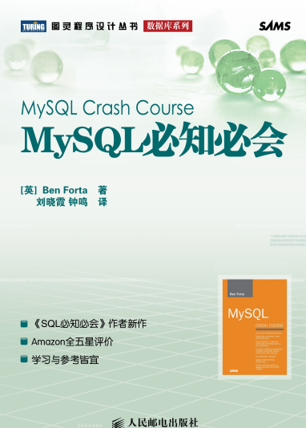

# 图书封面


# 目录

本书的读者对象是这样一些人：
 - 他没有学过SQL；
 - 他刚开始用MySQL，并希望一举成功；
 - 他想迅速地、尽可能多地学会使用MySQL；
 - 他希望学习怎样在自己的应用程序开发中使用MySQL；
 - 他希望通过使用MySQL轻松快速地提高工作效率，而不用劳烦他人帮忙。

目 录
第1章 了解SQL
第2章 MySQL简介
第3章 使用MySQL
第4章 检索数据
第5章 排序检索数据
第6章 过滤数据
第7章 数据过滤
第8章 用通配符进行过滤
第9章 用正则表达式进行搜索
第10章 创建计算字段
第11章 使用数据处理函数
第12章 汇总数据
第13章 分组数据
第14章 使用子查询
第15章 联结表
第16章 创建高级联结
第17章 组合查询
第18章 全文本搜索
第19章 插入数据
第20章 更新和删除数据
第21章 创建和操纵表
第22章 使用视图
第23章 使用存储过程
第24章 使用游标
第25章 使用触发器
第26章 管理事务处理
第27章 全球化和本地化
第28章 安全管理
第29章 数据库维护
第30章 改善性能
附录A MySQL入门
附录B 样例表
附录C MySQL语句的语法
附录D MySQL数据类型
附录E MySQL保留字

# 云图


# 代码
```python
from collections import Counter
from zhon import hanzi
import string
import re
import os
import matplotlib.pyplot as plt
import jieba
from wordcloud import WordCloud, ImageColorGenerator

with open('mysql必知应会.txt','r', encoding='utf-8') as fp:
    alltext = ' '.join(fp.readlines())

alltext = re.sub("[%s]+" % hanzi.punctuation, " ", alltext)
alltext = re.sub("[%s]+" % string.punctuation, " ", alltext)

seg_list = jieba.cut(alltext, cut_all=False)
seg_list = list(seg_list)

counter = Counter(seg_list)
top = counter.most_common(1000)

top_dict = dict(top)

stopwords_list = []
pwd = os.path.abspath('.')
for file in os.listdir(os.path.join(pwd,'stopwords')):
    filename = os.path.join(pwd,'stopwords',file)
    with open(filename,'r') as fp:
        stopwords_list.extend(fp.readlines())

stopwords_list = list(set(stopwords_list))

for stopword in stopwords_list:
    try:
        top_dict.pop(stopword.strip())
    except:
        pass

wc = WordCloud(background_color="white", #背景颜色max_words=2000,# 词云显示的最大词数
    font_path='simfang.ttf',
    max_font_size=50, #字体最大值
    random_state=42)

wc.generate_from_frequencies(top_dict)

plt.imshow(wc)
plt.axis('off')

plt.show()

```
