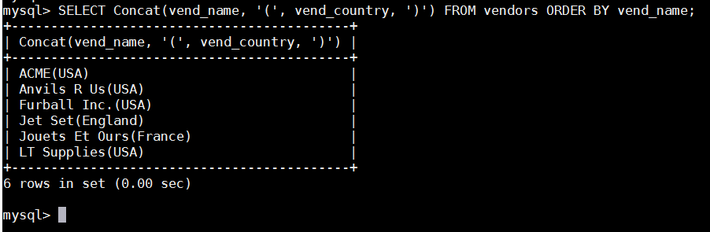
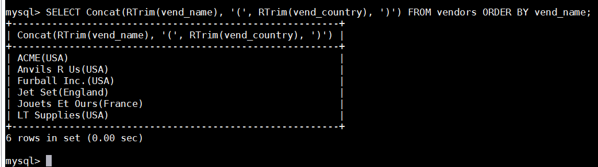
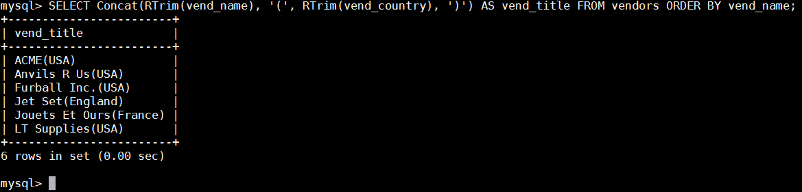
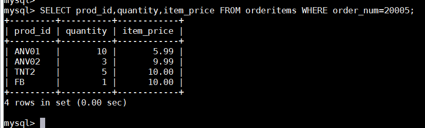
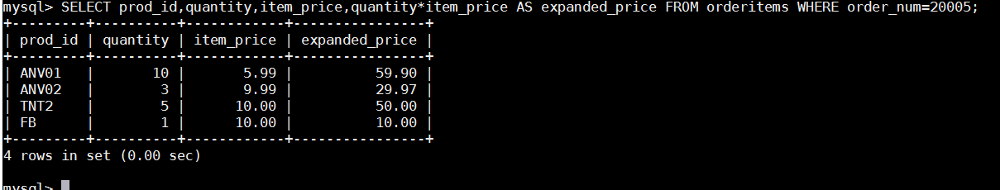
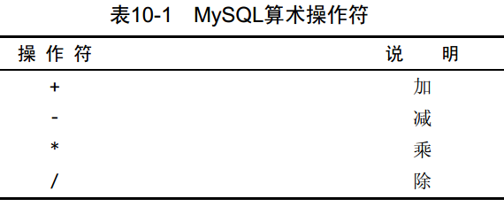

# 第十章 创建计算字段
本章介绍什么是计算字段，如何创建计算字段以及怎样从应用程序中使用别名引用它们。

## 10.1 计算字段
存储在数据库表中的数据一般不是应用程序所需要的格式。下面举几个例子。
 - 如果想在一个字段中既显示公司名，又显示公司的地址，但这两个信息一般包含在不同的表列中。
 - 城市、州和邮政编码存储在不同的列中（应该这样），但邮件标签打印程序却需要把它们作为一个恰当格式的字段检索出来。
 - 列数据是大小写混合的，但报表程序需要把所有数据按大写表示出来。 
 - 物品订单表存储物品的价格和数量，但不需要存储每个物品的总价格（用价格乘以数量即可）。为打印发票，需要物品的总价格。 
 - 需要根据表数据进行总数、平均数计算或其他计算。

在上述每个例子中，存储在表中的数据都不是应用程序所需要的。我们需要直接从数据库中检索出转换、计算或格式化过的数据；而不是检索出数据，然后再在客户机应用程序或报告程序中重新格式化。这就是计算字段发挥作用的所在了。与前面各章介绍过的列不同，计算字段并不实际存在于数据库表中。计算字段是运行时在SELECT语句内创建的。

字段（field） 基本上与列（ column） 的意思相同，经常互换使用，不过数据库列一般称为列，而术语字段通常用在计算字段的连接上。重要的是要注意到，只有数据库知道SELECT语句中哪些列是实际的表列，哪些列是计算字段。从客户机（如应用程序）的角度来看，计算字段的数据是以与其他列的数据相同的方式返回的。
客户机与服务器的格式 可在SQL语句内完成的许多转换和格式化工作都可以直接在客户机应用程序内完成。但一般来说，在数据库服务器上完成这些操作比在客户机中完成要快得多，因为DBMS是设计来快速有效地完成这种处理的。

## 10.2 拼接字段
为了说明如何使用计算字段，举一个创建由两列组成的标题的简单例子。vendors表包含供应商名和位置信息。假如要生成一个供应商报表，需要在供应商的名字中按照name(location)这样的格式列出供应商的位置。此报表需要单个值，而表中数据存储在两个列vend_name和vend_country中。此外，需要用括号将vend_country括起来，这些东西都没有明确存储在数据库表中。我们来看看怎样编写返回供应商名和位置的SELECT语句。拼接（concatenate） 将值联结到一起构成单个值。解决办法是把两个列拼接起来。在MySQL的SELECT语句中，可使用Concat()函数来拼接两个列。
MySQL的不同之处 多数DBMS使用+或||来实现拼接，MySQL则使用Concat()函数来实现。当把SQL语句转换成MySQL语句时一定要把这个区别铭记在心。

Concat()拼接串，即把多个串连接起来形成一个较长的串。Concat()需要一个或多个指定的串，各个串之间用逗号分隔。上面的SELECT语句连接以下4个元素：
 - 存储在vend_name列中的名字； 
 - 包含一个空格和一个左圆括号的串； 
 - 存储在vend_country列中的国家； 
 - 包含一个右圆括号的串。
从上述输出中可以看到， SELECT语句返回包含上述4个元素的单个列（计算字段）。在第8章中曾提到通过删除数据右侧多余的空格来整理数据，这可以使用MySQL的RTrim()函数来完成，如下所示：

RTrim()函数去掉值右边的所有空格。通过使用RTrim()，各个列都进行了整理。

Trim函数 MySQL除了支持RTrim()（正如刚才所见，它去掉串右边的空格），还支持LTrim()（去掉串左边的空格）以及Trim()（去掉串左右两边的空格）。

**使用别名**
从前面的输出中可以看到， SELECT语句拼接地址字段工作得很好。但此新计算列的名字是什么呢？实际上它没有名字，它只是一个值。如果仅在SQL查询工具中查看一下结果，这样没有什么不好。但是，一个未命名的列不能用于客户机应用中，因为客户机没有办法引用它。为了解决这个问题， SQL支持列别名。 别名（ alias） 是一个字段或值的替换名。别名用AS关键字赋予。请看下面的SELECT语句：

SELECT语句本身与以前使用的相同，只不过这里的语句中计算字段之后跟了文本AS vend_title。它指示SQL创建一个包含指定计算的名为vend_title的计算字段。从输出中可以看到，结果与以前的相同，但现在列名为vend_title，任何客户机应用都可以按名引用这个列，就像它是一个实际的表列一样。
别名的其他用途 别名还有其他用途。常见的用途包括在实际的表列名包含不符合规定的字符（如空格）时重新命名它，在原来的名字含混或容易误解时扩充它，等等。
导出列 别名有时也称为导出列（ derived column），不管称为什么，它们所代表的都是相同的东西。

## 10.3 执行算术计算
计算字段的另一常见用途是对检索出的数据进行算术计算。举一个例子， orders表包含收到的所有订单， orderitems表包含每个订单中的各项物品。下面的SQL语句检索订单号20005中的所有物品：

item_price列包含订单中每项物品的单价。如下汇总物品的价格（单价乘以订购数量）：

输出中显示的expanded_price列为一个计算字段，此计算为quantity\*item_price。客户机应用现在可以使用这个新计算列，就像使用其他列一样。

MySQL支持表10-1中列出的基本算术操作符。此外，圆括号可用来区分优先顺序。关于优先顺序的介绍，请参阅第7章。

如何测试计算 SELECT提供了测试和试验函数与计算的一个很好的办法。虽然SELECT通常用来从表中检索数据，但可以省略FROM子句以便简单地访问和处理表达式。例如， SELECT 3\*2;将返回6， SELECT Trim('abc');将返回abc，而SELECT Now();利用Now()函数返回当前日期和时间。通过这些例子，可以明白如何根据需要使用SELECT进行试验。

## 10.4 小结
本章介绍了计算字段以及如何创建计算字段。我们用例子说明了计算字段在串拼接和算术计算的用途。此外，还学习了如何创建和使用别名，以便应用程序能引用计算字段。

