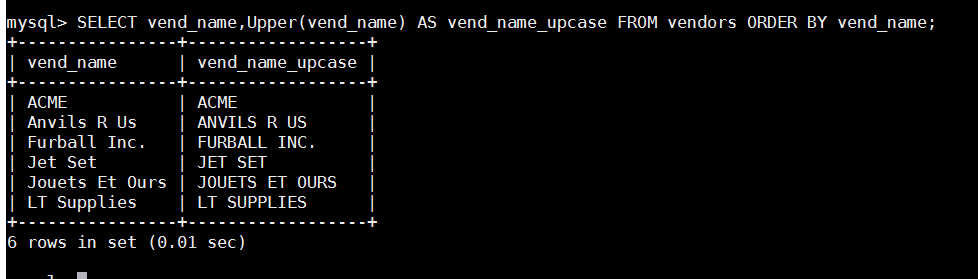
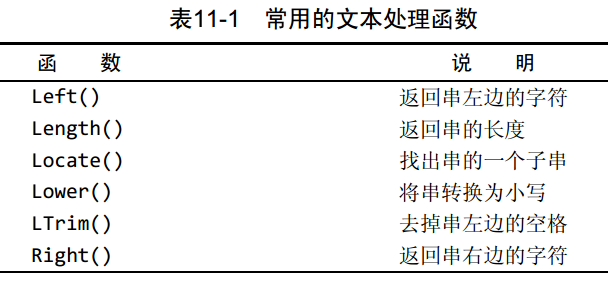
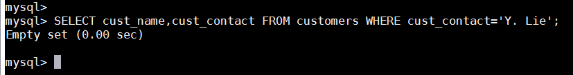
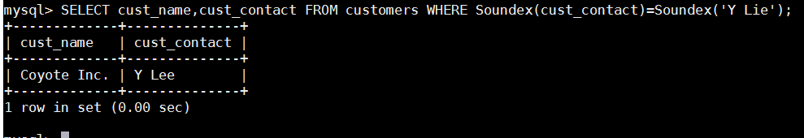
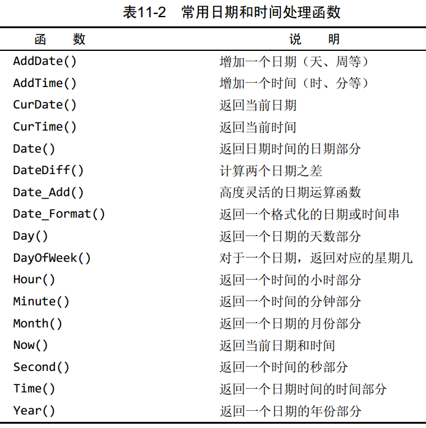
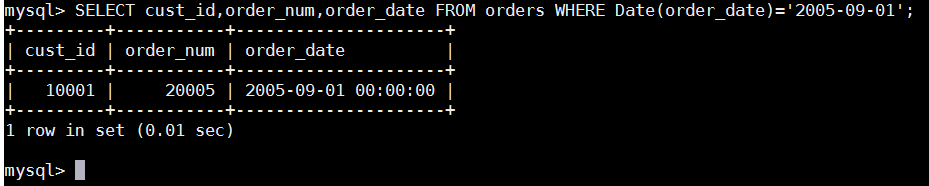
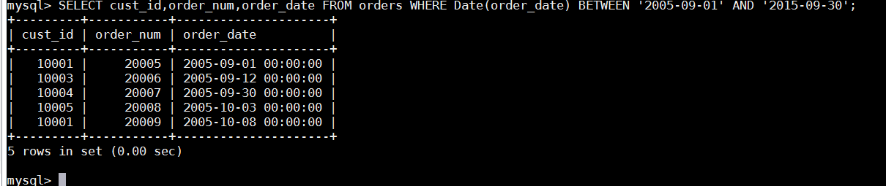
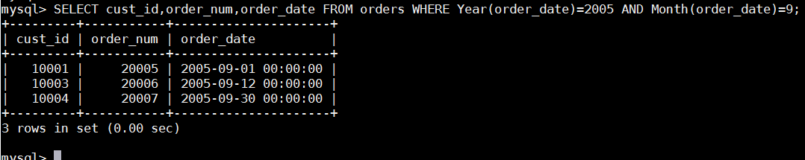

# 第11章 使用数据处理函数
本章介绍什么是函数， MySQL支持何种函数，以及如何使用这些函数。

## 11.1 函数
与其他大多数计算机语言一样， SQL支持利用函数来处理数据。函数一般是在数据上执行的，它给数据的转换和处理提供了方便。在前一章中用来去掉串尾空格的RTrim()就是一个函数的例子。
函数没有SQL的可移植性强 能运行在多个系统上的代码称为可移植的（ portable）。相对来说，多数SQL语句是可移植的，在SQL实现之间有差异时，这些差异通常不那么难处理。而函数的可移植性却不强。几乎每种主要的DBMS的实现都支持其他实现不支持的函数，而且有时差异还很大。为了代码的可移植，许多SQL程序员不赞成使用特殊实现的功能。虽然这样做很有好处，但不总是利于应用程序的性能。如果不使用这些函数，编写某些应用程序代码会很艰难。必须利用其他方法来实现DBMS非常有效地完成的工作。如果你决定使用函数，应该保证做好代码注释，以便以后你（或其他人）能确切地知道所编写SQL代码的含义。

## 11.2 使用函数
大多数SQL实现支持以下类型的函数。
 - 用于处理文本串（如删除或填充值，转换值为大写或小写）的文本函数。
 - 用于在数值数据上进行算术操作（如返回绝对值，进行代数运算）的数值函数。 
 - 用于处理日期和时间值并从这些值中提取特定成分（例如，返回两个日期之差，检查日期有效性等）的日期和时间函数。
 - 返回DBMS正使用的特殊信息（如返回用户登录信息，检查版本细节）的系统函数。

### 11.2.1 文本处理函数
上一章中我们已经看过一个文本处理函数的例子，其中使用RTrim()函数来去除列值右边的空格。下面是另一个例子，这次使用Upper()函数：

正如所见， Upper()将文本转换为大写，因此本例子中每个供应商都列出两次，第一次为vendors表中存储的值，第二次作为列vend_name_upcase转换为大写。
表11-1列出了某些常用的文本处理函数。

表11-1中的SOUNDEX需要做进一步的解释。 SOUNDEX是一个将任何文本串转换为描述其语音表示的字母数字模式的算法。 SOUNDEX考虑了类似的发音字符和音节，使得能对串进行发音比较而不是字母比较。虽然SOUNDEX不是SQL概念，但MySQL（就像多数DBMS一样）都提供对SOUNDEX的支持。下面给出一个使用Soundex()函数的例子。 customers表中有一个顾客Coyote Inc.，其联系名为Y.Lee。但如果这是输入错误，此联系名实际应该是Y.Lie，怎么办？显然，按正确的联系名搜索不会返回数据，如下所示：

现在试一下使用Soundex()函数进行搜索，它匹配所有发音类似于Y.Lie的联系名：

在这个例子中， WHERE子句使用Soundex()函数来转换cust_contact列值和搜索串为它们的SOUNDEX值。因为Y.Lee和Y.Lie发音相似，所以它们的SOUNDEX值匹配，因此WHERE子句正确地过滤出了所需的数据。

### 11.2.2 日期和时间处理函数
日期和时间采用相应的数据类型和特殊的格式存储，以便能快速和有效地排序或过滤，并且节省物理存储空间。一般，应用程序不使用用来存储日期和时间的格式，因此日期和时间函数总是被用来读取、统计和处理这些值。由于这个原因，日期和时间函数在MySQL语言中具有重要的作用。
表11-2列出了某些常用的日期和时间处理函数。

迄今为止，我们都是用比较数值和文本的WHERE子句过滤数据，但数据经常需要用日期进行过滤。用日期进行过滤需要注意一些别的问题和使用特殊的MySQL函数。首先需要注意的是MySQL使用的日期格式。无论你什么时候指定一个日期，不管是插入或更新表值还是用WHERE子句进行过滤，日期必须为格式yyyy-mm-dd。因此， 2005年9月1日，给出为2005-09-01。虽然其他的日期格式可能也行，但这是首选的日期格式，因为它排除了多义性（如，04/05/06是2006年5月4日或2006年4月5日或2004年5月6日或……）。
应该总是使用4位数字的年份 支持2位数字的年份， MySQL处理00-69为2000-2069，处理70-99为1970-1999。虽然它们可能是打算要的年份，但使用完整的4位数字年份更可靠，因为MySQL不必做出任何假定。因此，基本的日期比较应该很简单：
函数。 Date(order_date)指示MySQL仅提取列的日期部分，更可靠的SELECT语句为：

如果要的是日期，请使用Date() 如果你想要的仅是日期，则使用Date()是一个良好的习惯，即使你知道相应的列只包含日期也是如此。这样，如果由于某种原因表中以后有日期和时间值，你的SQL代码也不用改变。当然，也存在一个Time()函数，在你只想要时间时应该使用它。Date()和Time()都是在MySQL 4.1.1中第一次引入的。在你知道了如何用日期进行相等测试后，其他操作符（在第6章中介绍）的使用也就很清楚了。不过，还有一种日期比较需要说明。如果你想检索出2005年9月下的所有订单，怎么办？简单的相等测试不行，因为它也要匹配月份中的天数。有几种解决办法，其中之一如下所示：

其中， BETWEEN操作符用来把2005-09-01和2005-09-30定义为一个要匹配的日期范围。还有另外一种办法（一种不需要记住每个月中有多少天或不需要操心闰年2月的办法）：

Year()是一个从日期（或日期时间）中返回年份的函数。类似，Month()从日期中返回月份。因此， WHERE Year(order_date) = 2005 AND Month(order_date) = 9检索出order_date为2005年9月的所有行。
MySQL的版本差异 MySQL 4.1.1中增加了许多日期和时间函数。如果你使用的是更早的MySQL版本，应该查阅具体的文档以确定可以使用哪些函数。

### 11.2.3 数值处理函数
数值处理函数仅处理数值数据。这些函数一般主要用于代数、三角或几何运算，因此没有串或日期—时间处理函数的使用那么频繁。具有讽刺意味的是，在主要DBMS的函数中，数值函数是最一致最统一的函数。
表11-3列出一些常用的数值处理函数。

## 11.3 小结
本章介绍了如何使用SQL的数据处理函数，并着重介绍了日期处理函数。