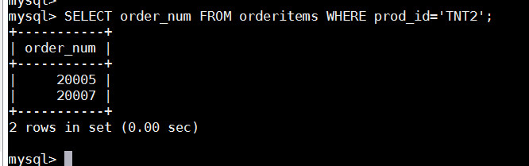
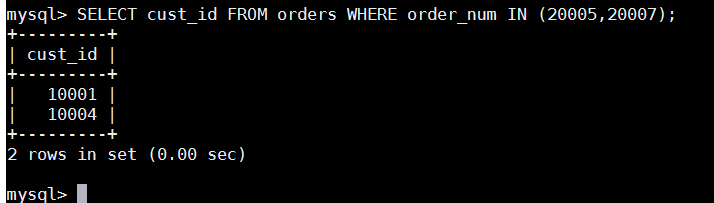
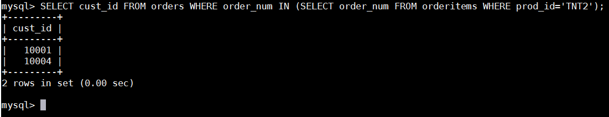
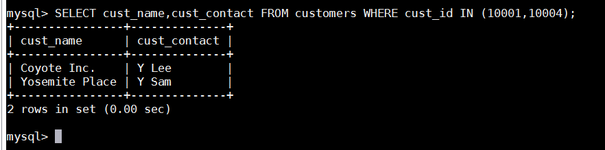
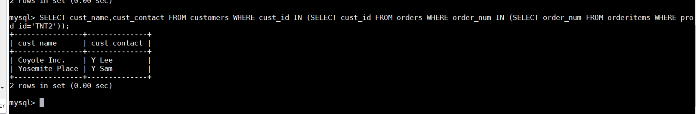
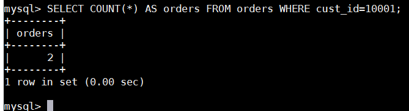
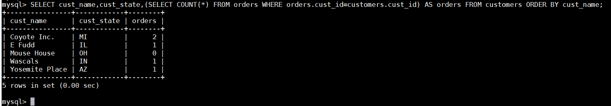
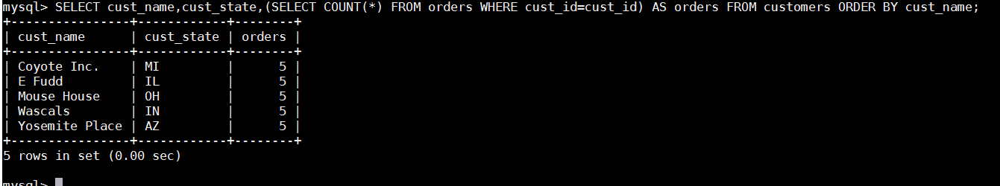

# 第14章-使用子查询
使用子查询本章介绍什么是子查询以及如何使用它们。

## 14.1 子查询
版本要求 MySQL 4.1引入了对子查询的支持，所以要想使用本章描述的SQL，必须使用MySQL 4.1或更高级的版本。SELECT语句是SQL的查询。迄今为止我们所看到的所有SELECT语句都是简单查询，即从单个数据库表中检索数据的单条语句。
查询（query） 任何SQL语句都是查询。但此术语一般指SELECT语句。
SQL还允许创建子查询（ subquery） ，即嵌套在其他查询中的查询。为什么要这样做呢？理解这个概念的最好方法是考察几个例子。

## 14.2 利用子查询进行过滤
本书所有章中使用的数据库表都是关系表（关于每个表及关系的描述，请参阅附录B）。订单存储在两个表中。对于包含订单号、客户ID、订单日期的每个订单， orders表存储一行。各订单的物品存储在相关的orderitems表中。 orders表不存储客户信息。它只存储客户的ID。实际的客户信息存储在customers表中。现在，假如需要列出订购物品TNT2的所有客户，应该怎样检索？下面列出具体的步骤。
- (1) 检索包含物品TNT2的所有订单的编号。
- (2) 检索具有前一步骤列出的订单编号的所有客户的ID。
- (3) 检索前一步骤返回的所有客户ID的客户信息。
上述每个步骤都可以单独作为一个查询来执行。可以把一条SELECT语句返回的结果用于另一条SELECT语句的WHERE子句。也可以使用子查询来把3个查询组合成一条语句。第一条SELECT语句的含义很明确，对于prod_id为TNT2的所有订单物品，它检索其order_num列。输出列出两个包含此物品的订单：

下一步，查询具有订单20005和20007的客户ID。利用第7章介绍的IN子句，编写如下的SELECT语句：

现在，把第一个查询（返回订单号的那一个）变为子查询组合两个查询。请看下面的SELECT语句：

在SELECT语句中，子查询总是从内向外处理。在处理上面的SELECT语句时， MySQL实际上执行了两个操作。首先，它执行下面的查询：
SELECT order_num FROM orderitems WHERE prod_id='TNT2'
此查询返回两个订单号： 20005和20007。然后，这两个值以IN操作符要求的逗号分隔的格式传递给外部查询的WHERE子句。外部查询变成：
SELECT cust_id FROM orders WHERE order_num IN (20005,20007)
可以看到，输出是正确的并且与前面硬编码WHERE子句所返回的值相同。

格式化SQL 包含子查询的SELECT语句难以阅读和调试，特别是它们较为复杂时更是如此。如上所示把子查询分解为多行并且适当地进行缩进，能极大地简化子查询的使用。现在得到了订购物品TNT2的所有客户的ID。下一步是检索这些客户ID的客户信息。检索两列的SQL语句为：

可以把其中的WHERE子句转换为子查询而不是硬编码这些客户ID：

为了执行上述SELECT语句， MySQL实际上必须执行3条SELECT语句。最里边的子查询返回订单号列表，此列表用于其外面的子查询的WHERE子句。外面的子查询返回客户ID列表，此客户ID列表用于最外层查询的WHERE子句。最外层查询确实返回所需的数据。可见，在WHERE子句中使用子查询能够编写出功能很强并且很灵活的SQL语句。对于能嵌套的子查询的数目没有限制，不过在实际使用时由于性能的限制，不能嵌套太多的子查询。
列必须匹配 在WHERE子句中使用子查询（如这里所示），应该保证SELECT语句具有与WHERE子句中相同数目的列。通常，子查询将返回单个列并且与单个列匹配，但如果需要也可以使用多个列。
虽然子查询一般与IN操作符结合使用，但也可以用于测试等于（=）、不等于（<>）等。
子查询和性能 这里给出的代码有效并获得所需的结果。但是，使用子查询并不总是执行这种类型的数据检索的最有效的方法。更多的论述，请参阅第15章，其中将再次给出这个例子。

## 14.3 作为计算字段使用子查询
使用子查询的另一方法是创建计算字段。假如需要显示customers表中每个客户的订单总数。订单与相应的客户ID存储在orders表中。为了执行这个操作，遵循下面的步骤。
(1) 从customers表中检索客户列表。
(2) 对于检索出的每个客户，统计其在orders表中的订单数目。
正如前两章所述，可使用SELECT COUNT(\*)对表中的行进行计数，并且通过提供一条WHERE子句来过滤某个特定的客户ID， 可仅对该客户的订单进行计数。例如，下面的代码对客户10001的订单进行计数：

为了对每个客户执行COUNT(\*)计算，应该将COUNT(\*)作为一个子查询。请看下面的代码：

这 条 SELECT 语 句 对 customers 表 中 每 个 客 户 返 回 3 列 ：cust_name、 cust_state和orders。 orders是一个计算字段，它是由圆括号中的子查询建立的。该子查询对检索出的每个客户执行一次。在此例子中，该子查询执行了5次，因为检索出了5个客户。子查询中的WHERE子句与前面使用的WHERE子句稍有不同，因为它使用了完全限定列名（在第4章中首次提到）。下面的语句告诉SQL比较orders表中的cust_id与当前正从customers表中检索的cust_id：
WHERE orders.cust_id=customers.cust_id

相关子查询（correlated subquery） 涉及外部查询的子查询。
这种类型的子查询称为相关子查询。任何时候只要列名可能有多义性，就必须使用这种语法（表名和列名由一个句点分隔）。为什么这样？我们来看看如果不使用完全限定的列名会发生什么情况：

显然，返回的结果不正确（请比较前面的结果），那么，为什么会这样呢？有两个cust_id列，一个在customers中，另一个在orders中，需要比较这两个列以正确地把订单与它们相应的顾客匹配。如果不完全限定列名， MySQL将假定你是对orders表中的cust_id进行自身比较。而SELECT COUNT(\*) FROM orders WHERE cust_id = cust_id;总是返回orders表中的订单总数（因为MySQL查看每个订单的cust_id是否与本身匹配，当然，它们总是匹配的）。虽然子查询在构造这种SELECT语句时极有用，但必须注意限制有歧义性的列名。

不止一种解决方案 正如本章前面所述，虽然这里给出的样例代码运行良好，但它并不是解决这种数据检索的最有效的方法。在后面的章节中我们还要遇到这个例子。

逐渐增加子查询来建立查询 用子查询测试和调试查询很有技巧性，特别是在这些语句的复杂性不断增加的情况下更是如此。 用子查询建立（和测试）查询的最可靠的方法是逐渐进行，这与MySQL处理它们的方法非常相同。首先，建立和测试最内层的查询。然后，用硬编码数据建立和测试外层查询，并且仅在确认它正常后才嵌入子查询。这时，再次测试它。对于要增加的每个查询，重复这些步骤。这样做仅给构造查询增加了一点点时间，但节省了以后（找出查询为什么不正常）的大量时间，并且极大地提高了查询一开始就正常工作的可能性。

## 14.4 小结
本章学习了什么是子查询以及如何使用它们。子查询最常见的使用是在WHERE子句的IN操作符中，以及用来填充计算列。我们举了这两种操作类型的例子。

