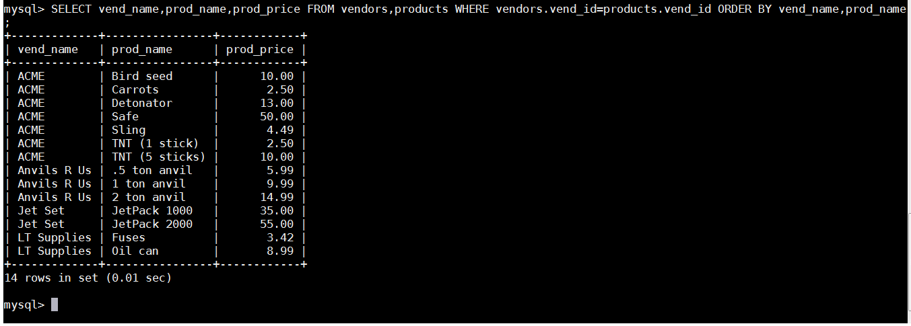
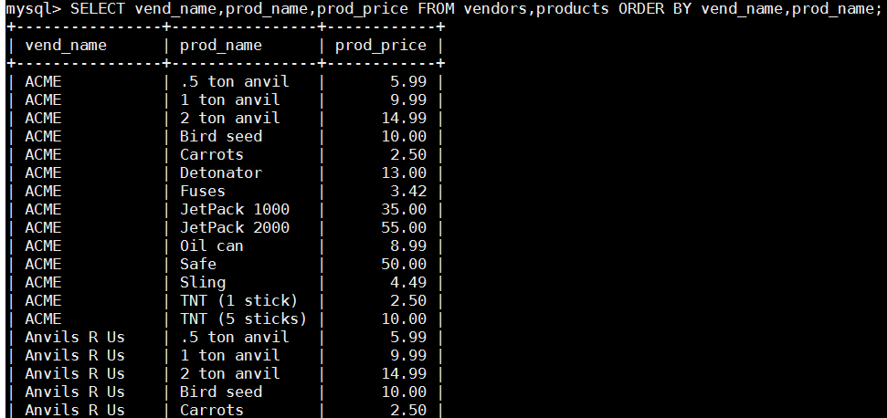
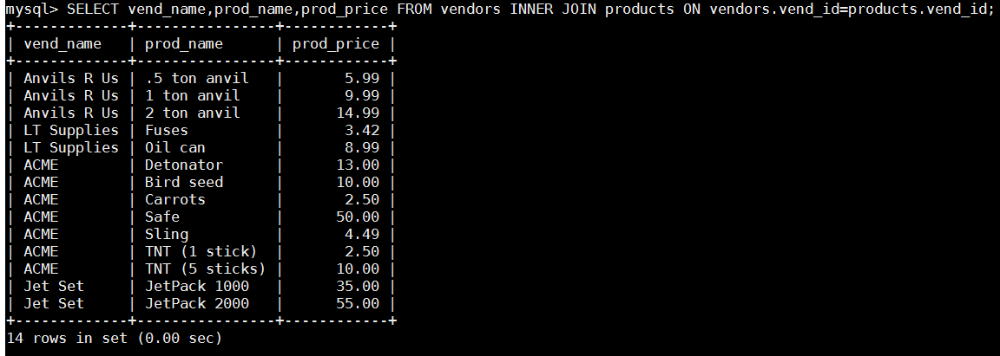
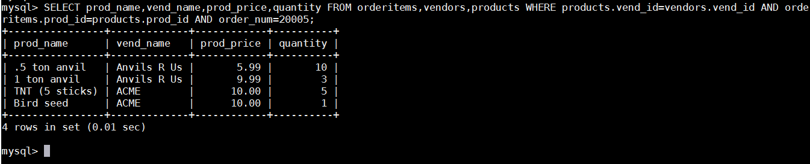
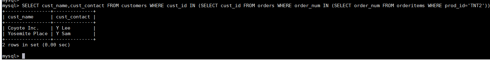
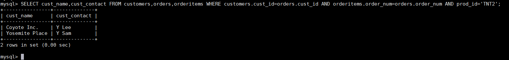

# 第15章-联结表
本章将介绍什么是联结，为什么要使用联结，如何编写使用联结的SELECT语句。

## 15.1 联结
SQL最强大的功能之一就是能在数据检索查询的执行中联结（join）表。联结是利用SQL的SELECT能执行的最重要的操作，很好地理解联结及其语法是学习SQL的一个极为重要的组成部分。在能够有效地使用联结前，必须了解关系表以及关系数据库设计的一些基础知识。下面的介绍并不是这个内容的全部知识，但作为入门已经足够了。

### 15.1.1 关系表
理解关系表的最好方法是来看一个现实世界中的例子。假如有一个包含产品目录的数据库表，其中每种类别的物品占一行。对于每种物品要存储的信息包括产品描述和价格，以及生产该产品的供应商信息。现在，假如有由同一供应商生产的多种物品，那么在何处存储供应商信息（如，供应商名、地址、联系方法等）呢？将这些数据与产品信息分开存储的理由如下。
- 因为同一供应商生产的每个产品的供应商信息都是相同的，对每个产品重复此信息既浪费时间又浪费存储空间。
- 如果供应商信息改变（例如，供应商搬家或电话号码变动），只需改动一次即可。
- 如果有重复数据（即每种产品都存储供应商信息），很难保证每次输入该数据的方式都相同。不一致的数据在报表中很难利用。

关键是，相同数据出现多次决不是一件好事，此因素是关系数据库设计的基础。关系表的设计就是要保证把信息分解成多个表，一类数据一个表。各表通过某些常用的值（即关系设计中的关系（ relational） ）互相关联。
在这个例子中，可建立两个表，一个存储供应商信息，另一个存储产品信息。 vendors表包含所有供应商信息，每个供应商占一行，每个供应商具有唯一的标识。此标识称为主键（ primary key） （在第1章中首次提到），可以是供应商ID或任何其他唯一值。products表只存储产品信息，它除了存储供应商ID（vendors表的主键）外不存储其他供应商信息。vendors表的主键又叫作products的外键，它将vendors表与products表关联，利用供应商ID能从vendors表中找出相应供应商的详细信息。
外键（foreign key） 外键为某个表中的一列，它包含另一个表的主键值，定义了两个表之间的关系。这样做的好处如下：
- 供应商信息不重复，从而不浪费时间和空间；
- 如果供应商信息变动，可以只更新vendors表中的单个记录，相关表中的数据不用改动；
- 由于数据无重复，显然数据是一致的，这使得处理数据更简单。
总之，关系数据可以有效地存储和方便地处理。因此，关系数据库的可伸缩性远比非关系数据库要好。
可伸缩性（scale） 能够适应不断增加的工作量而不失败。设计良好的数据库或应用程序称之为可伸缩性好（ scale well） 。

### 15.1.2 为什么要使用联结
正如所述，分解数据为多个表能更有效地存储，更方便地处理，并且具有更大的可伸缩性。但这些好处是有代价的。如果数据存储在多个表中，怎样用单条SELECT语句检索出数据？答案是使用联结。简单地说，联结是一种机制，用来在一条SELECT语句中关联表，因此称之为联结。使用特殊的语法，可以联结多个表返回一组输出，联结在运行时关联表中正确的行。

维护引用完整性 重要的是，要理解联结不是物理实体。换句话说，它在实际的数据库表中不存在。联结由MySQL根据需要建立，它存在于查询的执行当中。在使用关系表时，仅在关系列中插入合法的数据非常重要。回到这里的例子，如果在products表中插入拥有非法供应商ID（即没有在vendors表中出现）的供应商生产的产品，则这些产品是不可访问的，因为它们没有关联到某个供应商。为防止这种情况发生，可指示MySQL只允许在products表的供应商ID列中出现合法值（即出现在vendors表中的供应商）。这就是维护引用完整性，它是通过在表的定义中指定主键和外键来实现的。（这将在第21章介绍。）

## 15.2 创建联结
联结的创建非常简单，规定要联结的所有表以及它们如何关联即可。请看下面的例子：

我们来考察一下此代码。 SELECT语句与前面所有语句一样指定要检索的列。这里，最大的差别是所指定的两个列（prod_name和prod_price）在一个表中，而另一个列（vend_name）在另一个表中。现在来看FROM子句。与以前的SELECT语句不一样，这条语句的FROM子句列出了两个表，分别是vendors和products。它们就是这条SELECT语句联结的两个表的名字。这两个表用WHERE子句正确联结， WHERE子句指示MySQL匹配vendors表中的vend_id和products表中的vend_id。可以看到要匹配的两个列以vendors.vend_id 和 products.vend_id指定。这里需要这种完全限定列名，因为如果只给出vend_id，则MySQL不知道指的是哪一个（它们有两个，每个表中一个）。

完全限定列名 在引用的列可能出现二义性时，必须使用完全限定列名（用一个点分隔的表名和列名）。如果引用一个没有用表名限制的具有二义性的列名， MySQL将返回错误。

### 15.2.1 WHERE子句的重要性
利用WHERE子句建立联结关系似乎有点奇怪，但实际上，有一个很充分的理由。请记住，在一条SELECT语句中联结几个表时，相应的关系是在运行中构造的。在数据库表的定义中不存在能指示MySQL如何对表进行联结的东西。你必须自己做这件事情。在联结两个表时，你实际上做的是将第一个表中的每一行与第二个表中的每一行配对。 WHERE子句作为过滤条件，它只包含那些匹配给定条件（这里是联结条件）的行。没有WHERE子句，第一个表中的每个行将与第二个表中的每个行配对，而不管它们逻辑上是否可以配在一起。

笛卡儿积（cartesian product） 由没有联结条件的表关系返回的结果为笛卡儿积。检索出的行的数目将是第一个表中的行数乘以第二个表中的行数。为理解这一点，请看下面的SELECT语句及其输出：

从上面的输出中可以看到，相应的笛卡儿积不是我们所想要的。这里返回的数据用每个供应商匹配了每个产品，它包括了供应商不正确的产品。实际上有的供应商根本就没有产品。

不要忘了WHERE子句 应该保证所有联结都有WHERE子句，否则MySQL将返回比想要的数据多得多的数据。同理，应该保证WHERE子句的正确性。不正确的过滤条件将导致MySQL返回不正确的数据。

叉联结 有时我们会听到返回称为叉联结（ cross join）的笛卡儿积的联结类型。

### 15.2.2 内部联结
目前为止所用的联结称为等值联结（equijoin），它基于两个表之间的相等测试。这种联结也称为内部联结。其实，对于这种联结可以使用稍微不同的语法来明确指定联结的类型。下面的SELECT语句返回与前面例子完全相同的数据：

此语句中的SELECT与前面的SELECT语句相同，但FROM子句不同。这里，两个表之间的关系是FROM子句的组成部分，以INNER JOIN指定。在使用这种语法时，联结条件用特定的ON子句而不是WHERE子句给出。传递给ON的实际条件与传递给WHERE的相同。

使用哪种语法 ANSI SQL规范首选INNER JOIN语法。此外，尽管使用WHERE子句定义联结的确比较简单，但是使用明确的联结语法能够确保不会忘记联结条件，有时候这样做也能影响性能。

### 15.2.3 联结多个表
SQL对一条SELECT语句中可以联结的表的数目没有限制。创建联结的基本规则也相同。首先列出所有表，然后定义表之间的关系。例如：

此例子显示编号为20005的订单中的物品。订单物品存储在orderitems表中。每个产品按其产品ID存储，它引用products表中的产品。这些产品通过供应商ID联结到vendors表中相应的供应商，供应商ID存储在每个产品的记录中。这里的FROM子句列出了3个表，而WHERE子句定义了这两个联结条件，而第三个联结条件用来过滤出订单20005中的物品。

性能考虑 MySQL在运行时关联指定的每个表以处理联结。这种处理可能是非常耗费资源的，因此应该仔细，不要联结不必要的表。联结的表越多，性能下降越厉害。
现在可以回顾一下第14章中的例子了。该例子如下所示，其SELECT语句返回订购产品TNT2的客户列表：

正如第14章所述，子查询并不总是执行复杂SELECT操作的最有效的方法，下面是使用联结的相同查询：

正如第14章所述，这个查询中返回数据需要使用3个表。但这里我们没有在嵌套子查询中使用它们，而是使用了两个联结。这里有3个WHERE子句条件。前两个关联联结中的表，后一个过滤产品TNT2的数据。

多做实验 正如所见，为执行任一给定的SQL操作，一般存在不止一种方法。很少有绝对正确或绝对错误的方法。性能可能会受操作类型、表中数据量、是否存在索引或键以及其他一些条件的影响。因此，有必要对不同的选择机制进行实验，以找出最适合具体情况的方法。

## 15.3 小结
联结是SQL中最重要最强大的特性，有效地使用联结需要对关系数据库设计有基本的了解。本章随着对联结的介绍讲述了关系数据库设计的一些基本知识，包括等值联结（也称为内部联结）这种最经常使用的联结形式。下一章将介绍如何创建其他类型的联结。

