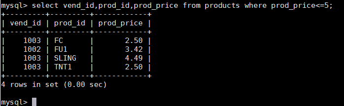
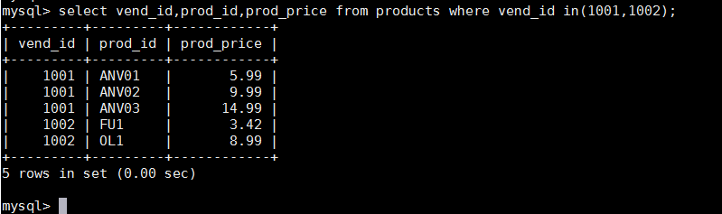
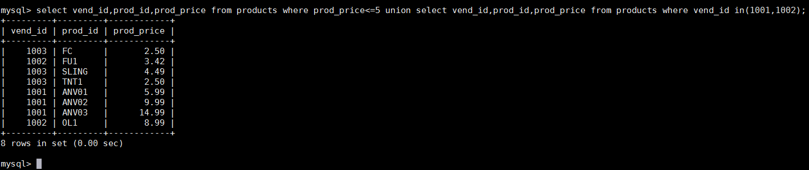
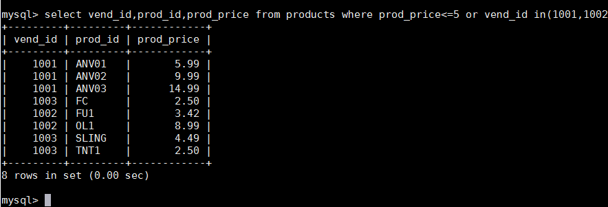
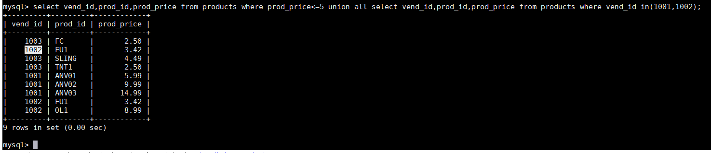
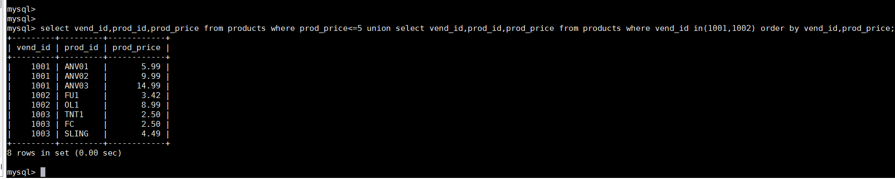

# 第17章-组合查询
本章讲述如何利用UNION操作符将多条SELECT语句组合成一个结果集。

## 17.1 组合查询
多数SQL查询都只包含从一个或多个表中返回数据的单条SELECT语句。 MySQL也允许执行多个查询（多条SELECT语句），并将结果作为单个查询结果集返回。这些组合查询通常称为并（ union） 或复合查询（compound query）。有两种基本情况，其中需要使用组合查询：
- 在单个查询中从不同的表返回类似结构的数据； 
- 对单个表执行多个查询，按单个查询返回数据。

组合查询和多个WHERE条件 多数情况下，组合相同表的两个查询完成的工作与具有多个WHERE子句条件的单条查询完成的工作相同。换句话说，任何具有多个WHERE子句的SELECT语句都可以作为一个组合查询给出，在以下段落中可以看到这一点。这两种技术在不同的查询中性能也不同。因此，应该试一下这两种技术，以确定对特定的查询哪一种性能更好。

## 17.2 创建组合查询
可用UNION操作符来组合数条SQL查询。利用UNION，可给出多条SELECT语句，将它们的结果组合成单个结果集。

### 17.2.1 使用UNION
UNION的使用很简单。所需做的只是给出每条SELECT语句，在各条语句之间放上关键字UNION。举一个例子，假如需要价格小于等于5的所有物品的一个列表，而且还想包括供应商1001和1002生产的所有物品（不考虑价格）。当然，可以利用WHERE子句来完成此工作，不过这次我们将使用UNION。正如所述，创建UNION涉及编写多条SELECT语句。首先来看单条语句：

第一条SELECT检索价格不高于5的所有物品。第二条SELECT使用IN找出供应商1001和1002生产的所有物品。为了组合这两条语句，按如下进行：

这条语句由前面的两条SELECT语句组成，语句中用UNION关键字分隔。 UNION指示MySQL执行两条SELECT语句，并把输出组合成单个查询结果集。作为参考，这里给出使用多条WHERE子句而不是使用UNION的相同查询：

在这个简单的例子中，使用UNION可能比使用WHERE子句更为复杂。但对于更复杂的过滤条件，或者从多个表（而不是单个表）中检索数据的情形，使用UNION可能会使处理更简单。

### 17.2.2 UNION规则
正如所见，并是非常容易使用的。但在进行并时有几条规则需要注意。 
- UNION必须由两条或两条以上的SELECT语句组成，语句之间用关键字UNION分隔（因此，如果组合4条SELECT语句，将要使用3个UNION关键字）。
- UNION中的每个查询必须包含相同的列、表达式或聚集函数（不过155 各个列不需要以相同的次序列出）。 
- 列数据类型必须兼容：类型不必完全相同，但必须是DBMS可以隐含地转换的类型（例如，不同的数值类型或不同的日期类型）。
如果遵守了这些基本规则或限制，则可以将并用于任何数据检索任务。

### 17.2.3 包含或取消重复的行
请返回到17.2.1节，考察一下所用的样例SELECT语句。我们注意到，在分别执行时，第一条SELECT语句返回4行，第二条SELECT语句返回5行。但在用UNION组合两条SELECT语句后，只返回了8行而不是9行。UNION从查询结果集中自动去除了重复的行（换句话说，它的行为与单条SELECT语句中使用多个WHERE子句条件一样）。因为供应商1002生产的一种物品的价格也低于5，所以两条SELECT语句都返回该行。在使用UNION时，重复的行被自动取消。这是UNION的默认行为，但是如果需要，可以改变它。事实上，如果想返回所有匹配行，可使用UNION ALL而不是UNION。请看下面的例子：

使用UNION ALL， MySQL不取消重复的行。因此这里的例子返回9行，其中有一行出现两次。
UNION与WHERE 本章开始时说过， UNION几乎总是完成与多个WHERE条件相同的工作。 UNION ALL为UNION的一种形式，它完成WHERE子句完成不了的工作。如果确实需要每个条件的匹配行全部出现（包括重复行），则必须使用UNION ALL而不是WHERE。

### 17.2.4 对组合查询结果排序
SELECT语句的输出用ORDER BY子句排序。在用UNION组合查询时，只能使用一条ORDER BY子句，它必须出现在最后一条SELECT语句之后。对于结果集，不存在用一种方式排序一部分，而又用另一种方式排序另一部分的情况，因此不允许使用多条ORDER BY子句。下面的例子排序前面UNION返回的结果：

这条UNION在最后一条SELECT语句后使用了ORDER BY子句。虽然ORDER BY子句似乎只是最后一条SELECT语句的组成部分，但实际上MySQL将用它来排序所有SELECT语句返回的所有结果。

组合不同的表 为使表述比较简单，本章例子中的组合查询使用的均是相同的表。但是其中使用UNION的组合查询可以应用不同的表。

## 17.3 小结
本章讲授如何用UNION操作符来组合SELECT语句。利用UNION，可把多条查询的结果作为一条组合查询返回，不管它们的结果中包含还是不包含重复。使用UNION可极大地简化复杂的WHERE子句，简化从多个表中检索数据的工作。
