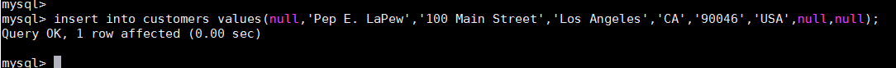
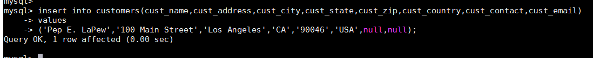
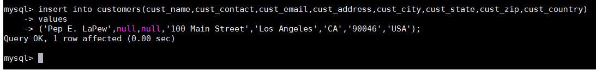
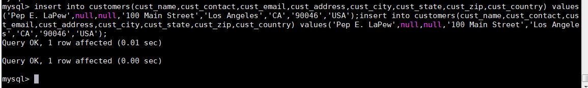
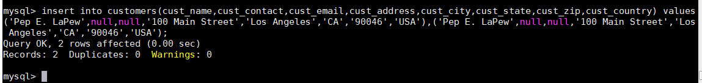
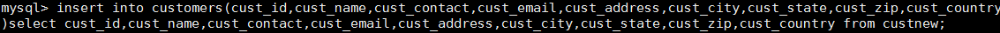

# 第19章-插入数据
本章介绍如何利用SQL的INSERT语句将数据插入表中。

## 19.1 数据插入
毫无疑问， SELECT是最常使用的SQL语句了（这就是为什么前17章讲的都是它的原因）。但是，还有其他3个经常使用的SQL语句需要学习。第一个就是INSERT（下一章介绍另外两个）。顾名思义， INSERT是用来插入（或添加）行到数据库表的。插入可以用几种方式使用：
- 插入完整的行；
- 插入行的一部分；
- 插入多行；
- 插入某些查询的结果。
下面将介绍这些内容。
插入及系统安全 可针对每个表或每个用户，利用MySQL的安全机制禁止使用INSERT语句，这将在第28章介绍。

## 19.2 插入完整的行
把数据插入表中的最简单的方法是使用基本的INSERT语法，它要求177132  指定表名和被插入到新行中的值。下面举一个例子：

没有输出 INSERT语句一般不会产生输出。
此例子插入一个新客户到customers表。存储到每个表列中的数据在VALUES子句中给出，对每个列必须提供一个值。如果某个列没有值（如上面的cust_contact和cust_email列），应该使用NULL值（假定表允许对该列指定空值）。各个列必须以它们在表定义中出现的次序填充。第一列cust_id也为NULL。这是因为每次插入一个新行时，该列由MySQL自动增量。你不想给出一个值（这是MySQL的工作），又不能省略此列（如前所述，必须给出每个列），所以指定一个NULL值（它被MySQL忽略， MySQL在这里插入下一个可用的cust_id值）。虽然这种语法很简单，但并不安全，应该尽量避免使用。上面的SQL语句高度依赖于表中列的定义次序，并且还依赖于其次序容易获得的信息。即使可得到这种次序信息，也不能保证下一次表结构变动后各个列保持完全相同的次序。因此，编写依赖于特定列次序的SQL语句是很不安全的。如果这样做，有时难免会出问题。编写INSERT语句的更安全（不过更烦琐）的方法如下：

此例子完成与前一个INSERT语句完全相同的工作，但在表名后的括号里明确地给出了列名。在插入行时， MySQL将用VALUES列表中的相应值填入列表中的对应项。 VALUES中的第一个值对应于第一个指定的列名。第二个值对应于第二个列名，如此等等。因为提供了列名， VALUES必须以其指定的次序匹配指定的列名，不一定按各个列出现在实际表中的次序。其优点是，即使表的结构改变，此INSERT语句仍然能正确工作。你会发现cust_id的NULL值是不必要的，cust_id列并没有出现在列表中，所以不需要任何值。下面的INSERT语句填充所有列（与前面的一样），但以一种不同的次序填充。因为给出了列名，所以插入结果仍然正确：

总是使用列的列表 一般不要使用没有明确给出列的列表的INSERT语句。使用列的列表能使SQL代码继续发挥作用，即使表结构发生了变化。

仔细地给出值 不管使用哪种INSERT语法，都必须给出VALUES的正确数目。如果不提供列名，则必须给每个表列提供一个值。如果提供列名，则必须对每个列出的列给出一个值。如果不这样，将产生一条错误消息，相应的行插入不成功。使用这种语法，还可以省略列。这表示可以只给某些列提供值，给其他列不提供值。（事实上你已经看到过这样的例子：当列名被明确列出时， cust_id可以省略。）

省略列 如果表的定义允许，则可以在INSERT操作中省略某些列。省略的列必须满足以下某个条件。
- 该列定义为允许NULL值（无值或空值）。
- 在表定义中给出默认值。这表示如果不给出值，将使用默认值。
如果对表中不允许NULL值且没有默认值的列不给出值，则MySQL将产生一条错误消息，并且相应的行插入不成功。

提高整体性能 数据库经常被多个客户访问，对处理什么请求以及用什么次序处理进行管理是MySQL的任务。 INSERT操作可能很耗时（特别是有很多索引需要更新时），而且它可能降低等待处理的SELECT语句的性能。如果数据检索是最重要的（通常是这样），则你可以通过在INSERT和INTO之间添加关键字LOW_PRIORITY，指示MySQL降低INSERT语句的优先级，如下所示：
INSERT LOW_PRIORITY INTO
顺便说一下，这也适用于下一章介绍的UPDATE和DELETE语句。

## 19.3 插入多个行
INSERT可以插入一行到一个表中。但如果你想插入多个行怎么办？
可以使用多条INSERT语句，甚至一次提交它们，每条语句用一个分号结束，如下所示：

或者，只要每条INSERT语句中的列名（和次序）相同，可以如下组合各语句：

其中单条INSERT语句有多组值，每组值用一对圆括号括起来，用逗号分隔。
提高INSERT的性能 此技术可以提高数据库处理的性能，因为MySQL用单条INSERT语句处理多个插入比使用多条INSERT语句快。

## 19.4 插入检索出的数据
INSERT一般用来给表插入一个指定列值的行。但是， INSERT还存在另一种形式，可以利用它将一条SELECT语句的结果插入表中。这就是所谓的INSERT SELECT，顾名思义，它是由一条INSERT语句和一条SELECT语句组成的。假如你想从另一表中合并客户列表到你的customers表。 不需要每次读取一行，然后再将它用INSERT插入，可以如下进行：
新例子的说明 这个例子把一个名为custnew的表中的数据导入customers表中。为了试验这个例子，应该首先创建和填充custnew表。 custnew表的结构与附录B中描述的customers表的相同。在填充custnew时，不应该使用已经在customers中使用过的cust_id值（如果主键值重复，后续的INSERT操作将会失败）或仅省略这列值让MySQL在导入数据的过程中产生新值。

这个例子使用INSERT SELECT从custnew中将所有数据导入customers。 SELECT语句从custnew检索出要插入的值，而不是列出它们。 SELECT中列出的每个列对应于customers表名后所跟的列表中的每个列。这条语句将插入多少行有赖于custnew表中有多少行。如果这个表为空，则没有行被插入（也不产生错误，因为操作仍然是合法的）。如果这个表确实含有数据，则所有数据将被插入到customers。这个例子导入了cust_id（假设你能够确保cust_id的值不重复）。你也可以简单地省略这列（从INSERT和SELECT中），这样MySQL就会生成新值。
INSERT SELECT中的列名 为简单起见，这个例子在INSERT和SELECT语句中使用了相同的列名。但是，不一定要求列名匹配。事实上， MySQL甚至不关心SELECT返回的列名。它使用的是列的位置，因此SELECT中的第一列（不管其列名）将用来填充表列中指定的第一个列，第二列将用来填充表列中指定的第二个列，如此等等。这对于从使用不同列名的表中导入数据是非常有用的。INSERT SELECT中SELECT语句可包含WHERE子句以过滤插入的数据。
更多例子 如果想看INSERT用法的更多例子，请参阅附录B中给出的样例表填充脚本，这主要用于创建本书中使用的样例表。

## 19.5 小结
本章介绍如何将行插入到数据库表。我们学习了使用INSERT的几种方法，以及为什么要明确使用列名，学习了如何用INSERT SELECT从其他表中导入行。下一章讲述如何使用UPDATE和DELETE进一步操纵表数据。
