# 第21章-创建和操纵表
本章讲授表的创建、更改和删除的基本知识。

## 21.1 创建表
MySQL不仅用于表数据操纵，而且还可以用来执行数据库和表的所有操作，包括表本身的创建和处理。一般有两种创建表的方法：
- 使用具有交互式创建和管理表的工具（如第2章讨论的工具）；
- 表也可以直接用MySQL语句操纵。

为了用程序创建表，可使用SQL的CREATE TABLE语句。值得注意的是，在使用交互式工具时，实际上使用的是MySQL语句。但是，这些语句不是用户编写的，界面工具会自动生成并执行相应的MySQL语句（更改现有表时也是这样）。另外的例子 关于表创建脚本的另外例子，请参阅本书中用来创建样例表的代码。

### 21.1.1 表创建基础
为利用CREATE TABLE创建表，必须给出下列信息：
- 新表的名字，在关键字CREATE TABLE之后给出；
- 表列的名字和定义，用逗号分隔。

CREATE TABLE语句也可能会包括其他关键字或选项，但至少要包括表的名字和列的细节。下面的MySQL语句创建本书中所用的customers表：
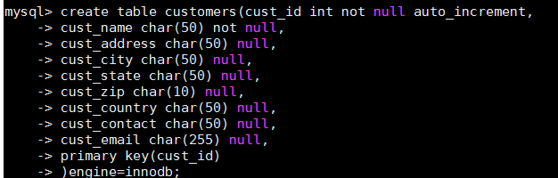

从上面的例子中可以看到，表名紧跟在CREATE TABLE关键字后面。实际的表定义（所有列）括在圆括号之中。各列之间用逗号分隔。这个表由9列组成。每列的定义以列名（它在表中必须是唯一的）开始，后跟列的数据类型（关于数据类型的解释，请参阅第1章。此外，附录D列出了MySQL支持的数据类型）。表的主键可以在创建表时用PRIMARY KEY关键字指定。这里，列cust_id指定作为主键列。整条语句由 右 圆 括 号 后 的 分 号 结 束 。（ 现 在 先 忽 略 ENGINE=InnoDB 和AUTO_INCREMENT，后面会对它们进行介绍。）语句格式化 可回忆一下，以前说过MySQL语句中忽略空格。语句可以在一个长行上输入，也可以分成许多行。它们的作用都相同。这允许你以最适合自己的方式安排语句的格式。前面的CREATE TABLE语句就是语句格式化的一个很好的例子，它被安排在多个行上，其中的列定义进行了恰当的缩进，以便阅读和编辑。以何种缩进格式安排SQL语句没有规定，但我强烈推荐采用某种缩进格式。处理现有的表 在创建新表时，指定的表名必须不存在，否则将出错。如果要防止意外覆盖已有的表， SQL要求首先手工删除该表（请参阅后面的小节），然后再重建它，而不是简单地用创建表语句覆盖它。如果你仅想在一个表不存在时创建它，应该在表名后给出IFNOT EXISTS。这样做不检查已有表的模式是否与你打算创建的表模式相匹配。它只是查看表名是否存在，并且仅在表名不存在时创建它。

### 21.1.2 使用NULL值
第6章中说过， NULL值就是没有值或缺值。允许NULL值的列也允许在插入行时不给出该列的值。不允许NULL值的列不接受该列没有值的行，换句话说，在插入或更新行时，该列必须有值。每个表列或者是NULL列，或者是NOT NULL列，这种状态在创建时由表的定义规定。请看下面的例子：
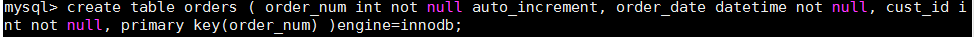

这条语句创建本书中所用的orders表。 orders包含3个列，分别是订单号、订单日期和客户ID。所有3个列都需要，因此每个列的定义都含有关键字NOT NULL。这将会阻止插入没有值的列。如果试图插入没有值的列，将返回错误，且插入失败。下一个例子将创建混合了NULL和NOT NULL列的表：
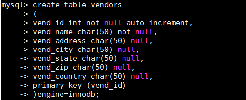

这条语句创建本书中使用的vendors表。供应商ID和供应商名字列是必需的，因此指定为NOT NULL。其余5个列全都允许NULL值，所以不指定NOT NULL。 NULL为默认设置，如果不指定NOT NULL，则认为指定的是NULL。理解NULL 不要把NULL值与空串相混淆。 NULL值是没有值，它不是空串。如果指定''（两个单引号，其间没有字符），这在NOT NULL列中是允许的。空串是一个有效的值，它不是无值。 NULL值用关键字NULL而不是空串指定。

### 21.1.3 主键再介绍
正如所述，主键值必须唯一。即，表中的每个行必须具有唯一的主键值。如果主键使用单个列，则它的值必须唯一。如果使用多个列，则这些列的组合值必须唯一。迄今为止我们看到的CREATE TABLE例子都是用单个列作为主键。其中主键用以下的类似的语句定义：
primary key (vend_id)
为创建由多个列组成的主键，应该以逗号分隔的列表给出各列名，如下所示：
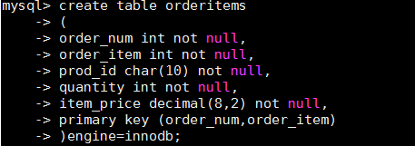

orderitems表包含orders表中每个订单的细节。每个订单有多项物品，但每个订单任何时候都只有1个第一项物品， 1个第二项物品，如此等等。因此，订单号（order_num列）和订单物品（order_item列）的组合是唯一的，从而适合作为主键，其定义为：
primary key (order_num, order_item)

主键可以在创建表时定义（如这里所示）， 或者在创建表之后定义（本章稍后讨论）。

主键和NULL值 第1章介绍过，主键为其值唯一标识表中每个行的列。主键中只能使用不允许NULL值的列。允许NULL值的列不能作为唯一标识。

### 21.1.4 使用AUTO_INCREMENT
让我们再次考察customers和orders表。 customers表中的顾客由列cust_id唯一标识，每个顾客有一个唯一编号。类似， orders表中的每个订单有一个唯一的订单号，这个订单号存储在列order_num中。这些编号除它们是唯一的以外没有别的特殊意义。在增加一个新顾客或新订单时，需要一个新的顾客ID或订单号。这些编号可以任意，只要它们是唯一的即可。显然，使用的最简单的编号是下一个编号，所谓下一个编号是大于当前最大编号的编号。例如，如果cust_id的最大编号为10005，则插入表中的下一个顾客可以具有等于10006的cust_id。简单吗？不见得。你怎样确定下一个要使用的值？当然，你可以使用SELECT语句得出最大的数（使用第12章介绍的Max()函数），然后对它加1。但这样做并不可靠（你需要找出一种办法来保证，在你执行SELECT和INSERT两条语句之间没有其他人插入行，对于多用户应用，这种情况是很有可能出现的），而且效率也不高（执行额外的MySQL操作肯定不是理想的办法）。这就是AUTO_INCREMENT发挥作用的时候了。请看以下代码行（用来创建customers表的CREATE TABLE语句的组成部分）：
cust_id int not null auto_increment,

AUTO_INCREMENT告诉MySQL，本列每当增加一行时自动增量。每次执行一个INSERT操作时， MySQL自动对该列增量（从而才有这个关键字AUTO_INCREMENT），给该列赋予下一个可用的值。这样给每个行分配一个唯一的cust_id，从而可以用作主键值。
每个表只允许一个AUTO_INCREMENT列，而且它必须被索引（如，通过使它成为主键）。覆盖AUTO_INCREMENT 如果一个列被指定为AUTO_INCREMENT，则它需要使用特殊的值吗？你可以简单地在INSERT语句中指定一个值，只要它是唯一的（至今尚未使用过）即可，该值将被用来替代自动生成的值。后续的增量将开始使用该手工插入的值。（相关的例子请参阅本书中使用的表填充脚本。）确定AUTO_INCREMENT值 让MySQL生成（通过自动增量）主键的一个缺点是你不知道这些值都是谁。考虑这个场景：你正在增加一个新订单。这要求在orders表中创建一行， 然后在orderitms表中对订购的每项物品创建一行。 order_num在orderitems表中与订单细节一起存储。这就是为什么orders表和orderitems表为相互关联的表的原因。这显然要求你在插入orders行之后，插入orderitems行之前知道生成的order_num。那么，如何在使用AUTO_INCREMENT列时获得这个值呢？可使用last_insert_id()函数获得这个值，如下所示：
select last_insert_id()
此语句返回最后一个AUTO_INCREMENT值，然后可以将它用于后续的MySQL语句。

### 21.1.5 指定默认值
如果在插入行时没有给出值， MySQL允许指定此时使用的默认值。默认值用CREATE TABLE语句的列定义中的DEFAULT关键字指定。请看下面的例子：
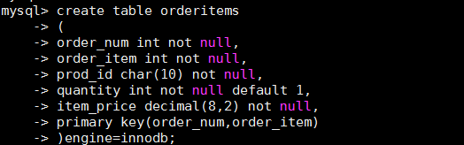

这条语句创建包含组成订单的各物品的orderitems表（订单本身存储在orders表中）。 quantity列包含订单中每项物品的数量。在此例子中，给该列的描述添加文本DEFAULT 1指示MySQL，在未给出数量的情况下使用数量1。不允许函数 与大多数DBMS不一样， MySQL不允许使用函数作为默认值，它只支持常量。使用默认值而不是NULL值 许多数据库开发人员使用默认值而不是NULL列，特别是对用于计算或数据分组的列更是如此。

### 21.1.6 引擎类型
你可能已经注意到，迄今为止使用的CREATE TABLE语句全都以ENGINE=InnoDB语句结束。与其他DBMS一样， MySQL有一个具体管理和处理数据的内部引擎。在你使用CREATE TABLE语句时，该引擎具体创建表，而在你使用SELECT语句或进行其他数据库处理时，该引擎在内部处理你的请求。多数时候，此引擎都隐藏在DBMS内，不需要过多关注它。但MySQL与其他DBMS不一样，它具有多种引擎。它打包多个引擎，这些引擎都隐藏在MySQL服务器内，全都能执行CREATE TABLE和SELECT等命令。为什么要发行多种引擎呢？因为它们具有各自不同的功能和特性，为不同的任务选择正确的引擎能获得良好的功能和灵活性。

当然，你完全可以忽略这些数据库引擎。如果省略ENGINE=语句，则使用默认引擎（很可能是MyISAM），多数SQL语句都会默认使用它。但并不是所有语句都默认使用它，这就是为什么ENGINE=语句很重要的原因（也就是为什么本书的样列表中使用两种引擎的原因）。以下是几个需要知道的引擎：
- InnoDB是一个可靠的事务处理引擎（参见第26章），它不支持全文本搜索；
- MEMORY在功能等同于MyISAM， 但由于数据存储在内存（不是磁盘）中，速度很快（特别适合于临时表）；
- MyISAM是一个性能极高的引擎，它支持全文本搜索（参见第18章），但不支持事务处理。

更多知识 所支持引擎的完整列表（及它们之间的不同），请参阅[链接](http://dev.mysql.com/doc/refman/5.0/en/storage_engines.html)。引擎类型可以混用。除productnotes表使用MyISAM外，本书中的样例表都使用InnoDB。 原因是作者希望支持事务处理（因此，使用InnoDB），但也需要在productnotes中支持全文本搜索（因此，使用MyISAM）。外键不能跨引擎 混用引擎类型有一个大缺陷。外键（用于强制实施引用完整性，如第1章所述）不能跨引擎，即使用一个引擎的表不能引用具有使用不同引擎的表的外键。那么， 你应该使用哪个引擎？这有赖于你需要什么样的特性。 MyISAM由于其性能和特性可能是最受欢迎的引擎。但如果你不需要可靠的事务处理，可以使用其他引擎。

## 21.2 更新表
21.2 更新表为更新表定义，可使用ALTER TABLE语句。但是，理想状态下，当表中存储数据以后，该表就不应该再被更新。在表的设计过程中需要花费大量时间来考虑，以便后期不对该表进行大的改动。为了使用ALTER TABLE更改表结构，必须给出下面的信息：
- 在ALTER TABLE之后给出要更改的表名（该表必须存在，否则将出错）；
- 所做更改的列表。

下面的例子给表添加一个列：
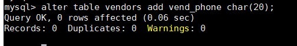

这条语句给vendors表增加一个名为vend_phone的列，必须明确其数据类型。

删除刚刚添加的列，可以这样做：
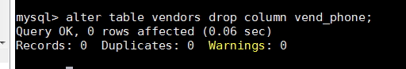

ALTER TABLE的一种常见用途是定义外键。下面是用来定义本书中的表所用的外键的代码：
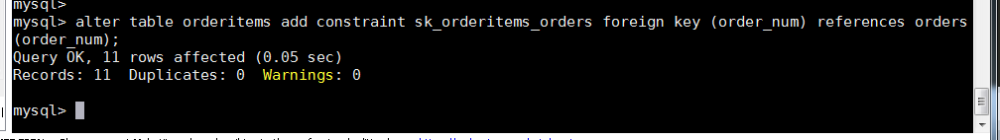
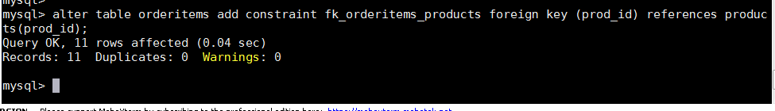
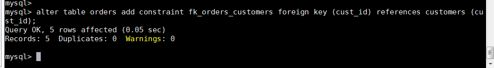
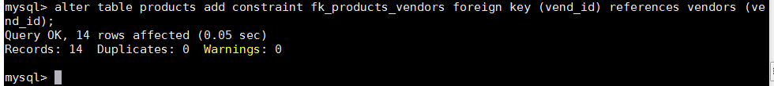

这里，由于要更改4个不同的表，使用了4条ALTER TABLE语句。为了对单个表进行多个更改，可以使用单条ALTER TABLE语句，每个更改用逗号分隔。复杂的表结构更改一般需要手动删除过程，它涉及以下步骤：
- 用新的列布局创建一个新表；
- 使用INSERT SELECT语句（关于这条语句的详细介绍，请参阅第输入分析输入20321.4 重命名表 15319章）从旧表复制数据到新表。如果有必要，可使用转换函数和计算字段；
- 检验包含所需数据的新表；
- 重命名旧表（如果确定，可以删除它）；
- 用旧表原来的名字重命名新表；
- 根据需要，重新创建触发器、存储过程、索引和外键。小心使用ALTER TABLE 使用ALTER TABLE要极为小心，应该在进行改动前做一个完整的备份（模式和数据的备份）。数据库表的更改不能撤销，如果增加了不需要的列，可能不能删除它们。类似地，如果删除了不应该删除的列，可能会丢失该列中的所有数据。

## 21.3 删除表
删除表（删除整个表而不是其内容）非常简单，使用DROP TABLE语句即可：
drop table customers2;

输入这条语句删除customers （假设它存在）。删除表没有确认，也不能撤销，执行这条语句将永久删除该表。

## 21.4 重命名表
使用RENAME TABLE语句可以重命名一个表：
rename table customers2 to customers;
RENAME TABLE所做的仅是重命名一个表。可以使用下面的语句对多个表重命名：
rename table backup_customers to customers,
             backup_vendors to vendors,
             backup_products to products;

## 21.5 小结
本章介绍了几条新SQL语句。 CREATE TABLE用来创建新表， ALTERTABLE用来更改表列（或其他诸如约束或索引等对象），而DROP TABLE用来完整地删除一个表。这些语句必须小心使用，并且应在做了备份后使用。本章还介绍了数据库引擎、定义主键和外键，以及其他重要的表和列选项。

