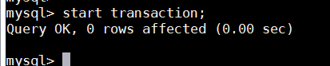
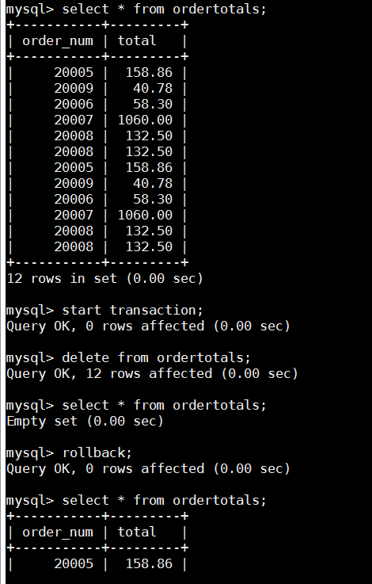
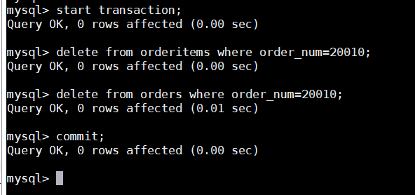
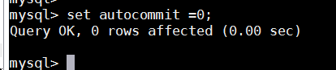

# 第26章-管理事务处理
本章介绍什么是事务处理以及如何利用COMMIT和ROLLBACK语句来管理事务处理。

## 26.1 事务处理
并非所有引擎都支持事务处理 正如第21章所述， MySQL支持几种基本的数据库引擎。正如本章所述，并非所有引擎都支持明确的事务处理管理。 MyISAM和InnoDB是两种最常使用的引擎。前者不支持明确的事务处理管理，而后者支持。这就是为什么本书中使用的样例表被创建来使用InnoDB而不是更经常使用的MyISAM的原因。如果你的应用中需要事务处理功能，则一定要使用正确的引擎类型。事务处理（transaction processing）可以用来维护数据库的完整性，它保证成批的MySQL操作要么完全执行，要么完全不执行。正如第15章所述，关系数据库设计把数据存储在多个表中，使数据更容易操纵、维护和重用。不用深究如何以及为什么进行关系数据库设计，在某种程度上说，设计良好的数据库模式都是关联的。前面章中使用的orders表就是一个很好的例子。订单存储在orders和orderitems两个表中： orders存储实际的订单，而orderitems存储订购的各项物品。这两个表使用称为主键（参阅第1章）的唯一ID互相关联。这两个表又与包含客户和产品信息的其他表相关联。249188  管理事务处理给系统添加订单的过程如下。(1) 检查数据库中是否存在相应的客户（从customers表查询），如果不存在，添加他/她。(2) 检索客户的ID。(3) 添加一行到orders表，把它与客户ID关联。(4) 检索orders表中赋予的新订单ID。(5) 对于订购的每个物品在orderitems表中添加一行，通过检索出来的ID把它与orders表关联（以及通过产品ID与products表关联）。现在，假如由于某种数据库故障（如超出磁盘空间、安全限制、表锁等）阻止了这个过程的完成。数据库中的数据会出现什么情况？如果故障发生在添加了客户之后， orders表添加之前，不会有什么问题。某些客户没有订单是完全合法的。在重新执行此过程时，所插入的客户记录将被检索和使用。可以有效地从出故障的地方开始执行此过程。但是，如果故障发生在orders行添加之后， orderitems行添加之前，怎么办呢？现在，数据库中有一个空订单。更糟的是，如果系统在添加orderitems行之中出现故障。结果是数据库中存在不完整的订单，而且你还不知道。如何解决这种问题？这里就需要使用事务处理了。事务处理是一种机制，用来管理必须成批执行的MySQL操作，以保证数据库不包含不完整的操作结果。利用事务处理，可以保证一组操作不会中途停止，它们或者作为整体执行，或者完全不执行（除非明确指示）。如果没有错误发生，整组语句提交给（写到）数据库表。如果发生错误，则进行回退（撤销）以恢复数据库到某个已知且安全的状态。因此，请看相同的例子，这次我们说明过程如何工作。(1) 检查数据库中是否存在相应的客户，如果不存在，添加他/她。(2) 提交客户信息。(3) 检索客户的ID。(4) 添加一行到orders表。250

## 26.2 控制事务处理
如果在添加行到orders表时出现故障，回退。(6) 检索orders表中赋予的新订单ID。(7) 对于订购的每项物品，添加新行到orderitems表。(8) 如果在添加新行到orderitems时出现故障，回退所有添加的orderitems行和orders行。(9) 提交订单信息。在使用事务和事务处理时，有几个关键词汇反复出现。下面是关于事务处理需要知道的几个术语：
- 事务（transaction）指一组SQL语句；
- 回退（rollback）指撤销指定SQL语句的过程；
- 提交（commit）指将未存储的SQL语句结果写入数据库表；
- 保留点（savepoint）指事务处理中设置的临时占位符（placeholder），你可以对它发布回退（与回退整个事务处理不同）。

## 26.2 控制事务处理
既然我们已经知道了什么是事务处理，下面讨论事务处理的管理中所涉及的问题。管理事务处理的关键在于将SQL语句组分解为逻辑块，并明确规定数据何时应该回退，何时不应该回退。MySQL使用下面的语句来标识事务的开始：

### 26.2.1 使用ROLLBACK
MySQL的ROLLBACK命令用来回退（撤销） MySQL语句，请看下面的语句：

这个例子从显示ordertotals表（此表在第24章中填充）的内容开始。首先执行一条SELECT以显示该表不为空。然后开始一个事务处理，用一条DELETE语句删除ordertotals中的所有行。另一条SELECT语句验证ordertotals确实为空。这时用一条ROLLBACK语句回退START TRANSACTION之后的所有语句，最后一条SELECT语句显示该表不为空。显然， ROLLBACK只能在一个事务处理内使用（在执行一条STARTTRANSACTION命令之后）。哪些语句可以回退？ 事务处理用来管理INSERT、 UPDATE和DELETE语句。你不能回退SELECT语句。（这样做也没有什么意义。）你不能回退CREATE或DROP操作。事务处理块中可以使用这两条语句，但如果你执行回退，它们不会被撤销。

### 26.2.2 使用COMMIT
一般的MySQL语句都是直接针对数据库表执行和编写的。这就是所谓的隐含提交（implicit commit），即提交（写或保存）操作是自动进行的。但是，在事务处理块中，提交不会隐含地进行。为进行明确的提交，使用COMMIT语句，如下所示：

在这个例子中，从系统中完全删除订单20010。因为涉及更新两个数据库表orders和orderItems，所以使用事务处理块来保证订单不被部分删除。最后的COMMIT语句仅在不出错时写出更改。如果第一条DELETE起作用，但第二条失败，则DELETE不会提交（实际上，它是被自动撤销的）。分析分析输入25226.2 控制事务处理 191隐含事务关闭 当COMMIT或ROLLBACK语句执行后，事务会自动关闭（将来的更改会隐含提交）。

### 26.2.3 使用保留点
简单的ROLLBACK和COMMIT语句就可以写入或撤销整个事务处理。但是，只是对简单的事务处理才能这样做，更复杂的事务处理可能需要部分提交或回退。例如，前面描述的添加订单的过程为一个事务处理。如果发生错误，只需要返回到添加orders行之前即可，不需要回退到customers表（如果存在的话）。为了支持回退部分事务处理，必须能在事务处理块中合适的位置放置占位符。这样，如果需要回退，可以回退到某个占位符。这些占位符称为保留点。为了创建占位符，可如下使用SAVEPOINT语句：
savepoint delete1;
每个保留点都取标识它的唯一名字，以便在回退时， MySQL知道要回退到何处。为了回退到本例给出的保留点，可如下进行：
rollback to delete1;
保留点越多越好 可以在MySQL代码中设置任意多的保留点，越多越好。为什么呢？因为保留点越多，你就越能按自己的意愿灵活地进行回退。释放保留点 保留点在事务处理完成（执行一条ROLLBACK或COMMIT）后自动释放。自MySQL 5以来，也可以用RELEASESAVEPOINT明确地释放保留点。输入输入253254192  管理事务处理

### 26.2.4 更改默认的提交行为
正如所述，默认的MySQL行为是自动提交所有更改。换句话说，任何时候你执行一条MySQL语句，该语句实际上都是针对表执行的，而且所做的更改立即生效。为指示MySQL不自动提交更改，需要使用以下语句：

autocommit标志决定是否自动提交更改，不管有没有COMMIT语句。设置autocommit为0（假）指示MySQL不自动提交更改（直到autocommit被设置为真为止）。标志为连接专用 autocommit标志是针对每个连接而不是服务器的。

## 26.3 小结
本章介绍了事务处理是必须完整执行的SQL语句块。我们学习了如何使用COMMIT和ROLLBACK语句对何时写数据，何时撤销进行明确的管理。还学习了如何使用保留点对回退操作提供更强大的控制。

