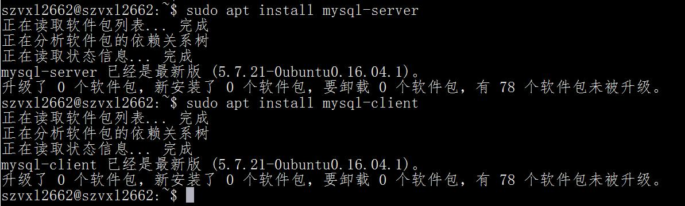
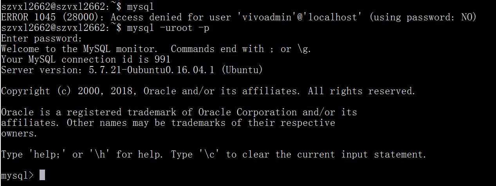
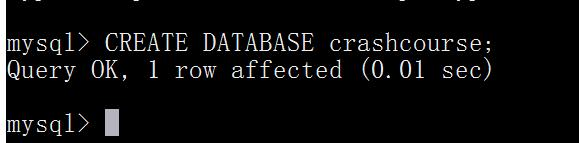
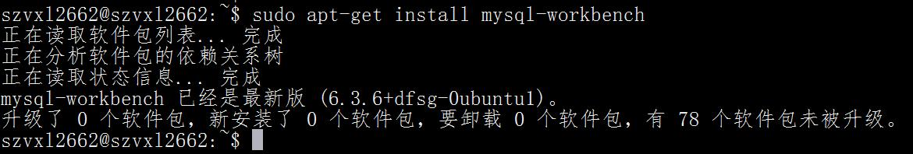
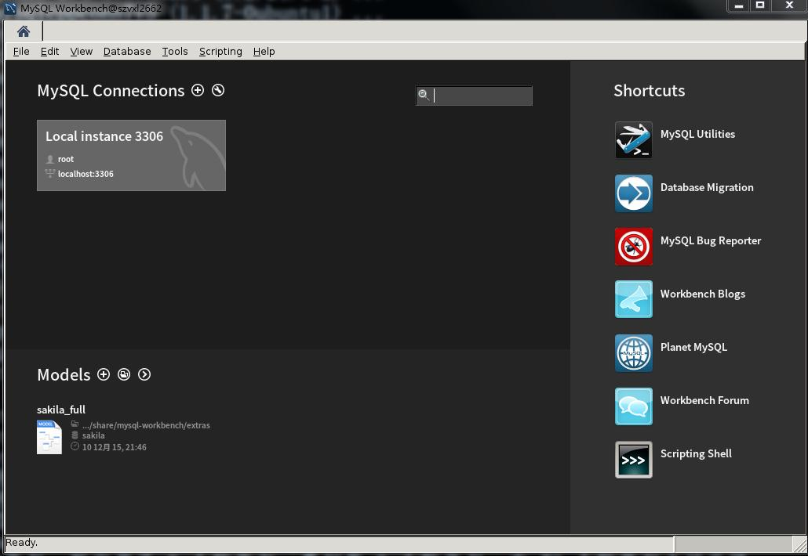
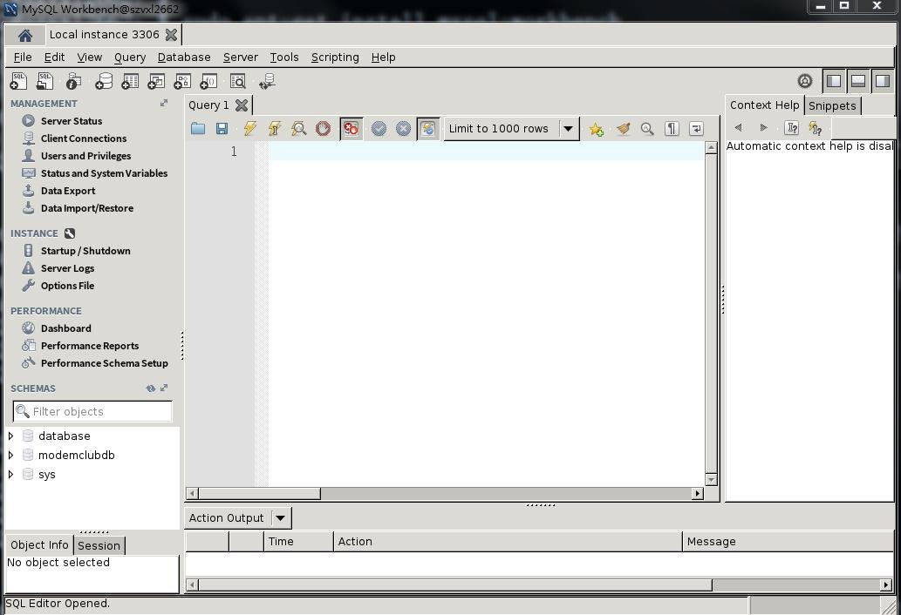

# 第二章 MySQL简介

本章将介绍什么是MySQL，以及在MySQL中可以应用什么工具。

## 2.1 什么是MySQL
正如所述，数据的所有存储、检索、管理和处理实际上是由数据库软件——DBMS(数据库管理系统)完成的。 
MySQL是一种DBMS，即它是一种数据库软件。
使用MySQL的原因：
- 成本——MySQL是开放源代码的，一般可以免费使用(甚至可以免费修改)。 
- 性能——MySQL执行很快(非常快)。 
- 可信赖——某些非常重要和声望很高的公司、站点使用MySQL，这些公司和站点都用MySQL来处理自己的重要数据。 
- 简单——MySQL很容易安装和使用。

### 2.1.1 客户机—服务器软件
DBMS可分为两类：
- 一类为基于共享文件系统的DBMS，(包括诸如Microsoft Access和FileMaker)用于桌面用途，通常不用于高端或更关键的应用。
- 另一类为基于客户机—服务器的DBMS，MySQL、 Oracle以及Microsoft SQL Server等数据库是基于客户机—服务器的数据库。

客户机—服务器应用分为两个不同的部分。
- 服务器部分是负责所有数据访问和处理的一个软件。这个软件运行在称为数据库服务器的计算机上。与数据文件打交道的只有服务器软件。关于数据、数据添加、删除和数据更新的所有请求都由服务器软件完成。这些请求或更改来自运行客户机软件的计算机。 
- 客户机是与用户打交道的软件。例如，如果你请求一个按字母顺序列出的产品表，则客户机软件通过网络提交该请求给服务器软件。服务器软件处理这个请求，根据需要过滤、丢弃和排序数据；然后把结果送回到你的客户机软件。

客户机和服务器软件可能安装在两台计算机或一台计算机上。不管它们在不在相同的计算机上，为进行所有数据库交互，客户机软件都要与服务器软件进行通信。所有这些活动对用户都是透明的。数据存储在别的地方，或者数据库服务器为你完成这个处理这一事实是隐藏的。你不需要直接访问数据文件。事实上，多数网络的建立使用户不具有对数据的访问权，甚至不具有对存储数据的驱动器的访问权。这样的意义何在？因为为了使用MySQL，你需要访问运行MySQL服务器软件的计算机和发布命令到MySQL的客户机软件的计算机。

- 服务器软件为MySQL DBMS。你可以在本地安装的副本上运行，也可以连接到运行在你具有访问权的远程服务器上的一个副本。 
- 客户机可以是MySQL提供的工具、脚本语言(如Perl)、 Web应用开发语言(如ASP、 ColdFusion、 JSP和PHP)、程序设计语言(如C、 C++、 Java)等。

**安装mysql-linux**

### 2.1.2 MySQL版本
MySQL的当前版本为版本5
版本要求说明，如果某章针对具体某个MySQL版本，则将在该章开始处明确说明。

## 2.2 MySQL工具
MySQL是一个客户机—服务器DBMS，因此，为了使用MySQL，需要有一个客户机，即你需要用来与MySQL打交道(给MySQL提供要执行的命令)的一个应用。有许多客户机应用可供选择，但在学习MySQL(确切地说，在编写和测试MySQL脚本时)，最好是使用专门用途的实用程序。特别是有3个工具需要提及。

### 2.2.1 mysql命令行实用程序
每个MySQL安装都有一个名为mysql的简单命令行实用程序。
MySQL选项和参数 如果仅输入mysql， 可能会出现一个错误消息。因为可能需要安全证书，或者是因为MySQL没有运行在本地或默认端口上。 mysql接受你可以(和可能需要)使用的一组命令行参数。例如，为了指定用户登录名ben，应该使用mysql -u ben。为了给出用户名、主机名、端口和口令，应该使用mysql -u ben -p -h myserver -P 9999。完整的命令行选项和参数列表可用mysql --help获得。

在操作系统命令提示符下输入mysql将出现一个如下的简单提示：

当然，具体的版本和连接信息可能不同，但都可以使用这个实用程序。请注意： 
- 命令输入在mysql>之后；
- 命令用;或\g结束，换句话说，仅按Enter不执行命令； 
- 输入help或\h获得帮助，也可以输入更多的文本获得特定命令的帮助(如，输入help select获得使用SELECT语句的帮助)； 
- 输入quit或exit退出命令行实用程序。

mysql命令行实用程序是使用最多的实用程序之一，它对于快速测试和执行脚本非常有价值。

熟悉mysql命令行实用程序 即使你选择使用后面描述的某个图形工具，也应该保证熟悉mysql命令行实用程序，因为它是你可以安全地依靠的一个总是会被给出的客户机(因为它是核心MySQL安装的一部分)。

### 2.2.2 MySQL Administrator
MySQL Administrator(MySQL管理器)是一个图形交互客户机，用来简化MySQL服务器的管理。
MySQL Administrator不作为核心MySQL 的 组 成 部 分 安 装 。必须从[链接](http://dev.mysql.com/downloads/)下载。
在Ubuntu下安装

MySQL Administrator提示输入服务器和登录信息(并且允许你保存服务器定义供以后选择)，然后显示允许选择不同视图的图标。
其中：
- Server Information(服务器信息)显示客户机和被连接的服务器的状态和版本信息； 
- Service Control(服务控制)允许停止和启动MySQL以及指定服务器特性； 
- User Administration(用户管理)用来定义MySQL用户、登录和权限； 
- Catalogs(目录)列出可用的数据库并允许创建数据库和表。

MySQL Administrator工具菜单包含有启动mysql命令行实用程序和MySQL Query Browser( MySQL查询浏览器)的选项。
MySQL Query Browser也包含启动mysql命令行实用程序和MySQL Administrator的菜单选项。

### 2.2.3 MySQL Query Browser
MySQL Query Browser为一个图形交互客户机，用来编写和执行MySQL命令。获得MySQL Query Browser 与MySQL Administrator一样，MySQL Query Browser不作为核心MySQL安装的成分。必须从[链接](http://dev.mysql.com/downloads/)下载。

MySQL Query Browser要求输入服务器和登录信息(在MySQL QueryBrowser和MySQL Administrator之间共享保存的定义)，然后显示应用界面。
注意下面几点。 
- 输入MySQL命令到屏幕顶上的窗口中。在输入语句后，单击Execute按钮把它提交给MySQL处理。 
- 结果(如果有)显示在屏幕左边的大区域网格中。 
- 多条语句和结果显示在它们自己的标签中，并且允许快速切换。 
- 屏幕右边是一个标签，它列出所有可能的数据源(这里称为大纲)，展开任一数据源查看它的表，展开任一个表查看它的列。 
- 你还可以选择表和列让MySQL Query Browser为你编写MySQL语句。 
- Schemata(大纲)标签的右边是一个History(历史)标签，它保持MySQL语句的执行历史。在需要测试不同版本的MySQL语句时，它非常有用。 
- 关于MySQL语法、函数等的帮助可在屏幕右下角得到。

执行保存的脚本 可用MySQL Query Browser执行保存的脚本(如用来创建和填充本书中使用的表的脚本)。为执行保存的脚本，请选择File, Open Script，选择相应的脚本(它将显示在一个新标签中)，然后单击Execute按钮。

## 2.3 小结
本章介绍了什么是MySQL，并引入了几个客户机实用程序(一个命20 令行实用程序，两个可选但强烈建议使用的图形实用程序)。  
