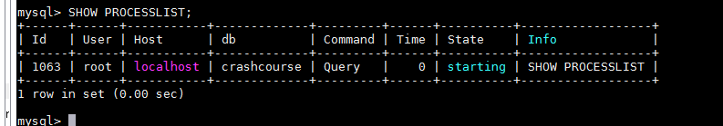
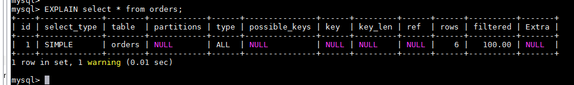

# 第30章-改善性能
本章将复习与MySQL性能有关的某些要点。

## 30.1 改善性能
数据库管理员把他们生命中的相当一部份时间花在了调整、试验以改善DBMS性能之上。在诊断应用的滞缓现象和性能问题时，性能不良的数据库（以及数据库查询）通常是最常见的祸因。可以看出，下面的内容并不能完全决定MySQL的性能。我们只是想回顾一下前面各章的重点，提供进行性能优化探讨和分析的一个出发点。
- 首先， MySQL（与所有DBMS一样）具有特定的硬件建议。在学习和研究MySQL时，使用任何旧的计算机作为服务器都可以。但对用于生产的服务器来说，应该坚持遵循这些硬件建议。
- 一般来说，关键的生产DBMS应该运行在自己的专用服务器上。
- MySQL是用一系列的默认设置预先配置的，从这些设置开始通常是很好的。但过一段时间后你可能需要调整内存分配、缓冲区大小等。（为查看当前设置，可使用 SHOW VARIABLES;和 SHOWSTATUS;。）
- MySQL一个多用户多线程的DBMS，换言之，它经常同时执行多个任务。如果这些任务中的某一个执行缓慢，则所有请求都会执行缓慢。如果你遇到显著的性能不良，可使用SHOW PROCESSLIST显示所有活动进程（以及它们的线程ID和执行时间）。你还可以用KILL命令终结某个特定的进程（使用这个命令需要作为管理员登录）。

- 总是有不止一种方法编写同一条SELECT语句。 应该试验联结、并、子查询等，找出最佳的方法。
- 使用EXPLAIN语句让MySQL解释它将如何执行一条SELECT语句。

- 一般来说，存储过程执行得比一条一条地执行其中的各条MySQL语句快。
- 应该总是使用正确的数据类型。
- 决不要检索比需求还要多的数据。换言之，不要用SELECT *（除非你真正需要每个列）。
- 有的操作（包括INSERT）支持一个可选的DELAYED关键字，如果使用它，将把控制立即返回给调用程序，并且一旦有可能就实际执行该操作。
- 在导入数据时，应该关闭自动提交。你可能还想删除索引（包括FULLTEXT索引），然后在导入完成后再重建它们。
- 必须索引数据库表以改善数据检索的性能。确定索引什么不是一件微不足道的任务，需要分析使用的SELECT语句以找出重复的WHERE和ORDER BY子句。如果一个简单的WHERE子句返回结果所花的时间太长，则可以断定其中使用的列（或几个列）就是需要索引的对象。
- 你的SELECT语句中有一系列复杂的OR条件吗？通过使用多条SELECT语句和连接它们的UNION语句，你能看到极大的性能改进。
- 索引改善数据检索的性能，但损害数据插入、删除和更新的性能。如果你有一些表，它们收集数据且不经常被搜索，则在有必要之前不要索引它们。（索引可根据需要添加和删除。）
- LIKE很慢。一般来说，最好是使用FULLTEXT而不是LIKE。
- 数据库是不断变化的实体。一组优化良好的表一会儿后可能就面目全非了。由于表的使用和内容的更改，理想的优化和配置也会改变。
- 最重要的规则就是，每条规则在某些条件下都会被打破。27830.2 小结 211浏览文档 位于[MySQL文档](http://dev.mysql.com/doc/)有许多提示和技巧（甚至有用户提供的评论和反馈）。一定要查看这些非常有价值的资料。

## 30.2 小结
本章回顾了与MySQL性能有关的某些提示和说明。当然，这只是一小部分，不过，既然你已经完成了本书的学习，你应该能试验和掌握自己觉得最适合的内容。 

