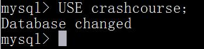
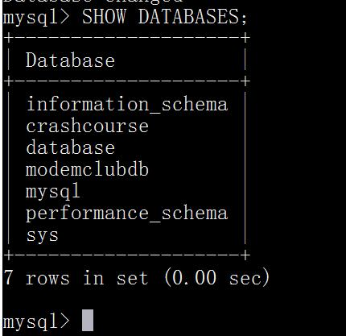
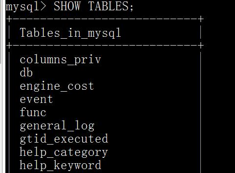
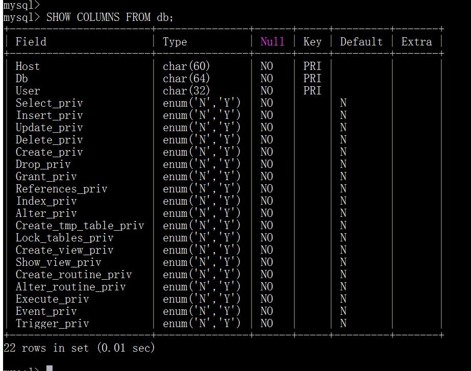
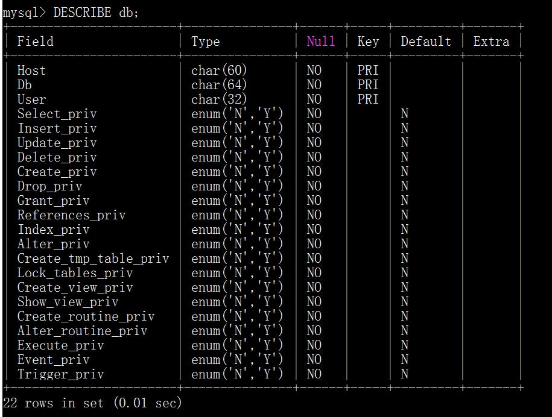
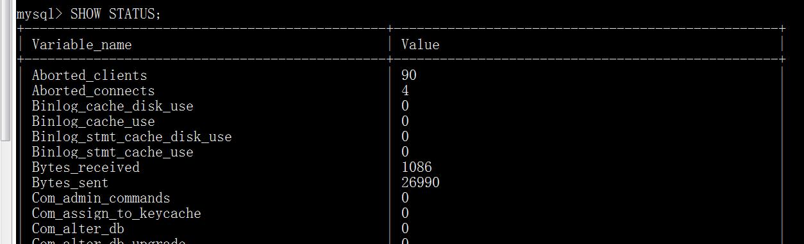
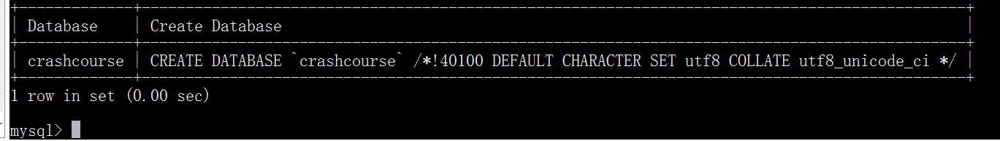
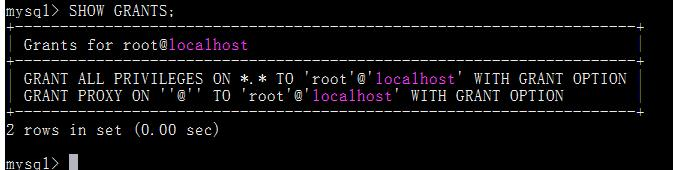
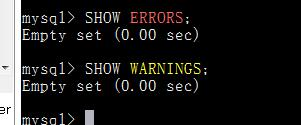
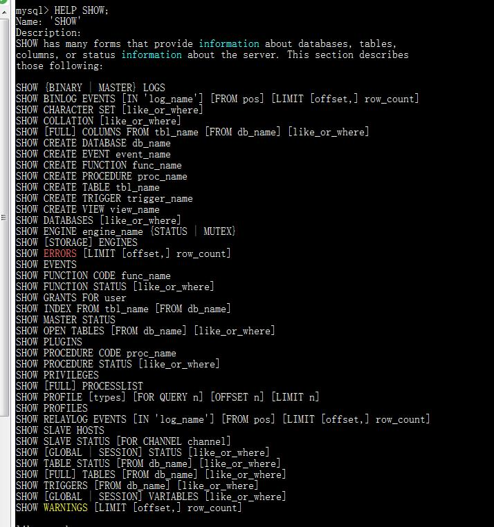

# 第三章 使用MySQL
本章将学习如何连接和登录到MySQL，如何执行MySQL语句，以及如何获得数据库和表的信息。

## 3.1 连接
在具有可供使用的MySQL DBMS和客户机软件之后，有必要简要讨论一下如何连接到数据库。MySQL与所有客户机—服务器DBMS一样，要求在能执行命令之前登录到DBMS。
MySQL在内部保存自己的用户列表，并且把每个用户与各种权限关联起来。在最初安装MySQL时，很可能会要求你输入一个管理登录(通常为root)和一个口令。如果你使用的是自己的本地服务器，并且是简单地试验一下MySQL，使用上述登录就可以了。但现实中，管理登录受到密切保护(因为对它的访问授予了创建表、删除整个数据库、更改登录和口令等完全的权限)。使用MySQL Administrator MySQL Administrator Users视图提供了一个简单的界面，可用来定义新用户，包括赋予口令和访问权限。

为了连接到MySQL，需要以下信息： 
- 主机名(计算机名)——如果连接到本地MySQL服务器， 为localhost； 
- 端口(如果使用默认端口3306之外的端口)；
- 一个合法的用户名； 
- 用户口令（如果需要）。
所有这些信息都可以传递给mysql命令行实用程序，或输入到MySQL Administrator和MySQL Query Browser的服务器连接屏幕。
在连接之后，你就可以访问你的登录名能够访问的任意数据库和表了。

## 3.2 选择数据库
在你最初连接到MySQL时，没有任何数据库打开供你使用。在你能执行任意数据库操作前，需要选择一个数据库。为此，可使用USE关键字。
关键字(key word) 作为MySQL语言组成部分的一个保留字。决不要用关键字命名一个表或列。
例如，为了使用crashcourse数据库，应该输入以下内容：

USE语句并不返回任何结果。依赖于使用的客户机，显示某种形式的通知。例如，这里显示出的Database changed消息是mysql命令行实用程序在数据库选择成功后显示的。
使用MySQL Query Browser 在MySQL Query Browser中，双击Schemata列表中列出的任一数据库以使用它。你看不到USE命令的实际执行，但会看到被选择的数据库（黑体加亮），而且应用标题栏将显示所选择的数据库名。记住，必须先使用USE打开数据库，才能读取其中的数据。

## 3.3 了解数据库和表
如果你不知道可以使用的数据库名时怎么办？这时 ， MySQLAdministrator和MySQL Query Browser怎样能显示可用的数据库列表？
数据库、表、列、用户、权限等的信息被存储在数据库和表中（MySQL使用MySQL来存储这些信息）。不过，内部的表一般不直接访问。可用MySQL的SHOW命令来显示这些信息（MySQL从内部表中提取这些信息）。
请看下面的例子：

SHOW DATABASES;返回可用数据库的一个列表。包含在这个列表中的可能是MySQL内部使用的数据库（如例子中的mysql和information_schema）。

为了获得一个数据库内的表的列表，使用SHOW TABLES; 如下所示：

SHOW TABLES;返回当前选择的数据库内可用表的列表。
SHOW也可以用来显示表列：

输出SHOW COLUMNS 要 求 给 出 一 个 表 名 （ 这 个 例 子 中 的 FROM customers），它对每个字段返回一行，行中包含字段名、数据类型、是否允许NULL、键信息、默认值以及其他信息（如字段cust_id的auto_increment）。

什么是自动增量？ 某些表列需要唯一值。在每个行添加到表中时， MySQL可以自动地为每个行分配下一个可用编号，不用在添加一行时手动分配唯一值（这样做必须记住最后一次使用的值）。这个功能就是所谓的自动增量。如果需要它，则必须在用CREATE语句创建表时把它作为表定义的组成部分。

DESCRIBE语句 MySQL支持用DESCRIBE作为SHOW COLUMNSFROM的一种快捷方式。换句话说， DESCRIBE customers;是SHOW COLUMNS FROM customers;的一种快捷方式。

所支持的其他SHOW语句还有：
- SHOW STATUS，用于显示广泛的服务器状态信息； 
- SHOW CREATE DATABASE和SHOW CREATE TABLE，分别用来显示创建特定数据库或表的MySQL语句； 
- SHOW GRANTS，用来显示授予用户（所有用户或特定用户）的安全权限； 
- SHOW ERRORS和SHOW WARNINGS， 用来显示服务器错误或警告消息。

值得注意的是，客户机应用程序使用与这里相同的MySQL命令。显示数据库和表的交互式列表、允许交互式创建和编辑表、便于数据录入和编辑或允许管理用户账号和权限等的应用全都使用你可以直接执行的相同的MySQL命令完成它们的工作。
进一步了解SHOW 请在mysql命令行实用程序中，执行命令HELP SHOW;显示允许的SHOW语句。

MySQL 5 的 新 增 内 容 MySQL 5 支 持 一 个 新 的 INFORMATION_SCHEMA命令，可用它来获得和过滤模式信息。

## 3.4 小结
本章介绍了如何连接和登录MySQL，如何用USE选择数据库，如何用SHOW查看MySQL数据库、表和内部信息。在这些知识的帮助下，我们可以进一步深入学习所有重要的SELECT语句了。 

