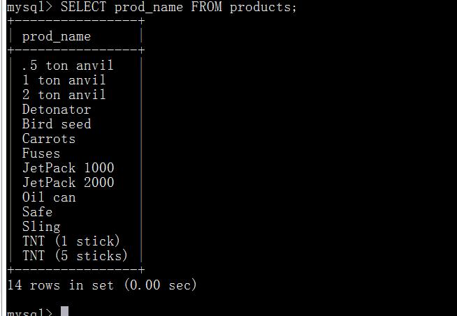
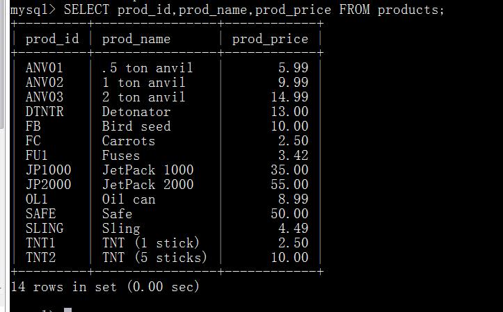
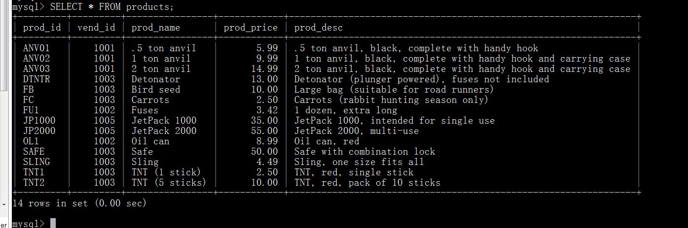
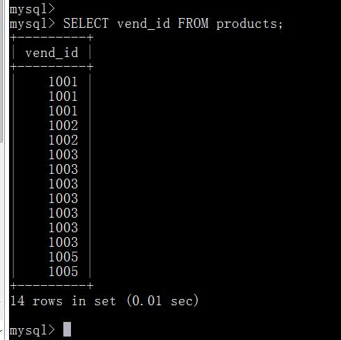
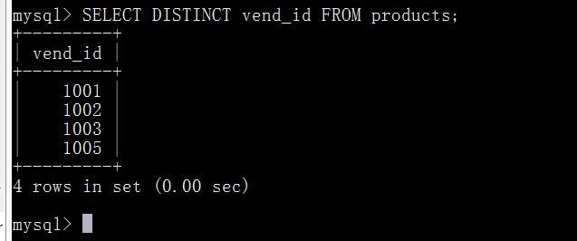
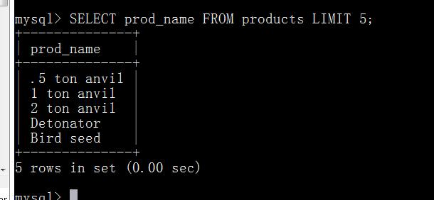
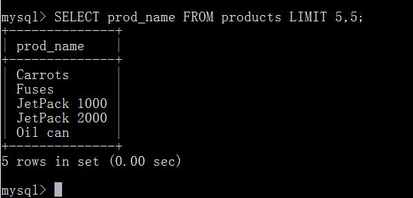
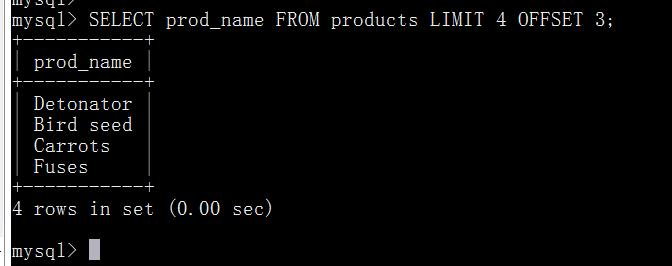
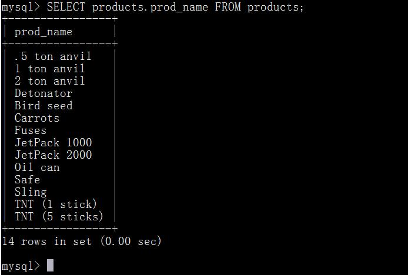
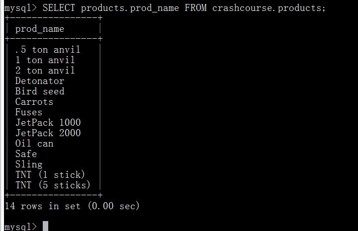

# 第四章 检索数据
本章将介绍如何使用SELECT语句从表中检索一个或多个数据列。

## 4.1 SELECT语句
正如第1章所述， SQL语句是由简单的英语单词构成的。这些单词称为关键字，每个SQL语句都是由一个或多个关键字构成的。大概，最经常使用的SQL语句就是SELECT语句了。它的用途是从一个或多个表中检索信息。为了使用SELECT检索表数据，必须至少给出两条信息——想选择什么，以及从什么地方选择。

## 4.2 检索单个列
我们将从简单的SQL SELECT语句开始介绍，此语句如下所示：

上述语句利用 SELECT语句从 products表中检索一个名为prod_name的列。所需的列名在SELECT关键字之后给出， FROM关键字指出从其中检索数据的表名。

未排序数据 如果读者自己试验这个查询，可能会发现显示输出的数据顺序不同。出现这种情况很正常。如果没有明确排序查询结果，则返回的数据的顺序没有特殊意义。返回数据的顺序可能是数据被添加到表中的顺序，也可能不是。只要返回相同数目的行，就是正常的。如上的一条简单SELECT语句将返回表中所有行。数据没有过滤(过滤将得出结果集的一个子集)， 也没有排序。

结束SQL语句 多条SQL语句必须以分号(；)分隔。 MySQL如同多数DBMS一样，不需要在单条SQL语句后加分号。但特定的DBMS可能必须在单条SQL语句后加上分号。当然，如果愿意可以总是加上分号。事实上，即使不一定需要，但加上分号肯定没有坏处。如果你使用的是mysql命令行，必须加上分号来结束SQL语句。

SQL语句和大小写 请注意， SQL语句不区分大小写，因此SELECT与select是相同的。同样，写成Select也没有关系。许多SQL开发人员喜欢对所有SQL关键字使用大写，而对所有列和表名使用小写，这样做使代码更易于阅读和调试。不过，一定要认识到虽然SQL是不区分大小写的，但有些标识符(如数据库名、表名、列名)可能不同：最佳方式是按照大小写的惯例，且使用时保持一致。

使用空格 在处理SQL语句时，其中所有空格都被忽略。 SQL语句可以在一行上给出，也可以分成许多行。多数SQL开发人员认为将SQL语句分成多行更容易阅读和调试。

## 4.3 检索多个列
要想从一个表中检索多个列，使用相同的SELECT语句。唯一的不同是必须在SELECT关键字后给出多个列名，列名之间必须以逗号分隔。
当心逗号 在选择多个列时，一定要在列名之间加上逗号，但最后一个列名后不加。如果在最后一个列名后加了逗号，将出现错误。

下面的SELECT语句从products表中选择3列：

与前一个例子一样，这条语句使用SELECT语句从表products中选择数据。在这个例子中，指定了3个列名，列名之间用逗号分隔。

数据表示 从上述输出可以看到， SQL语句一般返回原始的、无格式的数据。数据的格式化是一个表示问题，而不是一个检索问题。因此，表示(对齐和显示上面的价格值，用货币符号和逗号表示其金额)一般在显示该数据的应用程序中规定。一般很少使用实际检索出的原始数据(没有应用程序提供的格式)。

## 4.4 检索所有列
除了指定所需的列外(如上所述，一个或多个列)， SELECT语句还可以检索所有的列而不必逐个列出它们。这可以通过在实际列名的位置使用星号(\*)通配符来达到，如下所示：

如果给定一个通配符(\*)，则返回表中所有列。列的顺序一般是列在表定义中出现的顺序。但有时候并不是这样的，表的模式的变化(如添加或删除列)可能会导致顺序的变化。使用通配符 一般，除非你确实需要表中的每个列，否则最好别使用\*通配符。虽然使用通配符可能会使你自己省事，不用明确列出所需列，但检索不需要的列通常会降低检索和应用程序的性能。

检索未知列 使用通配符有一个大优点。由于不明确指定列名(因为星号检索每个列)，所以能检索出名字未知的列。

## 4.5 检索不同的行
正如所见， SELECT返回所有匹配的行。但是，如果你不想要每个值每次都出现，怎么办？例如，假如你想得出products表中产品的所有供应商ID：

SELECT语句返回14行(即使表中只有4个供应商)，因为products表中列出了14个产品。那么，如何检索出有不同值的列表呢？解决办法是使用DISTINCT关键字，顾名思义，此关键字指示MySQL只返回不同的值。

SELECT DISTINCT vend_id告诉MySQL只返回不同(唯一)的vend_id行，因此只返回4行。如果使用DISTINCT关键字，它必须直接放在列名的前面。

不能部分使用DISTINCT, DISTINCT关键字应用于所有列而不仅是前置它的列。如果给出SELECT DISTINCT vend_id,prod_price，除非指定的两个列都不同，否则所有行都将被检索出来。

## 4.6 限制结果
SELECT语句返回所有匹配的行，它们可能是指定表中的每个行。为了返回第一行或前几行，可使用LIMIT子句。下面举一个例子：

此语句使用SELECT语句检索单个列。 LIMIT 5指示MySQL返回不多于5行。
为得出下一个5行，可指定要检索的开始行和行数，如下所示：LIMIT 5, 5指示MySQL返回从行5开始的5行。第一个数为开始位置，第二个数为要检索的行数。

所以， 带一个值的LIMIT总是从第一行开始，给出的数为返回的行数。带两个值的LIMIT可以指定从行号为第一个值的位置开始。行0 检索出来的第一行为行0而不是行1。因此， LIMIT 1, 1将检索出第二行而不是第一行。
在行数不够时 LIMIT中指定要检索的行数为检索的最大行数。如果没有足够的行(例如，给出LIMIT 10, 5，但只有13行)， MySQL将只返回它能返回的那么多行。
MySQL 5的LIMIT语法 LIMIT 3, 4的含义是从行4开始的3行还是从行3开始的4行？如前所述，它的意思是从行3开始的4行，这容易把人搞糊涂。由于这个原因， MySQL 5支持LIMIT的另一种替代语法。 LIMIT4 OFFSET 3意为从行3开始取4行，就像LIMIT 3, 4一样。

## 4.7 使用完全限定的表名
迄今为止使用的SQL例子只通过列名引用列。也可能会使用完全限定的名字来引用列(同时使用表名和列字)。请看以下例子：

这条SQL语句在功能上等于本章最开始使用的那一条语句，但这里指定了一个完全限定的列名。表名也可以是完全限定的，如下所示：

这条语句在功能上也等于刚使用的那条语句(当然，假定products表确实位于crashcourse数据库中)。正如以后章节所介绍的那样，有一些情形需要完全限定名。现在，需要注意这个语法，以便在遇到时知道它的作用。

## 4.8 小结
本章学习了如何使用SQL的SELECT语句来检索单个表列、多个表列以及所有表列。下一章将讲授如何排序检索出来的数据。
