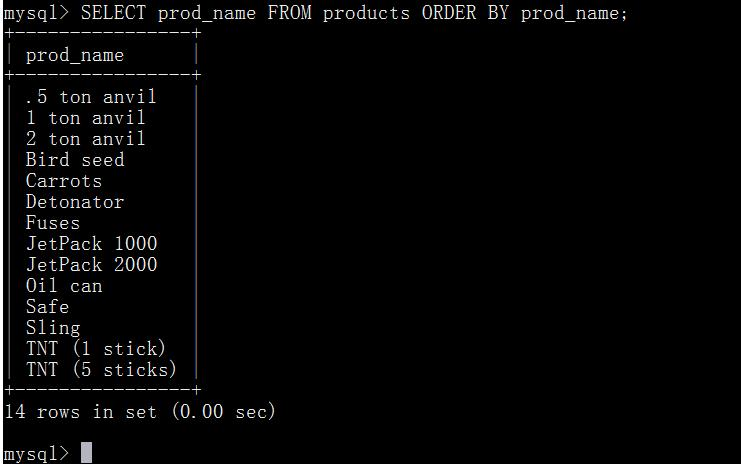
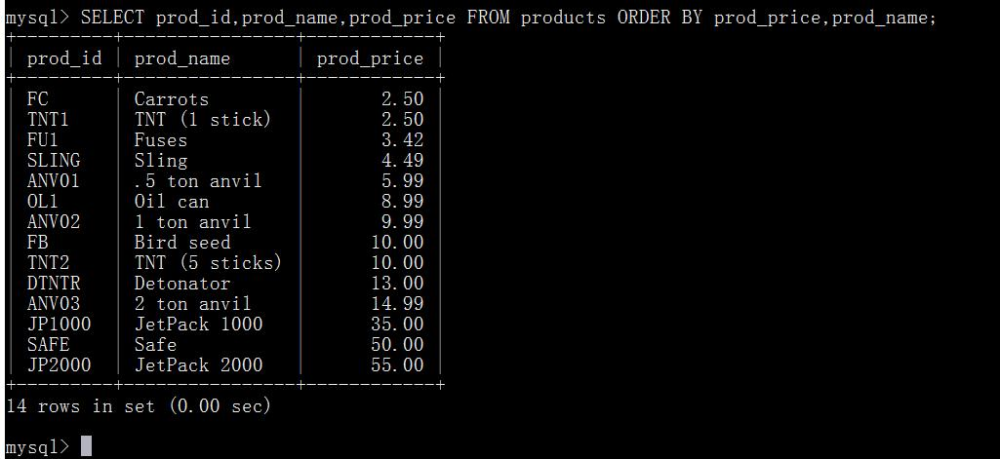
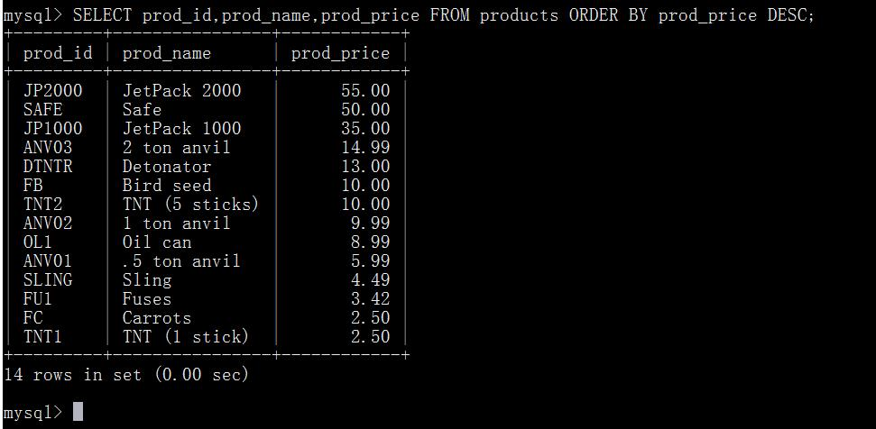
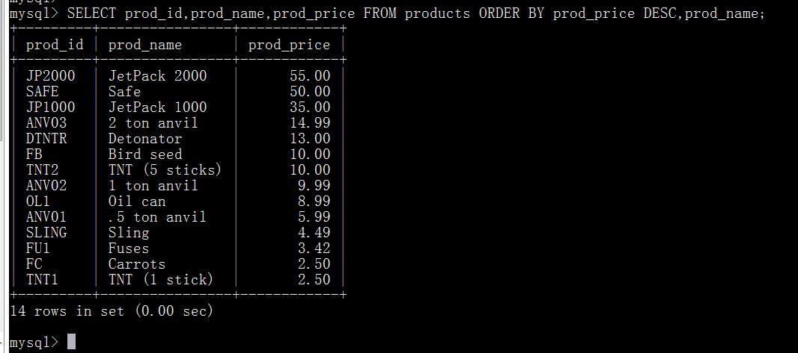
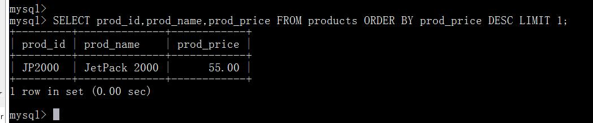

# 第五章 排序检索数据
本章将讲授如何使用SELECT语句的ORDER BY子句，根据需要排序检索出的数据。

## 5.1 排序数据
正如前一章所述，下面的SQL语句返回某个数据库表的单个列。但请看其输出，并没有特定的顺序。

其实，检索出的数据并不是以纯粹的随机顺序显示的。如果不排序，数据一般将以它在底层表中出现的顺序显示。这可以是数据最初添加到表中的顺序。但是，如果数据后来进行过更新或删除，则此顺序将会受到MySQL重用回收存储空间的影响。因此，如果不明确控制的话，不能(也不应该)依赖该排序顺序。关系数据库设计理论认为，如果不明确规定排序顺序，则不应该假定检索出的数据的顺序有意义。

子句(clause) SQL语句由子句构成，有些子句是必需的，而有的是可选的。一个子句通常由一个关键字和所提供的数据组成。子句的例子有SELECT语句的FROM子句，我们在前一章看到过这个子句。为了明确地排序用SELECT语句检索出的数据，可使用ORDER BY子句。ORDER BY子句取一个或多个列的名字，据此对输出进行排序。请看下面的例子：

这条语句除了指示MySQL对prod_name列以字母顺序排序数据的ORDER BY子句外，与前面的语句相同。
通过非选择列进行排序 通常， ORDER BY子句中使用的列将是为显示所选择的列。但是，实际上并不一定要这样，用非检索的列排序数据是完全合法的。

## 5.2 按多个列排序
经常需要按不止一个列进行数据排序。例如，如果要显示雇员清单，可能希望按姓和名排序（首先按姓排序，然后在每个姓中再按名排序）。如果多个雇员具有相同的姓，这样做很有用。为了按多个列排序，只要指定列名，列名之间用逗号分开即可（就像选择多个列时所做的那样）。下面的代码检索3个列，并按其中两个列对结果进行排序——首先按价格，然后再按名称排序。

重要的是理解在按多个列排序时，排序完全按所规定的顺序进行。换句话说，对于上述例子中的输出，仅在多个行具有相同的prod_price值时才对产品按prod_name进行排序。如果prod_price列中所有的值都是唯一的，则不会按prod_name排序。

## 5.3 指定排序方向
数据排序不限于升序排序（从A到Z）。这只是默认的排序顺序，还可以使用ORDER BY子句以降序（从Z到A）顺序排序。为了进行降序排序，必须指定DESC关键字。下面的例子按价格以降序排序产品（最贵的排在最前面）：

但是，如果打算用多个列排序怎么办？下面的例子以降序排序产品（最贵的在最前面），然后再对产品名排序：

DESC关键字只应用到直接位于其前面的列名。在上例中，只对prod_price列指定 DESC，对 prod_name列不指定。因此，prod_price列以降序排序，而prod_name列（在每个价格内）仍然按标准的升序排序。
在多个列上降序排序 如果想在多个列上进行降序排序， 必须对每个列指定DESC关键字。与DESC相反的关键字是ASC（ASCENDING），在升序排序时可以指定它。但实际上， ASC没有多大用处，因为升序是默认的（如果既不指定ASC也不指定DESC，则假定为ASC）。
区分大小写和排序顺序 在对文本性的数据进行排序时， A与a相同吗？ a位于B之前还是位于Z之后？这些问题不是理论问题，其答案取决于数据库如何设置。在字典（ dictionary）排序顺序中，A被视为与a相同，这是MySQL（和大多数数据库管理系统）的默认行为。但是，许多数据库管理员能够在需要时改变这种行为（如果你的数据库包含大量外语字符，可能必须这样做）。这里，关键的问题是，如果确实需要改变这种排序顺序，用简单的ORDER BY子句做不到。你必须请求数据库管理员的帮助。
使用ORDER BY和LIMIT的组合，能够找出一个列中最高或最低的值。下面的例子演示如何找出最昂贵物品的值：

prod_price DESC保证行是按照由最昂贵到最便宜检索的，而LIMIT 1告诉MySQL仅返回一行。
ORDER BY子句的位置 在给出ORDER BY子句时，应该保证它位于FROM子句之后。如果使用LIMIT，它必须位于ORDER BY之后。使用子句的次序不对将产生错误消息。

## 5.4 小结 
本章学习了如何用SELECT语句的ORDER BY子句对检索出的数据进行排序。这个子句必须是SELECT语句中的最后一条子句。可根据需要，利用它在一个或多个列上对数据进行排序。分析
