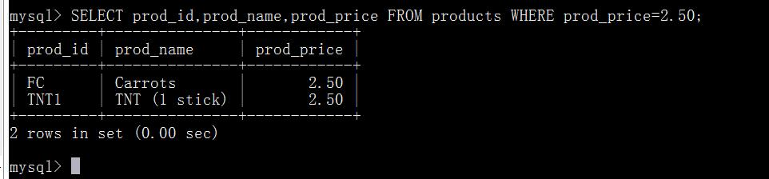
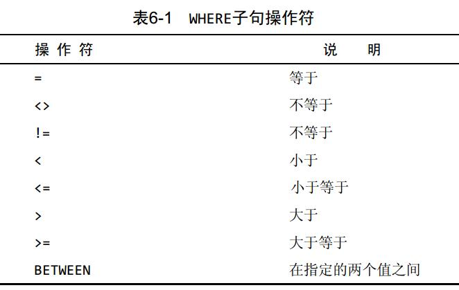
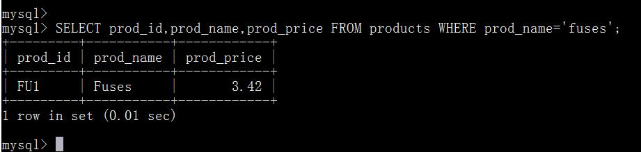
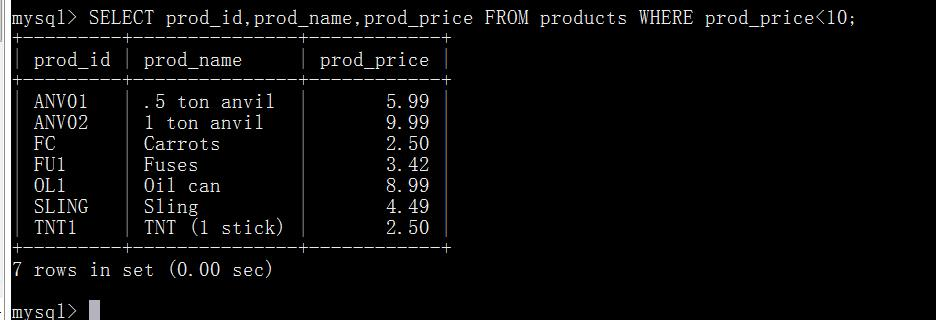
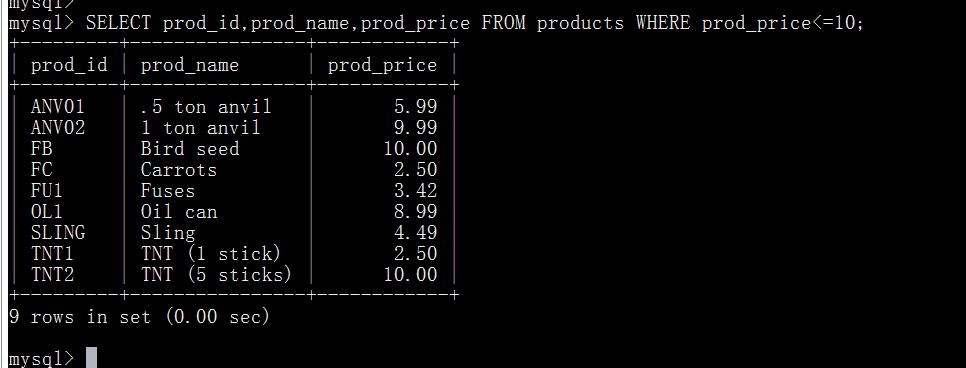
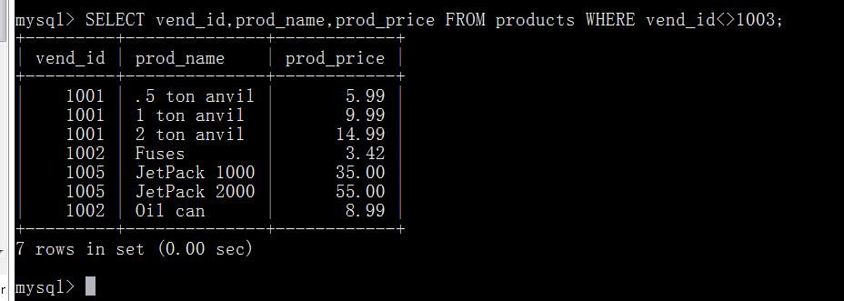
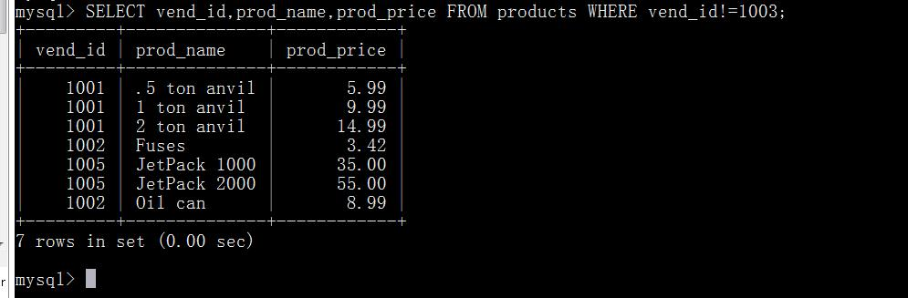
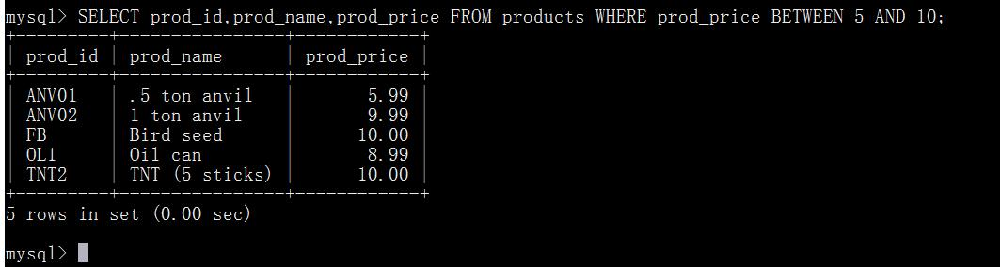
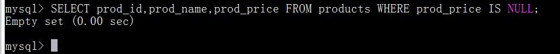
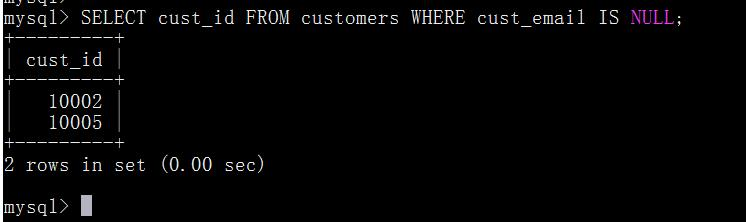

# 第六章 过滤数据
本章将讲授如何使用SELECT语句的WHERE子句指定搜索条件。

## 6.1 使用WHERE子句
数据库表一般包含大量的数据，很少需要检索表中所有行。通常只会根据特定操作或报告的需要提取表数据的子集。只检索所需数据需要指定搜索条件（ search criteria） ，搜索条件也称为过滤条件（ filtercondition） 。在SELECT语句中，数据根据WHERE子句中指定的搜索条件进行过滤。WHERE子句在表名（FROM子句）之后给出，如下所示：

这条语句从products表中检索两个列，但不返回所有行，只返回prod_price值为2.50的行。
这个例子采用了简单的相等测试：它检查一个列是否具有指定的值，据此进行过滤。但是SQL允许做的事情不仅仅是相等测试。

过滤与应用过滤 数据也可以在应用层过滤。为此目的， SQL的SELECT语句为客户机应用检索出超过实际所需的数据，然后客户机代码对返回数据进行循环，以提取出需要的行。通常，这种实现并不令人满意。因此，对数据库进行了优化，以便快速有效地对数据进行过滤。让客户机应用（或开发语言）处理数据库的工作将会极大地影响应用的性能，并且使所创建的应用完全不具备可伸缩性。此外，如果在客户机上过滤数据，服务器不得不通过网络发送多余的数据，这将导致网络带宽的浪费。

WHERE子句的位置 在同时使用ORDER BY和WHERE子句时，应该让ORDER BY位于WHERE之后， 否则将会产生错误。

## 6.2 WHERE子句操作符
我们在关于相等的测试时看到了第一个WHERE子句，它确定一个列是否包含特定的值。 MySQL支持表6-1列出的所有条件操作符。

### 6.2.1 检查单个值
我们已经看到了测试相等的例子。再来看一个类似的例子：

检查WHERE prod_name=‘fuses’语句，它返回prod_name的值为Fuses的一行。 MySQL在执行匹配时默认不区分大小写，所以fuses与Fuses匹配。
现在来看几个使用其他操作符的例子。第一个例子是列出价格小于10美元的所有产品：

下一条语句检索价格小于等于10美元的所有产品（输出的结果比第一个例子输出的结果多两种产品）：

### 6.2.2 不匹配检查
以下例子列出不是由供应商1003制造的所有产品：

何时使用引号 如果仔细观察上述WHERE子句中使用的条件，会看到有的值括在单引号内（如前面使用的'fuses'），而有的值未括起来。单引号用来限定字符串。如果将值与串类型的列进行比较，则需要限定引号。用来与数值列进行比较的值不用引号。

下面是相同的例子，其中使用!=而不是<>操作符：

### 6.2.3 范围值检查
为了检查某个范围的值，可使用BETWEEN操作符。其语法与其他WHERE子句的操作符稍有不同，因为它需要两个值，即范围的开始值和结束值。例如， BETWEEN操作符可用来检索价格在5美元和10美元之间或日期在指定的开始日期和结束日期之间的所有产品。
下面的例子说明如何使用BETWEEN操作符，它检索价格在5美元和10美元之间的所有产品：

从这个例子中可以看到，在使用BETWEEN时，必须指定两个值——所需范围的低端值和高端值。这两个值必须用AND关键字分隔。 BETWEEN匹配范围中所有的值，包括指定的开始值和结束值。

### 6.2.4 空值检查
在创建表时，表设计人员可以指定其中的列是否可以不包含值。在一个列不包含值时，称其为包含空值NULL。NULL 无值（no value），它与字段包含0、空字符串或仅仅包含空格不同。SELECT语句有一个特殊的WHERE子句，可用来检查具有NULL值的列。这个WHERE子句就是IS NULL子句。其语法如下：

这条语句返回没有价格（空prod_price字段，不是价格为0）的所有产品，由于表中没有这样的行，所以没有返回数据。但是， customers表确实包含有具有空值的列，如果在文件中没有某位顾客的电子邮件地分析则cust_email列将包含NULL值：

NULL与不匹配 在通过过滤选择出不具有特定值的行时，你可能希望返回具有NULL值的行。但是，不行。因为未知具有特殊的含义，数据库不知道它们是否匹配，所以在匹配过滤或不匹配过滤时不返回它们。因此，在过滤数据时，一定要验证返回数据中确实给出了被过滤列具有NULL的行。

## 6.3 小结
本章介绍了如何用SELECT语句的WHERE子句过滤返回的数据。我们学习了如何对相等、不相等、大于、小于、值的范围以及NULL值等进行测试。

