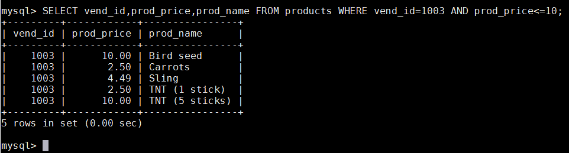
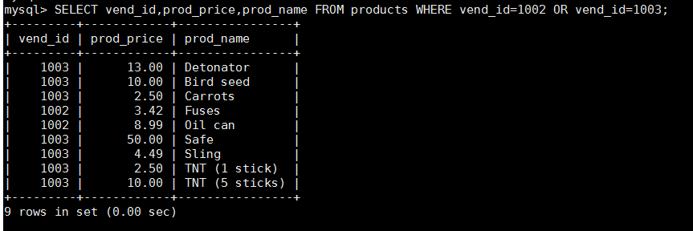
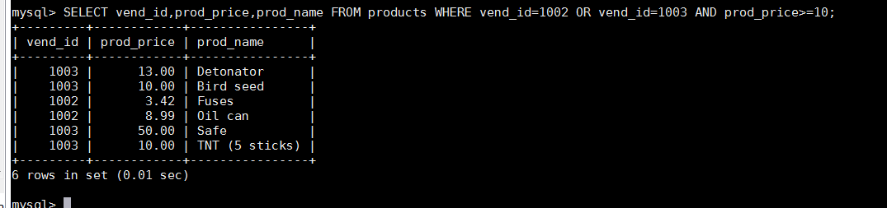
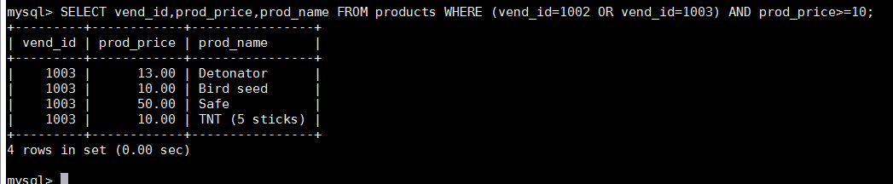
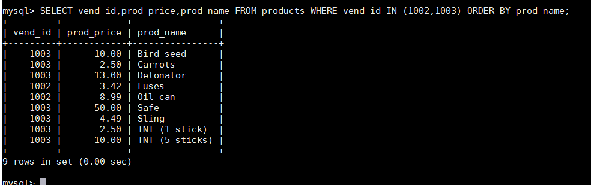
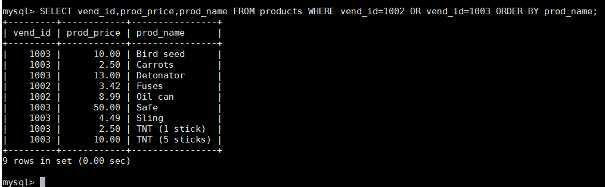
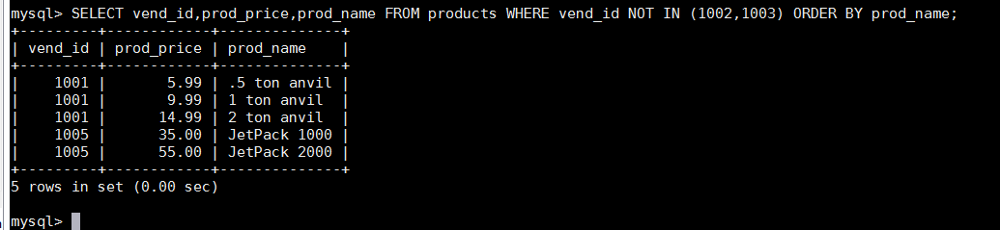

# 第七章 数据过滤
本章讲授如何组合WHERE子句以建立功能更强的更高级的搜索条件。我们还将学习如何使用NOT和IN操作符。

## 7.1 组合WHERE子句

第6章中介绍的所有WHERE子句在过滤数据时使用的都是单一的条件。为了进行更强的过滤控制， MySQL允许给出多个WHERE子句。这些子句可以两种方式使用：以AND子句的方式或OR子句的方式使用。
操作符（operator） 用来联结或改变WHERE子句中的子句的关键字。也称为逻辑操作符（ logical operator） 。

### 7.1.1 AND操作符
为了通过不止一个列进行过滤，可使用AND操作符给WHERE子句附加条件。下面的代码给出了一个例子：

此SQL语句检索由供应商1003制造且价格小于等于10美元的所有产品的名称和价格。这条SELECT语句中的WHERE子句包含两个条件，并且用AND关键字联结它们。 AND指示DBMS只返回满足所有给定条件的行。如果某个产品由供应商1003制造，但它的价格高于10美元，则不检索它。类似，如果产品价格小于10美元，但不是由指定供应商制造的也不被检索。
AND 用在WHERE子句中的关键字，用来指示检索满足所有给定条件的行。上述例子中使用了只包含一个关键字AND的语句，把两个过滤条件组合在一起。还可以添加多个过滤条件，每添加一条就要使用一个AND。

### 7.1.2 OR操作符OR
操作符与AND操作符不同，它指示MySQL检索匹配任一条件的行。请看如下的SELECT语句：

此SQL语句检索由任一个指定供应商制造的所有产品的产品名和价格。 OR操作符告诉DBMS匹配任一条件而不是同时匹配两个条件。如果这里使用的是AND操作符，则没有数据返回（此时创建的WHERE子句不会检索到匹配的产品）。
OR WHERE子句中使用的关键字，用来表示检索匹配任一给定条件的行。

### 7.1.3 计算次序
WHERE可包含任意数目的AND和OR操作符。允许两者结合以进行复杂和高级的过滤。但是，组合AND和OR带来了一个有趣的问题。为了说明这个问题，来看一个例子。假如需要列出价格为10美元（含）以上且由1002或1003制造的所有产品。下面的SELECT语句使用AND和OR操作符的组合建立了一个WHERE子句：

返回的行中有两行价格小于10美元，显然，返回的行未按预期的进行过滤。为什么会这样呢？原因在于计算的次序。 SQL（像多数语言一样）在处理OR操作符前，**优先处理AND操作符**。当SQL看到上述WHERE子句时，它理解为由供应商1003制造的任何价格为10美元（含）以上的产品，或者由供应商1002制造的任何产品，而不管其价格如何。换句话说，由于AND在计算次序中优先级更高，操作符被错误地组合了。此问题的解决方法是使用圆括号明确地分组相应的操作符。请看下面的SELECT语句及输出：

这条SELECT语句与前一条的唯一差别是，这条语句中，前两个条件用圆括号括了起来。因为圆括号具有较AND或OR操作符高的计算次序， DBMS首先过滤圆括号内的OR条件。这时， SQL语句变成了选择由供应商1002或1003制造的且价格都在10美元（含）以上的任何产品，这正是我们所希望的。在WHERE子句中使用圆括号 任何时候使用具有AND和OR操作符的WHERE子句，都应该使用圆括号明确地分组操作符。不要过分依赖默认计算次序，即使它确实是你想要的东西也是如此。使用圆括号没有什么坏处，它能消除歧义。

## 7.2 IN 操作符
圆括号在WHERE子句中还有另外一种用法。 IN操作符用来指定条件范围，范围中的每个条件都可以进行匹配。 IN取合法值的由逗号分隔的清单，全都括在圆括号中。下面的例子说明了这个操作符：

此SELECT语句检索供应商1002和1003制造的所有产品。 IN操作符后跟由逗号分隔的合法值清单，整个清单必须括在圆括号中。如果你认为IN操作符完成与OR相同的功能，那么你的这种猜测是对的。下面的SQL语句完成与上面的例子相同的工作：

为什么要使用IN操作符？其优点具体如下。 
- 在使用长的合法选项清单时， IN操作符的语法更清楚且更直观。 
- 在使用IN时，计算的次序更容易管理（因为使用的操作符更少）。 
- IN操作符一般比OR操作符清单执行更快。 
- IN的最大优点是可以包含其他SELECT语句，使得能够更动态地建立WHERE子句。

IN WHERE子句中用来指定要匹配值的清单的关键字，功能与OR相当。

## 7.3 NOT操作符
WHERE子句中的NOT操作符有且只有一个功能，那就是否定它之后所跟的任何条件。NOT WHERE子句中用来否定后跟条件的关键字。下面的例子说明NOT的使用。为了列出除1002和1003之外的所有供应商制造的产品，可编写如下的代码：

这里的NOT否定跟在它之后的条件，因此， MySQL不是匹配1002和 1003 的 vend_id ， 而 是 匹 配 1002 和 1003 之 外 供 应 商 的vend_id。为什么使用NOT？对于简单的WHERE子句，使用NOT确实没有什么优势。但在更复杂的子句中， NOT是非常有用的。例如，在与IN操作符联合使用时， NOT使找出与条件列表不匹配的行非常简单。
MySQL中的 NOT MySQL 支 持 使 用 NOT 对 IN 、 BETWEEN 和EXISTS子句取反，这与多数其他DBMS允许使用NOT对各种条件取反有很大的差别。

## 7.4 小结
本章讲授如何用AND和OR操作符组合成WHERE子句，而且还讲授了如何明确地管理计算的次序，如何使用IN和NOT操作符。

