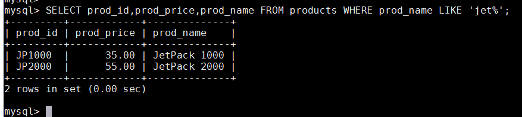
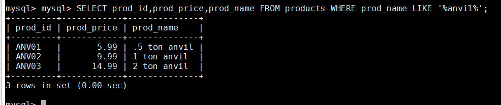
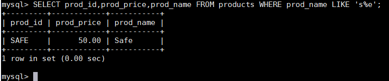
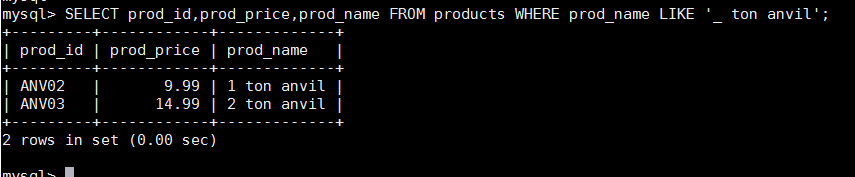
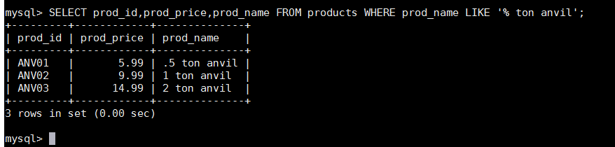

# 第八章 用通配符进行过滤
本章介绍什么是通配符、如何使用通配符以及怎样使用LIKE操作符进行通配搜索，以便对数据进行复杂过滤。

## 8.1 LIKE操作符
前面介绍的所有操作符都是针对已知值进行过滤的。不管是匹配一个还是多个值，测试大于还是小于已知值，或者检查某个范围的值，共同点是过滤中使用的值都是已知的。但是，这种过滤方法并不是任何时候都好用。例如，怎样搜索产品名中包含文本anvil的所有产品？用简单的比较操作符肯定不行，必须使用通配符。利用通配符可创建比较特定数据的搜索模式。在这个例子中，如果你想找出名称包含anvil的所有产品，可构造一个通配符搜索模式，找出产品名中任何位置出现anvil的产品。
通配符（wildcard） 用来匹配值的一部分的特殊字符。
搜索模式（search pattern）由字面值、通配符或两者组合构成的搜索条件。
通配符本身实际是SQL的WHERE子句中有特殊含义的字符， SQL支持几种通配符。
为在搜索子句中使用通配符，必须使用LIKE操作符。 LIKE指示MySQL，后跟的搜索模式利用通配符匹配而不是直接相等匹配进行比较。
谓词 操作符何时不是操作符？答案是在它作为谓词（ predicate）时。从技术上说， LIKE是谓词而不是操作符。虽然最终的结果是相同的，但应该对此术语有所了解，以免在SQL文档中遇到此术语时不知道。

### 8.1.1 百分号（%）通配符
最常使用的通配符是百分号（%）。在搜索串中， %表示任何字符出现任意次数。例如，为了找出所有以词jet起头的产品，可使用以下SELECT语句：

此例子使用了搜索模式'jet%'。在执行这条子句时，将检索任意以jet起头的词。 %告诉MySQL接受jet之后的任意字符，不管它有多少字符。
区分大小写 根据MySQL的配置方式，搜索可以是区分大小写的。如果区分大小写， 'jet%'与JetPack 1000将不匹配。
通配符可在搜索模式中任意位置使用，并且可以使用多个通配符。下面的例子使用两个通配符，它们位于模式的两端：

用通配符进行过滤搜索模式'%anvil%'表示匹配任何位置包含文本anvil的值，而不论它之前或之后出现什么字符。通配符也可以出现在搜索模式的中间，虽然这样做不太有用。下面的例子找出以s起头以e结尾的所有产品：

重要的是要注意到，除了一个或多个字符外， %还能匹配0个字符。 %代表搜索模式中给定位置的0个、 1个或多个字符。
注意尾空格 尾空格可能会干扰通配符匹配。例如，在保存词anvil 时 ， 如 果 它 后 面 有 一 个 或 多 个 空 格 ， 则 子 句 WHERE prod_name LIKE '%anvil'将不会匹配它们，因为在最后的l后有多余的字符。解决这个问题的一个简单的办法是在搜索模式最后附加一个%。一个更好的办法是使用函数（第11章将会介绍）去掉首尾空格。
注意NULL 虽然似乎%通配符可以匹配任何东西，但有一个例外，即NULL。即使是WHERE prod_name LIKE '%'也不能匹配用值NULL作为产品名的行。

### 8.1.2 下划线（\_）
通配符另一个有用的通配符是下划线（\_）。下划线的用途与%一样，但下划线只匹配单个字符而不是多个字符。举一个例子：

此WHERE子句中的搜索模式给出了后面跟有文本的两个通配符。结果只显示匹配搜索模式的行：第一行中下划线匹配1，第二行中匹配2。 .5 ton anvil产品没有匹配，因为搜索模式要求匹配两个通配符而不是一个。对照一下，下面的SELECT语句使用%通配符，返回三行产品：

与%能匹配0个字符不一样， \_总是匹配一个字符，不能多也不能少。

## 8.2 使用通配符的技巧
正如所见， MySQL的通配符很有用。但这种功能是有代价的：通配符搜索的处理一般要比前面讨论的其他搜索所花时间更长。这里给出一些使用通配符要记住的技巧。 
- 不要过度使用通配符。如果其他操作符能达到相同的目的，应该使用其他操作符。 
- 在确实需要使用通配符时，除非绝对有必要，否则不要把它们用在搜索模式的开始处。把通配符置于搜索模式的开始处，搜索起来是最慢的。 
- 仔细注意通配符的位置。如果放错地方，可能不会返回想要的数输出。
总之，通配符是一种极重要和有用的搜索工具，以后我们经常会用到它。

8.3 小结
本章介绍了什么是通配符以及如何在WHERE子句中使用SQL通配符，并且还说明了通配符应该细心使用，不要过度使用。

