# 第九章 用正则表达式进行搜索
本章将学习如何在MySQL WHERE子句内使用正则表达式来更好地控制数据过滤。

## 9.1 正则表达式介绍
前两章中的过滤例子允许用匹配、比较和通配操作符寻找数据。对于基本的过滤(或者甚至是某些不那么基本的过滤)，这样就足够了。但随着过滤条件的复杂性的增加， WHERE子句本身的复杂性也有必要增加。这也就是正则表达式变得有用的地方。正则表达式是用来匹配文本的特殊的串(字符集合)。如果你想从一个文本文件中提取电话号码，可以使用正则表达式。如果你需要查找名字中间有数字的所有文件，可以使用一个正则表达式。如果你想在一个文本块中找到所有重复的单词，可以使用一个正则表达式。如果你想替换一个页面中的所有URL为这些URL的实际HTML链接， 也可以使用一个正则表达式(对于最后这个例子，或者是两个正则表达式)。所有种类的程序设计语言、文本编辑器、操作系统等都支持正则表达式。有见识的程序员和网络管理员已经关注作为他们技术工具重要内容的正则表达式很长时间了。正则表达式用正则表达式语言来建立，正则表达式语言是用来完成刚讨论的所有工作以及更多工作的一种特殊语言。与任意语言一样，正则表达式具有你必须学习的特殊的语法和指令。

学习更多内容 完全覆盖正则表达式的内容超出了本书的范围。虽然基础知识都在这里做了介绍，但对正则表达式更为透彻的介绍可能还需要参阅作者的《正则表达式必知必会》

## 9.2 使用MySQL正则表达式
那么，正则表达式与MySQL有何关系？已经说过，正则表达式的作用是匹配文本，将一个模式(正则表达式)与一个文本串进行比较。MySQL用WHERE子句对正则表达式提供了初步的支持，允许你指定正则表达式，过滤SELECT检索出的数据。
仅为正则表达式语言的一个子集 如果你熟悉正则表达式， 需要注意： MySQL仅支持多数正则表达式实现的一个很小的子集。本章介绍MySQL支持的大多数内容。我们举几个例子，更清晰地描述正则表达式的概念。

### 9.2.1 基本字符匹配
我们从一个非常简单的例子开始。下面的语句检索列prod_name包含文本1000的所有行：
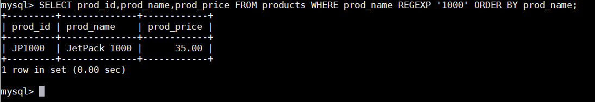

除关键字LIKE被REGEXP替代外，这条语句看上去非常像使用LIKE的语句(第8章)。它告诉MySQL： REGEXP后所跟的东西作为正则表达式(与文字正文1000匹配的一个正则表达式)处理。
为什么要费力地使用正则表达式？在刚才的例子中，正则表达式确实没有带来太多好处(可能还会降低性能)，不过，请考虑下面的例子：
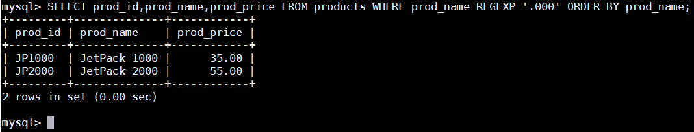

这里使用了正则表达式.000。 .是正则表达式语言中一个特殊的字符。它表示匹配任意一个字符，因此， 1000和2000都匹配且返回。当然，这个特殊的例子也可以用LIKE和通配符来完成(参阅第8章)。
LIKE与REGEXP 在LIKE和REGEXP之间有一个重要的差别。请看以下两条语句：
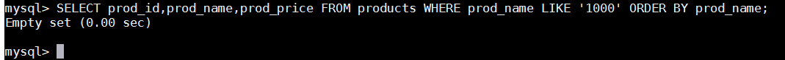

如果执行上述两条语句，会发现第一条语句不返回数据，而第二条语句返回一行。为什么？正如第8章所述， LIKE匹配整个列。如果被匹配的文本在列值中出现， LIKE将不会找到它，相应的行也不被返回(除非使用通配符)。而REGEXP在列值内进行匹配，如果被匹配的文本在列值中出现， REGEXP将会找到它，相应的行将被返回。这是一个非常重要的差别。那么， REGEXP能不能用来匹配整个列值(从而起与LIKE相同的作用)？答案是肯定的，使用^和$定位符( anchor)即可，本章后面介绍。
匹配不区分大小写 MySQL中的正则表达式匹配不区分大小写(即，大写和小写都匹配)。为区分大小写，可使用BINARY关键字，如WHERE prod_name REGEXP BINARY 'JetPack .000'。
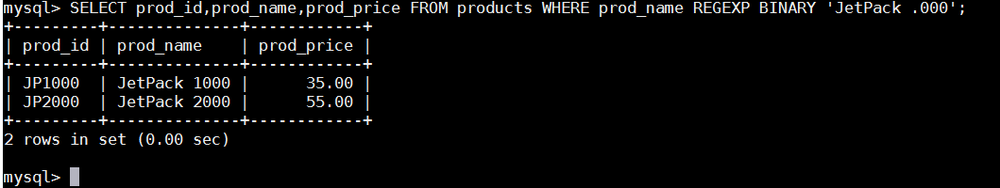

### 9.2.2 进行OR匹配
为搜索两个串之一(或者为这个串，或者为另一个串)，使用\|，如下所示：
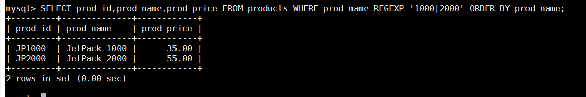

语句中使用了正则表达式1000\|2000。 \|为正则表达式的OR操作符。它表示匹配其中之一，因此1000和2000都匹配并返回。使用\|从功能上类似于在SELECT语句中使用OR语句， 多个OR条件可并入单个正则表达式。两个以上的OR条件 可以给出两个以上的OR条件。例如，'1000 \| 2000 \| 3000'将匹配1000或2000或3000。

### 9.2.3 匹配几个字符之一
匹配任何单一字符。但是，如果你只想匹配特定的字符，怎么办？可通过指定一组用[和]括起来的字符来完成，如下所示：
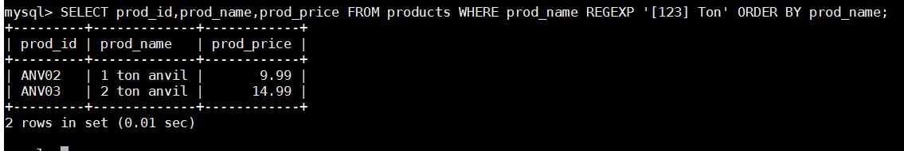

这里，使用了正则表达式[123] Ton。 [123]定义一组字符，它的意思是匹配1或2或3，因此， 1 ton和2 ton都匹配且返回(没有3 ton)。正如所见， []是另一种形式的OR语句。 事实上，正则表达式[123]Ton为[1\|2\|3]Ton的缩写，也可以使用后者。但是，需要用[]来定义OR语句查找什么。为更好地理解这一点，请看下面的例子：
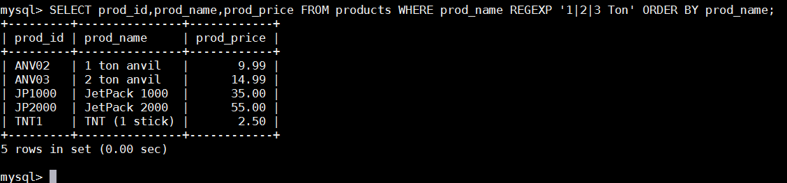

这并不是期望的输出。两个要求的行被检索出来，但还检索出了另外3行。之所以这样是由于MySQL假定你的意思是'1'或'2'或'3 ton'。除非把字符\|括在一个集合中，否则它将应用于整个串。字符集合也可以被否定，即，它们将匹配除指定字符外的任何东西。为否定一个字符集，在集合的开始处放置一个^即可。因此，尽管[123]匹配字符1、 2或3，但[^123]却匹配除这些字符外的任何东西。

### 9.2.4 匹配范围
集合可用来定义要匹配的一个或多个字符。例如，下面的集合将匹配数字0到9：[0123456789]
为简化这种类型的集合，可使用-来定义一个范围。下面的式子功能上等同于上述数字列表：[0-9]
范围不限于完整的集合， [1-3]和[6-9]也是合法的范围。此外，范围不一定只是数值的， [a-z]匹配任意字母字符。举一个例子：
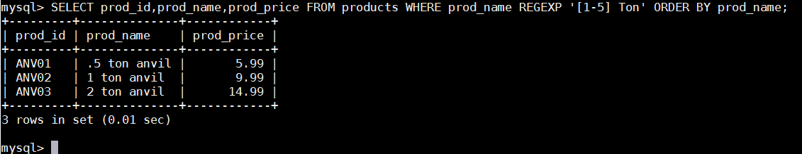

这里使用正则表达式[1-5] Ton。 [1-5]定义了一个范围，这个表达式意思是匹配1到5，因此返回3个匹配行。由于5 ton匹配，所以返回.5 ton。

### 9.2.5 匹配特殊字符
正则表达式语言由具有特定含义的特殊字符构成。我们已经看到.、[]、\|和-等，还有其他一些字符。请问，如果你需要匹配这些字符，应该怎么办呢？例如，如果要找出包含.字符的值，怎样搜索？请看下面的例子：
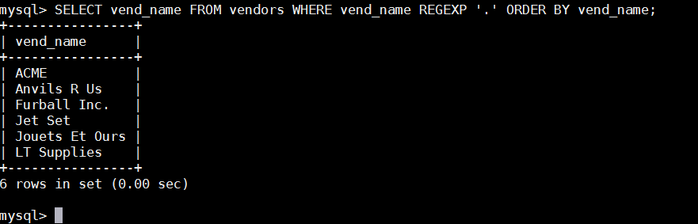

这并不是期望的输出， .匹配任意字符，因此每个行都被检索出来。为了匹配特殊字符，必须用\\\\为前导。\\\\-表示查找-， \\\\.表示查找.。
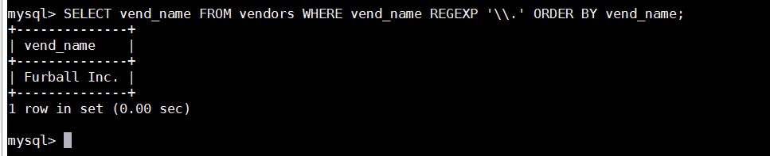

这才是期望的输出。 \\\\.匹配.，所以只检索出一行。这种处理就是所谓的转义(escaping)，正则表达式内具有特殊意义的所有字符都必须以这种方式转义。这包括.、 \|、 []以及迄今为止使用过的其他特殊字符。\\\\也用来引用元字符(具有特殊含义的字符)，如表9-1所列。
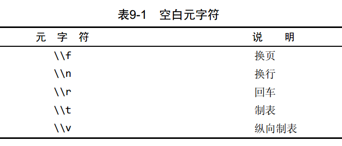

匹配\ 为了匹配反斜杠( \\\\)字符本身，需要使用\\\\\。
\或\\\\? 多数正则表达式实现使用单个反斜杠转义特殊字符，以便能使用这些字符本身。但MySQL要求两个反斜杠( MySQL自己解释一个，正则表达式库解释另一个)。

### 9.2.6 匹配字符类
存在找出你自己经常使用的数字、所有字母字符或所有数字字母字符等的匹配。为更方便工作，可以使用预定义的字符集，称为字符类(character class)。表9-2列出字符类以及它们的含义。
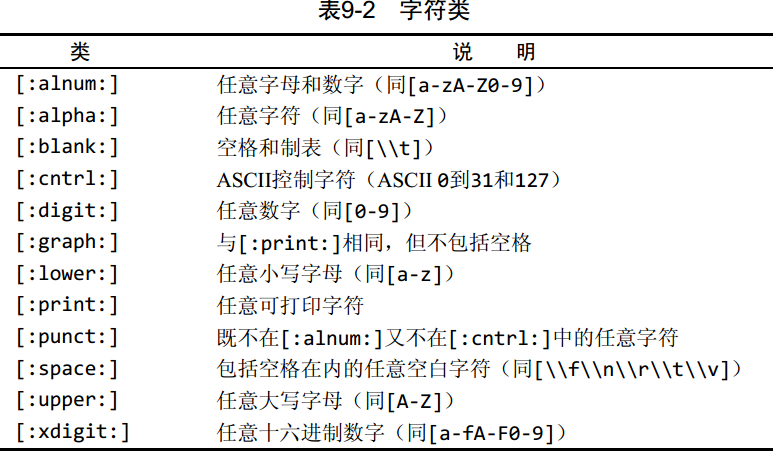

### 9.2.7 匹配多个实例
目前为止使用的所有正则表达式都试图匹配单次出现。如果存在一个匹配，该行被检索出来，如果不存在，检索不出任何行。但有时需要对匹配的数目进行更强的控制。例如，你可能需要寻找所有的数，不管数中包含多少数字，或者你可能想寻找一个单词并且还能够适应一个尾随的s(如果存在)，等等。这可以用表9-3列出的正则表达式重复元字符来完成。
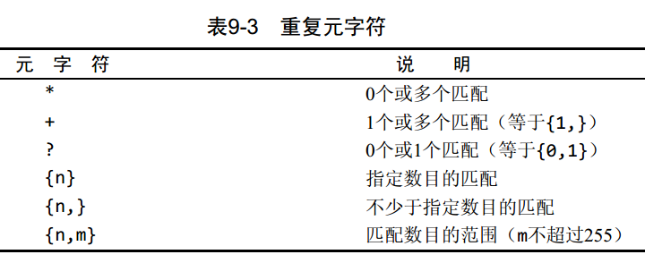

下面举几个例子。
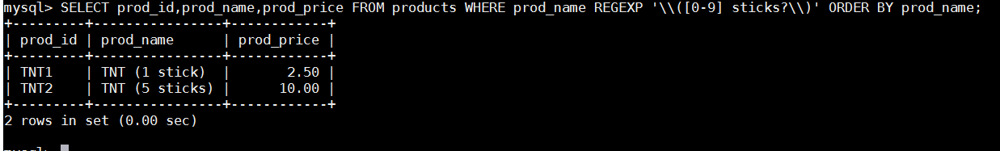

正则表达式\\\\([0-9] sticks?\\\\)需要解说一下。 \\\\(匹配)，[0-9]匹配任意数字(这个例子中为1和5)， sticks?匹配stick和sticks(s后的?使s可选，因为?匹配它前面的任何字符的0次或1次出现)， \\\\)匹配)。没有?，匹配stick和sticks会非常困难。
以下是另一个例子。这次我们打算匹配连在一起的4位数字：
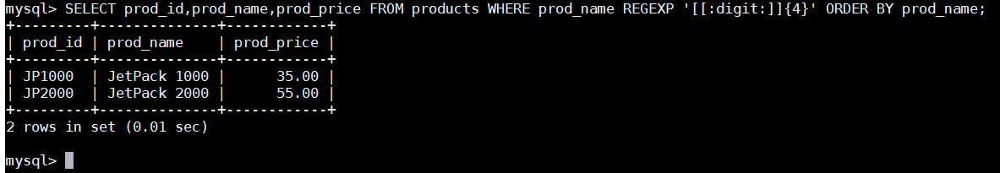

如前所述， [:digit:]匹配任意数字，因而它为数字的一个集合。 {4}确切地要求它前面的字符(任意数字)出现4次，所以[[:digit:]]{4}匹配连在一起的任意4位数字。需要注意的是，在使用正则表达式时，编写某个特殊的表达式几乎总是有不止一种方法。上面的例子也可以如下编写：
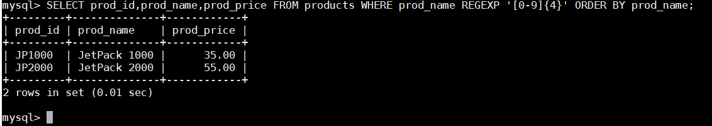

### 9.2.8 定位符
目前为止的所有例子都是匹配一个串中任意位置的文本。为了匹配输入7760特定位置的文本，需要使用表9-4列出的定位符。
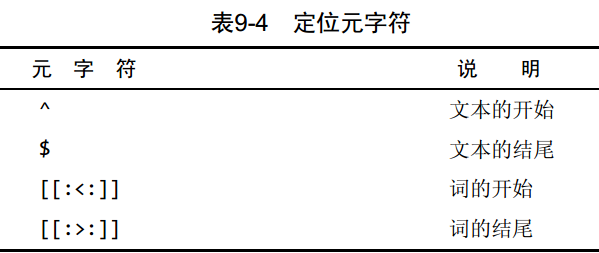

例如，如果你想找出以一个数(包括以小数点开始的数)开始的所有产品，怎么办？简单搜索\[0-9\\\\.](或[[:digit:]\\\\.])不行，因为它将在文本内任意位置查找匹配。解决办法是使用^定位符，如下所示：
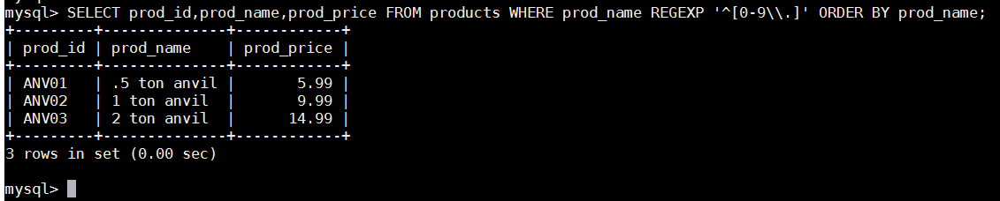

^匹配串的开始。因此， ^[0-9\\\\.]只在.或任意数字为串中第一个字符时才匹配它们。没有^， 则还要多检索出4个别的行(那些中间有数字的行)。

^的双重用途 ^有两种用法。在集合中(用[和]定义)，用它来否定该集合，否则，用来指串的开始处。

使REGEXP起类似LIKE的作用 本章前面说过， LIKE和REGEXP的不同在于， LIKE匹配整个串而REGEXP匹配子串。利用定位符，通过用^开始每个表达式，用$结束每个表达式，可以使REGEXP的作用与LIKE一样。

简单的正则表达式测试 可以在不使用数据库表的情况下用SELECT来测试正则表达式。REGEXP检查总是返回0(没有匹配)或1(匹配)。可以用带文字串的REGEXP来测试表达式，并试验它们。相应的语法如下：
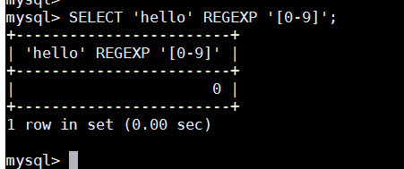

这个例子显然将返回0(因为文本hello中没有数字)。

## 9.3 小结
本章介绍了正则表达式的基础知识，学习了如何在MySQL的SELECT语句中通过REGEXP关键字使用它们。

