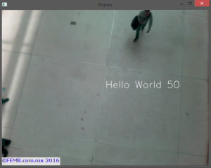
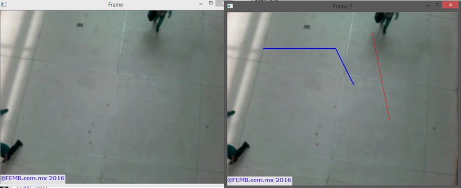

# OpenCV-3-在视频中绘制图像

## 在视频中插入helloworld

```python
import numpy as np
import cv2

cap = cv2.VideoCapture('peopleCounter.avi') #Open video file

w = cap.get(3) #get width
h = cap.get(4) #get height

mx = int(w/2)
my = int(h/2)

count = 0

while(cap.isOpened()):
    ret, frame = cap.read() #read a frame
    try:
        count = count + 1
        text = "Hello World " + str(count)
        cv2.putText(frame, text ,(mx,my),cv2.FONT_HERSHEY_SIMPLEX
                    ,1,(255,255,255),1,cv2.LINE_AA)
        cv2.imshow('Frame',frame)
    except:
        #if there are no more frames to show...
        print('EOF')
        break

    #Abort and exit with 'Q' or ESC
    k = cv2.waitKey(30) & 0xff
    if k == 27:
        break

cap.release() #release video file
cv2.destroyAllWindows() #close all openCV windows

```


首先，我们使用cap.get（）方法计算视频中的中间坐标（宽度/ 2，高度/ 2）。

然后，在我们调用imshow（）之前，我们使用cv2.putText（）这种方法在视频帧上写入文本。 用法是：cv.PutText（img，text，org，font，color），其中org是要编写的文本的原点（左下角）。

如果你运行代码，你会看到这个：


我们也可以在视频框架中绘制直线，圆圈等，OpenCV有很多绘制几何形状的方法。

让我们画一些线：
```python
import numpy as np
import cv2

cap = cv2.VideoCapture('peopleCounter.avi') #Open video file

while(cap.isOpened()):
    ret, frame = cap.read() #read a frame
    try:        
        cv2.imshow('Frame',frame)
        frame2 = frame
    except:
        #if there are no more frames to show...
        print('EOF')
        break

    line1 = np.array([[100,100],[300,100],[350,200]], np.int32).reshape((-1,1,2))
    line2 = np.array([[400,50],[450,300]], np.int32).reshape((-1,1,2))

    frame2 = cv2.polylines(frame2,[line1],False,(255,0,0),thickness=2)
    frame2 = cv2.polylines(frame2,[line2],False,(0,0,255),thickness=1)
    
    cv2.imshow('Frame 2',frame2)
    
    #Abort and exit with 'Q' or ESC
    k = cv2.waitKey(30) & 0xff
    if k == 27:
        break

cap.release() #release video file
cv2.destroyAllWindows() #close all openCV windows

```

这一次，我们在try块外工作，并使用两个视频窗口，一个用于显示原始视频，另一个用线条显示修改的视频。

为了使多段线正常工作，它需要为线段中的每个点（在我们的例子中为起点和终点）接收一个包含坐标对（x和y）的numpy数组。 如果你想像我一样指定点，你还需要调用reshape（-1,1,2）来使用多段线（）。

如果你运行这个代码，你会看到：


[这里](http://docs.opencv.org/2.4/modules/core/doc/drawing_functions.html)是OpenCV的绘图功能文档。

