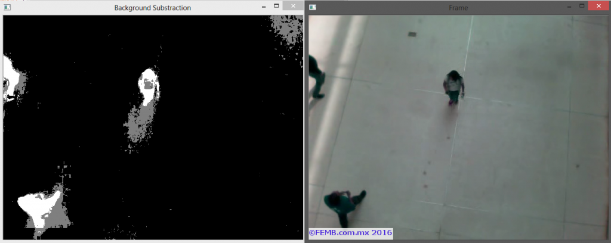

# OpenCV-4-视频背景消除

背景减法可以识别图像的前景和背景。 背景被认为是一系列图像中的任何东西，任何东西都是静态的。 前景是变化（移动）的一切。

在OpenCV中做背景减法只需要2行：

```python
import numpy as np
import cv2

cap = cv2.VideoCapture('peopleCounter.avi') #Open video file

fgbg = cv2.createBackgroundSubtractorMOG2(detectShadows = True) #Create the background substractor

while(cap.isOpened()):
    ret, frame = cap.read() #read a frame
    
    fgmask = fgbg.apply(frame) #Use the substractor
    
    try:        
        cv2.imshow('Frame',frame)
        cv2.imshow('Background Substraction',fgmask)
    except:
        #if there are no more frames to show...
        print('EOF')
        break
    
    #Abort and exit with 'Q' or ESC
    k = cv2.waitKey(30) & 0xff
    if k == 27:
        break

cap.release() #release video file
cv2.destroyAllWindows() #close all openCV windows


```

运行结果如下图


在新图像中，黑色代表背景，白色是前景中的物体，灰色是这些物体投射的阴影。

[MOG2减法器](http://docs.opencv.org/3.1.0/db/d5c/tutorial_py_bg_subtraction.html#gsc.tab=0)
在OpenCV中使用MOG2减法器的好处是背景不断被计算，这意味着照明的细微变化（例如由太阳引起的变化）不会影响您的计算结果。

