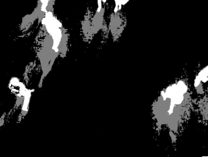

# OpenCV-5-形态改变

首先了解一下转换的内容及其用途（您只需要阅读关于侵蚀和扩张(Erosion and Dilation)，打开和关闭）。

本质上，我们将在二值化图像上使用侵蚀和扩张(Erosion and Dilation)（黑白）。 以非常普遍的方式，侵蚀(Erosion)将图像的黑色部分扩展成白色部分。 另一方面，扩张(Dilation)将图像的白色部分扩大成黑色部分。

要做这个操作，你还需要指定一个内核或结构元素（strel）。 这是一个在n * n大小的图像上进行卷积的矩阵，用于定义在计算每个像素的值时要使用的区域。

让我们试试这张图片：


```python
import cv2
import numpy as np

img = cv2.imread("noise.png")
ret,thresh1 = cv2.threshold(img,127,255,cv2.THRESH_BINARY)

kernel = np.ones((3,3),np.uint8)

erosion = cv2.erode(img,kernel,iterations = 1)

dilation = cv2.dilate(img,kernel,iterations = 1)

cv2.imwrite("erode.png",erosion)
cv2.imwrite("dilate.png",dilation)

```

我们使用阈值方法来二值化图像。 将其从颜色转换为黑白两种值（不同于灰度）。 

运行它并查看输出图像。 另外，尝试更改内核的大小（例如5,5或9,9），看看会发生什么。
您也可以将两个操作相结合，一个接一个地运行。

先做侵蚀，然后扩张被称为Openning。
先做扩张，然后侵蚀被称为Closing。

让我们试试这张图片：


```python
import cv2
import numpy as np

img = cv2.imread("noise.png")
ret,thresh1 = cv2.threshold(img,127,255,cv2.THRESH_BINARY)

kernel = np.ones((3,3),np.uint8)

erosion = cv2.erode(img,kernel,iterations = 1)

dilation = cv2.dilate(img,kernel,iterations = 1)

cv2.imwrite("erode.png",erosion)
cv2.imwrite("dilate.png",dilation)

```

看看输出结果，并试图了解关闭和打开过程中发生的事情。

现在，尝试将此代码合并到我们的代码中，在背景减除后，将阴影（灰色）取出并使视频流清晰（取出任何噪音），从中取出：



