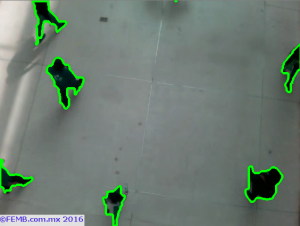

# OpenCV-6-计数

```python
import numpy as np
import cv2

# http://docs.opencv.org/master/d3/dc0/group__imgproc__shape.html#ga17ed9f5d79ae97bd4c7cf18403e1689a&gsc.tab=0
##http://docs.opencv.org/master/d4/d73/tutorial_py_contours_begin.html#gsc.tab=0

cap = cv2.VideoCapture('peopleCounter.avi') #Open video file
fgbg = cv2.createBackgroundSubtractorMOG2(detectShadows = True) #Create the background substractor
kernelOp = np.ones((3,3),np.uint8)
kernelCl = np.ones((11,11),np.uint8)

while(cap.isOpened()):
    ret, frame = cap.read() #read a frame

    fgmask = fgbg.apply(frame) #Use the substractor
    try:
        ret,imBin= cv2.threshold(fgmask,200,255,cv2.THRESH_BINARY)
        #Opening (erode->dilate) para quitar ruido.
        mask = cv2.morphologyEx(imBin, cv2.MORPH_OPEN, kernelOp)
        #Closing (dilate -> erode) para juntar regiones blancas.
        mask = cv2.morphologyEx(mask , cv2.MORPH_CLOSE, kernelCl)
    except:
        #if there are no more frames to show...
        print('EOF')
        break

    _, contours0, hierarchy = cv2.findContours(mask,cv2.RETR_EXTERNAL,cv2.CHAIN_APPROX_NONE)
    for cnt in contours0:
        cv2.drawContours(frame, cnt, -1, (0,255,0), 3, 8)

    cv2.imshow('Frame',frame)

    #Abort and exit with 'Q' or ESC
    k = cv2.waitKey(30) & 0xff
    if k == 27:
        break

cap.release() #release video file
cv2.destroyAllWindows() #close all openCV windows
```

我们赋予函数我们的掩码，cv2.RETR_EXTERNAL表示我们只关心外部轮廓（轮廓内的轮廓不会被检测到），而cv2.CHAIN_APPROX_NONE是用于“制作”轮廓的算法（您可以将其更改为另一个）。

绘制轮廓仅用于直观地欣赏所显示图像上的轮廓。


