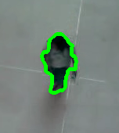

# OpenCV-7-确定一个人

我们如何将轮廓归类为一个人？
一个简单但有效的步骤可能是定义轮廓必须具有的最小区域：

为每个轮廓定义一个最小区域，查找轮廓，获取该区域，如果超过阈值，则执行一些操作。
阈值不是通用的，这意味着取决于您的视频流，您需要测试不同的值，直到它与视频一起工作。
例如，设置一个较低的阈值会让你感觉像这样：

虽然设置得太高会让你：


代码如下：
```python
import numpy as np
import cv2

cap = cv2.VideoCapture('peopleCounter.avi') #Open video file
fgbg = cv2.createBackgroundSubtractorMOG2(detectShadows = True) #Create the background substractor
kernelOp = np.ones((3,3),np.uint8)
kernelCl = np.ones((11,11),np.uint8)
areaTH = 500

while(cap.isOpened()):
    ret, frame = cap.read() #read a frame
    
    fgmask = fgbg.apply(frame) #Use the substractor
    try:
        ret,imBin= cv2.threshold(fgmask,200,255,cv2.THRESH_BINARY)
        #Opening (erode->dilate) para quitar ruido.
        mask = cv2.morphologyEx(imBin, cv2.MORPH_OPEN, kernelOp)
        #Closing (dilate -> erode) para juntar regiones blancas.
        mask =  cv2.morphologyEx(mask , cv2.MORPH_CLOSE, kernelCl)
    except:
        #if there are no more frames to show...
        print('EOF')
        break

    _, contours0, hierarchy = cv2.findContours(mask,cv2.RETR_EXTERNAL,cv2.CHAIN_APPROX_NONE)
    for cnt in contours0:
        cv2.drawContours(frame, cnt, -1, (0,255,0), 3, 8)
        area = cv2.contourArea(cnt)
        print(area)
        if area > areaTH:
            #################
            #   TRACKING    #
            #################            
            M = cv2.moments(cnt)
            cx = int(M['m10']/M['m00'])
            cy = int(M['m01']/M['m00'])
            x,y,w,h = cv2.boundingRect(cnt)
            cv2.circle(frame,(cx,cy), 5, (0,0,255), -1)            
            img = cv2.rectangle(frame,(x,y),(x+w,y+h),(0,255,0),2)
        
    cv2.imshow('Frame',frame)
    
    #Abort and exit with 'Q' or ESC
    k = cv2.waitKey(30) & 0xff
    if k == 27:
        break

cap.release() #release video file
cv2.destroyAllWindows() #close all openCV windows

```

