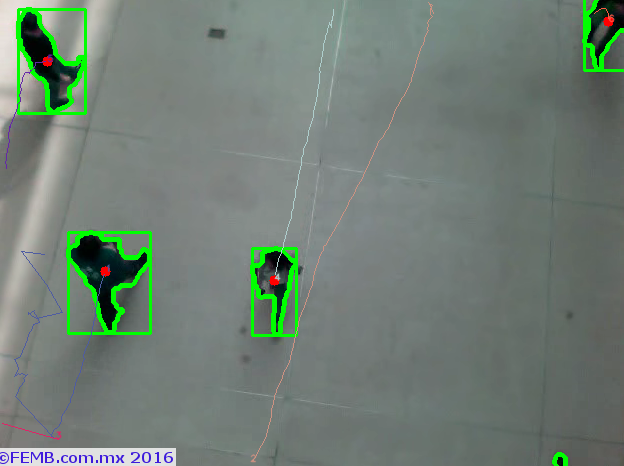

# OpenCV-8-跟踪移动

您现在已经知道图像中有人的时候，您想知道他们正朝哪个方向移动（上/下）。
在第一帧中，您检测到某人需要为该人提供一个ID并将其存储在图像中的初始位置。
然后，在以下帧中，要跟踪该人，需要将后面帧中的人物轮廓与首次出现时设置的ID相匹配，并保存该人的坐标。
然后，在该人穿过图像中的限制（或一定数量的限制）之后，您需要使用所有存储的位置评估他/她是否向上或向下移动。
为了处理所有这些ID和存储坐标，我创建了一个名为Person的类。 它可能没有被优化，但你可以在这里看看它。

```python
# Person.py
from random import randint
import time

class MyPerson:
    tracks = []
    def __init__(self, i, xi, yi, max_age):
        self.i = i
        self.x = xi
        self.y = yi
        self.tracks = []
        self.R = randint(0,255)
        self.G = randint(0,255)
        self.B = randint(0,255)
        self.done = False
        self.state = '0'
        self.age = 0
        self.max_age = max_age
        self.dir = None
    def getRGB(self):
        return (self.R,self.G,self.B)
    def getTracks(self):
        return self.tracks
    def getId(self):
        return self.i
    def getState(self):
        return self.state
    def getDir(self):
        return self.dir
    def getX(self):
        return self.x
    def getY(self):
        return self.y
    def updateCoords(self, xn, yn):
        self.age = 0
        self.tracks.append([self.x,self.y])
        self.x = xn
        self.y = yn
    def setDone(self):
        self.done = True
    def timedOut(self):
        return self.done
    def going_UP(self,mid_start,mid_end):
        if len(self.tracks) >= 2:
            if self.state == '0':
                if self.tracks[-1][1] < mid_end and self.tracks[-2][1] >= mid_end: #cruzo la linea
                    state = '1'
                    self.dir = 'up'
                    return True
            else:
                return False
        else:
            return False
    def going_DOWN(self,mid_start,mid_end):
        if len(self.tracks) >= 2:
            if self.state == '0':
                if self.tracks[-1][1] > mid_start and self.tracks[-2][1] <= mid_start: #cruzo la linea
                    state = '1'
                    self.dir = 'down'
                    return True
            else:
                return False
        else:
            return False
    def age_one(self):
        self.age += 1
        if self.age > self.max_age:
            self.done = True
        return True
class MultiPerson:
    def __init__(self, persons, xi, yi):
        self.persons = persons
        self.x = xi
        self.y = yi
        self.tracks = []
        self.R = randint(0,255)
        self.G = randint(0,255)
        self.B = randint(0,255)
        self.done = False
```


这里有一个你应该尝试的代码：
```python
import numpy as np
import cv2
import Person
import time

# http://docs.opencv.org/master/d3/dc0/group__imgproc__shape.html#ga17ed9f5d79ae97bd4c7cf18403e1689a&gsc.tab=0
##http://docs.opencv.org/master/d4/d73/tutorial_py_contours_begin.html#gsc.tab=0

cap = cv2.VideoCapture('peopleCounter.avi') #Open video file
fgbg = cv2.createBackgroundSubtractorMOG2(detectShadows = True) #Create the background substractor
kernelOp = np.ones((3,3),np.uint8)
kernelCl = np.ones((11,11),np.uint8)

#Variables
font = cv2.FONT_HERSHEY_SIMPLEX
persons = []
max_p_age = 5
pid = 1
areaTH = 500

while(cap.isOpened()):
    ret, frame = cap.read() #read a frame
    
    fgmask = fgbg.apply(frame) #Use the substractor
    try:
        ret,imBin= cv2.threshold(fgmask,200,255,cv2.THRESH_BINARY)
        #Opening (erode->dilate) para quitar ruido.
        mask = cv2.morphologyEx(imBin, cv2.MORPH_OPEN, kernelOp)
        #Closing (dilate -> erode) para juntar regiones blancas.
        mask =  cv2.morphologyEx(mask , cv2.MORPH_CLOSE, kernelCl)
    except:
        #if there are no more frames to show...
        print('EOF')
        break

    _, contours0, hierarchy = cv2.findContours(mask,cv2.RETR_EXTERNAL,cv2.CHAIN_APPROX_NONE)
    for cnt in contours0:
        cv2.drawContours(frame, cnt, -1, (0,255,0), 3, 8)
        area = cv2.contourArea(cnt)
        if area > areaTH:
            #################
            #   TRACKING    #
            #################            
            M = cv2.moments(cnt)
            cx = int(M['m10']/M['m00'])
            cy = int(M['m01']/M['m00'])
            x,y,w,h = cv2.boundingRect(cnt)
            
            new = True
            for i in persons:
                if abs(x-i.getX()) <= w and abs(y-i.getY()) <= h:
                    # el objeto esta cerca de uno que ya se detecto antes
                    new = False
                    i.updateCoords(cx,cy)   #actualiza coordenadas en el objeto and resets age
                    break
            if new == True:
                p = Person.MyPerson(pid,cx,cy, max_p_age)
                persons.append(p)
                pid += 1     
            #################
            #   DIBUJOS     #
            #################
            cv2.circle(frame,(cx,cy), 5, (0,0,255), -1)
            img = cv2.rectangle(frame,(x,y),(x+w,y+h),(0,255,0),2)            
            cv2.drawContours(frame, cnt, -1, (0,255,0), 3)

    #########################
    # DIBUJAR TRAYECTORIAS  #
    #########################
    for i in persons:
        if len(i.getTracks()) >= 2:
            pts = np.array(i.getTracks(), np.int32)
            pts = pts.reshape((-1,1,2))
            frame = cv2.polylines(frame,[pts],False,i.getRGB())
        if i.getId() == 9:
            print(str(i.getX()), ',', str(i.getY()))
        cv2.putText(frame, str(i.getId()),(i.getX(),i.getY()),font,0.3,i.getRGB(),1,cv2.LINE_AA)
     
    
    cv2.imshow('Frame',frame)
    
    #Abort and exit with 'Q' or ESC
    k = cv2.waitKey(30) & 0xff
    if k == 27:
        break

cap.release() #release video file
cv2.destroyAllWindows() #close all openCV windows
```

寻找一个检测到的轮廓的坐标，并尝试将它们与以前检测到的人物进行匹配。 如果没有人匹配，那么我们创建一个新的。


