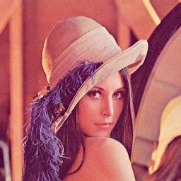
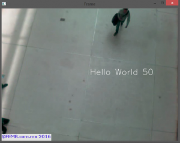
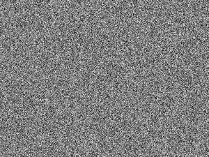

# OpenCV-1-图片处理

下载图片
```python
import cv2
import numpy as np

img = cv2.imread('Lenna.png') #load RGB image

imgGS = cv2.cvtColor(img, cv2.COLOR_BGR2GRAY) #convert RGB to grayscale
cv2.imwrite("LennaGS.png",imgGS) #save grayscale image

ret,imgBW = cv2.threshold(imgGS,127,255,cv2.THRESH_BINARY) #binarization
cv2.imwrite("LennaBW.png",imgBW) #save binary image

cv2.imshow('Original image', img) #Display original image
cv2.imshow('Grayscale image', imgGS) #Display grayscale image
cv2.imshow('Binary image', imgBW) #Display binarized image
cv2.waitKey(0) #exit with 'Q' or ESC
cv2.destroyAllWindows()

```


# OpenCV-2-读取视频流

视频[链接](https://www.dropbox.com/s/7mbo35zrxd1aefz/peopleCounter.avi?dl=0)


## 读取视频文件
```python
import numpy as np
import cv2

cap = cv2.VideoCapture('peopleCounter.avi') #Open video file

while(cap.isOpened()):
    ret, frame = cap.read() #read a frame
    try:
        cv2.imshow('Frame',frame)
    except:
        #if there are no more frames to show...
        print('EOF')
        break

    #Abort and exit with 'Q' or ESC
    k = cv2.waitKey(30) & 0xff
    if k == 27:
        break

cap.release() #release video file
cv2.destroyAllWindows() #close all openCV windows
```

然后我们用VideoCapture对象打开视频文件，将视频文件的位置作为参数。

我们从视频中读取相框并逐一展示，直到我们到达结尾。 此时，我们退出while循环并关闭视频文件和视频窗口。
使用网络摄像头非常相似.
唯一的区别是我们如何创建VideoCapture对象。 这次我们将它作为参数传递给它。 这表示我们要使用ID为0的网络摄像头。您的计算机上是否有多个网络摄像头，例如USB网络摄像头，另一个嵌入了您的屏幕上，您需要传递0或1，具体取决于您想要哪一个使用。

VideoCapture对象有几个[属性](http://docs.OpenCV识别一个人/classcv_1_1VideoCapture.html#aeb1644641842e6b104f244f049648f94)，您可以访问并且有时会更改.

## 从摄像头读取视频

```python
import numpy as np
import cv2

cap = cv2.VideoCapture(0)
    
while(cap.isOpened()):
    ret, frame = cap.read()
    try:
        cv2.imshow('Frame',frame)
    except:
        print('EOF')
        break

    k = cv2.waitKey(30) & 0xff
    if k == 27:
        break

cap.release()
cv2.destroyAllWindows()
```

下面是一个示例，显示所有属性的值并更改网络摄像头中视频流的宽度和高度.

```python
import numpy as np
import cv2

cap = cv2.VideoCapture(0)

#show all video properties
for i in range(19):
    print(i, cap.get(i))

cap.set(3,160) #set width
cap.set(4,120) #set height
    
while(cap.isOpened()):
    ret, frame = cap.read()
    try:
        cv2.imshow('Frame',frame)
    except:
        print('EOF')
        break

    k = cv2.waitKey(30) & 0xff
    if k == 27:
        break

cap.release()
cv2.destroyAllWindows()


```


# OpenCV-3-在视频中绘制图像

## 在视频中插入helloworld

```python
import numpy as np
import cv2

cap = cv2.VideoCapture('peopleCounter.avi') #Open video file

w = cap.get(3) #get width
h = cap.get(4) #get height

mx = int(w/2)
my = int(h/2)

count = 0

while(cap.isOpened()):
    ret, frame = cap.read() #read a frame
    try:
        count = count + 1
        text = "Hello World " + str(count)
        cv2.putText(frame, text ,(mx,my),cv2.FONT_HERSHEY_SIMPLEX
                    ,1,(255,255,255),1,cv2.LINE_AA)
        cv2.imshow('Frame',frame)
    except:
        #if there are no more frames to show...
        print('EOF')
        break

    #Abort and exit with 'Q' or ESC
    k = cv2.waitKey(30) & 0xff
    if k == 27:
        break

cap.release() #release video file
cv2.destroyAllWindows() #close all openCV windows

```


首先，我们使用cap.get（）方法计算视频中的中间坐标（宽度/ 2，高度/ 2）。

然后，在我们调用imshow（）之前，我们使用cv2.putText（）这种方法在视频帧上写入文本。 用法是：cv.PutText（img，text，org，font，color），其中org是要编写的文本的原点（左下角）。

如果你运行代码，你会看到这个：


我们也可以在视频框架中绘制直线，圆圈等，OpenCV有很多绘制几何形状的方法。

让我们画一些线：
```python
import numpy as np
import cv2

cap = cv2.VideoCapture('peopleCounter.avi') #Open video file

while(cap.isOpened()):
    ret, frame = cap.read() #read a frame
    try:        
        cv2.imshow('Frame',frame)
        frame2 = frame
    except:
        #if there are no more frames to show...
        print('EOF')
        break

    line1 = np.array([[100,100],[300,100],[350,200]], np.int32).reshape((-1,1,2))
    line2 = np.array([[400,50],[450,300]], np.int32).reshape((-1,1,2))

    frame2 = cv2.polylines(frame2,[line1],False,(255,0,0),thickness=2)
    frame2 = cv2.polylines(frame2,[line2],False,(0,0,255),thickness=1)
    
    cv2.imshow('Frame 2',frame2)
    
    #Abort and exit with 'Q' or ESC
    k = cv2.waitKey(30) & 0xff
    if k == 27:
        break

cap.release() #release video file
cv2.destroyAllWindows() #close all openCV windows

```

这一次，我们在try块外工作，并使用两个视频窗口，一个用于显示原始视频，另一个用线条显示修改的视频。

为了使多段线正常工作，它需要为线段中的每个点（在我们的例子中为起点和终点）接收一个包含坐标对（x和y）的numpy数组。 如果你想像我一样指定点，你还需要调用reshape（-1,1,2）来使用多段线（）。

如果你运行这个代码，你会看到：


[这里](http://docs.OpenCV识别一个人/drawing_functions.html)是OpenCV的绘图功能文档。


# OpenCV-4-视频背景消除

背景减法可以识别图像的前景和背景。 背景被认为是一系列图像中的任何东西，任何东西都是静态的。 前景是变化（移动）的一切。

在OpenCV中做背景减法只需要2行：

```python
import numpy as np
import cv2

cap = cv2.VideoCapture('peopleCounter.avi') #Open video file

fgbg = cv2.createBackgroundSubtractorMOG2(detectShadows = True) #Create the background substractor

while(cap.isOpened()):
    ret, frame = cap.read() #read a frame
    
    fgmask = fgbg.apply(frame) #Use the substractor
    
    try:        
        cv2.imshow('Frame',frame)
        cv2.imshow('Background Substraction',fgmask)
    except:
        #if there are no more frames to show...
        print('EOF')
        break
    
    #Abort and exit with 'Q' or ESC
    k = cv2.waitKey(30) & 0xff
    if k == 27:
        break

cap.release() #release video file
cv2.destroyAllWindows() #close all openCV windows


```

运行结果如下图


在新图像中，黑色代表背景，白色是前景中的物体，灰色是这些物体投射的阴影。

[MOG2减法器](http://docs.OpenCV识别一个人/tutorial_py_bg_subtraction.html#gsc.tab=0)
在OpenCV中使用MOG2减法器的好处是背景不断被计算，这意味着照明的细微变化（例如由太阳引起的变化）不会影响您的计算结果。


# OpenCV-5-形态改变

首先了解一下转换的内容及其用途（您只需要阅读关于侵蚀和扩张(Erosion and Dilation)，打开和关闭）。

本质上，我们将在二值化图像上使用侵蚀和扩张(Erosion and Dilation)（黑白）。 以非常普遍的方式，侵蚀(Erosion)将图像的黑色部分扩展成白色部分。 另一方面，扩张(Dilation)将图像的白色部分扩大成黑色部分。

要做这个操作，你还需要指定一个内核或结构元素（strel）。 这是一个在n * n大小的图像上进行卷积的矩阵，用于定义在计算每个像素的值时要使用的区域。

让我们试试这张图片：


```python
import cv2
import numpy as np

img = cv2.imread("noise.png")
ret,thresh1 = cv2.threshold(img,127,255,cv2.THRESH_BINARY)

kernel = np.ones((3,3),np.uint8)

erosion = cv2.erode(img,kernel,iterations = 1)

dilation = cv2.dilate(img,kernel,iterations = 1)

cv2.imwrite("erode.png",erosion)
cv2.imwrite("dilate.png",dilation)

```

我们使用阈值方法来二值化图像。 将其从颜色转换为黑白两种值（不同于灰度）。 

运行它并查看输出图像。 另外，尝试更改内核的大小（例如5,5或9,9），看看会发生什么。
您也可以将两个操作相结合，一个接一个地运行。

先做侵蚀，然后扩张被称为Openning。
先做扩张，然后侵蚀被称为Closing。

让我们试试这张图片：


```python
import cv2
import numpy as np

img = cv2.imread("noise.png")
ret,thresh1 = cv2.threshold(img,127,255,cv2.THRESH_BINARY)

kernel = np.ones((3,3),np.uint8)

erosion = cv2.erode(img,kernel,iterations = 1)

dilation = cv2.dilate(img,kernel,iterations = 1)

cv2.imwrite("erode.png",erosion)
cv2.imwrite("dilate.png",dilation)

```

看看输出结果，并试图了解关闭和打开过程中发生的事情。

现在，尝试将此代码合并到我们的代码中，在背景减除后，将阴影（灰色）取出并使视频流清晰（取出任何噪音），从中取出：


# OpenCV-6-计数

```python
import numpy as np
import cv2

# http://docs.OpenCV识别一个人/group__imgproc__shape.html#ga17ed9f5d79ae97bd4c7cf18403e1689a&gsc.tab=0
##http://docs.OpenCV识别一个人/tutorial_py_contours_begin.html#gsc.tab=0

cap = cv2.VideoCapture('peopleCounter.avi') #Open video file
fgbg = cv2.createBackgroundSubtractorMOG2(detectShadows = True) #Create the background substractor
kernelOp = np.ones((3,3),np.uint8)
kernelCl = np.ones((11,11),np.uint8)

while(cap.isOpened()):
    ret, frame = cap.read() #read a frame

    fgmask = fgbg.apply(frame) #Use the substractor
    try:
        ret,imBin= cv2.threshold(fgmask,200,255,cv2.THRESH_BINARY)
        #Opening (erode->dilate) para quitar ruido.
        mask = cv2.morphologyEx(imBin, cv2.MORPH_OPEN, kernelOp)
        #Closing (dilate -> erode) para juntar regiones blancas.
        mask = cv2.morphologyEx(mask , cv2.MORPH_CLOSE, kernelCl)
    except:
        #if there are no more frames to show...
        print('EOF')
        break

    _, contours0, hierarchy = cv2.findContours(mask,cv2.RETR_EXTERNAL,cv2.CHAIN_APPROX_NONE)
    for cnt in contours0:
        cv2.drawContours(frame, cnt, -1, (0,255,0), 3, 8)

    cv2.imshow('Frame',frame)

    #Abort and exit with 'Q' or ESC
    k = cv2.waitKey(30) & 0xff
    if k == 27:
        break

cap.release() #release video file
cv2.destroyAllWindows() #close all openCV windows
```

我们赋予函数我们的掩码，cv2.RETR_EXTERNAL表示我们只关心外部轮廓（轮廓内的轮廓不会被检测到），而cv2.CHAIN_APPROX_NONE是用于“制作”轮廓的算法（您可以将其更改为另一个）。

绘制轮廓仅用于直观地欣赏所显示图像上的轮廓。


# OpenCV-7-确定一个人

我们如何将轮廓归类为一个人？
一个简单但有效的步骤可能是定义轮廓必须具有的最小区域：

为每个轮廓定义一个最小区域，查找轮廓，获取该区域，如果超过阈值，则执行一些操作。
阈值不是通用的，这意味着取决于您的视频流，您需要测试不同的值，直到它与视频一起工作。
例如，设置一个较低的阈值会让你感觉像这样：

虽然设置得太高会让你：


代码如下：
```python
import numpy as np
import cv2

cap = cv2.VideoCapture('peopleCounter.avi') #Open video file
fgbg = cv2.createBackgroundSubtractorMOG2(detectShadows = True) #Create the background substractor
kernelOp = np.ones((3,3),np.uint8)
kernelCl = np.ones((11,11),np.uint8)
areaTH = 500

while(cap.isOpened()):
    ret, frame = cap.read() #read a frame
    
    fgmask = fgbg.apply(frame) #Use the substractor
    try:
        ret,imBin= cv2.threshold(fgmask,200,255,cv2.THRESH_BINARY)
        #Opening (erode->dilate) para quitar ruido.
        mask = cv2.morphologyEx(imBin, cv2.MORPH_OPEN, kernelOp)
        #Closing (dilate -> erode) para juntar regiones blancas.
        mask =  cv2.morphologyEx(mask , cv2.MORPH_CLOSE, kernelCl)
    except:
        #if there are no more frames to show...
        print('EOF')
        break

    _, contours0, hierarchy = cv2.findContours(mask,cv2.RETR_EXTERNAL,cv2.CHAIN_APPROX_NONE)
    for cnt in contours0:
        cv2.drawContours(frame, cnt, -1, (0,255,0), 3, 8)
        area = cv2.contourArea(cnt)
        print(area)
        if area > areaTH:
            #################
            #   TRACKING    #
            #################            
            M = cv2.moments(cnt)
            cx = int(M['m10']/M['m00'])
            cy = int(M['m01']/M['m00'])
            x,y,w,h = cv2.boundingRect(cnt)
            cv2.circle(frame,(cx,cy), 5, (0,0,255), -1)            
            img = cv2.rectangle(frame,(x,y),(x+w,y+h),(0,255,0),2)
        
    cv2.imshow('Frame',frame)
    
    #Abort and exit with 'Q' or ESC
    k = cv2.waitKey(30) & 0xff
    if k == 27:
        break

cap.release() #release video file
cv2.destroyAllWindows() #close all openCV windows

```


# OpenCV-8-跟踪移动

您现在已经知道图像中有人的时候，您想知道他们正朝哪个方向移动（上/下）。
在第一帧中，您检测到某人需要为该人提供一个ID并将其存储在图像中的初始位置。
然后，在以下帧中，要跟踪该人，需要将后面帧中的人物轮廓与首次出现时设置的ID相匹配，并保存该人的坐标。
然后，在该人穿过图像中的限制（或一定数量的限制）之后，您需要使用所有存储的位置评估他/她是否向上或向下移动。
为了处理所有这些ID和存储坐标，我创建了一个名为Person的类。 它可能没有被优化，但你可以在这里看看它。

```python
# Person.py
from random import randint
import time

class MyPerson:
    tracks = []
    def __init__(self, i, xi, yi, max_age):
        self.i = i
        self.x = xi
        self.y = yi
        self.tracks = []
        self.R = randint(0,255)
        self.G = randint(0,255)
        self.B = randint(0,255)
        self.done = False
        self.state = '0'
        self.age = 0
        self.max_age = max_age
        self.dir = None
    def getRGB(self):
        return (self.R,self.G,self.B)
    def getTracks(self):
        return self.tracks
    def getId(self):
        return self.i
    def getState(self):
        return self.state
    def getDir(self):
        return self.dir
    def getX(self):
        return self.x
    def getY(self):
        return self.y
    def updateCoords(self, xn, yn):
        self.age = 0
        self.tracks.append([self.x,self.y])
        self.x = xn
        self.y = yn
    def setDone(self):
        self.done = True
    def timedOut(self):
        return self.done
    def going_UP(self,mid_start,mid_end):
        if len(self.tracks) >= 2:
            if self.state == '0':
                if self.tracks[-1][1] < mid_end and self.tracks[-2][1] >= mid_end: #cruzo la linea
                    state = '1'
                    self.dir = 'up'
                    return True
            else:
                return False
        else:
            return False
    def going_DOWN(self,mid_start,mid_end):
        if len(self.tracks) >= 2:
            if self.state == '0':
                if self.tracks[-1][1] > mid_start and self.tracks[-2][1] <= mid_start: #cruzo la linea
                    state = '1'
                    self.dir = 'down'
                    return True
            else:
                return False
        else:
            return False
    def age_one(self):
        self.age += 1
        if self.age > self.max_age:
            self.done = True
        return True
class MultiPerson:
    def __init__(self, persons, xi, yi):
        self.persons = persons
        self.x = xi
        self.y = yi
        self.tracks = []
        self.R = randint(0,255)
        self.G = randint(0,255)
        self.B = randint(0,255)
        self.done = False
```


这里有一个你应该尝试的代码：
```python
import numpy as np
import cv2
import Person
import time

# http://docs.OpenCV识别一个人/group__imgproc__shape.html#ga17ed9f5d79ae97bd4c7cf18403e1689a&gsc.tab=0
##http://docs.OpenCV识别一个人/tutorial_py_contours_begin.html#gsc.tab=0

cap = cv2.VideoCapture('peopleCounter.avi') #Open video file
fgbg = cv2.createBackgroundSubtractorMOG2(detectShadows = True) #Create the background substractor
kernelOp = np.ones((3,3),np.uint8)
kernelCl = np.ones((11,11),np.uint8)

#Variables
font = cv2.FONT_HERSHEY_SIMPLEX
persons = []
max_p_age = 5
pid = 1
areaTH = 500

while(cap.isOpened()):
    ret, frame = cap.read() #read a frame
    
    fgmask = fgbg.apply(frame) #Use the substractor
    try:
        ret,imBin= cv2.threshold(fgmask,200,255,cv2.THRESH_BINARY)
        #Opening (erode->dilate) para quitar ruido.
        mask = cv2.morphologyEx(imBin, cv2.MORPH_OPEN, kernelOp)
        #Closing (dilate -> erode) para juntar regiones blancas.
        mask =  cv2.morphologyEx(mask , cv2.MORPH_CLOSE, kernelCl)
    except:
        #if there are no more frames to show...
        print('EOF')
        break

    _, contours0, hierarchy = cv2.findContours(mask,cv2.RETR_EXTERNAL,cv2.CHAIN_APPROX_NONE)
    for cnt in contours0:
        cv2.drawContours(frame, cnt, -1, (0,255,0), 3, 8)
        area = cv2.contourArea(cnt)
        if area > areaTH:
            #################
            #   TRACKING    #
            #################            
            M = cv2.moments(cnt)
            cx = int(M['m10']/M['m00'])
            cy = int(M['m01']/M['m00'])
            x,y,w,h = cv2.boundingRect(cnt)
            
            new = True
            for i in persons:
                if abs(x-i.getX()) <= w and abs(y-i.getY()) <= h:
                    # el objeto esta cerca de uno que ya se detecto antes
                    new = False
                    i.updateCoords(cx,cy)   #actualiza coordenadas en el objeto and resets age
                    break
            if new == True:
                p = Person.MyPerson(pid,cx,cy, max_p_age)
                persons.append(p)
                pid += 1     
            #################
            #   DIBUJOS     #
            #################
            cv2.circle(frame,(cx,cy), 5, (0,0,255), -1)
            img = cv2.rectangle(frame,(x,y),(x+w,y+h),(0,255,0),2)            
            cv2.drawContours(frame, cnt, -1, (0,255,0), 3)

    #########################
    # DIBUJAR TRAYECTORIAS  #
    #########################
    for i in persons:
        if len(i.getTracks()) >= 2:
            pts = np.array(i.getTracks(), np.int32)
            pts = pts.reshape((-1,1,2))
            frame = cv2.polylines(frame,[pts],False,i.getRGB())
        if i.getId() == 9:
            print(str(i.getX()), ',', str(i.getY()))
        cv2.putText(frame, str(i.getId()),(i.getX(),i.getY()),font,0.3,i.getRGB(),1,cv2.LINE_AA)
     
    
    cv2.imshow('Frame',frame)
    
    #Abort and exit with 'Q' or ESC
    k = cv2.waitKey(30) & 0xff
    if k == 27:
        break

cap.release() #release video file
cv2.destroyAllWindows() #close all openCV windows
```

寻找一个检测到的轮廓的坐标，并尝试将它们与以前检测到的人物进行匹配。 如果没有人匹配，那么我们创建一个新的。


# OpenCV-9-人数

上次我向你展示了如何跟踪一个对象的移动，虽然实际上它只是保存了该对象之前坐标的列表。 现在，我们必须查看该列表并确定对象在图像中上下移动。
为此，我将首先创建两条假想线，指示何时评估对象的方向（line_up，line_down）。
我还设置了两条限制线来告诉我的代码何时停止跟踪一个对象（up_limit，down_limit）。

我还在Person类中使用了两个方法：going_UP（a，b）和going_DOWN（a，b）。 都会收到line_down和line_up，并返回true，它们会评估对象是否已沿正确方向越过line_up或line_down。 如果是这样，那么计数器会递增......而我们正在计数人数。

此外，Person类还具有一个State属性，用于了解对象何时位于映像的计数限制之外并释放分配的内存。

这是代码：
```python
##Contador de personas
##Federico Mejia
import numpy as np
import cv2
import Person
import time

#Contadores de entrada y salida
cnt_up   = 0
cnt_down = 0

#Fuente de video
#cap = cv2.VideoCapture(0)
cap = cv2.VideoCapture('peopleCounter.avi')

#Propiedades del video
##cap.set(3,160) #Width
##cap.set(4,120) #Height

#Imprime las propiedades de captura a consola
for i in range(19):
    print(i, cap.get(i))

w = cap.get(3)
h = cap.get(4)
frameArea = h*w
areaTH = frameArea/250
print('Area Threshold', areaTH)

#Lineas de entrada/salida
line_up = int(2*(h/5))
line_down   = int(3*(h/5))

up_limit =   int(1*(h/5))
down_limit = int(4*(h/5))

print("Red line y:",str(line_down))
print("Blue line y:", str(line_up))
line_down_color = (255,0,0)
line_up_color = (0,0,255)
pt1 =  [0, line_down];
pt2 =  [w, line_down];
pts_L1 = np.array([pt1,pt2], np.int32)
pts_L1 = pts_L1.reshape((-1,1,2))
pt3 =  [0, line_up];
pt4 =  [w, line_up];
pts_L2 = np.array([pt3,pt4], np.int32)
pts_L2 = pts_L2.reshape((-1,1,2))

pt5 =  [0, up_limit];
pt6 =  [w, up_limit];
pts_L3 = np.array([pt5,pt6], np.int32)
pts_L3 = pts_L3.reshape((-1,1,2))
pt7 =  [0, down_limit];
pt8 =  [w, down_limit];
pts_L4 = np.array([pt7,pt8], np.int32)
pts_L4 = pts_L4.reshape((-1,1,2))

#Substractor de fondo
fgbg = cv2.createBackgroundSubtractorMOG2(detectShadows = True)

#Elementos estructurantes para filtros morfoogicos
kernelOp = np.ones((3,3),np.uint8)
kernelOp2 = np.ones((5,5),np.uint8)
kernelCl = np.ones((11,11),np.uint8)

#Variables
font = cv2.FONT_HERSHEY_SIMPLEX
persons = []
max_p_age = 5
pid = 1

while(cap.isOpened()):
##for image in camera.capture_continuous(rawCapture, format="bgr", use_video_port=True):
    #Lee una imagen de la fuente de video
    ret, frame = cap.read()
##    frame = image.array

    for i in persons:
        i.age_one() #age every person one frame
    #########################
    #   PRE-PROCESAMIENTO   #
    #########################
    
    #Aplica substraccion de fondo
    fgmask = fgbg.apply(frame)
    fgmask2 = fgbg.apply(frame)

    #Binariazcion para eliminar sombras (color gris)
    try:
        ret,imBin= cv2.threshold(fgmask,200,255,cv2.THRESH_BINARY)
        ret,imBin2 = cv2.threshold(fgmask2,200,255,cv2.THRESH_BINARY)
        #Opening (erode->dilate) para quitar ruido.
        mask = cv2.morphologyEx(imBin, cv2.MORPH_OPEN, kernelOp)
        mask2 = cv2.morphologyEx(imBin2, cv2.MORPH_OPEN, kernelOp)
        #Closing (dilate -> erode) para juntar regiones blancas.
        mask =  cv2.morphologyEx(mask , cv2.MORPH_CLOSE, kernelCl)
        mask2 = cv2.morphologyEx(mask2, cv2.MORPH_CLOSE, kernelCl)
    except:
        print('EOF')
        print('UP:',cnt_up)
        print('DOWN:',cnt_down)
        break
    #################
    #   CONTORNOS   #
    #################
    
    # RETR_EXTERNAL returns only extreme outer flags. All child contours are left behind.
    _, contours0, hierarchy = cv2.findContours(mask2,cv2.RETR_EXTERNAL,cv2.CHAIN_APPROX_SIMPLE)
    for cnt in contours0:
        area = cv2.contourArea(cnt)
        if area > areaTH:
            #################
            #   TRACKING    #
            #################
            
            #Falta agregar condiciones para multipersonas, salidas y entradas de pantalla.
            
            M = cv2.moments(cnt)
            cx = int(M['m10']/M['m00'])
            cy = int(M['m01']/M['m00'])
            x,y,w,h = cv2.boundingRect(cnt)

            new = True
            if cy in range(up_limit,down_limit):
                for i in persons:
                    if abs(cx-i.getX()) <= w and abs(cy-i.getY()) <= h:
                        # el objeto esta cerca de uno que ya se detecto antes
                        new = False
                        i.updateCoords(cx,cy)   #actualiza coordenadas en el objeto and resets age
                        if i.going_UP(line_down,line_up) == True:
                            cnt_up += 1;
                            print("ID:",i.getId(),'crossed going up at',time.strftime("%c"))
                        elif i.going_DOWN(line_down,line_up) == True:
                            cnt_down += 1;
                            print("ID:",i.getId(),'crossed going down at',time.strftime("%c"))
                        break
                    if i.getState() == '1':
                        if i.getDir() == 'down' and i.getY() > down_limit:
                            i.setDone()
                        elif i.getDir() == 'up' and i.getY() < up_limit:
                            i.setDone()
                    if i.timedOut():
                        #sacar i de la lista persons
                        index = persons.index(i)
                        persons.pop(index)
                        del i     #liberar la memoria de i
                if new == True:
                    p = Person.MyPerson(pid,cx,cy, max_p_age)
                    persons.append(p)
                    pid += 1     
            #################
            #   DIBUJOS     #
            #################
            cv2.circle(frame,(cx,cy), 5, (0,0,255), -1)
            img = cv2.rectangle(frame,(x,y),(x+w,y+h),(0,255,0),2)            
            #cv2.drawContours(frame, cnt, -1, (0,255,0), 3)
            
    #END for cnt in contours0
            
    #########################
    # DIBUJAR TRAYECTORIAS  #
    #########################
    for i in persons:
##        if len(i.getTracks()) >= 2:
##            pts = np.array(i.getTracks(), np.int32)
##            pts = pts.reshape((-1,1,2))
##            frame = cv2.polylines(frame,[pts],False,i.getRGB())
##        if i.getId() == 9:
##            print str(i.getX()), ',', str(i.getY())
        cv2.putText(frame, str(i.getId()),(i.getX(),i.getY()),font,0.3,i.getRGB(),1,cv2.LINE_AA)
        
    #################
    #   IMAGANES    #
    #################
    str_up = 'UP: '+ str(cnt_up)
    str_down = 'DOWN: '+ str(cnt_down)
    frame = cv2.polylines(frame,[pts_L1],False,line_down_color,thickness=2)
    frame = cv2.polylines(frame,[pts_L2],False,line_up_color,thickness=2)
    frame = cv2.polylines(frame,[pts_L3],False,(255,255,255),thickness=1)
    frame = cv2.polylines(frame,[pts_L4],False,(255,255,255),thickness=1)
    cv2.putText(frame, str_up ,(10,40),font,0.5,(255,255,255),2,cv2.LINE_AA)
    cv2.putText(frame, str_up ,(10,40),font,0.5,(0,0,255),1,cv2.LINE_AA)
    cv2.putText(frame, str_down ,(10,90),font,0.5,(255,255,255),2,cv2.LINE_AA)
    cv2.putText(frame, str_down ,(10,90),font,0.5,(255,0,0),1,cv2.LINE_AA)

    cv2.imshow('Frame',frame)
    #cv2.imshow('Mask',mask)    
    
    #preisonar ESC para salir
    k = cv2.waitKey(30) & 0xff
    if k == 27:
        break
#END while(cap.isOpened())
    
#################
#   LIMPIEZA    #
#################
cap.release()
cv2.destroyAllWindows()

```
