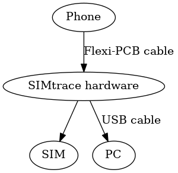
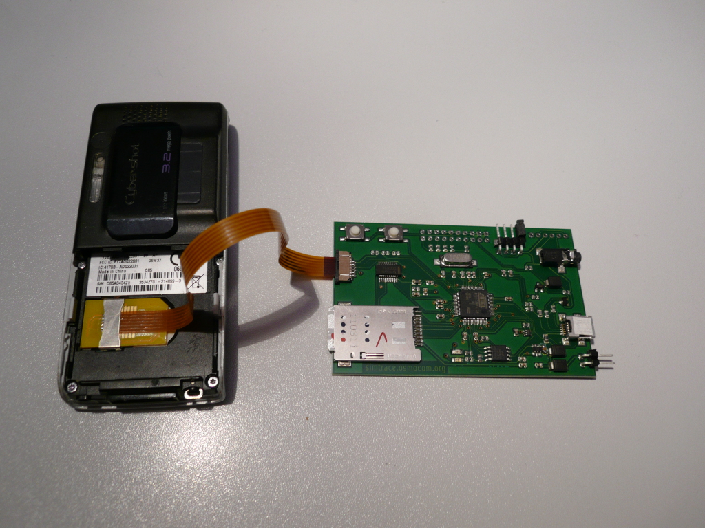
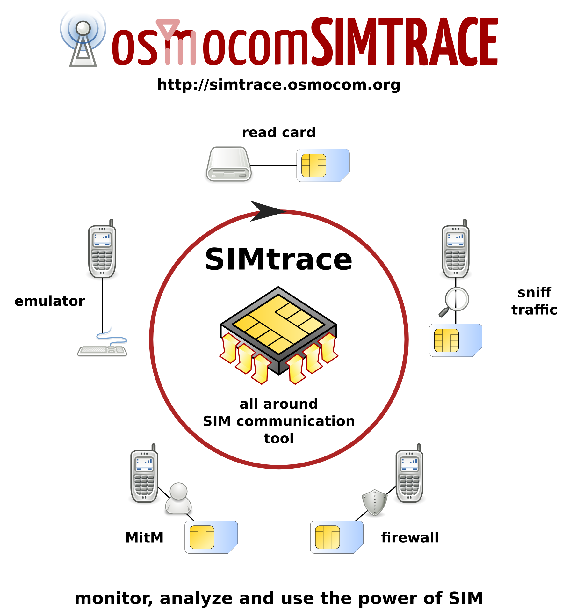
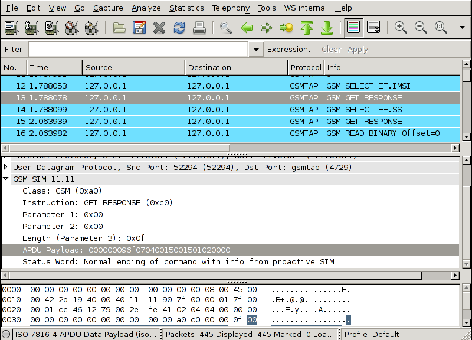
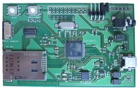
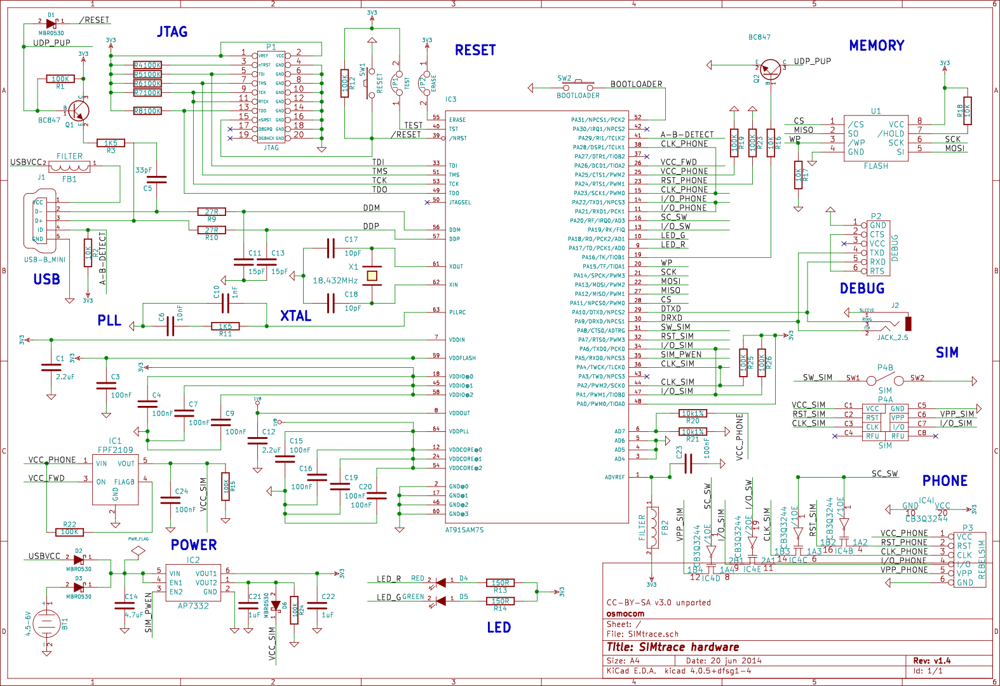

# 简介
Osmocom SIMtrace是用于被动跟踪SIM卡和手机之间SIM-ME通信的软件和硬件系统。




它通过使用支持USB的AT91SAM7微控制器的T = 0兼容USART工作。

USART在SIM卡和手机之间的ISO 7816-3 / TS 11.11接口上交换时被动接收字节。 接收到的字节通过USB发送到PC，PC上的程序称为simtrace从USB设备收集数据，解析APDU并通过GSMTAP将它们转发到wireshark协议分析器。

# 特征
- 完全无源扫描仪
- RST和ATR检测
- 支持PPS / PTS自动波特率
- APDU的分割
SIMtrace可以用于监视ME-SIM通信，但也可以模拟手机或SIM卡，也可以是MitM。
虽然硬件支持所有这些模式，但只有监控方面已经在软件中实现。

# TODO
SIMtrace是一个社区项目，帮助不仅仅是欢迎。

有些任务需要不需要电子或SIM卡协议方面的知识，只需要非常基本的C编程技能：
- 使用libusb热插拔API来保持程序跨SIMrtace断开连接
一些任务不需要微控制器编程技巧：
- 扩展/完成SIM协议的wireshark解剖器。
以下是其他一些可以改进的方面：
- 检查奇偶校验错误
- 验证TCK / PCK校验字节
- 实施MITM

# 硬件
第一种实现方式使用Olimex SAM7-P64开发板，其中一些I / O线连接到来自[RebelSIM_Scanner](https://osmocom.org/projects/simtrace/wiki/RebelSIM_Scanner)的机械SIM卡适配器。 如果使用[RebelSIM](https://osmocom.org/projects/simtrace/wiki/RebelSIM)扫描仪，即使只使用线路，也要连接USB。 它需要供电，否则真正的读者往往无法初始化卡。

现在我们有专门的PCB设计。 原理图和Gerber文件是作为开源硬件发布的，并且可以由所有人制作。

但是，那些对从零开始构建它不感兴趣的人可以从http://shop.sysmocom.de/products/simtrace 购买完整的工厂生产，测试和闪存PCB组件

它也可以通过一个独立的适配器与全尺寸SIM卡连接. [链接](http://shop.sysmocom.de/products/fullsize-sim-fpc)

[SIMtrace_Hardware](https://osmocom.org/projects/simtrace/wiki/SIMtrace_Hardware)提供更多详细信息

# 固件
AT91SAM7S器件的固件是通过重复使用[OpenPCD](http://www.openpcd.org/)的许多代码编写的RFID阅读器。 详细信息可在[SIMtrace固件](https://osmocom.org/projects/simtrace/wiki/SIMtrace_Firmware)上找到。

# 文档
请检查用户手册的附件。 在那里，你会发现一些提示安装现成的软件包
你最喜欢的Linux发行版。

# 主机PC软件
simtrace程序是git：//git.osmocom.org/simtrace.git存储库的一部分。 它将绑定到USB设备并使用UDP / IPv4发送GSMTAP帧到localhost：4729。

前提条件
[libosmocore](https://osmocom.org/projects/libosmocore/wiki)和头文件（simtrace_usb.h）。

其他软件包：
```
sudo apt-get install libusb-1.0-0-dev
```

编译：
```
git clone git://git.osmocom.org/simtrace.git
cd simtrace/host/
make
```

访问它
添加udev规则，以便能够使用simtrace并以非root用户身份访问设备（只需要在osmocom组中）
```
sudo groupadd osmocom
sudo adduser $USERNAME osmocom
sudo tee /etc/udev/rules.d/10-osmocom.rules << EOF
# to use, install this file in /etc/udev/rules.d as 10-osmocom.rules
# rule to grant read/write access on SIMtrace to group named osmocom.
SUBSYSTEM=="usb", ATTR{idProduct}=="0762", ATTRS{idVendor}=="16c0", MODE="0660", GROUP="osmocom" 
EOF
sudo service udev reload
```
您必须注销并重新登录才能生效。

使用它
简单地开始simtrace。
它将发送GSMTAP帧到UDP / IPv4 localhost：4729。

它还会将帧的hexdumps打印到控制台，如下所示：
```
sudo ./simtrace
APDU: (9):  a0 a4 00 00 02 6f 07 9f 0f
APDU: (22):  a0 c0 00 00 0f 00 00 00 09 6f 07 04 00 15 00 15 01 02 00 00 91 78
APDU: (9):  a0 a4 00 00 02 6f 38 9f 0f
APDU: (22):  a0 c0 00 00 0f 00 00 00 09 6f 38 04 00 15 00 55 01 02 00 00 91 78
APDU: (16):  a0 b0 00 00 09 ff 3f ff ff 00 00 3f 03 00 91 78
APDU: (9):  a0 a4 00 00 02 6f ad 9f 0f
APDU: (8):  a0 b0 00 00 01 00 91 78
APDU: (9):  a0 a4 00 00 02 6f 07 9f 0f
APDU: (16):  a0 b0 00 00 09 08 49 06 20 11 49 00 11 06 91 78
APDU: (9):  a0 a4 00 00 02 6f 7e 9f 0f
APDU: (18):  a0 b0 00 00 0b ff ff ff ff 64 f0 00 ff fe 00 03 91 78
APDU: (9):  a0 a4 00 00 02 6f 78 9f 0f
APDU: (9):  a0 b0 00 00 02 00 01 91 78
APDU: (9):  a0 a4 00 00 02 6f 74 9f 0f
APDU: (23):  a0 b0 00 00 10 00 00 00 00 00 00 00 00 00 00 00 00 00 00 00 00 91 78
APDU: (9):  a0 a4 00 00 02 6f 20 9f 0f
APDU: (16):  a0 b0 00 00 09 ff ff ff ff ff ff ff ff 07 91 78
APDU: (9):  a0 a4 00 00 02 6f 30 9f 0f
APDU: (22):  a0 c0 00 00 0f 00 00 00 f0 6f 30 04 00 11 00 55 01 02 00 00 91 78
```

# Wireshark集成
有一个实验补丁，也是simtrace.git软件包的一部分。 它也包含在wireshark开发者版本中（因为wireshark 1.7.1）。

在wireshark中查看APDU：
- 在本地主机上SIMtrace自动在本地打开一个UDP接收器，不需要做任何事情
- 在另一台机器上获取数据
    - 在另一台机器上启动一个用于GSMTAP的UDP接收器（不要在netcat“连接”时使用）
        ```
        socat -u udp-recv：4729 / dev / null
        ```
    - 告诉SIMtrace要转发哪台机器
    ```
    ./simtrace -i 192.168.0.1
    ```



协议解析远远没有完成，补丁总是受欢迎的！

# 其他软件
simlabTrace似乎能够使用MITM，并且似乎也有一个使用SIMtrace作为读卡器的CCID驱动程序。

# 联系人/邮件列表
对于任何与开发或使用有关的问题，都有一个邮件列表[mailto：simtrace@lists.osmocom.org]，您可以在http://lists.osmocom.org/mailman/listinfo/simtrace 订阅/取消订阅它并阅读 档案在http://lists.osmocom.org/pipermail/simtrace/

请确保您在开始发布之前阅读MailingListRules。


# Osmocom SIMtrace Hardware
此页面专门用于Osmocom SIMtrace的硬件，如下所示：



您可以在[sysmocom商店](http://shop.sysmocom.de/products/simtrace)购买该设备。

# 连接器
- USB：USB mini-B连接器。主要连接器。主机软件通过USB与电路板进行通信（嗅探，...）。它也可以用来闪存微控制器（使用DFU）。
- 串行：2.5毫米插孔串行电缆，由osmocomBB使用。用于调试设备的端口（printf去那里）。
- 调试（P2）：与串行相同，但使用FTDI串行电缆。建议在将电缆插入simtrace之前，先切断6pin FTDI连接器的电压线。
- jtag（P1）：JTAG 20针连接器，用于进行硬件辅助调试。
- BT1：电池连接器（4.5-6V DC）。通常USB提供电源，但电池端口可用于自主使用SIMtrace。嗅探的数据可以保存在闪存（U1）中。
- FFC_SIM（P3）：将扁平柔性电缆与SIM端连接起来用于电话。
- SIM（P4）：将您的SIM卡放在那里（而不是在手机中）
- 重置（SW1）：重置主板（不擦除固件）。如果你太懒惰拔掉并重新插上USB。
- 引导加载程序（SW2）：用于启动引导加载程序以使用DFU闪存设备。插入USB时按下。
- 测试（JP1）：使用SAM-BA使用跳线短路闪烁。
- 擦除（JP2）：使用跳线短路以完全擦除固件。

# 电路图

原理图，Gerber文件等可以在simtrace.git存储库的'hardware'子目录中找到：
http://cgit.osmocom.org/cgit/simtrace/tree/hardware （网页浏览）
git：//git.osmocom.org/simtrace（git clone URL）
我们使用Kicad作为EDA工具。大部分关于原理图和Gerber文件的工作都由Kevin Redon完成，基于Harald Welte的原始设计。

最新原理图的PDF格式图也可作为此页的附件。

# 互连
硬件原理图非常非常简单：

- 将SIM-RST与PA7连接
- 将SIM-I / O与PA6和PA1连接
- 将SIM-CLK与PA2和PA4连接
- 将SIM-GND与GND连接

# 操作模式
AT91SAM7S的USART能够T = 0。文档只提及它在时钟主模式，就像你一样会在智能卡读卡器中运行，积极与智能卡通话。但是，通过使用USART输入时钟多路复用器，您可以使用外部生成的CLK，如手机SIM卡插槽中的那个。

不幸的是，USART的Rx超时功能在T = 0模式下不工作，所以我不得不重新实现Rx超时（等待时间）
通过TC（定时器/计数器）模块0进行处理。由于技术限制，我们将等待最多一个字节（12 etu）比我们应该。

# Modi 
SIMtrace可以用作：
- 嗅探器
- 读卡器
- 卡模拟器
- 人在这方面的中间人
SAM7S提供2个T = 0的USART端口。
一个连接到手机（PA21-PA27），另一个连接到SIM（PA1-PA7）。
线路通过总线开关从手机传输到SIM卡（IC4 = CB3Q3244）。
总线交换机提供4条线路的2条总线：
- 第一个用于转发RST，CLK和VPP（在SIM和电话之间）。它由SC_SW（PA20）控制，
- 第二个用于转发I / O（在SIM和电话之间）。它由SC_I / O（PA19）控制，
各种修改需要中断不同的线路：
--------------------------------------
SW_SC（PA20）|SC_I / O（PA19）|描述|方式
---------------------------------------
L| L|电话和SIM直接连接|嗅探器（使用任何USART端口）
L| H|只有I / O中断|MitM（使用两个USART端口）
H| H|手机和SIM卡未连接|读卡器，仿真器（使用每个USART端口）
截至目前，仍然只有嗅探器在固件中实现

SIM卡支持各种类别（电压等级）：A类= 5.0V，B类= 3.0V，C类= 1.8V。
SIMtrace v1.x仅支持B类（3.0V），所有实际SIM卡和手机也支持。
为确保使用B类，SIMtrace通过将VCC线保持在该电压下强制3.3V（在3.0V±10％规格内）。
SIMtrace v2将支持所有3个类。

