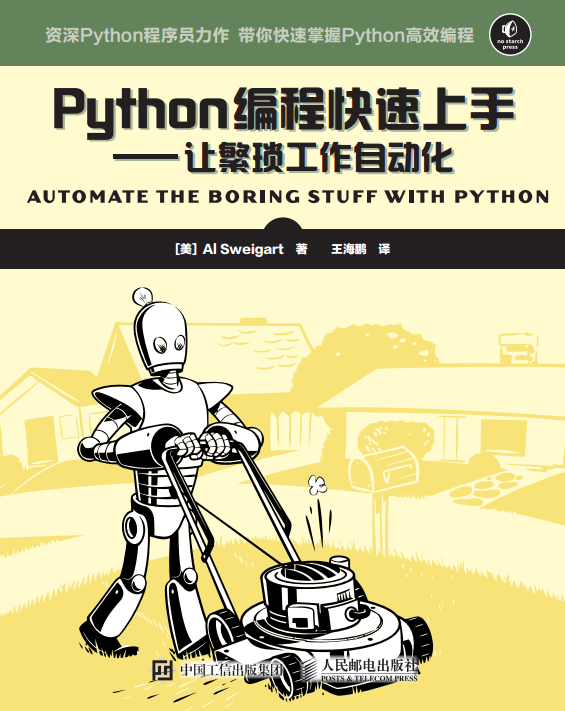
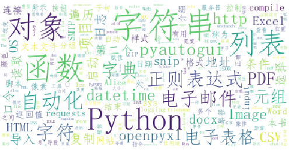

# 图书封面


# 本书简介
本书的第一部分介绍了基本 Python 编程概念，第二部分介绍了一些不同的任务，你可以让计算机自动完成它们。第二部分的每一章都有一些项目程序，供你学习。下面简单介绍一下每章的内容。
第一部分： Python 编程基础
“第 1 章： Python 基础”介绍了表达式、 Python 指令的最基本类型，以及如何使用 Python 交互式环境来尝试运行代码。
“第 2 章：控制流”解释了如何让程序决定执行哪些指令，以便代码能够智能地响应不同的情况。
“第 3 章：函数”介绍了如何定义自己的函数，以便将代码组织成可管理的部分。
“第 4 章：列表”介绍了列表数据类型，解释了如何组织数据。
“第 5 章：字典和结构化数据”介绍了字典数据类型，展示了更强大的数据组织方法。
“第 6 章：字符串操作”介绍了处理文本数据（在 Python 中称为字符串）。

第二部分：自动化任务
“第 7 章：模式匹配与正则表达式”介绍了 Python 如何用正则表达式处理字符串，以及查找文本模式。
“第 8 章：读写文件”解释了程序如何读取文本文件的内容，并将信息保存到硬盘的文件中。
“第 9 章：组织文件”展示了 Python 如何用比手工操作快得多的速度，复制、移动、重命名和删除大量的文件，也解释了压缩和解压缩文件。
“第 10 章：调试”展示了如何使用 Python 的缺陷查找和缺陷修复工具。
“第 11 章：从 Web 抓取信息”展示了如何编程来自动下载网页，解析它们，获取信息。这称为从 Web 抓取信息。
“第 12 章：处理 Excel 电子表格”介绍了编程处理 Excel 电子表格，这样你就不必去阅读它们。如果你必须分析成百上千的文档，这是很有帮助的。
“第 13 章：处理 PDF 和 Word 文档”介绍了编程读取 Word 和 PDF 文档。
“第 14 章：处理 CSV 文件和 JSON 数据”解释了如何编程操作 CSV 和 JSON 文件。
“第 15 章：保持时间、计划任务和启动程序”解释了 Python 程序如何处理时间和日期，如何安排计算机在特定时间执行任务。这一章也展示了 Python 程序如何启动非 Python 程序。
“第 16 章：发送电子邮件和短信”解释了如何编程来发送电子邮件和短信。
“第 17 章：操作图像”解释了如何编程来操作 JPG 或 png) 这样的图像。
“第 18 章：用 GUI 自动化控制键盘和鼠标”解释了如何编程控制鼠标和键盘，自动化鼠标点击和击键。

# 云图


# 代码

```python
from collections import Counter
from zhon import hanzi
import string
import re
import os
import matplotlib.pyplot as plt
import jieba
from wordcloud import WordCloud, ImageColorGenerator

with open('Python编程快速上手.txt','r', encoding='utf-8') as fp:
    alltext = ' '.join(fp.readlines())

alltext = re.sub("[%s]+" % hanzi.punctuation, " ", alltext)
alltext = re.sub("[%s]+" % string.punctuation, " ", alltext)

seg_list = jieba.cut(alltext, cut_all=False)
seg_list = list(seg_list)

counter = Counter(seg_list)
top = counter.most_common(1000)

top_dict = dict(top)

stopwords_list = []
pwd = os.path.abspath('.')
for file in os.listdir(os.path.join(pwd,'stopwords')):
    filename = os.path.join(pwd,'stopwords',file)
    with open(filename,'r') as fp:
        stopwords_list.extend(fp.readlines())

stopwords_list = list(set(stopwords_list))

for stopword in stopwords_list:
    try:
        top_dict.pop(stopword.strip())
    except:
        pass

wc = WordCloud(background_color="white",
    font_path='simfang.ttf',
    max_font_size=50,
    random_state=42)

wc.generate_from_frequencies(top_dict)

plt.imshow(wc)
plt.axis('off')

plt.show()

```

