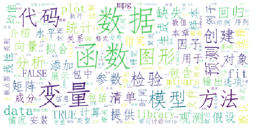

目录
第一部分 　入门
第2章 　创建数据集
第3章 　图形初阶
第4章 　基本数据管理
第5章 　高级数据管理

第二部分 　基本方法
第6章 　基本图形
第7章 　基本统计分析

第三部分 　中级方法
第8章 　回归
第9章 　方差分析
第10章 　功效分析
第11章 　中级绘图
第12章 　重抽样与自助法

第四部分 　高级方法
第13章 　广义线性模型
第14章 　主成分和因子分析
第15章 　处理缺失数据的高级方法
第16章 　高级图形进阶
后记：探索R的世界　　357
附录A 　图形用户界面　　359
附录B 　自定义启动环境　　362
附录C 　从R中导出数据　　364
附录D 　制作出版级品质的输出　　366
附录E 　R中的矩阵运算　　374
附录F 　本书中用到的扩展包　　376
附录G 　处理大数据　　381
附录H 　更新R　　383

