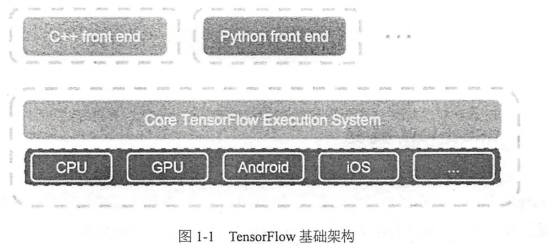
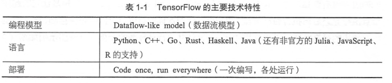
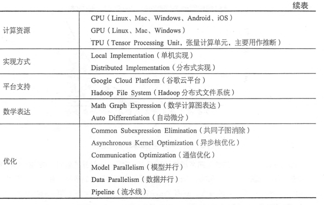
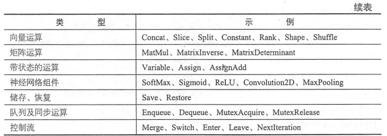
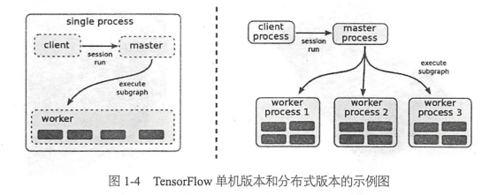
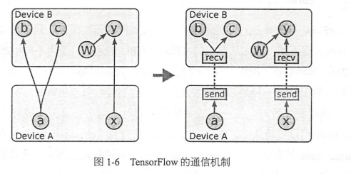
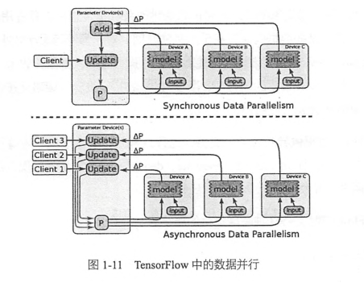
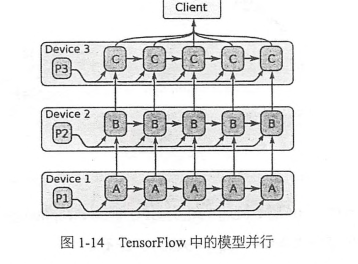
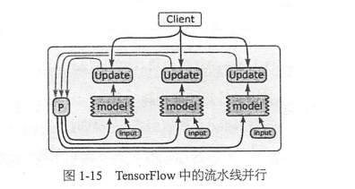

# 第1章-TensorFlow基础

## 1.1 TensorFlow概要

TensorFlow官方网站 [链接](www.tensorflow.org)
TensorFlow github网站 [链接](github.com/tensorflow/tensorflow)
TensorFlow模型仓库网站 [链接](github.com/tensorflow/models)

TensorFlow既是一个实现机器学习算法的接口，同时也是执行机器学习算法的框架。

TensorFlow使用数据流式图来规划计算流程的，它可以将计算映射到不同硬件和操作系统平台。

## 1.2 TensorFlow编程模型简介

### 1.2.1 核心概念
TensorFlow中的计算可以表示为一个有向图，或者称为计算图，其中的每一个计算操作将作为一个节点，节点和节点之间的连接称为边。
计算图的每一个节点可以有任意个输入和任意个输出，每一个节点描述了一种运算操作，节点可以算是运算操作的实例化。在计算图边中流动的数据被称为张量(tensor)。

session是用户使用TensorFlow时的交互式接口。

### 1.2.2 实现原理
TensorFlow有一个重要的组件是client即客户端，它通过session的接口和master以及多个work相连。其中每一个work可以与多个硬件设备相连，并负责管理这些硬件。而master则负责指导所有的work按照流程执行计算图。
TensorFlow分为单机好分布式两种。

TensorFlow为CPU和GPU提供了管理设备的对象接口，每一个对象负责分配、释放设备的内存，以及执行节点的运算核。

在只有一个硬件设备的情况下，计算图会按照依赖关系被顺序执行。
当有多个设备时，情况变得复杂，难点有二：
 1. 每一个节点该让什么硬件设备来执行
 2. 如何管理节点之间的数据通信。
第一个问题，TensorFlow设计了一套为节点分配资源的策略。
第二个问题，在多个设备上，计算图会被划分为许多子图，子图通过发送节点和接收节点通信。

### 1.2.3 拓展功能
- TensorFlow原生支持自动求导，但是也会给TensorFlow的优化带来麻烦。
- TensorFlow还支持单独执行子图。
- TensorFlow支持计算图的控制流。（if/while etc.)
- input node可以让用户直接输入文件系统路径
- 队列是TensorFlow任务调度的一个重要特性
- 容器是TensorFlow中一种特殊的管理长期变量的机制

### 1.2.4 性能优化
- TensorFlow能自动识别重复计算，并改写计算图
- 可以巧妙的安排计算的顺序来改善数据传输和内存占用的问题
- 支持异步计算
- 第三方高度优化库，eg. cuDNN,cuda-convenet
- 支持对数据精度进行压缩

TensorFlow提供了三种不同的加速神经网络训练的并行计算模式
- 数据并行

- 模型并行

- 流水线并行

