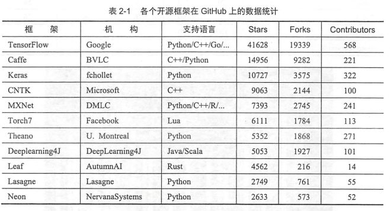

# 2 TensorFlow和其他深度学习框架的对比 18

## 2.1 主流深度学习框架对比 18

## 2.2 各深度学习框架简介 20
### TensorFlow
TensorFlow是相对高阶的机器学习库，用户㐓方便地用它设计神经网络结构，而不必为了追求高效率的实现亲自写C++或者CUDA代码。

TensorFlow另外一个特点是灵活的移植性。
TensorFlow还提供了TensorBoard，TensorBoard是TensorFlow的一组web应用，用来监控TensorFlow的运行过程，或可视化计算图。

### caffe
官方网址 [链接](caffe.berkeleyvision.org)
github网址 [链接](github.com/BVLC/caffe)

caffe的主要优势有以下几点：
- 容易上手，网络结构都是以配置文件形式定义，不需要用代码设计网络
- 训练速度快，能够训练state-of-the-art的模型与大规模的数据。
- 组件模块化，可以方便的拓展到新的模型和学习任务上。

caffe的一大优势是拥有大量的训练好的经典模型（AlexNet/VGG/Inception）乃至其他state-of-the-art(ResNet等)的模型。收藏在它的[model zoo](github.com/BVLC/caffe/Model-Zoo)里。

### Theano
官方网址 [链接](http://www.deeplearning.net/software/theano)
github网址 [链接](github.com/Theano/Theano)

Theano的主要优势如下：
- 集成numpy，可以直接使用numpy的ndarray，API接口学习成本低。
- 计算稳定性好
- 动态的生成C或者cuda代码，用以编译成高效率的机器代码。

Theano是一个完全基于python的符号计算库。

### Torch
官方网址 [链接](http://torch.ch)
github网址 [链接](github.com/torch/torch7)

Torch是LuaJIT上的一个高效的科学计算库，支持大量的机器学习算法，同事以GPU上的计算优先。

### Lasagne
官方网址 [链接](http://lasagne.readthedocs.io)
github网址 [链接](github.com/Lasagne/Lasagne)

Lasagne是一个基于Theano的轻量级的神经网络库。

### Keras
官方网址 [链接](keras.io)
github网址 [链接](github.com/fchollet/keras)

Keras是崇尚极简、高度模块化的神经网络库，使用python实现，并可以同事运行在TensorFlow和Theano上。

### MXNet
官方网址 [链接](mxnet.io)
github网址 [链接](github.com/dmlc/mxnet)

MXNet是DMLC开发的一款开源的、轻量级、可移植的、灵活的深度学习库，它让用户可以混合使用符号编程模式和指令式编程模式来最大化效率和灵活性。

### DIGITS
官方网址 [链接](developer.nvidia.com/digits)
github网址 [链接](github.com/NVIDIA/DIGITS)

DIGITS不是一个标准的深度学习库，它可以算是caffe的高级封装。

### CNTK
官方网址 [链接](cntk.ai)
github网址 [链接](github.com/Microsoft/CNTK)

CNTK是微软研究院开源的深度学习框架。
CNTK设计是性能导向的。

### Deepelearning4J
官方网址 [链接](http://deeplearning4j.org/)
github网址 [链接](github.com/deeplearning4j/deeplearning4j)

Deepelearning4J是一个基于java和scala的开源的分布式深度学习库，其核心目标是创建一个即插即用的解决方案原型。

### chainer
官方网址 [链接](chainer.org)
github网址 [链接](github.com/pfnet/chainer)

chainer特性描述：
- powerfull 支持cuda计算
- flexible 支持多种前馈神经网络
- intuitive 前馈计算可以引入python的各种控制流

### leaf
官方网址 [链接](autumnai.com/leaf/book)
github网址 [链接](github.com/autumnai/leaf)

leaf是一个基于Rust语言的直观的跨平台的深度学习乃至机器智能框架。

### DSSTNE
github网址 [链接](github.com/amznlabs/amazon-dsstne)

DSSTNE是亚马逊开源的稀疏神经网络框架，在训练稀疏的数据时具有很大优势。

