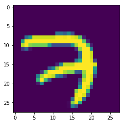
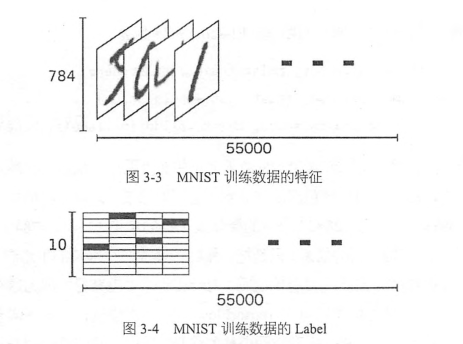
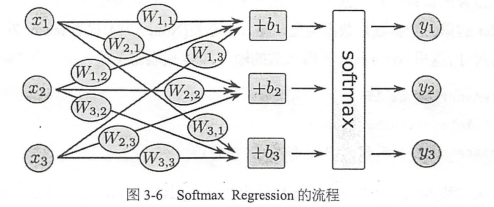
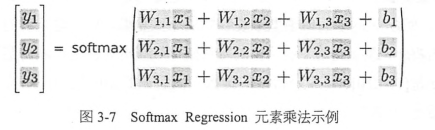
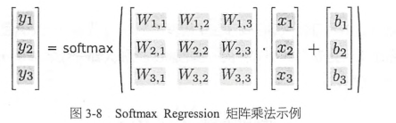

# 3 TensorFlow第一步 39
## 3.1 TensorFlow的编译及安装 39

- install anconda
[link](TensorFlow实战-第3章-TensorFlow第一步/https://www.anaconda.com/download/)

- CPU version
conda install tensorflow

- GPU version
conda install tensorflow-gpu

## 3.2 TensorFlow实现SoftmaxRegression识别手写数字 46

### 导入数据
MNIST是一个非常简单的机器视觉数据集，由几万张28x28像素的手写数字组成，这些图片只包含灰度信息。

```python
from tensorflow.examples.tutorials.mnist import input_data
mnist = input_data.read_data_sets("MNIST_data/", one_hot=True)

print(mnist.train.images.shape, mnist.train.labels.shape)
print(mnist.test.images.shape, mnist.test.labels.shape)
print(mnist.validation.images.shape, mnist.validation.labels.shape)
```

    Extracting MNIST_data/train-images-idx3-ubyte.gz
    Extracting MNIST_data/train-labels-idx1-ubyte.gz
    Extracting MNIST_data/t10k-images-idx3-ubyte.gz
    Extracting MNIST_data/t10k-labels-idx1-ubyte.gz
    (55000, 784) (55000, 10)
    (10000, 784) (10000, 10)
    (5000, 784) (5000, 10)

可以看到数据集中，训练集有55000个样本，测试集有10000个样本，验证集有5000个样本。
这里的数据全部丢弃了图片的二维结构信息，只是把一张图片变成了一个很长的一维向量。
我们可以使用matplotlib把一维数据还原为原来的图像。如下所示。

```python
from matplotlib import pyplot as plt
% matplotlib inline

data = mnist.train.images[0].reshape((28,28))
plt.imshow(data)

print(mnist.train.labels[0])
```

    [0. 0. 0. 0. 0. 0. 0. 1. 0. 0.]

)

训练数据(55000, 784)，第一维是图片的编号，第二维是图片中像素点的编号。
对10个种类的标签进行了onehot编码，如上所示，[0. 0. 0. 0. 0. 0. 0. 1. 0. 0.] 代表为7



### 准备好数据以后，接下来就要设计算法了
这里使用了一个叫做softmax regression的算法来训练分类模型。

当我们处理分类任务时，通常需要使用softmax regression模型。即使后面章节中的CNN或者RNN，如果是分类模型，最后一层同样也是softmax regression。
它的工作原理很简单，将可以判定为某类的特征想加，然后将这些特征转化为判定为这一类的概率。
这些特征可以通过一些简单的方法得到，比如对所有像素求一个加权和，而权重是根据数据自动学习、训练出来的。比如某一个像素的灰度值大代表可能是数字n的概率越大。

如下公式：
$$feature_i = \sum_j W_{ij} x_j + b_i$$
其中i为第i类，j代表一张图片的第j个像素。$$b_i$$是bias。

接下来计算所有特征的softmax，简单的说就是计算一个exp函数，然后再进行标准化（让所有类别的输出的概率值和为1）。
$$softmax(x) = normalize(exp(x))$$
其中判定为第i类的概率是：
$$softmax(x)\_i = \frac {exp(x)}{\sum_j exp(x_j)}$$





可以用下面一行简洁的表达：
$$y = softmax(Wx + b)$$

cross_entropy的定义如下：
$$H_{y'}(y) = - \sum_i {y_i'} log(y_i)$$

```python
import tensorflow as tf

# 创建InteractiveSession，使用这个命令会将这个session注册为默认的session，
# 之后的计算也默认跑在这个session里面。
# 不同session之间的数据和运算都是相互独立的。
sess = tf.InteractiveSession()

# 创建用于输入数据的placeholder，第一个参数是数据类型，第二个参数代表tensor的shape。
# None表示不限制条数，784是表示一个784维的向量。
x = tf.placeholder(tf.float32, [None, 784])

#接下来要为softmax regression模型中的weight和biases创建Variable对象。
#Variable中的数据是持久化的，长期存在并且在每轮迭代中被更新。
#这里把weight和bias全部初始化为0，因为模型训练时会自动学习合适的值，所以对这个简单模型来说初始值不太重要。
#但是对于复杂CNN RNN或者其他比较深的全连接网络来说，初始化的方法比较重要，甚至至关重要。
W = tf.Variable(tf.zeros([784, 10]))
b = tf.Variable(tf.zeros([10]))

# 实现公式y = softmax(Wx + b)
#tf.nn包含了大量的神经网络组件，softmax是其中之一。
#tf.matmul是矩阵乘法函数
y = tf.nn.softmax(tf.matmul(x, W) + b)

# 为了训练模型，需要定义一个loss function来描述模型对问题的分类精度。
#loss越小，代表模型分类结果和真实值的偏差越小，也就是说模型越准确。
#对于多分类问题，通常使用cross-entrpopy作为loss function.
#其中y是预测的概率分布，y'是真是的概率分布。
#tf.reduce_mean用来对每个batch数据结果求平均值。
y_ = tf.placeholder(tf.float32, [None, 10])
cross_entropy = tf.reduce_mean(-tf.reduce_sum(y_ * tf.log(y), reduction_indices=[1]))

#有了softmax regression和损失函数cross-entropy的定义，只需要再定义一个优化算法就可以开始训练。
#我们常见的是随机梯度下降SGD，定义好优化算法后，TensorFlow就可以根据我们定义的整个计算图自动求导，并根据反向传播算法进行训练，在每一轮迭代时更新参数来减少loss。在后台TensorFlow会自动天津爱很多运算操作来实现刚才提到的返现爱你过传播和梯度下降，而给我们提供的是一个封装好的优化器。我们直接调用tf.train.GradientDescentOptimizer，并设置学习速率为0.5，优化目标设定为cross-entropy，得到进行训练的操作train_step。
#下一步使用TensorFlow的全局参数初始化器tf.global_variables_initializer，并直接实行run方法。
train_step = tf.train.GradientDescentOptimizer(0.5).minimize(cross_entropy)
tf.global_variables_initializer().run()

#最后一步，开始迭代执行训练操作train_step，这里每次都随机从训练集中抽取100条样本过程一个mini-batch，并feed给placehodler，然后调用train_step对这些样本进行训练。
#使用一小部分数据进行随机梯度下降，这样绝大多数比全量样本训练的收敛速度更快，而且计算量不太大。
#只有把数据feed时，并运行run方法时，计算才开始执行。
for i in range(1000):
    batch_xs, batch_ys = mnist.train.next_batch(100)
    train_step.run({x: batch_xs, y_: batch_ys})

#现在完成了训练，需要对模型的准确性进行验证。
#tf.argmax是从一个tensor中找最大值的序号
#tf.argmax(y, 1)是求各个预测的数字钟概率最大的那一个。
#tf.argmax(y_, 1)则是找样本的真是数字类别。
#tf.equal是判断预测的数字是否是真正的类别。
#tf.cast将correct_prediction输出的bool值转换为float32
correct_prediction = tf.equal(tf.argmax(y, 1), tf.argmax(y_, 1))
accuracy = tf.reduce_mean(tf.cast(correct_prediction, tf.float32))

#最后计算模型的在测试集上的准确率，并打印出来结果。
print(accuracy.eval({x: mnist.test.images, y_: mnist.test.labels}))
```

    0.9194

### 总结
从上面的例子，我们可以总结一下整个流程。
1. 定义算法公式，也就是神经网络forward时的计算
2. 定义loss，选定优化器，并指定优化器优化loss
3. 迭代地对数据进行训练
4. 在测试集或者验证集上对准确率进行评测。

