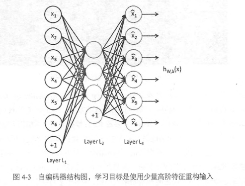
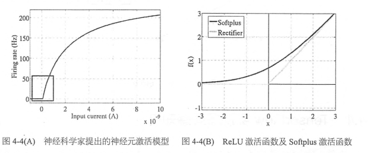

# 第4章-TensorFlow实现自编码器及多层感知机

## 4.1 自编码器简介
深度学习在早期一度被认为是一种无监督的特征学习，模仿了人脑的对特征逐层抽象提取的过程。这其中两点很重要，一是无监督学习，即我们不需要标注数据就可以对数据进行一定程度的学习，这种学习是对数据内容的组织形式的学习，抽取的是频繁出现的特征，二是逐层抽象，特征是需要不断抽象的，就像人总是从简单基础的概念开始学习，再到复杂的概念。

简单的特征是可以不断抽象转化为高一级的特征的，那我们如何找到这些结构呢，然后如何抽象呢？如果我们有狠毒哦标注的数据，就可以训练一个深层的神经网络。如果没有标注的数据呢？这种情况下，我们依然可以使用无监督的自编码器来提取特征。自编码器，就是可以使用自身的高阶特征编码自己。自编码器也是一种神经网络，它的输入和输出是一直的，它借助稀疏编码的思想，目标是使用稀疏的一些高阶特征重新组合来重构自己。因此特点非常明显，第一，期望输入和输出一直，第二，希望使用高阶特征重构自己，而不是复制像素点。

自编码器通常希望使用少量稀疏的高阶特征来重构输入，所以我们可以加入几种限制：
1. 如果限制中间隐含层节点的数据量，比如让中间银行曾节点的数量小于输入/输出节点的数据量，就相当于一个降维过程。
2. 如果给数据加入噪声，那么就是denoising antuoencoder去噪自编码器，我们将从噪声中学习数据的特征。

去噪自编码器中最常使用的是加性高斯噪声AGN，其结构图如下：


当然也可以使用masking noise，即有随机遮挡的噪声，这样图像中的一部分像素被置为0，模型需要从其他像素结构推测出这些被遮挡的像素是什么，因此模型依然需要学习图像中抽象的高阶特征。

如果自编码器的隐含层只有一层，其原理类似于主成分PCA。


Hinton教授提出了基于深度信念网络（DBN），由多层RBM堆叠而成。我们可能很难直接训练极深的网络，但是可以用无监督的朱岑个训练提取特征，将网络的权重初始化到一个比较好的位置，辅助后面的监督训练。在DBN模型中，含有多个隐含层，每一个隐含层都是限制性玻尔兹曼RBM（一种具有特殊连接分布分神经网络）。DBN训练时，需要先对每两层见进行无监督的预训练，这个过程相当于一个多层的自编码器，可以将整个网络的权重初始化到一个理想的分布。最后通过反向传播算法调整模型权重，这个步骤会使用经过标注的信息来做监督性的分类训练，也解决了网络过深带来的梯度弥散问题。简单的说，hinton的思路是先用自编码器的方法进行无监督的预训练，提取特征并初始化权重，然后使用标注信息进行监督式的训练。


## 4.2 TensorFlow实现自编码器


```python
# 依然使用mnist数据集
import numpy as np
import sklearn.preprocessing as prep
import tensorflow as tf
from tensorflow.examples.tutorials.mnist import input_data

#一种初始化方法xavier_init，模型的权重初始化太小容易在层间传递时逐渐缩小而难以起到作用，如果太大，在层间传递时将逐渐放大而导致发散或者失效。
#最好的方法是不大也不小，从数学角度就是满足方差是2/(n_in+n_out)均匀或者高斯分布。
#下面就是构建了一个均匀分布。方差刚好是2/(n_in+n_out)
#fan_in是输入节点的个数，fan_out是输出节点的个数

def xavier_init(fan_in, fan_out, constant = 1):
    low = -constant * np.sqrt(6.0 / (fan_in + fan_out))
    high = constant * np.sqrt(6.0 / (fan_in + fan_out))
    return tf.random_uniform((fan_in, fan_out), minval = low, maxval = high, dtype = tf.float32)

class AdditiveGaussianNoiseAutoencoder(object):
    #n_input:输入变量数
    #n_hidden:隐含层节点数
    #transfer_function:隐含层激活函数，默认是softplus
    #optimizer:优化器，默认是adam
    #scale:高斯噪声系数，默认是0.1
    def __init__(self, n_input, n_hidden, transfer_function = tf.nn.softplus, optimizer = tf.train.AdamOptimizer(), scale = 0.1):
        self.n_input = n_input
        self.n_hidden = n_hidden
        self.transfer = transfer_function
        self.scale = tf.placeholder(tf.float32)
        self.training_scale = scale
        network_weights = self._initialize_weights()
        self.weights = network_weights

        # model
        #self.x 输入
        # self.transfer对w1*(x+n)+b1进行几乎偶函数处理
        #经过隐含层后，需要在输出层上进行数据复原、重建操作。h*w2+b2
        self.x = tf.placeholder(tf.float32, [None, self.n_input])
        self.hidden = self.transfer(tf.add(tf.matmul(self.x + scale * tf.random_normal((n_input,)), self.weights['w1']), self.weights['b1']))
        self.reconstruction = tf.add(tf.matmul(self.hidden, self.weights['w2']), self.weights['b2'])

        # cost
        #这里使用平方误差作为cost，1/2*sum((x'-x)^2)
        self.cost = 0.5 * tf.reduce_sum(tf.pow(tf.subtract(self.reconstruction, self.x), 2.0))
        self.optimizer = optimizer.minimize(self.cost)

        #初始化模型所有参数
        init = tf.global_variables_initializer()
        self.sess = tf.Session()
        self.sess.run(init)

    #创建一个存储各个参数的字典，其中w1使用xavier_init初始化，其余初始化为0
    def _initialize_weights(self):
        all_weights = dict()
        all_weights['w1'] = tf.Variable(xavier_init(self.n_input, self.n_hidden))
        all_weights['b1'] = tf.Variable(tf.zeros([self.n_hidden], dtype = tf.float32))
        all_weights['w2'] = tf.Variable(tf.zeros([self.n_hidden, self.n_input], dtype = tf.float32))
        all_weights['b2'] = tf.Variable(tf.zeros([self.n_input], dtype = tf.float32))
        return all_weights

    #执行一步训练的函数partial_fit
    def partial_fit(self, X):
        cost, opt = self.sess.run((self.cost, self.optimizer), feed_dict = {self.x: X,
                                                                            self.scale: self.training_scale
                                                                            })
        return cost

    #只求损失函数的calc_total_cost
    def calc_total_cost(self, X):
        return self.sess.run(self.cost, feed_dict = {self.x: X,
                                                     self.scale: self.training_scale
                                                     })

    #transform函数只返回自编码器隐含层的输出结果
    def transform(self, X):
        return self.sess.run(self.hidden, feed_dict = {self.x: X,
                                                       self.scale: self.training_scale
                                                       })

    #通过重建层提取到高阶特征复原为原始数据
    def generate(self, hidden = None):
        if hidden is None:
            hidden = np.random.normal(size = self.weights["b1"])
        return self.sess.run(self.reconstruction, feed_dict = {self.hidden: hidden})

    #reconstruct = transform+generate
    def reconstruct(self, X):
        return self.sess.run(self.reconstruction, feed_dict = {self.x: X,
                                                               self.scale: self.training_scale
                                                               })

    def getWeights(self):
        return self.sess.run(self.weights['w1'])

    def getBiases(self):
        return self.sess.run(self.weights['b1'])
```


```python
#standard_scale对输入数据进行标准化处理
def standard_scale(X_train, X_test):
    preprocessor = prep.StandardScaler().fit(X_train)
    X_train = preprocessor.transform(X_train)
    X_test = preprocessor.transform(X_test)
    return X_train, X_test

#获取随机block数据的函数
def get_random_block_from_data(data, batch_size):
    start_index = np.random.randint(0, len(data) - batch_size)
    return data[start_index:(start_index + batch_size)]
```


```python
#获取数据集
mnist = input_data.read_data_sets('MNIST_data', one_hot = True)
#对输入数据进行标准化处理
X_train, X_test = standard_scale(mnist.train.images, mnist.test.images)

n_samples = int(mnist.train.num_examples)
training_epochs = 20
batch_size = 128
display_step = 1

autoencoder = AdditiveGaussianNoiseAutoencoder(n_input = 784,
                                               n_hidden = 200,
                                               transfer_function = tf.nn.softplus,
                                               optimizer = tf.train.AdamOptimizer(learning_rate = 0.001),
                                               scale = 0.01)

for epoch in range(training_epochs):
    avg_cost = 0.0
    total_batch = int(n_samples / batch_size)
    # Loop over all batches
    for i in range(total_batch):
        #获取随机block数据
        batch_xs = get_random_block_from_data(X_train, batch_size)

        # Fit training using batch data
        cost = autoencoder.partial_fit(batch_xs)
        # Compute average loss
        avg_cost += cost / n_samples * batch_size

    # Display logs per epoch step
    if epoch % display_step == 0:
        print("Epoch:", '%04d' % (epoch + 1), "cost=", "{:.9f}".format(avg_cost))

print("Total cost: " + str(autoencoder.calc_total_cost(X_test)))
```

    Extracting MNIST_data/train-images-idx3-ubyte.gz
    Extracting MNIST_data/train-labels-idx1-ubyte.gz
    Extracting MNIST_data/t10k-images-idx3-ubyte.gz
    Extracting MNIST_data/t10k-labels-idx1-ubyte.gz
    Epoch: 0001 cost= 18799.158003409
    Epoch: 0002 cost= 12072.621204545
    Epoch: 0003 cost= 10246.132863636
    Epoch: 0004 cost= 10029.809239205
    Epoch: 0005 cost= 9912.949165341
    Epoch: 0006 cost= 9418.074565341
    Epoch: 0007 cost= 9859.652969318
    Epoch: 0008 cost= 9497.867059659
    Epoch: 0009 cost= 9283.955078409
    Epoch: 0010 cost= 8127.477447727
    Epoch: 0011 cost= 9125.452381818
    Epoch: 0012 cost= 8159.187385227
    Epoch: 0013 cost= 8330.580655682
    Epoch: 0014 cost= 8220.359098295
    Epoch: 0015 cost= 8393.369086932
    Epoch: 0016 cost= 8835.428011932
    Epoch: 0017 cost= 7937.553089205
    Epoch: 0018 cost= 8520.666870455
    Epoch: 0019 cost= 7843.604306818
    Epoch: 0020 cost= 8403.237051705
    Total cost: 643869.4

至此，去噪自编码器实现就全部完成了。
自编码器作为一种无监督学习的方法，它与其他无监督学习的主要不同是，它不是对数据进行聚类，而是提取其中最有用、最频繁出现的高阶特征，根据这些高阶特征重构数据。

## 4.3 多层感知机简介
为了拟合复杂的场景，需要隐含层，但是过深的神经网络会遇到过拟合、参数难以调试、梯度弥散等问题。对于这些问题我们徐亚哦很多的trick来解决。

1. 过拟合是指在模型预测准确率在训练集上升高了，但是在测试集上却小江了，通常意味着泛化能力不好，模型只是记忆了当前数据的特征，不具备推广能力。
Hilton团队提出来一个dropout方法，它的大致思路是在训练时，将神将网络的某一层的输出节点数据随机丢弃一部分。dropout也算是一种bagging方法，可以理解为每次丢弃节点数据是对特征的一种采样。

2. 参数难以调试是另外一个痛点，尤其是SGD参数。

3. 梯度弥散，之前的sigmoid容易在层间传播误差，直到ReLU出现才比较完美解决了梯度弥散问题。ReLU是一个简单的非线性函数y=max(0,x)


ReLU相对于sigmoid主要变化有三个：
- 单侧抑制
- 相对宽阔的兴奋边界
- 稀疏激活性

当然，深加工年网络的额输出层一般都还是sigmoid函数，因为它最接近概率输出分布。

说了那么多，隐含层到底有什么用呢。
隐含层代表性的功能是可以解决XOR问题。没有隐含层的神经网络是线性的，这是早期神经网络的致命缺陷，当引入了隐含层并使用了非线性的激活函数后我们可以使用曲线划分样本，解决XOR异或函数的分类问题。神经网络的隐含层越多，就可以对原有特征进行越抽象的变换，模型的拟合能力越强，这就是多层感知机MLP的功能所在。

## 4.4 TensorFlow实现多层感知机
加入隐含层


```python
# Create the model
#载入MNIST_data
from tensorflow.examples.tutorials.mnist import input_data
import tensorflow as tf
mnist = input_data.read_data_sets("MNIST_data/", one_hot=True)
sess = tf.InteractiveSession()

in_units = 784  #输入节点个数
h1_units = 300  #隐含层节点个数
#tf.truncated_normal截断为正态分布
W1 = tf.Variable(tf.truncated_normal([in_units, h1_units], stddev=0.1))
b1 = tf.Variable(tf.zeros([h1_units]))
W2 = tf.Variable(tf.zeros([h1_units, 10]))
b2 = tf.Variable(tf.zeros([10]))

x = tf.placeholder(tf.float32, [None, in_units])

#dropout比率keep_prob在训练和预测时是不同的，训练小于1，预测等于1
keep_prob = tf.placeholder(tf.float32)

hidden1 = tf.nn.relu(tf.matmul(x, W1) + b1)
hidden1_drop = tf.nn.dropout(hidden1, keep_prob)
y = tf.nn.softmax(tf.matmul(hidden1_drop, W2) + b2)

# Define loss and optimizer
y_ = tf.placeholder(tf.float32, [None, 10])
cross_entropy = tf.reduce_mean(-tf.reduce_sum(y_ * tf.log(y), reduction_indices=[1]))
train_step = tf.train.AdagradOptimizer(0.3).minimize(cross_entropy)

# Train
tf.global_variables_initializer().run()
for i in range(3000):
  batch_xs, batch_ys = mnist.train.next_batch(100)
  train_step.run({x: batch_xs, y_: batch_ys, keep_prob: 0.75})

# Test trained model
correct_prediction = tf.equal(tf.argmax(y, 1), tf.argmax(y_, 1))
accuracy = tf.reduce_mean(tf.cast(correct_prediction, tf.float32))
print(accuracy.eval({x: mnist.test.images, y_: mnist.test.labels, keep_prob: 1.0}))
```

    Extracting MNIST_data/train-images-idx3-ubyte.gz
    Extracting MNIST_data/train-labels-idx1-ubyte.gz
    Extracting MNIST_data/t10k-images-idx3-ubyte.gz
    Extracting MNIST_data/t10k-labels-idx1-ubyte.gz
    0.979

在测试集上可以达到大约98%的准确率，相当于第三章的92%提升了不少。

