# 第1章-TensorFlow基础

## 1.1 TensorFlow概要

TensorFlow官方网站 [链接](www.tensorflow.org)
TensorFlow github网站 [链接](github.com/tensorflow/tensorflow)
TensorFlow模型仓库网站 [链接](github.com/tensorflow/models)

TensorFlow既是一个实现机器学习算法的接口，同时也是执行机器学习算法的框架。


TensorFlow使用数据流式图来规划计算流程的，它可以将计算映射到不同硬件和操作系统平台。
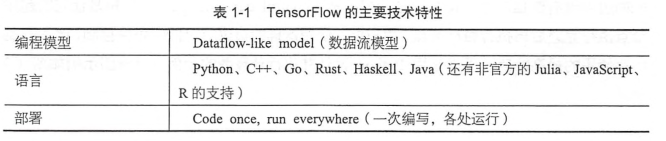
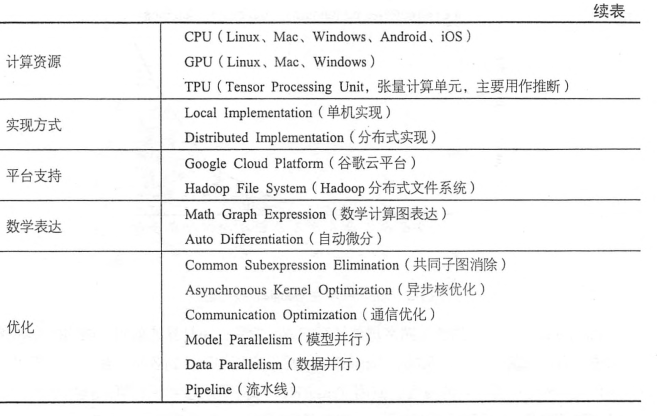

## 1.2 TensorFlow编程模型简介

### 1.2.1 核心概念
TensorFlow中的计算可以表示为一个有向图，或者称为计算图，其中的每一个计算操作将作为一个节点，节点和节点之间的连接称为边。
计算图的每一个节点可以有任意个输入和任意个输出，每一个节点描述了一种运算操作，节点可以算是运算操作的实例化。在计算图边中流动的数据被称为张量(tensor)。

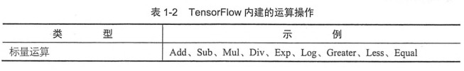
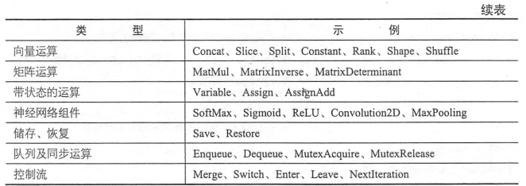

session是用户使用TensorFlow时的交互式接口。

### 1.2.2 实现原理
TensorFlow有一个重要的组件是client即客户端，它通过session的接口和master以及多个work相连。其中每一个work可以与多个硬件设备相连，并负责管理这些硬件。而master则负责指导所有的work按照流程执行计算图。
TensorFlow分为单机好分布式两种。
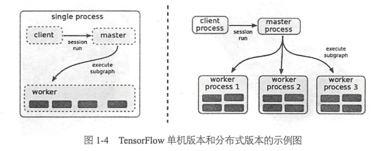

TensorFlow为CPU和GPU提供了管理设备的对象接口，每一个对象负责分配、释放设备的内存，以及执行节点的运算核。

在只有一个硬件设备的情况下，计算图会按照依赖关系被顺序执行。
当有多个设备时，情况变得复杂，难点有二：
 1. 每一个节点该让什么硬件设备来执行
 2. 如何管理节点之间的数据通信。
第一个问题，TensorFlow设计了一套为节点分配资源的策略。
第二个问题，在多个设备上，计算图会被划分为许多子图，子图通过发送节点和接收节点通信。
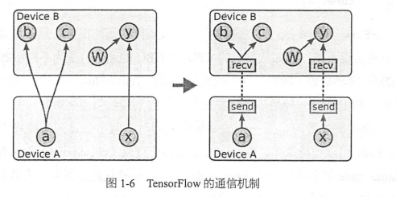

### 1.2.3 拓展功能
- TensorFlow原生支持自动求导，但是也会给TensorFlow的优化带来麻烦。
- TensorFlow还支持单独执行子图。
- TensorFlow支持计算图的控制流。（if/while etc.)
- input node可以让用户直接输入文件系统路径
- 队列是TensorFlow任务调度的一个重要特性
- 容器是TensorFlow中一种特殊的管理长期变量的机制

### 1.2.4 性能优化
- TensorFlow能自动识别重复计算，并改写计算图
- 可以巧妙的安排计算的顺序来改善数据传输和内存占用的问题
- 支持异步计算
- 第三方高度优化库，eg. cuDNN,cuda-convenet
- 支持对数据精度进行压缩

TensorFlow提供了三种不同的加速神经网络训练的并行计算模式
- 数据并行
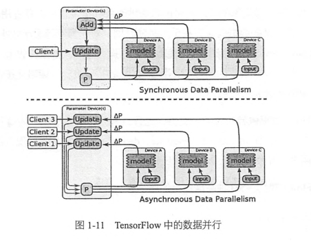

- 模型并行
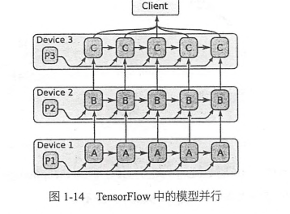

- 流水线并行
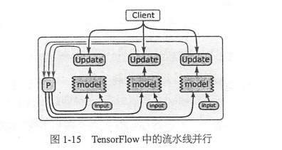


# 2 TensorFlow和其他深度学习框架的对比 18

## 2.1 主流深度学习框架对比 18
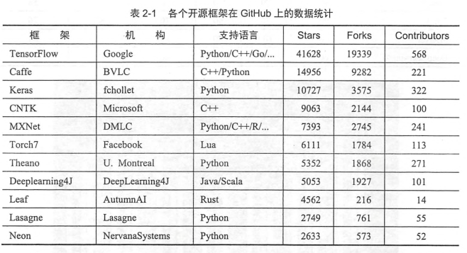

## 2.2 各深度学习框架简介 20
### TensorFlow
TensorFlow是相对高阶的机器学习库，用户㐓方便地用它设计神经网络结构，而不必为了追求高效率的实现亲自写C++或者CUDA代码。

TensorFlow另外一个特点是灵活的移植性。
TensorFlow还提供了TensorBoard，TensorBoard是TensorFlow的一组web应用，用来监控TensorFlow的运行过程，或可视化计算图。

### caffe
官方网址 [链接](caffe.berkeleyvision.org)
github网址 [链接](github.com/BVLC/caffe)

caffe的主要优势有以下几点：
- 容易上手，网络结构都是以配置文件形式定义，不需要用代码设计网络
- 训练速度快，能够训练state-of-the-art的模型与大规模的数据。
- 组件模块化，可以方便的拓展到新的模型和学习任务上。

caffe的一大优势是拥有大量的训练好的经典模型（AlexNet/VGG/Inception）乃至其他state-of-the-art(ResNet等)的模型。收藏在它的[model zoo](github.com/BVLC/caffe/Model-Zoo)里。

### Theano
官方网址 [链接](http://www.deeplearning.net/software/theano)
github网址 [链接](github.com/Theano/Theano)

Theano的主要优势如下：
- 集成numpy，可以直接使用numpy的ndarray，API接口学习成本低。
- 计算稳定性好
- 动态的生成C或者cuda代码，用以编译成高效率的机器代码。

Theano是一个完全基于python的符号计算库。

### Torch
官方网址 [链接](http://torch.ch)
github网址 [链接](github.com/torch/torch7)

Torch是LuaJIT上的一个高效的科学计算库，支持大量的机器学习算法，同事以GPU上的计算优先。

### Lasagne
官方网址 [链接](http://lasagne.readthedocs.io)
github网址 [链接](github.com/Lasagne/Lasagne)

Lasagne是一个基于Theano的轻量级的神经网络库。


### Keras
官方网址 [链接](keras.io)
github网址 [链接](github.com/fchollet/keras)

Keras是崇尚极简、高度模块化的神经网络库，使用python实现，并可以同事运行在TensorFlow和Theano上。

### MXNet
官方网址 [链接](mxnet.io)
github网址 [链接](github.com/dmlc/mxnet)

MXNet是DMLC开发的一款开源的、轻量级、可移植的、灵活的深度学习库，它让用户可以混合使用符号编程模式和指令式编程模式来最大化效率和灵活性。

### DIGITS
官方网址 [链接](developer.nvidia.com/digits)
github网址 [链接](github.com/NVIDIA/DIGITS)

DIGITS不是一个标准的深度学习库，它可以算是caffe的高级封装。

### CNTK
官方网址 [链接](cntk.ai)
github网址 [链接](github.com/Microsoft/CNTK)

CNTK是微软研究院开源的深度学习框架。
CNTK设计是性能导向的。

### Deepelearning4J
官方网址 [链接](http://deeplearning4j.org/)
github网址 [链接](github.com/deeplearning4j/deeplearning4j)

Deepelearning4J是一个基于java和scala的开源的分布式深度学习库，其核心目标是创建一个即插即用的解决方案原型。

### chainer
官方网址 [链接](chainer.org)
github网址 [链接](github.com/pfnet/chainer)

chainer特性描述：
- powerfull 支持cuda计算
- flexible 支持多种前馈神经网络
- intuitive 前馈计算可以引入python的各种控制流

### leaf
官方网址 [链接](autumnai.com/leaf/book)
github网址 [链接](github.com/autumnai/leaf)

leaf是一个基于Rust语言的直观的跨平台的深度学习乃至机器智能框架。

### DSSTNE
github网址 [链接](github.com/amznlabs/amazon-dsstne)

DSSTNE是亚马逊开源的稀疏神经网络框架，在训练稀疏的数据时具有很大优势。


# 3 TensorFlow第一步 39
## 3.1 TensorFlow的编译及安装 39

- install anconda
[link](TensorFlow实战/)

- CPU version
conda install tensorflow

- GPU version
conda install tensorflow-gpu

## 3.2 TensorFlow实现SoftmaxRegression识别手写数字 46

### 导入数据
MNIST是一个非常简单的机器视觉数据集，由几万张28x28像素的手写数字组成，这些图片只包含灰度信息。

```python
from tensorflow.examples.tutorials.mnist import input_data
mnist = input_data.read_data_sets("MNIST_data/", one_hot=True)

print(mnist.train.images.shape, mnist.train.labels.shape)
print(mnist.test.images.shape, mnist.test.labels.shape)
print(mnist.validation.images.shape, mnist.validation.labels.shape)
```

    Extracting MNIST_data/train-images-idx3-ubyte.gz
    Extracting MNIST_data/train-labels-idx1-ubyte.gz
    Extracting MNIST_data/t10k-images-idx3-ubyte.gz
    Extracting MNIST_data/t10k-labels-idx1-ubyte.gz
    (55000, 784) (55000, 10)
    (10000, 784) (10000, 10)
    (5000, 784) (5000, 10)

可以看到数据集中，训练集有55000个样本，测试集有10000个样本，验证集有5000个样本。
这里的数据全部丢弃了图片的二维结构信息，只是把一张图片变成了一个很长的一维向量。
我们可以使用matplotlib把一维数据还原为原来的图像。如下所示。

```python
from matplotlib import pyplot as plt
% matplotlib inline

data = mnist.train.images[0].reshape((28,28))
plt.imshow(data)

print(mnist.train.labels[0])
```

    [0. 0. 0. 0. 0. 0. 0. 1. 0. 0.]

)

训练数据(55000, 784)，第一维是图片的编号，第二维是图片中像素点的编号。
对10个种类的标签进行了onehot编码，如上所示，[0. 0. 0. 0. 0. 0. 0. 1. 0. 0.] 代表为7

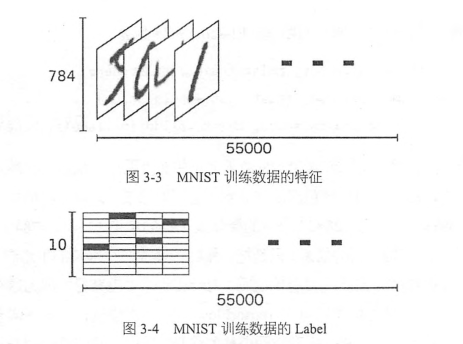

### 准备好数据以后，接下来就要设计算法了
这里使用了一个叫做softmax regression的算法来训练分类模型。

当我们处理分类任务时，通常需要使用softmax regression模型。即使后面章节中的CNN或者RNN，如果是分类模型，最后一层同样也是softmax regression。
它的工作原理很简单，将可以判定为某类的特征想加，然后将这些特征转化为判定为这一类的概率。
这些特征可以通过一些简单的方法得到，比如对所有像素求一个加权和，而权重是根据数据自动学习、训练出来的。比如某一个像素的灰度值大代表可能是数字n的概率越大。

如下公式：
$$feature_i = \sum_j W_{ij} x_j + b_i$$
其中i为第i类，j代表一张图片的第j个像素。$$b_i$$是bias。

接下来计算所有特征的softmax，简单的说就是计算一个exp函数，然后再进行标准化（让所有类别的输出的概率值和为1）。
$$softmax(x) = normalize(exp(x))$$
其中判定为第i类的概率是：
$$softmax(x)\_i = \frac {exp(x)}{\sum_j exp(x_j)}$$


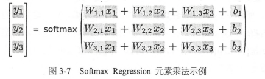
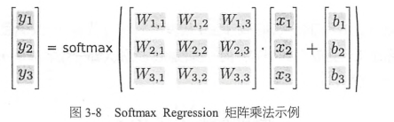

可以用下面一行简洁的表达：
$$y = softmax(Wx + b)$$

cross_entropy的定义如下：
$$H_{y'}(y) = - \sum_i {y_i'} log(y_i)$$

```python
import tensorflow as tf

# 创建InteractiveSession，使用这个命令会将这个session注册为默认的session，
# 之后的计算也默认跑在这个session里面。
# 不同session之间的数据和运算都是相互独立的。
sess = tf.InteractiveSession()

# 创建用于输入数据的placeholder，第一个参数是数据类型，第二个参数代表tensor的shape。
# None表示不限制条数，784是表示一个784维的向量。
x = tf.placeholder(tf.float32, [None, 784])

#接下来要为softmax regression模型中的weight和biases创建Variable对象。
#Variable中的数据是持久化的，长期存在并且在每轮迭代中被更新。
#这里把weight和bias全部初始化为0，因为模型训练时会自动学习合适的值，所以对这个简单模型来说初始值不太重要。
#但是对于复杂CNN RNN或者其他比较深的全连接网络来说，初始化的方法比较重要，甚至至关重要。
W = tf.Variable(tf.zeros([784, 10]))
b = tf.Variable(tf.zeros([10]))

# 实现公式y = softmax(Wx + b)
#tf.nn包含了大量的神经网络组件，softmax是其中之一。
#tf.matmul是矩阵乘法函数
y = tf.nn.softmax(tf.matmul(x, W) + b)

# 为了训练模型，需要定义一个loss function来描述模型对问题的分类精度。
#loss越小，代表模型分类结果和真实值的偏差越小，也就是说模型越准确。
#对于多分类问题，通常使用cross-entrpopy作为loss function.
#其中y是预测的概率分布，y'是真是的概率分布。
#tf.reduce_mean用来对每个batch数据结果求平均值。
y_ = tf.placeholder(tf.float32, [None, 10])
cross_entropy = tf.reduce_mean(-tf.reduce_sum(y_ * tf.log(y), reduction_indices=[1]))

#有了softmax regression和损失函数cross-entropy的定义，只需要再定义一个优化算法就可以开始训练。
#我们常见的是随机梯度下降SGD，定义好优化算法后，TensorFlow就可以根据我们定义的整个计算图自动求导，并根据反向传播算法进行训练，在每一轮迭代时更新参数来减少loss。在后台TensorFlow会自动天津爱很多运算操作来实现刚才提到的返现爱你过传播和梯度下降，而给我们提供的是一个封装好的优化器。我们直接调用tf.train.GradientDescentOptimizer，并设置学习速率为0.5，优化目标设定为cross-entropy，得到进行训练的操作train_step。
#下一步使用TensorFlow的全局参数初始化器tf.global_variables_initializer，并直接实行run方法。
train_step = tf.train.GradientDescentOptimizer(0.5).minimize(cross_entropy)
tf.global_variables_initializer().run()

#最后一步，开始迭代执行训练操作train_step，这里每次都随机从训练集中抽取100条样本过程一个mini-batch，并feed给placehodler，然后调用train_step对这些样本进行训练。
#使用一小部分数据进行随机梯度下降，这样绝大多数比全量样本训练的收敛速度更快，而且计算量不太大。
#只有把数据feed时，并运行run方法时，计算才开始执行。
for i in range(1000):
    batch_xs, batch_ys = mnist.train.next_batch(100)
    train_step.run({x: batch_xs, y_: batch_ys})

#现在完成了训练，需要对模型的准确性进行验证。
#tf.argmax是从一个tensor中找最大值的序号
#tf.argmax(y, 1)是求各个预测的数字钟概率最大的那一个。
#tf.argmax(y_, 1)则是找样本的真是数字类别。
#tf.equal是判断预测的数字是否是真正的类别。
#tf.cast将correct_prediction输出的bool值转换为float32
correct_prediction = tf.equal(tf.argmax(y, 1), tf.argmax(y_, 1))
accuracy = tf.reduce_mean(tf.cast(correct_prediction, tf.float32))

#最后计算模型的在测试集上的准确率，并打印出来结果。
print(accuracy.eval({x: mnist.test.images, y_: mnist.test.labels}))
```

    0.9194

### 总结
从上面的例子，我们可以总结一下整个流程。
1. 定义算法公式，也就是神经网络forward时的计算
2. 定义loss，选定优化器，并指定优化器优化loss
3. 迭代地对数据进行训练
4. 在测试集或者验证集上对准确率进行评测。


# 第4章-TensorFlow实现自编码器及多层感知机

## 4.1 自编码器简介
深度学习在早期一度被认为是一种无监督的特征学习，模仿了人脑的对特征逐层抽象提取的过程。这其中两点很重要，一是无监督学习，即我们不需要标注数据就可以对数据进行一定程度的学习，这种学习是对数据内容的组织形式的学习，抽取的是频繁出现的特征，二是逐层抽象，特征是需要不断抽象的，就像人总是从简单基础的概念开始学习，再到复杂的概念。

简单的特征是可以不断抽象转化为高一级的特征的，那我们如何找到这些结构呢，然后如何抽象呢？如果我们有狠毒哦标注的数据，就可以训练一个深层的神经网络。如果没有标注的数据呢？这种情况下，我们依然可以使用无监督的自编码器来提取特征。自编码器，就是可以使用自身的高阶特征编码自己。自编码器也是一种神经网络，它的输入和输出是一直的，它借助稀疏编码的思想，目标是使用稀疏的一些高阶特征重新组合来重构自己。因此特点非常明显，第一，期望输入和输出一直，第二，希望使用高阶特征重构自己，而不是复制像素点。

自编码器通常希望使用少量稀疏的高阶特征来重构输入，所以我们可以加入几种限制：
1. 如果限制中间隐含层节点的数据量，比如让中间银行曾节点的数量小于输入/输出节点的数据量，就相当于一个降维过程。
2. 如果给数据加入噪声，那么就是denoising antuoencoder去噪自编码器，我们将从噪声中学习数据的特征。

去噪自编码器中最常使用的是加性高斯噪声AGN，其结构图如下：
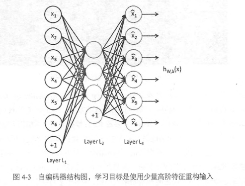

当然也可以使用masking noise，即有随机遮挡的噪声，这样图像中的一部分像素被置为0，模型需要从其他像素结构推测出这些被遮挡的像素是什么，因此模型依然需要学习图像中抽象的高阶特征。

如果自编码器的隐含层只有一层，其原理类似于主成分PCA。


Hinton教授提出了基于深度信念网络（DBN），由多层RBM堆叠而成。我们可能很难直接训练极深的网络，但是可以用无监督的朱岑个训练提取特征，将网络的权重初始化到一个比较好的位置，辅助后面的监督训练。在DBN模型中，含有多个隐含层，每一个隐含层都是限制性玻尔兹曼RBM（一种具有特殊连接分布分神经网络）。DBN训练时，需要先对每两层见进行无监督的预训练，这个过程相当于一个多层的自编码器，可以将整个网络的权重初始化到一个理想的分布。最后通过反向传播算法调整模型权重，这个步骤会使用经过标注的信息来做监督性的分类训练，也解决了网络过深带来的梯度弥散问题。简单的说，hinton的思路是先用自编码器的方法进行无监督的预训练，提取特征并初始化权重，然后使用标注信息进行监督式的训练。


## 4.2 TensorFlow实现自编码器


```python
# 依然使用mnist数据集
import numpy as np
import sklearn.preprocessing as prep
import tensorflow as tf
from tensorflow.examples.tutorials.mnist import input_data

#一种初始化方法xavier_init，模型的权重初始化太小容易在层间传递时逐渐缩小而难以起到作用，如果太大，在层间传递时将逐渐放大而导致发散或者失效。
#最好的方法是不大也不小，从数学角度就是满足方差是2/(n_in+n_out)均匀或者高斯分布。
#下面就是构建了一个均匀分布。方差刚好是2/(n_in+n_out)
#fan_in是输入节点的个数，fan_out是输出节点的个数

def xavier_init(fan_in, fan_out, constant = 1):
    low = -constant * np.sqrt(6.0 / (fan_in + fan_out))
    high = constant * np.sqrt(6.0 / (fan_in + fan_out))
    return tf.random_uniform((fan_in, fan_out), minval = low, maxval = high, dtype = tf.float32)

class AdditiveGaussianNoiseAutoencoder(object):
    #n_input:输入变量数
    #n_hidden:隐含层节点数
    #transfer_function:隐含层激活函数，默认是softplus
    #optimizer:优化器，默认是adam
    #scale:高斯噪声系数，默认是0.1
    def __init__(self, n_input, n_hidden, transfer_function = tf.nn.softplus, optimizer = tf.train.AdamOptimizer(), scale = 0.1):
        self.n_input = n_input
        self.n_hidden = n_hidden
        self.transfer = transfer_function
        self.scale = tf.placeholder(tf.float32)
        self.training_scale = scale
        network_weights = self._initialize_weights()
        self.weights = network_weights

        # model
        #self.x 输入
        # self.transfer对w1*(x+n)+b1进行几乎偶函数处理
        #经过隐含层后，需要在输出层上进行数据复原、重建操作。h*w2+b2
        self.x = tf.placeholder(tf.float32, [None, self.n_input])
        self.hidden = self.transfer(tf.add(tf.matmul(self.x + scale * tf.random_normal((n_input,)), self.weights['w1']), self.weights['b1']))
        self.reconstruction = tf.add(tf.matmul(self.hidden, self.weights['w2']), self.weights['b2'])

        # cost
        #这里使用平方误差作为cost，1/2*sum((x'-x)^2)
        self.cost = 0.5 * tf.reduce_sum(tf.pow(tf.subtract(self.reconstruction, self.x), 2.0))
        self.optimizer = optimizer.minimize(self.cost)

        #初始化模型所有参数
        init = tf.global_variables_initializer()
        self.sess = tf.Session()
        self.sess.run(init)

    #创建一个存储各个参数的字典，其中w1使用xavier_init初始化，其余初始化为0
    def _initialize_weights(self):
        all_weights = dict()
        all_weights['w1'] = tf.Variable(xavier_init(self.n_input, self.n_hidden))
        all_weights['b1'] = tf.Variable(tf.zeros([self.n_hidden], dtype = tf.float32))
        all_weights['w2'] = tf.Variable(tf.zeros([self.n_hidden, self.n_input], dtype = tf.float32))
        all_weights['b2'] = tf.Variable(tf.zeros([self.n_input], dtype = tf.float32))
        return all_weights

    #执行一步训练的函数partial_fit
    def partial_fit(self, X):
        cost, opt = self.sess.run((self.cost, self.optimizer), feed_dict = {self.x: X,
                                                                            self.scale: self.training_scale
                                                                            })
        return cost

    #只求损失函数的calc_total_cost
    def calc_total_cost(self, X):
        return self.sess.run(self.cost, feed_dict = {self.x: X,
                                                     self.scale: self.training_scale
                                                     })

    #transform函数只返回自编码器隐含层的输出结果
    def transform(self, X):
        return self.sess.run(self.hidden, feed_dict = {self.x: X,
                                                       self.scale: self.training_scale
                                                       })

    #通过重建层提取到高阶特征复原为原始数据
    def generate(self, hidden = None):
        if hidden is None:
            hidden = np.random.normal(size = self.weights["b1"])
        return self.sess.run(self.reconstruction, feed_dict = {self.hidden: hidden})

    #reconstruct = transform+generate
    def reconstruct(self, X):
        return self.sess.run(self.reconstruction, feed_dict = {self.x: X,
                                                               self.scale: self.training_scale
                                                               })

    def getWeights(self):
        return self.sess.run(self.weights['w1'])

    def getBiases(self):
        return self.sess.run(self.weights['b1'])
```


```python
#standard_scale对输入数据进行标准化处理
def standard_scale(X_train, X_test):
    preprocessor = prep.StandardScaler().fit(X_train)
    X_train = preprocessor.transform(X_train)
    X_test = preprocessor.transform(X_test)
    return X_train, X_test

#获取随机block数据的函数
def get_random_block_from_data(data, batch_size):
    start_index = np.random.randint(0, len(data) - batch_size)
    return data[start_index:(start_index + batch_size)]
```


```python
#获取数据集
mnist = input_data.read_data_sets('MNIST_data', one_hot = True)
#对输入数据进行标准化处理
X_train, X_test = standard_scale(mnist.train.images, mnist.test.images)

n_samples = int(mnist.train.num_examples)
training_epochs = 20
batch_size = 128
display_step = 1

autoencoder = AdditiveGaussianNoiseAutoencoder(n_input = 784,
                                               n_hidden = 200,
                                               transfer_function = tf.nn.softplus,
                                               optimizer = tf.train.AdamOptimizer(learning_rate = 0.001),
                                               scale = 0.01)

for epoch in range(training_epochs):
    avg_cost = 0.0
    total_batch = int(n_samples / batch_size)
    # Loop over all batches
    for i in range(total_batch):
        #获取随机block数据
        batch_xs = get_random_block_from_data(X_train, batch_size)

        # Fit training using batch data
        cost = autoencoder.partial_fit(batch_xs)
        # Compute average loss
        avg_cost += cost / n_samples * batch_size

    # Display logs per epoch step
    if epoch % display_step == 0:
        print("Epoch:", '%04d' % (epoch + 1), "cost=", "{:.9f}".format(avg_cost))

print("Total cost: " + str(autoencoder.calc_total_cost(X_test)))
```

    Extracting MNIST_data/train-images-idx3-ubyte.gz
    Extracting MNIST_data/train-labels-idx1-ubyte.gz
    Extracting MNIST_data/t10k-images-idx3-ubyte.gz
    Extracting MNIST_data/t10k-labels-idx1-ubyte.gz
    Epoch: 0001 cost= 18799.158003409
    Epoch: 0002 cost= 12072.621204545
    Epoch: 0003 cost= 10246.132863636
    Epoch: 0004 cost= 10029.809239205
    Epoch: 0005 cost= 9912.949165341
    Epoch: 0006 cost= 9418.074565341
    Epoch: 0007 cost= 9859.652969318
    Epoch: 0008 cost= 9497.867059659
    Epoch: 0009 cost= 9283.955078409
    Epoch: 0010 cost= 8127.477447727
    Epoch: 0011 cost= 9125.452381818
    Epoch: 0012 cost= 8159.187385227
    Epoch: 0013 cost= 8330.580655682
    Epoch: 0014 cost= 8220.359098295
    Epoch: 0015 cost= 8393.369086932
    Epoch: 0016 cost= 8835.428011932
    Epoch: 0017 cost= 7937.553089205
    Epoch: 0018 cost= 8520.666870455
    Epoch: 0019 cost= 7843.604306818
    Epoch: 0020 cost= 8403.237051705
    Total cost: 643869.4

至此，去噪自编码器实现就全部完成了。
自编码器作为一种无监督学习的方法，它与其他无监督学习的主要不同是，它不是对数据进行聚类，而是提取其中最有用、最频繁出现的高阶特征，根据这些高阶特征重构数据。

## 4.3 多层感知机简介
为了拟合复杂的场景，需要隐含层，但是过深的神经网络会遇到过拟合、参数难以调试、梯度弥散等问题。对于这些问题我们徐亚哦很多的trick来解决。

1. 过拟合是指在模型预测准确率在训练集上升高了，但是在测试集上却小江了，通常意味着泛化能力不好，模型只是记忆了当前数据的特征，不具备推广能力。
Hilton团队提出来一个dropout方法，它的大致思路是在训练时，将神将网络的某一层的输出节点数据随机丢弃一部分。dropout也算是一种bagging方法，可以理解为每次丢弃节点数据是对特征的一种采样。

2. 参数难以调试是另外一个痛点，尤其是SGD参数。

3. 梯度弥散，之前的sigmoid容易在层间传播误差，直到ReLU出现才比较完美解决了梯度弥散问题。ReLU是一个简单的非线性函数y=max(0,x)
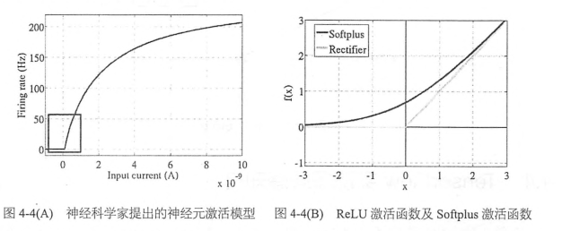

ReLU相对于sigmoid主要变化有三个：
- 单侧抑制
- 相对宽阔的兴奋边界
- 稀疏激活性

当然，深加工年网络的额输出层一般都还是sigmoid函数，因为它最接近概率输出分布。

说了那么多，隐含层到底有什么用呢。
隐含层代表性的功能是可以解决XOR问题。没有隐含层的神经网络是线性的，这是早期神经网络的致命缺陷，当引入了隐含层并使用了非线性的激活函数后我们可以使用曲线划分样本，解决XOR异或函数的分类问题。神经网络的隐含层越多，就可以对原有特征进行越抽象的变换，模型的拟合能力越强，这就是多层感知机MLP的功能所在。

## 4.4 TensorFlow实现多层感知机
加入隐含层


```python
# Create the model
#载入MNIST_data
from tensorflow.examples.tutorials.mnist import input_data
import tensorflow as tf
mnist = input_data.read_data_sets("MNIST_data/", one_hot=True)
sess = tf.InteractiveSession()

in_units = 784  #输入节点个数
h1_units = 300  #隐含层节点个数
#tf.truncated_normal截断为正态分布
W1 = tf.Variable(tf.truncated_normal([in_units, h1_units], stddev=0.1))
b1 = tf.Variable(tf.zeros([h1_units]))
W2 = tf.Variable(tf.zeros([h1_units, 10]))
b2 = tf.Variable(tf.zeros([10]))

x = tf.placeholder(tf.float32, [None, in_units])

#dropout比率keep_prob在训练和预测时是不同的，训练小于1，预测等于1
keep_prob = tf.placeholder(tf.float32)

hidden1 = tf.nn.relu(tf.matmul(x, W1) + b1)
hidden1_drop = tf.nn.dropout(hidden1, keep_prob)
y = tf.nn.softmax(tf.matmul(hidden1_drop, W2) + b2)

# Define loss and optimizer
y_ = tf.placeholder(tf.float32, [None, 10])
cross_entropy = tf.reduce_mean(-tf.reduce_sum(y_ * tf.log(y), reduction_indices=[1]))
train_step = tf.train.AdagradOptimizer(0.3).minimize(cross_entropy)

# Train
tf.global_variables_initializer().run()
for i in range(3000):
  batch_xs, batch_ys = mnist.train.next_batch(100)
  train_step.run({x: batch_xs, y_: batch_ys, keep_prob: 0.75})

# Test trained model
correct_prediction = tf.equal(tf.argmax(y, 1), tf.argmax(y_, 1))
accuracy = tf.reduce_mean(tf.cast(correct_prediction, tf.float32))
print(accuracy.eval({x: mnist.test.images, y_: mnist.test.labels, keep_prob: 1.0}))
```

    Extracting MNIST_data/train-images-idx3-ubyte.gz
    Extracting MNIST_data/train-labels-idx1-ubyte.gz
    Extracting MNIST_data/t10k-images-idx3-ubyte.gz
    Extracting MNIST_data/t10k-labels-idx1-ubyte.gz
    0.979

在测试集上可以达到大约98%的准确率，相当于第三章的92%提升了不少。


# 第5章-TensorFlow实现卷积神经网络CNN

## 5.1 卷积神经网络简介
卷积神经网络CNN最初是为了解决图像识别等问题设计的，当然现在的应用已经不限于图像和视频，也可以用于时间序列信号，比如音频信号、文本数据等。

在深度学习出现之前，必须借助SIFT、HoG等算法提取出有效而丰富的特征，再集合SVM等机器学习算法进行图像识别。
Snipaste_2018-04-18_17-11-33.png

CNN作为一个深度学习架构被提出来最初的诉求是降低对图像数据预处理的要求，以及避免复杂的特征工程。CNN最大的特点是在于卷积的权值共享结构，可以大幅减少神经网络的参数量，方式过拟合的同时又降低了神经网络模型的复杂度。

卷积神经网络的历史
感受野 --> 神经认知机(S-cells/C-cells)

卷积神经网络可以利用空间结构关系减少需要学习的参数量，从而提高方向传播算法的训练效率。在卷积神经网络中，第一个卷积层直接接受图像像素的输入，每一个卷积操作只处理一小块图像，进行卷积变化后再传到后面的网络，每一层卷积都会提取数据中最有效的特征。这种方法可以提取到图像中最基本的特征，而后再进行组合和抽象形成更高阶的特征。

一般卷积神经网络由多个卷积层构成，每个卷积层中通常会进行如下几个操作。
1. 图像通过多个不同的卷积核的滤波，并加偏置，提取出局部特征，每一个卷积核会映射出一个新的2D图像
2. 将前面卷积核的滤波输出结果，进行非线性的激活函数处理。目前最常见的是使用ReLUctant函数，而以前sigmoid函数用的比较多。
3. 再激活函数的结果再进行池化操作(即降采样)，目前一般是使用最大池化，保留最显著的特征，并提高模型的畸变容忍能力。
这几个步骤构成了最常见的卷积层，当然也可以加上一个LRN（局部响应归一化层）层，目前非常流程的trick还有batch normalization等。

一个卷积层中可以有多个不同的卷积核，而每一个卷积核都对应一个滤波后映射的新图像，同一个新图像中每一个像素都来自完全相同的卷积核，这就是卷积核的权值共享。我们为什么要共享卷积核的权值参数呢？答案很简单，降低模型复杂度，减轻过拟合并降低计算量。
Snipaste_2018-04-18_17-29-12.png

每一个卷积核滤波得到的图像就是一类特征的映射，即一个Feature map。
参数量和隐含节点个数或者图片大小无关，只跟卷积核的大小有关，这就是所谓的权值共享。
Snipaste_2018-04-18_17-32-56.png

总结一下就是，卷积神经网络的要点就是局部连接、权值共享、池化层中的降采样。

#### LeNet5
LeNet5是最早的深层卷积神经网络之一
LeNet5特性有如下几点：
- 每个卷积层包含三部分，卷积、池化和非线性激活函数
- 使用卷积提取空间特征
- 降采样的平均池化层
- 双曲正切tanh或者s型sigmoid的激活函数
- MLP多层感知机作为最后的分类器
- 层与层之间的稀疏连接减少计算复杂度

LeNet5结构图如下所示：
Snipaste_2018-04-18_17-47-25.png

## 5.2 TensorFlow实现简单的卷积网络

# 第6章-TensorFlow实现经典卷积神经网络

# 第7章-TensorFlow实现循环神经网络RNN及Word2Vec

# 第8章-TensorFlow实现深度请强化学习

# 第9章-TensorBoard-多GPU并行及分布式并行

# 第10章-TF.Learn从入门到精通

# 第11章-TF.Contrib的其他组件

