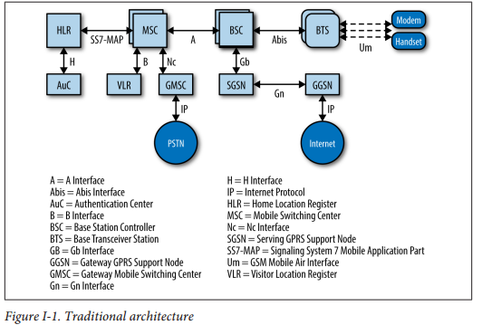
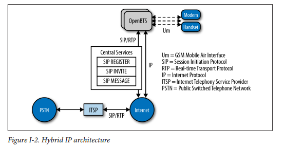

# 简介
电话很酷。是的，智能手机也很酷，但我正在谈论普通老式双向电话机。在地球上任何两点之间传递你的声音的能力是一个了不起的人类成就。也许更令人惊讶的是，这种成就多快被视为理所当然。过去100年来为建立公共交换电话网络进行了巨大的努力。铜网被挂起和埋葬。奠定了城市和城镇之间的长距离线路。人类手动路由和连接呼叫，然后模拟机器和数字计算机自动完成。一路上，移动网络被发明和部署。同样的基础设施故事发生在技术先进：设备升级，手机反复取代。现在，有线和无线电话网络几十年来都在稳固地提供语音服务，因此数据带宽正在进入下一个升级周期：光纤到家，LTE到智能手机。 OpenBTS桥接了这两个世界。通过在无线射频接口和开放IP协议之间转换，它允许任何具有IP连接的人部署移动网络。地球上的许多地方仍然没有家庭电话线或移动网络接收。但是，更多的时候，他们确实通过卫星或长途WiFi连接了互联网。恰当地集成，OpenBTS可以将这种互联网连接转换并分布到一个大的地理区域的移动网络。任何GSM电话都可以连接和使用语音服务或SMS，甚至基本数据。可以将连接带到偏远地区，同时跳过整个基础设施建设和升级周期。 OpenBTS和软件定义无线电的组合改变了我们应该考虑移动网络的方式。这项新技术允许纯软件构建复杂的无线电网络。 OpenBTS是一个C ++应用程序，它实现了GSM栈。随着新功能的实施或增加了协议支持，现有的OpenBTS移动网络的功能可以通过简单的软件更新来增强！另外，因为OpenBTS只是软件，你可以随心所欲地做任何事情。您不再需要硬件供应商的权限来访问其关闭的黑盒子实现。您可以构建一个利基产品或实验功能;移动网络最终开放创新。

## 谁应该读这本书
电信工程师 - 有线或无线，电路交换或分组交换 - 应该能够锁定OpenBTS项目的这一介绍。冒着将材料过于分散的危险，我们已经注意解释OpenBTS的无线电和IP侧。如果你是一名射频（RF）专家，你将学到一些关于互联网电话的知识。并在非常低的水平进行检查。如果您有兴趣在移动设备上调试应用程序，OpenBTS提供了几个原始接口，可以查看无线传输中的具体情况。您的软件还可以使用新的数据API来构建搜索和救援，紧急响应，功率优化，道路交通分析等应用。

## 为什么我写了本书
我的背景主要是在VoIP中。当我开始使用OpenBTS工作时，我很无意识地了解无线电系统的复杂程度。相反，我和其他人一起工作的是无线电专家，但从未接触过VoIP。 OpenBTS项目的文档很丰富，但非常广泛，以支持广泛的有关各方的观众;它需要简化。我们希望有一本新书能够为技术提供一个完整的新手，使他们能够成功建立自己的网络：获得语音通话的工作，交换一些短信等等。这个最初的成功应该建立信心，让这个人自己出发。我试图将健康数量的上下文组合到逐步的部分中。移动网络在GSM和RF方面仍然非常复杂。每个提示都有帮助。我希望你能在设置你的时候避免大问题！我也希望这本书足够有趣，可以在没有硬件的情况下阅读。在深入OpenBTS相关项目之前，本书应该为您提供足够的信息来确定所需资源的范围。 

## 今天移动网络上的文字
正如Marc Andreessen所说：“软件正在吃掉世界。”这在移动行业中绝对是正确的。随着处理能力变得更快，更便宜，现在可以在软件中实现极其复杂的信号处理算法。该软件也能够在日益通用的硬件上运行。由于专用硬件和协议而导致供应商锁定的时代已经过时，并且移动基础架构中的一些真正竞争和创新的机会似乎越来越接近。几年前，“建立自己的移动网络”这本书将成为一个非常不同的读者。 “编译”和“定制”这些词甚至可能没有出现。图I-1说明了这种网络的体系结构。

这种网络架构是许多人经过多年研究的令人难以置信的工程。它非常强大且可扩展，但不幸的是，它非常不灵活且非常昂贵。大学越来越关注这个问题，其中最着名的是加州大学伯克利分校新兴地区技术与基础设施（TIER）小组和硅谷卡内基梅隆大学的CyLab流动研究中心，该中心最近发表了一篇论文，这种传统的移动体系结构，包括来自传统有线网络的演变行李。
为了解决这个问题，出现了多个开源项目。仅举几例：Osmocom，OpenLTE和YateBTS。每个项目都有不同的目标和体系结构，以自己的方式解决传统网络的难题。然而，这本书是关于该组织的老将，OpenBTS。 OpenBTS项目是一组开源软件组件，可用于构建更现代化的轻量级网络。 OpenBTS允许传统移动网络的“Um”无线电接口直接与互联网电话协议互连。图I-2说明了这种新的“混合”体系结构。

手机上的软件或配置更改是不必要的，因为移动网络的无线接口与传统网络相同。然而，网络核心不再由一系列复杂的协议和服务器组成。它由开放协议组成，并使用IP作为其传输。已经存在许多实施这些开放协议的软件项目。 OpenBTS还开发了一些新组件，以提供仍不可用的功能，以连接GSM和互联网世界。围绕“云”的激动和围绕“应用程序”的激动如此之多，似乎最终这两者之间的沟通开始盛行。

## 浏览本书
到本书结束时，您将建立一个功能齐全的移动网络。它将显示为任何其他网络在您的手机上进行的操作，并在网络参与者之间路由呼叫和SMS，以及在手机和互联网之间提供数据连接。
- 第1章将逐步指导您选择无线电和处理硬件，设置基本操作系统和开发环境，以及编译和安装软件组件。 
- 第2章介绍初始组件配置和激活以及网络功能测试。 
- 第3章深入探讨生产网络的故障排除和性能调整技术。 
- 第4章详细介绍了如何将您的单节点网络扩展为具有移动性和切换功能的真正的多节点移动网络。 
- 第5章基于您的配置提供通用分组无线业务（GPRS）数据功能。 
- 第6章探讨了一个类似于WiFi专属门户网站的OpenBTS特有功能，可用于应急响应和ad hoc网络。 
- 第7章提供了与OpenBTS NodeManager控件和事件API之上的应用程序交互和构建应用程序的参考资料。 
- 第8章介绍了您的网络的一些后续步骤：与公共交换电话网络（PSTN）互连，专用分支交换（PBX）集成以及当前的频谱监管状态。 
- 附录A提供了GSM术语，RF测量，组件端口，路径和文件的快速参考。 
- 附录B介绍了Ubuntu 12操作系统的安装。 
- 附录C显示了如何捕获不仅IP交换机，而且还捕获原始的GSM无线电帧。

## 在线资源
OpenBTS社区
OpenBTS文档
GSM时隙和频道可视化器
GitHub上的OpenBTS源代码库

