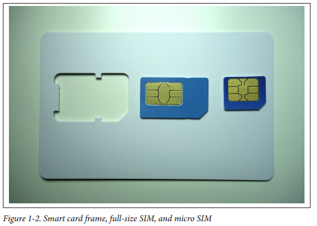

# 设置
在本章中，我们将指导您选择硬件，安装基本操作系统和开发环境设置，以及实际编译和安装组成OpenBTS软件套件的组件。可以采取几个捷径 - 例如，如果您希望使用官方二进制包而不是编译自己的程序包，但整个过程都是针对那些希望从头开始构建的程序。

## 硬件组件
虽然OpenBTS实现了用软件构建移动网络所涉及的大部分复杂性，但无线电波仍然必须以某种方式传输和接收。本节详细介绍了您应该采购哪些硬件组件以在开发环境中实现此功能。第2章介绍了这些组件的配置。

### Linux服务器
第一个需求是标准的商品Linux服务器。其他体系结构已经开始得到支持，但现在仍然坚持使用运行32位操作系统的x86处理器，以获得最佳结果。这台计算机可以是您测试环境中的独立计算机，也可以是您每天使用的笔记本电脑或台式机上的虚拟机。处理能力和RAM的最低要求由于涉及许多变量，例如并发载波信号的数量，网络负载，网络使用类型，无线电环境等，因此没有明确定义。每个变量都会影响所需的资源。单载波信号要求OpenBTS软件生成下行波形以发送给手机并解调从手机接收的上行波形。 OpenBTS支持在单个物理无线电上创建多个并发载波信号，以线性增加网络容量，但处理需求非常高。对于使用单载波信号（最多7个并行语音通道）的稳定实验室设置，建议使用Intel i5或与2 GB RAM相当的设备。它还必须至少有一个USB2接口，但USB3正迅速成为新软件定义无线电的要求。现在开始使用USB3可能是一个好主意，以避免将来升级。 USB接口增加吞吐量的需求与通过它传送的无线电波形样本的数量和大小有关。在生产环境中，可以使用多个同时载波信号，这大大增加了所需的采样带宽。另外，用于解调信号的算法可以被配置为以更稳健的方式进行操作（例如，纠正由于部署环境造成的信号失真）。因此，产生和解调这些信号所需的处理能力可能比实验室设备中的要大一个数量级。需要记住的另一件事是，随着OpenBTS的更新版本的推出，新的功能可能需要更多的处理能力或内存。例如，全球移动系统（GSM）模式下的OpenBTS可以在英特尔凌动处理器上平稳运行，但新的OpenBTS-UMTS（通用移动电话系统）至少需要一个英特尔i7。这个旁注实际上是在软件中定义无线电接入网络（RAN）的主要优点。随着新标准的发布，可以通过简单的软件更新将它们应用于生产RAN，而不是交换昂贵的硬件基础设施。

### 软件定义无线电
软件无线电（SDR）是从硬件角度使OpenBTS成为可能的关键突破。SDR已用于军事应用大约20年。直到最近，由于技术成本的降低，它们才能提供给更多的观众。现代SDR是一种通过USB电缆或以太网连接到计算机的硬件。它们通常与一副纸牌一样小，或者像三张DVD一样大，并通过USB主机连接或小型外部电源直接供电。 SDR硬件实现了一个完全通用的无线电，它可以通过主机应用程序发送和接收定义频率范围（即60 MHz至4 GHz）的原始波形。该主机应用程序可以是一个FM收音机实现，可以接收原始波形，解调信号并播放音频。这意味着无线电硬件不再是围绕特定应用设计的;完全由主机来定义实现，允许任何人纯粹用软件来创建无线电应用。 OpenBTS支持来自多个供应商的SDR：Ettus Research，Fairwaves，Nuand和Range Networks。这些产品的价格从大约500美元到超过2500美元不等。如果您选择通过以太网连接的产品，请确保您的Linux服务器具有用于无线电的专用以太网端口（最好是千兆位以太网）。大多数SDR是适用于任何无线电项目的完全通用的硬件，而一些SDR专门针对实施移动网络进行了优化。购买前请咨询供应商。天线许多SDR具有足够的发射和接收灵敏度，可以在小型环境下无天线操作。通常，可以实现半径为1米的覆盖区域。这是实验室环境的理想设置，特别是如果多个开发人员使用多个无线电。覆盖区域不会相互重叠和相互干扰。另外，您的网络不会干扰该地区的任何运营商。即使您的覆盖区域非常小，国家监管机构仍然很可能会要求您在使用GSM频率之前获得测试许可证。有关更多信息，请参阅第78页的“频谱管理”。在实验室环境中，多个开发人员将共享一个OpenBTS实例，因此必须扩展覆盖区域。添加一对小型5 dBi天线可以在无阻碍的环境中大幅提升，最高可达25米半径。这些通常是带有SubMiniature A型（SMA）连接器的橡胶鸭式天线，外观与典型的家庭WiFi路由器天线相似。图1-1显示了一个例子。


天线针对特定频率进行调谐，因此请选择与您将使用的GSM频段（850,900,1800或1900 MHz）最接近的频段。频率也在覆盖区域大小中起作用。低频段（850和900 MHz）传播的距离比高频段更大 - 有时几乎是两倍。

### 测试电话
对于测试，至少需要两个与您将使用的频段（850,900,1800或1900 MHz）兼容的GSM手机。大多数现代GSM手机都是“四频段”，这意味着所有频段都得到支持。还有“三频”和“双频”手持设备。确定手机是否与您的网络兼容的最简单方法是在GSM Arena上搜索模型。这里列出了完整的技术规格。您还必须确保您使用的手机已解锁。如果手机处于“锁定”状态，则意味着制造商已将硬件的基带处理器编程为仅与特定载波一起工作。通常可以通过在拨号盘上输入一系列数字来消除此限制，但这超出了本书的范围。最简单的选择是使用可以接受任何运营商的用户身份模块（SIM）卡的解锁手机。

### 测试SIM卡
GSM手机中使用的SIM卡只不过是一个精简的智能卡。智能卡也被称为芯片卡或集成电路卡（ICC），可以在许多认证和识别应用中找到。全尺寸智能卡具有与信用卡相同的尺寸;较新的信用卡实际上使用智能卡技术来提高安全性。 SIM卡使用标准智能卡写入器进行编程，一旦写入，就会从全尺寸卡框中弹出，以便它们适合GSM手机。图1-2显示了全尺寸智能卡载体，弹出的全尺寸SIM卡和微调的SIM卡。


有几种方法可以在您的测试环境中使用SIM卡。根据您的需求和未来的部署计划，您可以决定使用备用SIM，自己创建一些新的SIM，或者委托一家公司对其进行批量编程。

#### 使用备用SIM卡
出于测试目的，任何物理上适合手机的SIM卡都可能工作。但是，使用现有的SIM卡，已过期的SIM卡或外国的SIM卡会进行权衡，主要涉及安全功能。存储在SIM中的秘密密钥，名为“Ki”，只有SIM发行者知道。它存储在SIM卡中不可读的部分内存中，制造商将其放置在那里后无法检索。运营商和手机之间的这种共享秘密是允许网络在用户有效的情况下以密码方式确定的。 OpenBTS针对这种情况提供了一种称为“基于缓存的身份验证”的替代身份验证方法。它与手机进行初始身份验证交换并记录结果。它使用这个相同的请求，并期望在未来有相同的答案。该方法并不像每个请求的唯一交换一样安全，但仍然比完全禁用身份验证要好。另一个名为“Kc”的密钥用于支持呼叫加密。在您的测试环境中使用其他电话的SIM卡时，您将失去这两项功能，但如果您无法使用智能卡写卡器和空白卡，则这是您的最佳选择。当使用其他运营商的SIM卡连接到您自己的OpenBTS网络时，一些手机是棘手的。如果手机可以检测到它的“本地”载波信号，手动选择另一个载波的选项可能会从设置菜单中隐藏。在未锁定的iPhone中使用AT＆T SIM卡时通常会遇到这种情况。

#### 自制SIM卡
要为您自己的测试环境创建一小批SIM卡，您需要空白的可擦写“神奇”SIM卡和智能卡写卡器。阿里巴巴网站上的多家供应商提供了许多产品。通过USB连接的示例作者如图1-3所示，但市场上有许多不同寻常的作家。


软件安装和写入命令取决于选择哪个写入器和卡。有关编写SIM卡的最新信息可以在OpenBTS wiki页面上找到。

#### 批量SIM卡
SIM写入公司开始以合理的价格提供更少量的卡片。您通常会提交一些关于您的订单的参数，例如卡片工艺，所需的验证算法和卡片数量，以获得报价。一旦订购完成，成品将是一盒SIM卡以及一张单独的文件或文件，其中包含每张卡片的ID和加密密钥列表。然后可以使用脚本将该列表批量导入到订户数据库中。现在，您的所有订阅者都可以进行系统配置，无需手动刻录10,000张个人SIM卡，而且每个用户都留下了精美的SIM卡。

#### 全尺寸与微米与纳米
相比一旦你有一个技术上兼容的SIM卡（2G与3G与4G等），它可能仍然具有不兼容的外形因素。这很容易通过使用SIM卡切割器来弥补，这是运营商喜欢收取可观的服务费用。它看起来像订书机，但功能更像是曲奇工具，如图1-4所示。


他们可以以低于20美元的价格购买，并将SIM卡从标准转换为微型，并将微型转换为纳米。这些尺寸之间的唯一区别是实际芯片周围的塑料量。

## 操作系统和开发环境设置
现在已经收集了硬件，您可以继续设置开发环境。 OpenBTS传统上是在Ubuntu长期支持（LTS）发行版上开发和测试的。它也在Debian和CentOS发行版上进行了测试。对于本书，将使用经过测试的分发和体系结构：Ubuntu Server 12.04 LTS 32位。从OpenBTS 5.0开始，64位系统也受到支持，但尚未广泛部署。除了Ubuntu 12之外，Ubuntu 13和14系统也已成功使用。基于RPM的系统（CenOS，Fedora和Red Hat Enterprise Linux）的初步打包也可用，但本书不会涉及。请访问OpenBTS.org获取更多信息。如果您尚未安装兼容的操作系统，附录B将提供完整的分步指南。如果您打算使用官方OpenBTS发行包，请随意跳到第10页的“安装”。

### Git兼容性
Git是一个管理软件源代码更改的版本控制系统。 OpenBTS项目利用了Git中的一些新功能，例如子模块分支跟踪。为确保您的客户端兼容（例如，比1.8.2更新），它需要更新。首先，执行这个命令来添加对Personal Package Archives的支持，这是一种分发二进制发行包的替代方法：
```
$ sudo apt-get install software-properties-common python-software-properties
```
然后，执行以下命令为最新的Git构建到您的系统：
```
$ sudo add-apt-repository ppa：git-core/ppa
```
现在，您只需刷新软件包列表并再次安装Git来更新系统的客户端：
```
$ sudo apt-get update 
$ sudo apt -get install git
```
要确认新的Git客户端已正确安装，请运行以下命令：
```
$ git --version 
git version 1.9.1
```
现在您已安装Git，您可以继续下载开发脚本。

### 下载代码
OpenBTS项目由多个托管在GitHub上独立开发库中的软件组件组成。理解Git的复杂性不应该成为使用OpenBTS的障碍，因此编写了几个开发脚本，以便下载代码，切换分支和编译组件。要将这些开发脚本下载到新环境中，请运行以下命令：
```
$ git clone https://github.com/RangeNetworks/dev.git
```
开发脚本假定您为GitHub设置了安全Shell（SSH）密钥。如果您不这样做，请在继续之前按照这些说明进行设置。
现在，要下载所有组件，只需运行clone.sh脚本：
```
$ cd dev $ ./clone.sh
```
每个组件的存储库都将从GitHub克隆到您的开发环境中。 clone.sh脚本还会自动初始化所​​需的任何子模块。既然OpenBTS项目源代码位于您的开发环境中，您可以选择特定的分支或版本进行编译。 switchto.sh脚本用于在构建版本目标之间切换。例如，如果要构建v4.0.0发行版，请运行以下命令：
```
$ ./switchto.sh v4.0.0
```
可以使用state.sh脚本为每个组件列出当前版本的目标。该脚本还列出了每个组件的任何未完成的本地更改。 
```
$ ./state.sh
```
本书重点介绍5.0系列分支。要定位5.0中最新，最好的代码，请运行以下命令：
```
$ ./switchto.sh 5.0
```

### 构建代码
现在您的开发环境已准备好在5.0系列分支中构建最新的位。要编译二进制包，您将使用build.sh脚本。它会自动安装编译器和自动配置工具以及任何所需的依赖关系。它还控制将构建哪个无线电收发器应用。由于有多种不同的驱动程序可用于各种无线电类型，因此build.sh需要一个参数，以便知道哪个硬件正在定位（有效的无线电类型为SDR1，USRP1，B100，B110，B200，B210，N200和N210）。 OpenBTS还支持Fairwaves的UmTRX硬件。但是，它使用UHD无线电驱动程序的定制版本，并且build.sh脚本尚未自动安装。本书的目标是Ettus Research N200。立即运行build命令：
```
$ ./build.sh N200
```
这个过程在第一次运行时可能需要一段时间（30-60分钟），具体取决于正在执行的硬件。展望未来，您只需重新编译更新的组件。例如，以下命令仅重新编译Ettus Research B100收音机的OpenBTS包：
```
$ ./build.sh B100
```
openbts当构建脚本完成时，将会有一个名为“BUILDS”的新目录，其中包含一个子目录建立时间戳。此目录的示例如下所示：
```
$ ls dev/BUILDS/2014-07-29--20-44-51/*.deb 
liba53_0.1_i386.deb range-asterisk-config_5.0_all.deb 
libcoredumper1_1.2.1-1_i386。 deb range-configs_5.0_all.deb 
libcoredumper-dev_1.2.1-1_i386.deb sipauthserve_5.0_i386.deb 
openbts_5.0_i386.deb smqueue_5.0_i386.deb 
range-asterisk_11.7.0.4_i386.deb
```
恭喜！您现在可以继续安装和启动每个组件，并了解每个组件的用途。

## 安装
现在你已经下载了一套官方发行版软件包或编译好自己的软件包，需要安装并启动它们。为每个组件提供一些背景信息，然后提供安装过程和所需的任何初始化配置。由于一些组件依赖于其他组件，它们将按照满足这些相互依赖性的顺序呈现。在继续之前，请转到新的编译目录：
```
$ cd dev/BUILDS/2014-07-29--20-44-51/
```

### 安装依赖关系
如果您使用build.sh脚本在前一节编译了自己的一组包，这些依赖关系已经安装完毕，这部分可以跳过。如果您使用的是一组官方发行版软件包，则需要安装一些额外的系统库并定义一个额外的资源库源，以便找到并安装所有依赖项。执行以下命令为ZeroMQ定义额外的存储库源，ZeroMQ是所有组件使用的库：
```
$ sudo apt-get install software-properties-common python-software-properties 
$ sudo add-apt-repository ppa：chris-lea/zeromq 
$ sudo apt-get update
```

#### Coredumper库
OpenBTS使用coredumper共享库来产生有意义的调试信息，如果OpenBTS崩溃。 Google最初编写了它，实际上有两个libcoredumper软件包：libcoredumper-dev包含编译利用coredumper库的程序所需的开发文件，libcoredumper包含应用程序在运行时加载的共享库：
```
$ sudo dpkg -i libcoredumper1_1.2.1-1_i386 .deb
```
自发布本书以来，包名中的确切版本号可能已发生变化。 

#### A5/3库
OpenBTS使用A5/3共享库来支持呼叫加密。它包含必须与OpenBTS分开分发的加密程序例程：
```
$ sudo dpkg -i liba53_0.1_i386.deb
```
### 安装组件
通过在全新系统上安装以下所有组件，可以确保您可以使用功能齐全的GSM网络，框。语音，短信和数据所需的一切都将在一个系统中运行。您将要安装的整体架构如图1-5所示。


会话发起协议（SIP）和实时传输协议（RTP）是OpenBTS用于将GSM流量转换为VoIP的两种协议。

#### 系统配置
此软件包包含一组默认配置，可让新的Ubuntu系统在安装时即装即用。它包括网络接口，防火墙规则，域名系统（DNS）配置，日志记录等设置。如果您已经习惯于配置Linux发行版，但可能不想安装此软件包，但其内容可用作指导进行所需的更改。在安装过程中，系统会多次提示您确认覆盖某些配置文件。如果您不确定文件的功能，在处理全新系统时，安全答案始终为“Y”：
```
$ sudo dpkg -i range-configs_5.0_all.deb
```
如果您回答“Y”，则此软件包将覆盖您的网络接口配置，当询问有关/etc/network/interfaces的更改时。您可以在此提示下回答“N”，并保留您的配置：但是，只有手动将第62页的“中央服务”中详述的文本添加到您的接口定义之后，GPRS才能正常工作。它负责调用iptables-restore自动加载防火墙规则。 

#### Asterisk
Asterisk是一个VoIP交换机，负责处理SIP INVITE请求，建立呼叫的各个部分，并将它们连接在一起。有两个包负责设置Asterisk安装，它不需要任何额外的配置：range-asterisk和range-asterisk-configs。 range-asterisk软件包包含Asterisk SIP交换机软件的确认版本，并确保已包含OpenBTS所需的相应模块。没有包含Asterisk的其他补丁;它只是为了代表Asterisk最新的确认版本。 range-asterisk-configs软件包包含一组配置文件，因此Asterisk知道并可以与订户注册数据库进行通信。这个数据库是各种组件存储和更新用户的电话号码，身份，身份验证，来电显示和注册状态的地方。另外，通过使用这个数据库，在将新手机添加到网络时，不再需要手动编辑Asterisk配置文件：
```
$ sudo dpkg -i range-asterisk*.deb $ sudo apt-get install -f
```
#### SIPAuthServe
SIP授权服务器（SIPAuthServe）是一个应用程序，用于处理OpenBTS在手机尝试加入移动网络时产生的SIP REGISER请求。当手机认证成功时，SIPAuthServe负责使用启动它的OpenBTS实例的IP地址更新订户注册数据库，允许其他订户呼叫手机：
```
$ sudo dpkg -i sipauthserve_5.0_i386.deb 
$ sudo apt -get install -f 
```
#### SMQueue 
SIP MESSAGE Queue（SMQueue）是一个应用程序，用于处理手机发送SMS时OpenBTS生成的SIP MESSAGE请求。它存储消息，安排它们在网络中传送，并在目标手机不可用时重新安排它们：
```
$ sudo dpkg -i smqueue_5.0_i386.deb 
$ sudo apt-get install -f
```
#### OpenBTS
最后，我们到达显示。 OpenBTS负责在软件中实现GSM空中接口，并直接与GSM手机通信。该通信在IP网络侧转换为SIP和RTP，并与上述组件交互以形成核心网络。 GSM手机看到一个完全兼容的GSM无线接入网络，核心网络可以看到标准的SIP端点。任何一方都不应该知道允许手持设备无缝连接到IP世界之间有一层：
```
$ sudo dpkg -i openbts_5.0_i386.deb 
$ sudo apt-get install -f
```

### 启动/停止组件
现在每个组件都已安装，你需要开始他们。使用名为Upstart的系统在Ubuntu上控制组件。未来版本的OpenBTS套件将支持其他机制，如systemd，但现在使用Upstart。要启动所有组件，执行以下命令：
```
$ sudo start asterisk 
$ sudo start sipauthserve 
$ sudo start smqueue 
$ sudo start openbts
```
相反，要停止所有组件，请使用：
```
$ sudo stop openbts 
$ sudo stop asterisk 
$ sudo stop sipauthserve 
$ sudo stop smqueue
```
启动和关闭的顺序并不重要，但如果OpenBTS在没有其他组件的情况下运行，GSM网络将可见但不可用。每个组件都在后台运行，并在出现故障时自动重启。要监视组件在后台运行时的控制台输出，可以使用以下日志文​​件：
```
/var/log/upstart/asterisk.log 
/var/log/upstart/sipauthserve.log 
/var/log/upstart/smqueue.log/var/log/upstart/openbts.log
```
系统组件已安装并正在运行。下一步将开始测试和配置它们。


