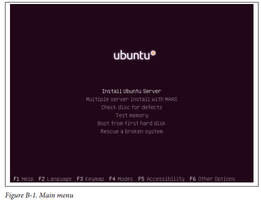
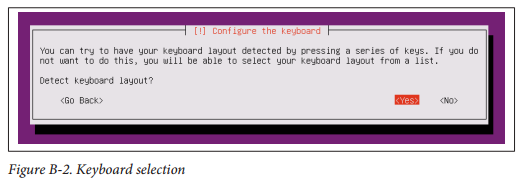
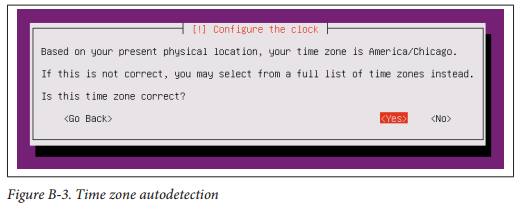
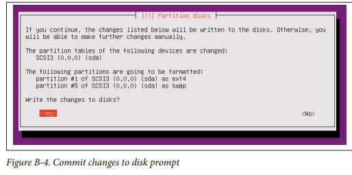
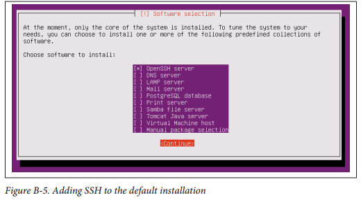

# 附录B操作系统安装
在新计算机或虚拟机上，请执行以下步骤以生成兼容的最低操作系统安装。如果您已安装兼容的操作系统，请随时跳到第8页上的“Git兼容性”。使用虚拟机时，必须至少将两个内核分配给该实例。

## 下载和准备启动媒体
Ubuntu 12.04 LTS安装镜像（.iso文件）可从此页面下载。在“服务器安装CD”部分中，下载从“PC（Intel×86）服务器安装CD”链接的文件。“这是32位服务器安装程序。 Ubuntu桌面与Ubuntu服务器一样也同样工作，但服务器版本的安装足迹更小。图像下载完成后，可以将其刻录到物理磁盘上，以便安装在独立的服务器硬件上。如果您使用的是虚拟机，只需在系统提示启动介质时选择该.iso映像文件即可。 如果您正在使用VMware软件，请取消选中“使用简易安装”选项。一旦物理服务器将这个新磁盘放入其CD托盘中，将其启动。同样，现在可以启动新的虚拟机。

## 开始安装
您将看到的第一件事是语言选择菜单。这是将用于安装过程的语言。本书将使用英文，但可以随意使用您的母语。用箭头键移动选择器以突出显示所需的语言，然后按Enter键。现在主菜单如图B-1所示。图B-1。主菜单从该菜单中选择“安装Ubuntu服务器”。 

## 配置安装
显示的下一个屏幕是另一个语言选择菜单。这是将在安装的系统中使用的语言，而不是安装过程。再次，本书将使用英文，但如果需要，您可以选择更舒适的选项。使用箭头键移动选择器以突出显示所需的语言，然后按Enter键。随后的屏幕标题为“选择您的位置”，用于配置时区和区域设置，例如日期和时间的格式。美国将在本书中使用。使用箭头键移动选择器以突出显示您的国家，然后按Enter键。现在你的键盘布局必须被选中。您可以使用键盘布局自动检测或选择国家和布局。检测是一系列相对简单的要求按键和问题，将决定使用的键盘类型。本书中的步骤假定您使用了自动检测方法。出现“检测键盘布局？”的问题后，使用箭头键选择“是”并按下Enter开始自动检测过程，如图B-2所示。完成后，按Enter键确认检测到的布局，选择“继续”。图B-2。键盘选择最后，必须为系统输入一个主机名。您可以选择适合您的网络命名方案的主机名。本书使用默认名称“Ubuntu”。通过按Tab选择它以突出显示“继续”，然后按Enter键确认。

## 添加OpenBTS用户
系统上必须存在用户“openbts”。最简单的方法是在安装过程中进行配置。在“设置用户和密码”屏幕上的“新用户全名”字段中，输入“openbts”，按Tab键突出显示“继续”，然后按Enter键确认。配置安装| 87将出现下一个字段，“您帐户的用户名”。在此字段中输入“openbts”，按Tab键突出显示“继续”，然后按Enter键确认。现在将显示新用户的密码字段。输入密码，按Tab突出显示“继续”，然后按Enter键确认。随后将出现密码确认字段。输入相同的密码，按Tab键突出显示“继续”，然后按Enter键确认。如果密码不够复杂，可能会出现一个屏幕，询问您是否要使用此弱密码。您可以选择制作更复杂的密码，也可以接受它。一旦提问“使用弱密码？”，请使用箭头键选择“是”或“否”，然后按Enter键确认。最后，会出现一个屏幕，询问您是否想为该用户的主目录加密。 OpenBTS套件尚未经过加密用户目录的测试，因此此处的安全选项为“否”。使用箭头键选择“否”并按Enter键确认。

## 网络配置和自动检测
安装程序大多会自动执行下一节，因为它使用DHCP自动配置网络连接。如果DHCP服务不可用，则需要手动输入服务器的IP地址以及网络的网络掩码，网关和DNS信息。这不在本书的范围之内。请在线查阅Ubuntu服务器文档。网络硬件和配置自动完成后，将出现带有自动检测时区的提示，如图B-3所示。图B-3。时区自动检测如果时区对应您的位置，请使用箭头键选择“是”，然后按Enter键确认。如果不匹配，请选择“否”，然后按Enter键调出手动选择菜单。 

## 配置磁盘
安装程序现在已经快要开始将文件写入磁盘，但必须先对其进行分区。最简单的方法是让Ubuntu使用整个磁盘。如果您已经在磁盘上安装了另一个操作系统，或者想自定义所使用的分区方案，则需要再次查阅Ubuntu文档，因为这不在本书的讨论范围之内。在“分区磁盘”屏幕上的“分区方法”问题中，使用箭头键突出显示“引导 - 使用整个磁盘”并按Enter键确认。将出现一个新的屏幕，列出可用的磁盘。使用箭头键突出显示所需的目标磁盘，然后按Enter键确认。最后，将出现一个确认屏幕，如图B-4所示。图B-4。提交对磁盘提示的更改请确保它是正确的目标磁盘。完成此步骤后，磁盘内容可能会不可逆转地丢失。对于“将更改写入磁盘？”问题，请使用箭头键选择“是”，然后按Enter键确认。

## 基本软件和更新
程序包管理器现在需要配置。出现的第一个屏幕允许您在网络上指定HTTP代理。如果有，请在“HTTP配置磁盘”中输入89proxy信息“字段;否则留空。按Tab键突出显示“继续”，然后按Enter键确认。标题为“配置tasksel”的下一个屏幕允许在系统上激活自动更新。为避免未经您许可的情况下安全更新破坏您的系统的可能性，应将其停用。按回车确认“无自动更新”的默认值。最后，将出现一个屏幕，允许您将一些基础软件添加到默认安装。唯一有趣的项目是“OpenSSH”，它安装了Secure Shell服务，允许远程控制台访问服务器。使用空格键激活“OpenSSH”，然后按Tab键突出显示“Continue”并按Enter确认，如图B-5所示。图B-5。将SSH添加到默认安装

## 完成安装
仍需要一小部分名为GRUB的软件，以便可以在系统引导时加载操作系统。与分区说明一样，如果您将Ubuntu安装在另一个现有操作系统旁边，则需要查阅Ubuntu文档。出现“将GRUB引导装载程序安装到主引导记录？”的问题后，使用箭头键突出显示“是”，然后按Enter键确认。最终屏幕将显示确认安装已完成。如果这是一台物理服务器，请在此时删除安装CD。按Enter确认，系统现在将重新启动。 

## 第一次登录
系统重新启动后，请使用用户名“openbts”和密码登录。 

### SSH
如果您不想直接使用Linux服务器硬件或虚拟机，请改为使用SSH访问。这是在安装步骤中安装的“OpenSSH”服务。它允许您通过网络连接登录到计算机。如果您使用的是OS X或Linux桌面，则SSH客户端是内置的。打开终端应用程序并执行以下命令：$ ssh openbts @ your-linux-server-ip如果您使用Windows，则需要一个第三方客户端。最流行的是PuTTY。使用以下登录详细信息进行连接：
•用户名：openbts
•密码：您选择的密码
•主机：your-linux-server-ip
•端口：22
您已登录并准备好继续配置开发环境。
