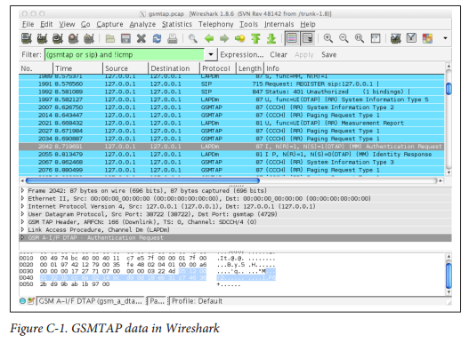

# 附录C捕获流量
两种来源可用于捕获OpenBTS安装中的活动。可以记录网络的IP侧进行调试或分析，原始的GSM和GPRS无线电帧也是如此。统一到一个单一的流中，它为基带开发人员，应用程序作者和网络工程师提供了一个非常强大的研究工具。 

## IP流量
第一个来源是在OpenBTS的各个组件之间发送的原始IP数据包。除了VoIP信令和媒体流之外，还有许多其他端口交换数据。表A-3列出了这些端口及其设置和类型的列表。为了从这些端口捕获数据，需要一个名为tcpdump的小型实用程序。它可以侦听系统上的任何网络接口，并显示和/或将流量记录到文件中。现在安装它：
```
$ sudo apt-get install tcpdump 
```
tcpdump的确切用法超出了本书的范围，因此仅举几个例子。要了解更多信息，请使用man（manual）命令：
```
$ man tcpdump
```
要从本地环回接口（-i lo）在控制台上显示（-s0 -A）所有SIP信令（portrange 5060-5069），请执行以下内容：
```
$ sudo tcpdump -i lo -n -s0 -A portrange 5060-5069
```
您可以将其记录在pcap（数据包捕获）格式的文件中，而不显示跟踪的流量。下面概述的Wireshark GUI工具使用pcap格式。要将所有RTP介质（portrange 16484-16584）记录到文件（-w rtp.pcap），执行以下命令：
```
$ sudo tcpdump -i lo -n -s0 -w rtp.pcap portrange 16484-16584
```
当运行一个多节点系统中，流量不会出现在环回接口上。它将通过硬件网络接口进行物理传输和接收。要指定此接口，请使用上面的“-i”标志，但用接口名称替换“lo”。例如，要在控制台上从eth0接口显示（-s0 -A）所有对等协议（端口16001），请执行以下命令：
```
$ sudo tcpdump -i eth0 -n -s0 -A port 16001
```

## GSM流量
IP流量为容易捕捉，但无线电接口如何？这样做有一个方便的功能，叫做GSMTAP。它将通过空中发送和接收的GSM和GPRS无线电突发重新封装为IP数据包。这些数据包然后成为正常IP跟踪的一部分，由tcpdump捕获，如上所述。有三个参数用于配置GSMTAP：

Control.GSMTAP.GSM启用或禁用GSM跟踪
Control.GSMTAP.GPRS启用或禁用GPRS跟踪
Control.GSMTAP.TargetIP GSMTAP数据的IP目的地

假设所有组件都从同一台计算机上运行，控制.GSMTAP.TargetIP的默认值127.0.0.1会很好。这意味着GSMTAP帧将被发送到本地环回接口，以便通过tcpdump进行捕获。如果您的组件在不同的计算机上运行，​​则需要将Con trol.GSMTAP.TargetIP设置为您的中央服务计算机的IP地址。要开始发送GSM无线电通信作为IP，必须启用Control.GSMTAP.GSM密钥：
```
OpenBTS> config Control.GSMTAP.GSM 1 Control.GSMTAP.GSM from “0” to “1”
```
现在，使用tcpdump捕获所有IP环回接口上的IP流量并将其存储为pcap文件：
```
$ sudo tcpdump -i lo -n -s0 -w gsmtap.pcap
```
当您完成跟踪时，可以通过按Ctrl-C来停止tcpdump。生成的文件gsmtap.pcap可以在Wireshark中打开。您可以在您的测试系统上安装Wireshark（如果它已经有可用的桌面），或者使用SFTP将pcap文件复制到您的日常桌面计算机上。 捕获在Wireshark中打开的TrafficOnce，GSMTAP数据可以显示为任何其他网络流量。它甚至有自己的显示过滤器：gsmtap。在下面的屏幕截图中，使用了一个相当常见的过滤器组合：（gsmtap或sip）和！icmp。通过这种滤波器组合，GSM和SIP信令按时间顺序可见，使得痕迹易于理解。图C-1来自成功向基站注册的手机的GSMTAP迹线。 Packets 1991和1992（OpenBTS和SIPAuthServe之间的SIP交换）启动了此GSM认证信息请求。突出显示的分组2042是从基站发送给手持设备的认证请求。下面的数据包2055是手机对基站的响应。图C-1。 Wireshark中的GSMTAP数据


正如您所看到的，与tcpdump和Wireshark相结合的GSMTAP是一个非常强大的工具。
