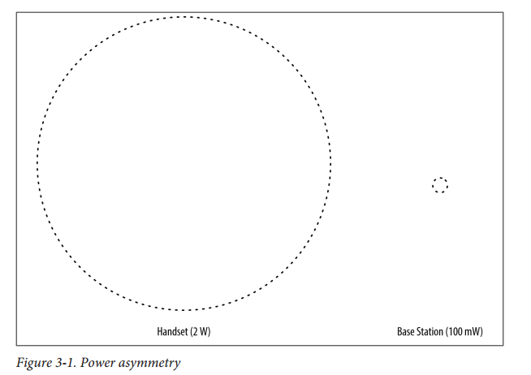
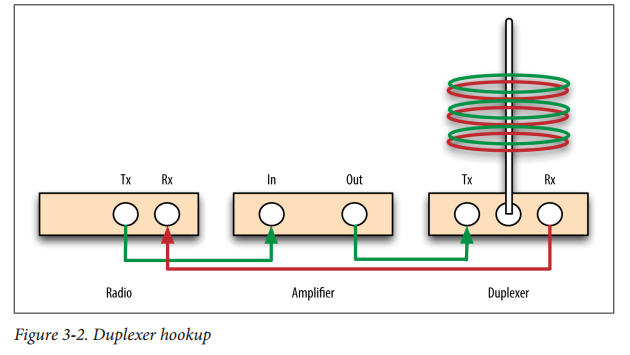

# 第3章 故障排除和性能调整
随着您的网络越来越多地适应生产，您将需要一些其他技术来帮助调试出现的问题。虽然有些错误与错误配置直接相关，但其他错误并不明显。根据部署条件和网络使用模式，网络问题实际上可能与性能不佳有关。为您的特定场景优化网络性能可能是关键。因此，故障排除和调整一起呈现。

## stats命令
观察OpenBTS中事件发生的快速而简单的方法是使用stats命令。有几十个事件类型被跟踪。要获取它们的完整列表，请运行不带参数的stats命令：
```
OpenBTS> stats
```
每个事件类型只是一个小型SQLite3数据库中的一个键名，每个键的值对应于该事件发生的次数上次统计数据库已被清除。清除数据库非常方便，可以为您感兴趣的事件提供已知的启动计数。要清除数据库，请执行以下操作：
```
OpenBTS> stats clear
stats table (gReporting) cleared
```
现在，如果从网络中的一部手机发送短信至另一部手机，并搜索SMS-相关的事件，你会看到如下内容：
```
OpenBTS> stats SMS
OpenBTS.GSM.MM.CMServiceRequest.MOSMS: 1 events over 4 minutes
OpenBTS.GSM.SMS.MOSMS.Start: 1 events over 4 minutes
OpenBTS.GSM.SMS.MOSMS.Complete: 1 events over 4 minutes
OpenBTS.GSM.SMS.MTSMS.Start: 1 events over 4 minutes
OpenBTS.GSM.SMS.MTSMS.Complete: 1 events over 4 minutes
```

OpenBTS.GSM.MM.CMServiceRequest.MOSMS显示手机发信号给基站，它希望执行移动发起的SMS（MOSMS）。 OpenBTS.GSM.SMS.MOSMS.Start和Complete键显示MOSMS已启动并完成。 前三个键与从手机到基站的初始传输有关。 最后两个键显示从基站到目的地手机的移动端接SMS（MTSMS）已经开始并完成。

## 运行时日志
所有OpenBTS组件的日志都存储在/var/log/OpenBTS.log中。 为了在生产时监控它们，请执行：
```
$ tail -f /var/log/OpenBTS.log
```
如果您只想监视包含某些文本的日志条目，则可以链接tail和grep命令。 例如，要只监视包含“sipauthserve”文本的新条目，请使用以下命令：
```
$ tail -f /var/log/OpenBTS.log | grep sipauthserve
```
您还可以搜索特定文本的现有日志。 在本例中，我们没有监视新条目，而是在整个日志文件中搜索文本“sipauthserve”：
```
$ grep sipauthserve /var/log/OpenBTS.log
```
日志条目包含许多不同的信息。 这是OpenBTS生成的一个示例条目：
```
2014-09-04T10:50:09.258961+02:00 ubuntu openbts: NOTICE 27238:27238 2014-09-04T10:50:09.2 GSMConfig.cpp:132:regenerateBeacon: regenerating system information messages, changemark 5
```
从左到右的字段是：
•数据写入时间戳：“2014-09-04T10：50：09.258961 + 02：00”
•系统主机名：“ubuntu”
•系统应用程序：“openbts”
•事件级别：“NOTICE”
•事件用户和组：“27238：27238”
•数据创建时间戳：“2014-09-04T10：50：09.2”
•事件源文件，行和函数名称：“GSMConfig.cpp：132：regenerateBeacon
•事件文本：“regenerating system information messages, changemark 5”

### 日志级别
默认情况下，组件仅设置为在通知级别和更高级别上记录事件。这通常是足够的信息来调试典型的服务错误，如掉话或高干扰率。所有OpenBTS组件使用的日志记录系统具有八个报告事件级别：
EMERG
报告与服务故障或硬件损坏相关的严重故障
ALERT
报告配置错误或连接不畅导致的服务中断
CRIT
报告可能会降低服务的异常事件
ERR
报告在特殊情况下可能导致服务退化的软件内部错误
WARNING
报告可能表明正常服务退化的异常事件
NOTICE
报告可能不会影响服务但可能会对网络运营商感兴趣的异常事件
INFO
报告正常事件
DEBUG
会降低系统性能;仅供开发人员使用

要从系统中获取不同的信息，请调整日志记录级别。例如，INFO级别还报告正常事件（除NOTICE和以上）。这些正常事件可以为您提供上下文，以推断可能发生的错误。要更改组件范围内的日志记录级别，请执行以下操作：
```
OpenBTS> config Log.Level INFO
Log.Level changed from "NOTICE" to "INFO"
```

一旦您从日志中定位了一些可疑活动，您就可以使用源文件字段来公开该应用程序的更多信息。 上面的事件是从GSMConfig.cpp发出的。 要在该源文件上启用DEBUG级别日志记录，请执行以下操作：
```
OpenBTS> rawconfig Log.Level.GSMConfig.cpp DEBUG
defined new config Log.Level.GSMConfig.cpp as "DEBUG"
```
您需要使用rawconfig来定义此键/值对，因为它不在配置模式中。 要从配置数据库中删除此自定义键/值对，请使用rmconfig：
```
OpenBTS> rmconfig Log.Level.GSMConfig.cpp
Log.Level.GSMConfig.cpp removed from the configuration table
```
从OpenBTS 5.0开始，现在可以为OpenBTS中的各个子系统组定义一个日志级别。 以下每组可单独调整：
• Log.Level.Control
• Log.Level.SIP
• Log.Level.GSM
• Log.Level.GPRS
• Log.Level.Layer2
• Log.Level.SMS
同样，因为这是一个自定义键/值对，所以您必须使用rawconfig：
```
OpenBTS> rawconfig Log.Level.SIP DEBUG
defined new config Log.Level.SIP as "DEBUG"
```
再次，要从配置数据库中删除自定义键/值对，请使用rmconfig：
```
OpenBTS> rmconfig Log.Level.SIP
Log.Level.SIP removed from the configuration table
```

在整个组件范围内使用DEBUG级别会产生如此多的信息，以至于它可能会破坏OpenBTS的稳定性。 DEBUG只能用于单个源文件或日志组。

## 环境调整
使OpenBTS在部署环境中良好运行是关键的一步。 周围的建筑物和树叶，气候，塔架高度，天线选择，电缆长度和放大器功率都起到了作用。 整个企业都建立在提供这方面的专业知识的基础上，而硬件主题则过于宽泛，无法在这里以有意义的方式进行讨论。 任何可靠的部署都需要硬件和软件调优。 本节坚持使用OpenBTS软件中的控件。

### 非用户电话
如果您的部署使用第46页的“更强，更清洁的信号”中所述的放大射频链路，并且该区域的其他载波信号较弱或不存在，则必须处理非用户手持设备。所有可以看到您的网络的手机都将尝试加入，因为它们没有本地服务。在农村社区部署中，这是一个非常普遍的问题。这些社区的大多数居民在带着服务前往附近城镇时都有手机。当他们到达时，手机可能不会关机。如果在这种情况下新塔楼升级，它可能不得不处理数千个非订户手持设备。这些手机产生将被拒绝的LUR。有超过20种不同的方式来拒绝这些请求;关键是要为您的部署使用正确的一个。默认情况下，OpenBTS使用非常友好的拒绝原因（0×04），允许手机在几分钟内重试。您需要使用拒绝原因，告诉手机长时间消失，以便LUR流量不会使系统瘫痪，直到授权人无法使用它为止。有两个参数可以定义您想要使用的拒绝原因：
```
OpenBTS> config RejectCause 
Control.LUR.404RejectCause 0x04 [default] Control.LUR.UnprovisionedRejectCause 0x04 [default] 
```
Control.LUR.404RejectCause键定义哪个原因在未知用户尝试加入时使用，而Control.LUR.UnprovisionedRejectCause定义了当已知用户尝试加入但未通过认证时要使用的内容。可能有理由独立调整它们，但现在它们将被设置为相同。允许的拒绝代码在表3-1中描述。

Table 3-1. Reject causes, as defined in GSM 04.08 section 10.5.3.6

Hex value| Description
---- | ----
0x02| IMSI unknown in HLR
0x04| IMSI unknown in VLR
0x05| IMEI not accepted
0x0B| PLMN not allowed
0x0C| Location area not allowed
0x0D| Roaming not allowed in this location area
0x11| Network failure
0x16| Congestion
0x20| Service option not supported
0x21| Requested service option not subscribed
0x22| Service option temporarily out of order
0x26| Call cannot be identified
0x30| Retry upon entry into a new cell
0x5F| Semantically incorrect message
0x60| Invalid mandatory information
0x61| Message type nonexistent or not implemented
0x62| Message type not compatible with the protocol state
0x63| Information element nonexistent or not implemented
0x64| Conditional IE error
0x65| Message not compatible with the protocol state
0x6F| Unspecified protocol error

根据手机的不同，每种手机都可能有不同的效果。 通过测试，一些最受欢迎的产品出现并在表3-1中突出显示。 这些值会指示非用户手机长时间消失，但与此同时，不会导致手机放弃加入其他网络。 现在更改这些值以减少非用户LUR流量：
```
OpenBTS> config Control.LUR.404RejectCause 0x0C
Control.LUR.404RejectCause changed from "0x04" to "0x0C"
OpenBTS> config Control.LUR.UnprovisionedRejectCause 0x0C
Control.LUR.UnprovisionedRejectCause changed from "0x04" to "0x0C"
```

### 覆盖区域
让手机忽略你的网络的另一种方法是实际上阻止他们看到它。 这是通过缩小可用覆盖区域的物理和政策来完成的。 短信和注册服务的覆盖范围可能比语音服务大4倍（2倍半径），因为丢失的帧可以在不中断服务的情况下进行重传。

#### 物理层收缩
OpenBTS有一个功率控制机制，可以调整发射功率的衰减来扩大或缩小覆盖区域。 要检查基站的当前衰减级别，请使用电源命令：
```
OpenBTS> power
current downlink power –10 dB wrt full scale
```
要调整衰减，只需提供一个参数给power命令。 要将基站增加到覆盖范围最大的最大功率，请指定应该有0 dB的衰减：
```
OpenBTS> power 0
current downlink power 0 dB wrt full scale
```
相反，增加衰减来降低功耗并缩小覆盖区域：
```
OpenBTS> power 20
current downlink power -20 dB wrt full scale
```
还有另一种物理层功率控制可用。 手机也使用不同的功率电平向基站传输，因此所有手机的接收功率在到达基站时的强度大致相同。 基站控制手机使用的功率电平，并可用于手机，所以我们可以限制这个范围。 手机无法控制它将使用的功率级别，所以我们可以限制它被告知使用的数值范围。 MS.Power键允许这样做：
```
OpenBTS> config MS.Power
GSM.MS.Power.Damping 75 [default]
GSM.MS.Power.Max 33 [default]
GSM.MS.Power.Min 5 [default]
```
虽然这种方法不太常用，但为了完整起见，这里也包含它。

#### policy收缩
在大量使用的情况下，物理缩小覆盖区域可能不足以稳定网络。 还有一个参数可以派上用场，GSM.MS.TA.MAX：
```
OpenBTS> config GSM.MS.TA
GSM.MS.TA.Damping 50 [default]
GSM.MS.TA.Max 62 [default]
```
TA代表时间提前。定时提前是GSM用于补偿远离基站的手机的一种方法。手机越远，TA值越大。这个值告诉手机提前发射无线电脉冲串，以便在分配的时隙内正确到达基站。光速很快但仍不是瞬时的。返回参数：例如，将GSM.MS.TA.MAX设置为10，会导致OpenBTS默默地忽略TA大于10的任何无线电突发。TA的测量方式称为符号周期，对应的距离约为550米GSM.MS.TA.MAX设置为10时，OpenBTS将根据策略忽略距离5.5公里以外的手机的任何突发事件。因为覆盖区域从来都不是完美的圈子，所以这是政策限制方便的地方。如果你的塔位于一个山谷中，并被三个方向的高程所保护，那么剩下的方向将会收到远离塔的信号。您不想关闭电源，因为山坡上有用户，所以您可以通过策略限制覆盖区域.

### 信号失真
信号失真高度依赖于您的设施周围的地形。 默认情况下，OpenBTS被配置为非常彻底地减少多路径失真。 它通过在试图消除失真时查看更大的时间窗口来实现这一点。 这在计算上非常昂贵。 如果您的安装位于没有任何建筑物或树木的开阔地形中，则可以通过调整GSM.Radio.MaxExpectedDelaySpread来显着降低CPU负载。 较小的覆盖范围也是在这里使用小值的候选对象：
```
OpenBTS> config Delay
GSM.Radio.MaxExpectedDelaySpread 4 [default]
```
这个关键字决定了将要检查多少个符号周期。调整后如果性能不佳，请调回默认值4。

## 更强，更清洁的信号
为了有效扩展网络的生产用途，您需要一个放大器和谐振腔双工器。由于GSM手机的发射功率通常为2 W，而您的SDR的发射功率为100 mW，因此基站将成为限制您覆盖范围的因素。上行信号可以从手机到达基站，但是从基站返回到手机的下行信号对于手机无法接收太弱。图3-1说明了基站和手机之间的相对功率不对称。


举例来说，在基站的发射链中增加一个2 W的放大器将增加您的覆盖范围，但现在必须对接收链采取额外的预防措施。接收天线现在正从发射天线接收到如此大量的能量，实际上可能会损坏SDR的电路。至少，它将使得解调干净的信号成为不可能的，因为来自放大器的额外的2W本地发射能量算作噪声并且将完全淹没任何远程手持设备。要解决这个问题，你需要一个腔双工器。腔双工器连接到发射和接收天线端口。然后将单个天线连接到双工器，如图3-2所示。 GSM在不同频率上发送和接收，因此双工器能够干净地分离发送和接收信号。这可以防止不必要的发射能量回绕到接收链中。由于此分频是基于频率的，所以必须选择与您将使用的GSM频段（850,900,1800或1900 MHz）相匹配的双工器。



