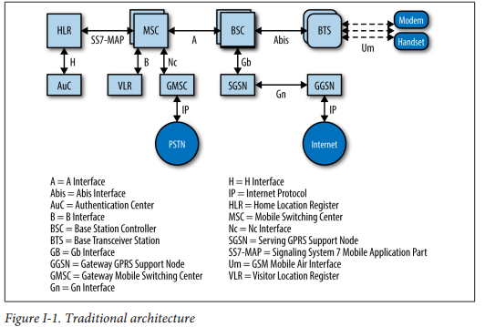
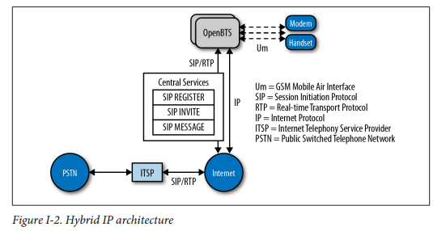
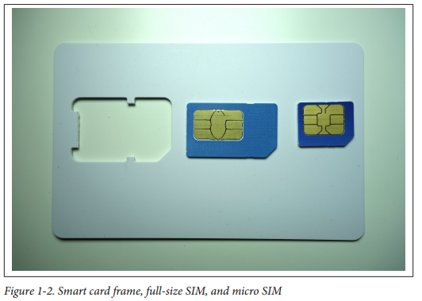
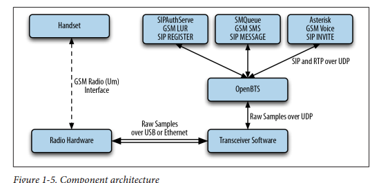
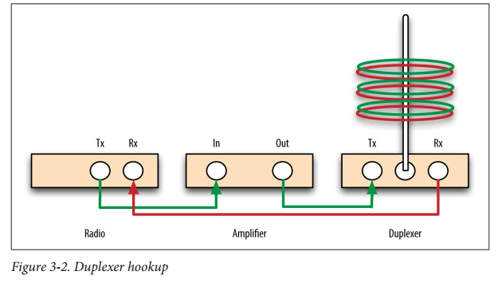
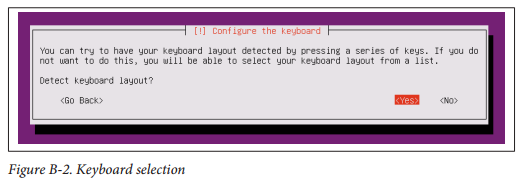
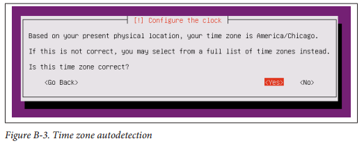
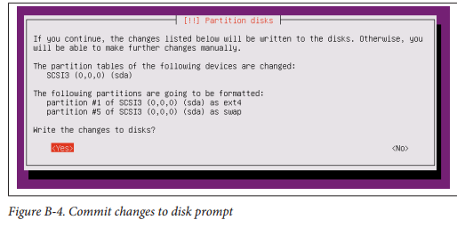
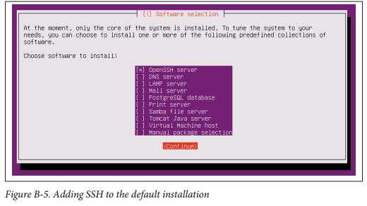
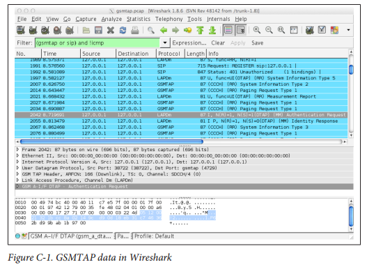

# 第1章
## 简介
电话很酷。是的，智能手机也很酷，但我正在谈论普通老式双向电话机。在地球上任何两点之间传递你的声音的能力是一个了不起的人类成就。也许更令人惊讶的是，这种成就多快被视为理所当然。过去100年来为建立公共交换电话网络进行了巨大的努力。铜网被挂起和埋葬。奠定了城市和城镇之间的长距离线路。人类手动路由和连接呼叫，然后模拟机器和数字计算机自动完成。一路上，移动网络被发明和部署。同样的基础设施故事发生在技术先进：设备升级，手机反复取代。现在，有线和无线电话网络几十年来都在稳固地提供语音服务，因此数据带宽正在进入下一个升级周期：光纤到家，LTE到智能手机。 OpenBTS桥接了这两个世界。通过在无线射频接口和开放IP协议之间转换，它允许任何具有IP连接的人部署移动网络。地球上的许多地方仍然没有家庭电话线或移动网络接收。但是，更多的时候，他们确实通过卫星或长途WiFi连接了互联网。恰当地集成，OpenBTS可以将这种互联网连接转换并分布到一个大的地理区域的移动网络。任何GSM电话都可以连接和使用语音服务或SMS，甚至基本数据。可以将连接带到偏远地区，同时跳过整个基础设施建设和升级周期。 OpenBTS和软件定义无线电的组合改变了我们应该考虑移动网络的方式。这项新技术允许纯软件构建复杂的无线电网络。 OpenBTS是一个C ++应用程序，它实现了GSM栈。随着新功能的实施或增加了协议支持，现有的OpenBTS移动网络的功能可以通过简单的软件更新来增强！另外，因为OpenBTS只是软件，你可以随心所欲地做任何事情。您不再需要硬件供应商的权限来访问其关闭的黑盒子实现。您可以构建一个利基产品或实验功能;移动网络最终开放创新。

### 谁应该读这本书
电信工程师 - 有线或无线，电路交换或分组交换 - 应该能够锁定OpenBTS项目的这一介绍。冒着将材料过于分散的危险，我们已经注意解释OpenBTS的无线电和IP侧。如果你是一名射频（RF）专家，你将学到一些关于互联网电话的知识。并在非常低的水平进行检查。如果您有兴趣在移动设备上调试应用程序，OpenBTS提供了几个原始接口，可以查看无线传输中的具体情况。您的软件还可以使用新的数据API来构建搜索和救援，紧急响应，功率优化，道路交通分析等应用。

### 为什么我写了本书
我的背景主要是在VoIP中。当我开始使用OpenBTS工作时，我很无意识地了解无线电系统的复杂程度。相反，我和其他人一起工作的是无线电专家，但从未接触过VoIP。 OpenBTS项目的文档很丰富，但非常广泛，以支持广泛的有关各方的观众;它需要简化。我们希望有一本新书能够为技术提供一个完整的新手，使他们能够成功建立自己的网络：获得语音通话的工作，交换一些短信等等。这个最初的成功应该建立信心，让这个人自己出发。我试图将健康数量的上下文组合到逐步的部分中。移动网络在GSM和RF方面仍然非常复杂。每个提示都有帮助。我希望你能在设置你的时候避免大问题！我也希望这本书足够有趣，可以在没有硬件的情况下阅读。在深入OpenBTS相关项目之前，本书应该为您提供足够的信息来确定所需资源的范围。 

### 今天移动网络上的文字
正如Marc Andreessen所说：“软件正在吃掉世界。”这在移动行业中绝对是正确的。随着处理能力变得更快，更便宜，现在可以在软件中实现极其复杂的信号处理算法。该软件也能够在日益通用的硬件上运行。由于专用硬件和协议而导致供应商锁定的时代已经过时，并且移动基础架构中的一些真正竞争和创新的机会似乎越来越接近。几年前，“建立自己的移动网络”这本书将成为一个非常不同的读者。 “编译”和“定制”这些词甚至可能没有出现。图I-1说明了这种网络的体系结构。


这种网络架构是许多人经过多年研究的令人难以置信的工程。它非常强大且可扩展，但不幸的是，它非常不灵活且非常昂贵。大学越来越关注这个问题，其中最着名的是加州大学伯克利分校新兴地区技术与基础设施（TIER）小组和硅谷卡内基梅隆大学的CyLab流动研究中心，该中心最近发表了一篇论文，这种传统的移动体系结构，包括来自传统有线网络的演变行李。
为了解决这个问题，出现了多个开源项目。仅举几例：Osmocom，OpenLTE和YateBTS。每个项目都有不同的目标和体系结构，以自己的方式解决传统网络的难题。然而，这本书是关于该组织的老将，OpenBTS。 OpenBTS项目是一组开源软件组件，可用于构建更现代化的轻量级网络。 OpenBTS允许传统移动网络的“Um”无线电接口直接与互联网电话协议互连。图I-2说明了这种新的“混合”体系结构。


手机上的软件或配置更改是不必要的，因为移动网络的无线接口与传统网络相同。然而，网络核心不再由一系列复杂的协议和服务器组成。它由开放协议组成，并使用IP作为其传输。已经存在许多实施这些开放协议的软件项目。 OpenBTS还开发了一些新组件，以提供仍不可用的功能，以连接GSM和互联网世界。围绕“云”的激动和围绕“应用程序”的激动如此之多，似乎最终这两者之间的沟通开始盛行。

### 浏览本书
到本书结束时，您将建立一个功能齐全的移动网络。它将显示为任何其他网络在您的手机上进行的操作，并在网络参与者之间路由呼叫和SMS，以及在手机和互联网之间提供数据连接。
- 第1章将逐步指导您选择无线电和处理硬件，设置基本操作系统和开发环境，以及编译和安装软件组件。 
- 第2章介绍初始组件配置和激活以及网络功能测试。 
- 第3章深入探讨生产网络的故障排除和性能调整技术。 
- 第4章详细介绍了如何将您的单节点网络扩展为具有移动性和切换功能的真正的多节点移动网络。 
- 第5章基于您的配置提供通用分组无线业务（GPRS）数据功能。 
- 第6章探讨了一个类似于WiFi专属门户网站的OpenBTS特有功能，可用于应急响应和ad hoc网络。 
- 第7章提供了与OpenBTS NodeManager控件和事件API之上的应用程序交互和构建应用程序的参考资料。 
- 第8章介绍了您的网络的一些后续步骤：与公共交换电话网络（PSTN）互连，专用分支交换（PBX）集成以及当前的频谱监管状态。 
- 附录A提供了GSM术语，RF测量，组件端口，路径和文件的快速参考。 
- 附录B介绍了Ubuntu 12操作系统的安装。 
- 附录C显示了如何捕获不仅IP交换机，而且还捕获原始的GSM无线电帧。

### 在线资源
OpenBTS社区
OpenBTS文档
GSM时隙和频道可视化器
GitHub上的OpenBTS源代码库

# 第2章
## 设置
在本章中，我们将指导您选择硬件，安装基本操作系统和开发环境设置，以及实际编译和安装组成OpenBTS软件套件的组件。可以采取几个捷径 - 例如，如果您希望使用官方二进制包而不是编译自己的程序包，但整个过程都是针对那些希望从头开始构建的程序。

### 硬件组件
虽然OpenBTS实现了用软件构建移动网络所涉及的大部分复杂性，但无线电波仍然必须以某种方式传输和接收。本节详细介绍了您应该采购哪些硬件组件以在开发环境中实现此功能。第2章介绍了这些组件的配置。

Linux服务器
第一个需求是标准的商品Linux服务器。其他体系结构已经开始得到支持，但现在仍然坚持使用运行32位操作系统的x86处理器，以获得最佳结果。这台计算机可以是您测试环境中的独立计算机，也可以是您每天使用的笔记本电脑或台式机上的虚拟机。处理能力和RAM的最低要求由于涉及许多变量，例如并发载波信号的数量，网络负载，网络使用类型，无线电环境等，因此没有明确定义。每个变量都会影响所需的资源。单载波信号要求OpenBTS软件生成下行波形以发送给手机并解调从手机接收的上行波形。 OpenBTS支持在单个物理无线电上创建多个并发载波信号，以线性增加网络容量，但处理需求非常高。对于使用单载波信号（最多7个并行语音通道）的稳定实验室设置，建议使用Intel i5或与2 GB RAM相当的设备。它还必须至少有一个USB2接口，但USB3正迅速成为新软件定义无线电的要求。现在开始使用USB3可能是一个好主意，以避免将来升级。 USB接口增加吞吐量的需求与通过它传送的无线电波形样本的数量和大小有关。在生产环境中，可以使用多个同时载波信号，这大大增加了所需的采样带宽。另外，用于解调信号的算法可以被配置为以更稳健的方式进行操作（例如，纠正由于部署环境造成的信号失真）。因此，产生和解调这些信号所需的处理能力可能比实验室设备中的要大一个数量级。需要记住的另一件事是，随着OpenBTS的更新版本的推出，新的功能可能需要更多的处理能力或内存。例如，全球移动系统（GSM）模式下的OpenBTS可以在英特尔凌动处理器上平稳运行，但新的OpenBTS-UMTS（通用移动电话系统）至少需要一个英特尔i7。这个旁注实际上是在软件中定义无线电接入网络（RAN）的主要优点。随着新标准的发布，可以通过简单的软件更新将它们应用于生产RAN，而不是交换昂贵的硬件基础设施。

软件定义无线电
软件无线电（SDR）是从硬件角度使OpenBTS成为可能的关键突破。SDR已用于军事应用大约20年。直到最近，由于技术成本的降低，它们才能提供给更多的观众。现代SDR是一种通过USB电缆或以太网连接到计算机的硬件。它们通常与一副纸牌一样小，或者像三张DVD一样大，并通过USB主机连接或小型外部电源直接供电。 SDR硬件实现了一个完全通用的无线电，它可以通过主机应用程序发送和接收定义频率范围（即60 MHz至4 GHz）的原始波形。该主机应用程序可以是一个FM收音机实现，可以接收原始波形，解调信号并播放音频。这意味着无线电硬件不再是围绕特定应用设计的;完全由主机来定义实现，允许任何人纯粹用软件来创建无线电应用。 OpenBTS支持来自多个供应商的SDR：Ettus Research，Fairwaves，Nuand和Range Networks。这些产品的价格从大约500美元到超过2500美元不等。如果您选择通过以太网连接的产品，请确保您的Linux服务器具有用于无线电的专用以太网端口（最好是千兆位以太网）。大多数SDR是适用于任何无线电项目的完全通用的硬件，而一些SDR专门针对实施移动网络进行了优化。购买前请咨询供应商。天线许多SDR具有足够的发射和接收灵敏度，可以在小型环境下无天线操作。通常，可以实现半径为1米的覆盖区域。这是实验室环境的理想设置，特别是如果多个开发人员使用多个无线电。覆盖区域不会相互重叠和相互干扰。另外，您的网络不会干扰该地区的任何运营商。即使您的覆盖区域非常小，国家监管机构仍然很可能会要求您在使用GSM频率之前获得测试许可证。有关更多信息，请参阅第78页的“频谱管理”。在实验室环境中，多个开发人员将共享一个OpenBTS实例，因此必须扩展覆盖区域。添加一对小型5 dBi天线可以在无阻碍的环境中大幅提升，最高可达25米半径。这些通常是带有SubMiniature A型（SMA）连接器的橡胶鸭式天线，外观与典型的家庭WiFi路由器天线相似。图1-1显示了一个例子。


天线针对特定频率进行调谐，因此请选择与您将使用的GSM频段（850,900,1800或1900 MHz）最接近的频段。频率也在覆盖区域大小中起作用。低频段（850和900 MHz）传播的距离比高频段更大 - 有时几乎是两倍。

测试电话
对于测试，至少需要两个与您将使用的频段（850,900,1800或1900 MHz）兼容的GSM手机。大多数现代GSM手机都是“四频段”，这意味着所有频段都得到支持。还有“三频”和“双频”手持设备。确定手机是否与您的网络兼容的最简单方法是在GSM Arena上搜索模型。这里列出了完整的技术规格。您还必须确保您使用的手机已解锁。如果手机处于“锁定”状态，则意味着制造商已将硬件的基带处理器编程为仅与特定载波一起工作。通常可以通过在拨号盘上输入一系列数字来消除此限制，但这超出了本书的范围。最简单的选择是使用可以接受任何运营商的用户身份模块（SIM）卡的解锁手机。

测试SIM卡
GSM手机中使用的SIM卡只不过是一个精简的智能卡。智能卡也被称为芯片卡或集成电路卡（ICC），可以在许多认证和识别应用中找到。全尺寸智能卡具有与信用卡相同的尺寸;较新的信用卡实际上使用智能卡技术来提高安全性。 SIM卡使用标准智能卡写入器进行编程，一旦写入，就会从全尺寸卡框中弹出，以便它们适合GSM手机。图1-2显示了全尺寸智能卡载体，弹出的全尺寸SIM卡和微调的SIM卡。


有几种方法可以在您的测试环境中使用SIM卡。根据您的需求和未来的部署计划，您可以决定使用备用SIM，自己创建一些新的SIM，或者委托一家公司对其进行批量编程。

使用备用SIM卡
出于测试目的，任何物理上适合手机的SIM卡都可能工作。但是，使用现有的SIM卡，已过期的SIM卡或外国的SIM卡会进行权衡，主要涉及安全功能。存储在SIM中的秘密密钥，名为“Ki”，只有SIM发行者知道。它存储在SIM卡中不可读的部分内存中，制造商将其放置在那里后无法检索。运营商和手机之间的这种共享秘密是允许网络在用户有效的情况下以密码方式确定的。 OpenBTS针对这种情况提供了一种称为“基于缓存的身份验证”的替代身份验证方法。它与手机进行初始身份验证交换并记录结果。它使用这个相同的请求，并期望在未来有相同的答案。该方法并不像每个请求的唯一交换一样安全，但仍然比完全禁用身份验证要好。另一个名为“Kc”的密钥用于支持呼叫加密。在您的测试环境中使用其他电话的SIM卡时，您将失去这两项功能，但如果您无法使用智能卡写卡器和空白卡，则这是您的最佳选择。当使用其他运营商的SIM卡连接到您自己的OpenBTS网络时，一些手机是棘手的。如果手机可以检测到它的“本地”载波信号，手动选择另一个载波的选项可能会从设置菜单中隐藏。在未锁定的iPhone中使用AT＆T SIM卡时通常会遇到这种情况。

自制SIM卡
要为您自己的测试环境创建一小批SIM卡，您需要空白的可擦写“神奇”SIM卡和智能卡写卡器。阿里巴巴网站上的多家供应商提供了许多产品。通过USB连接的示例作者如图1-3所示，但市场上有许多不同寻常的作家。


软件安装和写入命令取决于选择哪个写入器和卡。有关编写SIM卡的最新信息可以在OpenBTS wiki页面上找到。

批量SIM卡
SIM写入公司开始以合理的价格提供更少量的卡片。您通常会提交一些关于您的订单的参数，例如卡片工艺，所需的验证算法和卡片数量，以获得报价。一旦订购完成，成品将是一盒SIM卡以及一张单独的文件或文件，其中包含每张卡片的ID和加密密钥列表。然后可以使用脚本将该列表批量导入到订户数据库中。现在，您的所有订阅者都可以进行系统配置，无需手动刻录10,000张个人SIM卡，而且每个用户都留下了精美的SIM卡。

全尺寸与微米与纳米
相比一旦你有一个技术上兼容的SIM卡（2G与3G与4G等），它可能仍然具有不兼容的外形因素。这很容易通过使用SIM卡切割器来弥补，这是运营商喜欢收取可观的服务费用。它看起来像订书机，但功能更像是曲奇工具，如图1-4所示。


他们可以以低于20美元的价格购买，并将SIM卡从标准转换为微型，并将微型转换为纳米。这些尺寸之间的唯一区别是实际芯片周围的塑料量。

### 操作系统和开发环境设置
现在已经收集了硬件，您可以继续设置开发环境。 OpenBTS传统上是在Ubuntu长期支持（LTS）发行版上开发和测试的。它也在Debian和CentOS发行版上进行了测试。对于本书，将使用经过测试的分发和体系结构：Ubuntu Server 12.04 LTS 32位。从OpenBTS 5.0开始，64位系统也受到支持，但尚未广泛部署。除了Ubuntu 12之外，Ubuntu 13和14系统也已成功使用。基于RPM的系统（CenOS，Fedora和Red Hat Enterprise Linux）的初步打包也可用，但本书不会涉及。请访问OpenBTS.org获取更多信息。如果您尚未安装兼容的操作系统，附录B将提供完整的分步指南。如果您打算使用官方OpenBTS发行包，请随意跳到第10页的“安装”。

#### Git兼容性
Git是一个管理软件源代码更改的版本控制系统。 OpenBTS项目利用了Git中的一些新功能，例如子模块分支跟踪。为确保您的客户端兼容（例如，比1.8.2更新），它需要更新。首先，执行这个命令来添加对Personal Package Archives的支持，这是一种分发二进制发行包的替代方法：
```
$ sudo apt-get install software-properties-common python-software-properties
```
然后，执行以下命令为最新的Git构建到您的系统：
```
$ sudo add-apt-repository ppa：git-core/ppa
```
现在，您只需刷新软件包列表并再次安装Git来更新系统的客户端：
```
$ sudo apt-get update 
$ sudo apt -get install git
```
要确认新的Git客户端已正确安装，请运行以下命令：
```
$ git --version 
git version 1.9.1
```
现在您已安装Git，您可以继续下载开发脚本。

#### 下载代码
OpenBTS项目由多个托管在GitHub上独立开发库中的软件组件组成。理解Git的复杂性不应该成为使用OpenBTS的障碍，因此编写了几个开发脚本，以便下载代码，切换分支和编译组件。要将这些开发脚本下载到新环境中，请运行以下命令：
```
$ git clone https://github.com/RangeNetworks/dev.git
```
开发脚本假定您为GitHub设置了安全Shell（SSH）密钥。如果您不这样做，请在继续之前按照这些说明进行设置。
现在，要下载所有组件，只需运行clone.sh脚本：
```
$ cd dev $ ./clone.sh
```
每个组件的存储库都将从GitHub克隆到您的开发环境中。 clone.sh脚本还会自动初始化所​​需的任何子模块。既然OpenBTS项目源代码位于您的开发环境中，您可以选择特定的分支或版本进行编译。 switchto.sh脚本用于在构建版本目标之间切换。例如，如果要构建v4.0.0发行版，请运行以下命令：
```
$ ./switchto.sh v4.0.0
```
可以使用state.sh脚本为每个组件列出当前版本的目标。该脚本还列出了每个组件的任何未完成的本地更改。 
```
$ ./state.sh
```
本书重点介绍5.0系列分支。要定位5.0中最新，最好的代码，请运行以下命令：
```
$ ./switchto.sh 5.0
```

#### 构建代码
现在您的开发环境已准备好在5.0系列分支中构建最新的位。要编译二进制包，您将使用build.sh脚本。它会自动安装编译器和自动配置工具以及任何所需的依赖关系。它还控制将构建哪个无线电收发器应用。由于有多种不同的驱动程序可用于各种无线电类型，因此build.sh需要一个参数，以便知道哪个硬件正在定位（有效的无线电类型为SDR1，USRP1，B100，B110，B200，B210，N200和N210）。 OpenBTS还支持Fairwaves的UmTRX硬件。但是，它使用UHD无线电驱动程序的定制版本，并且build.sh脚本尚未自动安装。本书的目标是Ettus Research N200。立即运行build命令：
```
$ ./build.sh N200
```
这个过程在第一次运行时可能需要一段时间（30-60分钟），具体取决于正在执行的硬件。展望未来，您只需重新编译更新的组件。例如，以下命令仅重新编译Ettus Research B100收音机的OpenBTS包：
```
$ ./build.sh B100
```
openbts当构建脚本完成时，将会有一个名为“BUILDS”的新目录，其中包含一个子目录建立时间戳。此目录的示例如下所示：
```
$ ls dev/BUILDS/2014-07-29--20-44-51/*.deb 
liba53_0.1_i386.deb range-asterisk-config_5.0_all.deb 
libcoredumper1_1.2.1-1_i386。 deb range-configs_5.0_all.deb 
libcoredumper-dev_1.2.1-1_i386.deb sipauthserve_5.0_i386.deb 
openbts_5.0_i386.deb smqueue_5.0_i386.deb 
range-asterisk_11.7.0.4_i386.deb
```
恭喜！您现在可以继续安装和启动每个组件，并了解每个组件的用途。

### 安装
现在你已经下载了一套官方发行版软件包或编译好自己的软件包，需要安装并启动它们。为每个组件提供一些背景信息，然后提供安装过程和所需的任何初始化配置。由于一些组件依赖于其他组件，它们将按照满足这些相互依赖性的顺序呈现。在继续之前，请转到新的编译目录：
```
$ cd dev/BUILDS/2014-07-29--20-44-51/
```

#### 安装依赖关系
如果您使用build.sh脚本在前一节编译了自己的一组包，这些依赖关系已经安装完毕，这部分可以跳过。如果您使用的是一组官方发行版软件包，则需要安装一些额外的系统库并定义一个额外的资源库源，以便找到并安装所有依赖项。执行以下命令为ZeroMQ定义额外的存储库源，ZeroMQ是所有组件使用的库：
```
$ sudo apt-get install software-properties-common python-software-properties 
$ sudo add-apt-repository ppa：chris-lea/zeromq 
$ sudo apt-get update
```

##### Coredumper库
OpenBTS使用coredumper共享库来产生有意义的调试信息，如果OpenBTS崩溃。 Google最初编写了它，实际上有两个libcoredumper软件包：libcoredumper-dev包含编译利用coredumper库的程序所需的开发文件，libcoredumper包含应用程序在运行时加载的共享库：
```
$ sudo dpkg -i libcoredumper1_1.2.1-1_i386 .deb
```
自发布本书以来，包名中的确切版本号可能已发生变化。 

##### A5/3库
openBTS/3共享库来支持呼叫加密。它包含必须与OpenBTS分开分发的加密程序例程：
```
$ sudo dpkg -i liba53_0.1_i386.deb
```
#### 安装组件
通过在全新系统上安装以下所有组件，可以确保您可以使用功能齐全的GSM网络，框。语音，短信和数据所需的一切都将在一个系统中运行。您将要安装的整体架构如图1-5所示。


会话发起协议（SIP）和实时传输协议（RTP）是OpenBTS用于将GSM流量转换为VoIP的两种协议。

#### 系统配置
此软件包包含一组默认配置，可让新的Ubuntu系统在安装时即装即用。它包括网络接口，防火墙规则，域名系统（DNS）配置，日志记录等设置。如果您已经习惯于配置Linux发行版，但可能不想安装此软件包，但其内容可用作指导进行所需的更改。在安装过程中，系统会多次提示您确认覆盖某些配置文件。如果您不确定文件的功能，在处理全新系统时，安全答案始终为“Y”：
```
$ sudo dpkg -i range-configs_5.0_all.deb
```
如果您回答“Y”，则此软件包将覆盖您的网络接口配置，当询问有关/etc/network/interfaces的更改时。您可以在此提示下回答“N”，并保留您的配置：但是，只有手动将第62页的“中央服务”中详述的文本添加到您的接口定义之后，GPRS才能正常工作。它负责调用iptables-restore自动加载防火墙规则。 

#### Asterisk
Asterisk是一个VoIP交换机，负责处理SIP INVITE请求，建立呼叫的各个部分，并将它们连接在一起。有两个包负责设置Asterisk安装，它不需要任何额外的配置：range-asterisk和range-asterisk-configs。 range-asterisk软件包包含Asterisk SIP交换机软件的确认版本，并确保已包含OpenBTS所需的相应模块。没有包含Asterisk的其他补丁;它只是为了代表Asterisk最新的确认版本。 range-asterisk-configs软件包包含一组配置文件，因此Asterisk知道并可以与订户注册数据库进行通信。这个数据库是各种组件存储和更新用户的电话号码，身份，身份验证，来电显示和注册状态的地方。另外，通过使用这个数据库，在将新手机添加到网络时，不再需要手动编辑Asterisk配置文件：
```
$ sudo dpkg -i range-asterisk*.deb $ sudo apt-get install -f
```
#### SIPAuthServe
SIP授权服务器（SIPAuthServe）是一个应用程序，用于处理OpenBTS在手机尝试加入移动网络时产生的SIP REGISER请求。当手机认证成功时，SIPAuthServe负责使用启动它的OpenBTS实例的IP地址更新订户注册数据库，允许其他订户呼叫手机：
```
$ sudo dpkg -i sipauthserve_5.0_i386.deb 
$ sudo apt -get install -f 
```
#### SMQueue 
SIP MESSAGE Queue（SMQueue）是一个应用程序，用于处理手机发送SMS时OpenBTS生成的SIP MESSAGE请求。它存储消息，安排它们在网络中传送，并在目标手机不可用时重新安排它们：
```
$ sudo dpkg -i smqueue_5.0_i386.deb 
$ sudo apt-get install -f
```
#### OpenBTS
最后，我们到达显示。 OpenBTS负责在软件中实现GSM空中接口，并直接与GSM手机通信。该通信在IP网络侧转换为SIP和RTP，并与上述组件交互以形成核心网络。 GSM手机看到一个完全兼容的GSM无线接入网络，核心网络可以看到标准的SIP端点。任何一方都不应该知道允许手持设备无缝连接到IP世界之间有一层：
```
$ sudo dpkg -i openbts_5.0_i386.deb 
$ sudo apt-get install -f
```

### 启动/停止组件
现在每个组件都已安装，你需要开始他们。使用名为Upstart的系统在Ubuntu上控制组件。未来版本的OpenBTS套件将支持其他机制，如systemd，但现在使用Upstart。要启动所有组件，执行以下命令：
```
$ sudo start asterisk 
$ sudo start sipauthserve 
$ sudo start smqueue 
$ sudo start openbts
```
相反，要停止所有组件，请使用：
```
$ sudo stop openbts 
$ sudo stop asterisk 
$ sudo stop sipauthserve 
$ sudo stop smqueue
```
启动和关闭的顺序并不重要，但如果OpenBTS在没有其他组件的情况下运行，GSM网络将可见但不可用。每个组件都在后台运行，并在出现故障时自动重启。要监视组件在后台运行时的控制台输出，可以使用以下日志文​​件：
```
/var/log/upstart/asterisk.log 
/var/log/upstart/sipauthserve.log 
/var/log/upstart/smqueue.log/var/log/upstart/openbts.log
```
系统组件已安装并正在运行。下一步将开始测试和配置它们。


## 初始测试和配置
现在应该安装软件和硬件。本章将指导您完成一些初步的完整性检查，功能测试和基本配置定制。到本章结束时，您将通过您的私人移动网络在手机间成功交换第一条短信息和语音通话！

### 初始状态
如果服务的其他实例已在运行，则后面的一些手动步骤将会发生冲突并失败。为了确保这个系统上没有别的东西在运行，执行以下命令：
```
$ sudo stop openbts 
$ sudo stop asterisk 
$ sudo stop sipauthserve 
$ sudo stop smqueue
```
现在您可以继续确认链中每个步骤的连通性，然后运行第一个基本试验。

### 确认无线电连接
首先要验证的是收发器应用程序可以与无线电硬件通信。不同的供应商有不同的方法来完成这一点。 

#### Ettus Research Radios
所有Ettus硬件均使用Transceiver52M二进制文件，该文件安装在上一章的/OpenBTS中。运行它，如下所示，以查看是否检测到硬件设备：
```
$ cd /OpenBTS 
$ sudo ./transceiver 
[sudo] password for openbts：
linux; GNU C ++版本4.6.3; Boost_104601; UHD_003.006.002-releaseUsing internal clock reference
-- Opening a USRP2/N-Series device...
-- Current recv frame size: 1472 bytes
-- Current send frame size: 1472 bytes
```
上述示例显示尝试成功。收发器可以通过按Ctrl-C来停止。如果您看到类似以下输出的内容，则存在以下问题：
```
$ cd /OpenBTS 
$ sudo ./transceiver 
[sudo] password for openbts：
linux; GNU C++ version 4.6.3; Boost_104601; UHD_003.007.002-release
Using internal clock reference
ALERT 1745:1745 2014-09-05T22:37:00.4 UHDDevice.cpp:528:open: No UHD devices
found with address ''
ALERT 1745:1745 2014-09-05T22:37:00.4 runTransceiver.cpp:160:main: Transceiver
exiting...
```

Ettus提供了一对帮助应用程序来自动检测和检查附加无线电。运行以下命令以列出所有连接的设备。如果未显示，请跳至第18页的“排除USB故障”或第19页的“故障排除以太网”以解决连接问题。这个例子显示了通过以太网连接的N200：
```
$ uhd_find_devices 
linux; GNU C++ version 4.6.3; Boost_104601; UHD_003.007.002-release
UHD Device 0
Device Address:
type: usrp2
addr: 192.168.10.2
name:
serial: XXXXXX
```
另一个有用的应用程序是uhd_usrp_probe，它将检查设备并返回其技术信息和配置。这个应用程序的示例运行如下：
```
$ uhd_usrp_probe
linux; GNU C++ version 4.6.3; Boost_104601; UHD_003.007.002-release
-- Opening a USRP2/N-Series device...
-- Current recv frame size: 1472 bytes
-- Current send frame size: 1472 bytes
_____________________________________________________
/
| Device: USRP2 /N-Series Device
| _____________________________________________________
| /
| | Mboard: N200r4
| | hardware: 2576
| | mac-addr: XX:XX:XX:XX:XX:XX
| | ip-addr: 192.168.10.2
| | subnet: 255.255.255.255
| | gateway: 255.255.255.255
| | gpsdo: none
| | serial: XXXXXX
| | FW Version: 12.3
| | FPGA Version: 10.0
| |
| | Time sources: none, external, _external_, mimo
| | Clock sources: internal, external, mimo
| | Sensors: mimo_locked, ref_locked
| | _____________________________________________________
| | /
| | | RX DSP: 0
| | | Freq range: -50.000 to 50.000 Mhz
| | _____________________________________________________
| | /
| | | RX DSP: 1
| | | Freq range: -50.000 to 50.000 Mhz
| | _____________________________________________________
| | /
| | | RX Dboard: A
| | | ID: SBX (0x0054)
| | | Serial: XXXXXX
| | | _____________________________________________________
| | | /
| | | | RX Frontend: 0
| | | | Name: SBXv3 RX
| | | | Antennas: TX/RX, RX2, CAL
| | | | Sensors: lo_locked
| | | | Freq range: 400.000 to 4400.000 Mhz
| | | | Gain range PGA0: 0.0 to 31.5 step 0.5 dB
| | | | Connection Type: IQ
| | | | Uses LO offset: No
| | | _____________________________________________________
| | | /
| | | | RX Codec: A
| | | | Name: ads62p44
| | | | Gain range digital: 0.0 to 6.0 step 0.5 dB
| | | | Gain range fine: 0.0 to 0.5 step 0.1 dB
| | _____________________________________________________
| | /
| | | TX DSP: 0
| | | Freq range: -250.000 to 250.000 Mhz
| | _____________________________________________________
| | /
| | | TX Dboard: A
| | | ID: SBX (0x0055)
| | | Serial: XXXXXX
| | | _____________________________________________________
| | | /
| | | | TX Frontend: 0
| | | | Name: SBXv3 TX
| | | | Antennas: TX/RX, CAL
| | | | Sensors: lo_locked
| | | | Freq range: 400.000 to 4400.000 Mhz
| | | | Gain range PGA0: 0.0 to 31.5 step 0.5 dB
| | | | Connection Type: QI
| | | | Uses LO offset: No
| | | _____________________________________________________
| | | /
| | | | TX Codec: A
| | | | Name: ad9777
| | | | Gain Elements: None
```

#### Range Networks Radios
网络SDR1无线电广播使用TransceiverRAD1二进制文件，该文件安装在上一章的/OpenBTS中。如下运行它，看看是否检测到硬件设备：
```
$ cd /OpenBTS 
$ sudo ./transceiver 1
```
如果程序不立即停止并继续运行，它已成功检测到无线电硬件。收发器可以通过按Ctrl-C停止，如下所示：
```
$ cd /OpenBTS 
$ sudo ./transceiver 1 
^C Received shutdown signal
```

如果程序立即停止，如下面的输出所示，继续进入故障排除USB部分以解决此问题：
```
$ cd /OpenBTS 
$ sudo ./transceiver 1 
$ 
```

#### USB故障排除
使用虚拟机设置时，USB连接最常见的问题是所需的USB设备未与正确的虚拟机相关联。使用虚拟机的设置来查找相应的USB设备并将其分配给运行OpenBTS开发环境的虚拟机。

#### 以太网进行故障诊断
无论使用虚拟机还是实际服务器，以太网连接的无线电都必须有一个额外的以太网接口。虽然可以更改无线电的IP地址以匹配您的本地网络，但这是不可取的，因为在收发器应用程序和无线电硬件之间通过以太网交换的样本对延迟和丢失非常敏感。他们应该建立专门的连接。在服务器中安装额外的物理以太网接口或在虚拟机中创建额外的虚拟以太网接口。确保该接口与无线电硬件在同一子网上。所有Ettus硬件的默认IP地址是192.168.10.2。使用以下示例为您的额外以太网接口分配适当的地址：
```
$ sudo ifconfig eth1 192.168.10.1/24
```
现在使用简单的ping命令测试连接。按Ctrl-C停止ping测试：
```
$ ping 192.168.10.2
PING 192.168.10.2 (192.168.10.2) 56(84) bytes of data.
64 bytes from 192.168.10.2: icmp_req=1 ttl=64 time=1.037 ms
64 bytes from 192.168.10.2: icmp_req=2 ttl=64 time=1.113 ms
^C
```

### 启动网络
既然您已确认收发器软件可以通信使用无线电硬件，您可以在后台开始运行OpenBTS服务。使用以下命令执行此操作：
```
$ sudo start openbts
```
OpenBTS服务将自动启动收发器软件的实例并连接到无线电硬件。无线电采样然后通过本地用户数据报协议（UDP）套接字在收发器软件和OpenBTS软件之间交换。

#### 配置 系统和CLI
openBTS/OpenBTS.db。每个键在OpenBTS中编译的模式中定义，用于验证正在使用的值。这种配置系统所带来的一个优点是，大多数关键值可以在几秒钟内改变并应用于运行系统，而不会中断服务。这些是动态密钥。配置系统中还有一些静态键需要重新启动OpenBTS才能应用更改。

操作配置键最简单的方法是通过OpenBTS命令行界面（CLI）。运行以下shell命令打开它：
```
$ sudo /openBTS/OpenBTSCLI
```
现在，您将看到一个OpenBTS提示符。这是包括配置更改在内的命令可以被执行以供OpenBTS处理的地方。从现在起，前缀为$的命令将在Linux命令行上执行。 OpenBTS>前缀的命令用于OpenBTS命令行。打开两个终端窗口可能会很方便，因此不需要不断地输入和退出OpenBTS命令行。

#### 改变频段和ARFCN
首先要检查的是无线频段和绝对射频频道号（ARFCN）。无线电波段是四个值中的一个：850,900,1800或1900 MHz，对应于全球可用的四个GSM波段。 ARFCN只是选定频段内的一对频率，将用于无线电信号的传输和接收。每个无线电频段有超过100种不同的ARFCN可以使用。 ARFCN也可以被称为载波（例如，使用多个ARFCN的系统是多载波系统）。选择正确的频段和ARFCN对于监管原因以及避免与当地运营商的干扰很重要。您可以使用OpenBTS config命令检查当前频段和ARFCN设置。这些配置键位于GSM.Radio类别中。要查看名称中带有单词GSM.Radio的所有配置密钥，请输入以下命令：
```
OpenBTS> config GSM.Radio
GSM.Radio.ARFCNs 1 [default]
GSM.Radio.Band 900 [default]
GSM.Radio.C0 51 [default]
GSM.Radio.MaxExpectedDelaySpread 4 [default]
GSM.Radio.PowerManager.MaxAttenDB 10 [default]
GSM.Radio.PowerManager.MinAttenDB 0 [default]
GSM.Radio.RSSITarget -50 [default]
GSM.Radio.SNRTarget 10 [default]
```
GSM.Radio.Band键显示正在使用900 MHz频段，GSM.Radio.C0键表示当前选择该频段的ARFCN＃51。如果您的无线电硬件对特定频率没有限制或优化，则可以继续进行这些设置。消除干扰的简单优化是选择您的国家/地区的其他运营商未使用的频段。一般来说，美洲使用850和1900 MHz系统，而世界其他地区则使用900和1800 MHz。国家列表可以在Wikipedia上找到。另外，如果可能的话，选择较低的频率以改善低功率覆盖。如果您的本地注册管理机构为您指定了特定频段和ARFCN，那么您必须使用它。要更改您的GSM频段，您必须再次使用OpenBTS config命令。这一次，将所需的乐队添加到该命令的末尾。以下示例将频段更改为850 MHz：
```
OOpenBTS> config GSM.Radio.Band 850
GSM.Radio.Band changed from "900" to "850"
WARNING: GSM.Radio.C0 (51) falls outside the valid range of ARFCNs 128-251 for
GSM.Radio.Band (850)
GSM.Radio.Band is static; change takes effect on restart
```
该命令确认该Band已更改，但传递了另外两条信息。首先，关于ARFCN对850MHz频段无效的警告。 850 MHz的有效范围是128-251。其次，通知您GSM.Radio.Band参数是静态的，不能在运行时应用; OpenBTS必须重新启动。要修复第一条警告，请再次使用config命令为850 MHz频带设置有效的ARFCN：
```
OpenBTS> config GSM.Radio.C0 166
GSM.Radio.C0 changed from "51" to "166"
GSM.Radio.C0 is static; change takes effect on restart
```
该命令确认ARFCN已更改，并再次警告此参数为静态。您现在可以重新启动OpenBTS以应用更改：
```
$ sudo stop openbts
openBTS/waiting
$ sudo start openbts
openBTS/running, process 6075
```
该服务将需要几秒钟时间才能开始备份，并且您可以再次自由使用OpenBTS CLI 。

#### Range Networks Radio 校准
   Range Networks SDR1硬件可以配备滤波器，针对特定的GSM频段优化无线电。 每个单元也被校准到一个特定的频带，并且如果OpenBTS设置不符合这个校准，可能会表现不佳。 要查看收音机的出厂校准，请使用trxfactory命令：
```
OpenBTS> trxfactory
Factory Information
SDR Serial Number = XXXX
RF Serial Number = XXX
GSM.Radio.Band = 850
GSM.Radio.RxGain = 52
TRX.TxAttenOffset = 1
TRX.RadioFrequencyOffset = 116
```
要确定是否需要调整，请使用audit命令。 在对安装进行故障排除时，audit命令是您不变的伴侣。 它会报告非默认值，无效值和冲突值，如果您使用的是范围网络硬件，则会列出出厂校准和当前运行配置之间不匹配的部分：
```
OpenBTS> audit
+---------------------------------------------------------------------+
| WARNING : Factory Radio Calibration [key current-value (factory)] |
| To use the factory value again, execute: rmconfig key |
+---------------------------------------------------------------------+
TRX.RadioFrequencyOffset "132" ("116")
```
在本例中，TRX.RadioFrequencyOffset参数与工厂校准不匹配。 如消息所示，可以使用rmconfig命令再次使用出厂值：
```
OpenBTS> rmconfig TRX.RadioFrequencyOffset
TRX.RadioFrequencyOffset set back to its default value
TRX.RadioFrequencyOffset is static; change takes effect on restart
```
这是另一个需要重新启动OpenBTS的静态参数，如上所述。 大多数配置参数不是静态的，因此重新启动OpenBTS将成为例外而不是规则。 对于报告为不匹配的任何其他校准参数重复此过程。 

### Ettus Research无线电校准
Range Networks和Ettus Research无线电之间的一个主要区别在于GSM.Radio.RxGain的适当值。 Range Networks对这个参数使用了一个更高的值，如果它没有调整，Ettus Research设备将无法正常工作。 接收到的信号将过载驱动解调器。 对于初学者，请将GSM.Radio.RxGain设置为10：
```
OpenBTS> devconfig GSM.Radio.RxGain 10
GSM.Radio.RxGain changed from "52" to "10"
GSM.Radio.RxGain is static; change takes effect on restart
```
还有一个专用的命令，可以让你设置这个参数而不用重新启动OpenBTS。 如果您需要进行微调以避免每次重新启动，请使用rxgain。

## 搜索网络
既然Radio已经过校准并且设置已确认，您将使用手机搜索新创建的网络。 每部手机的菜单都不同，但该项通常与“运营商选择”或“网络选择”类似。图2-1中详细介绍了在Android上手动选择不同运营商的流程。
Snipaste_2018-05-15_09-10-20.png

1. 从Android菜单系统启动“设置”应用程序。
2. 选择“更多”。
3. 选择“移动网络”。
4. 选择“网络运营商”。这可能会也可能不会启动搜索。 如果没有，请选择“搜索网络”。
5. 搜索完成后，将显示可用运营商网络列表。

图2-2详细说明了在iOS 7上手动选择不同运营商的流程。
Snipaste_2018-05-15_09-11-23.png

1.在主屏幕中，打开“设置”应用程序。
2.选择“运营商”。
3.在“网络选择”屏幕上，禁用自动载波选择。
4.手机现在将搜索可用的运营商网络。
5.搜索完成后，将显示可用运营商网络列表。

我们在这里看到了可选运营商列表中的测试网络。 根据使用的手机型号，固件和SIM卡，网络ID将显示为“00101”，“001-01”，“测试PLMN 1-1”或GSM“OpenBTS”的短名称。如果您的测试网络 没有被检测到，通过重新选择菜单项，在打开和关闭之间切换飞行模式，或者关闭手机电源，再次强制搜索。 如果仍然无法使用，请再次确认手机支持您在上面配置的GSM频段，并且基带已解锁（即不受合同限制仅使用特定载波）。 本部分让您验证下行链路是否正常工作; 以下部分将指导您验证上行链路。 然后，您将继续输入手机的身份参数并通过第一次连接（第27页）连接至网络。

## 测试无线电频率环境因素
如果您从未有过涉及射频或模拟信号的项目，那么您可能会对可能出现问题的数量感到惊讶。最终，您可能会惊讶于RF通信可以工作！在openBTS/或身份号码所证明的信息。在建立新网络时需要注意的一点是，无线电干扰或来自上行链路上其他来源的“噪音”。如果上行链路噪声太大，则来自手机的信号不能可靠地解调成可用信息。 OpenBTS将通过使用noise命令显示当前级别：
```
OpenBTS> noise
noise RSSI is -68 dB wrt full scale
MS RSSI target is -50 dB wrt full scale
INFO: the current noise level is acceptable.
```

在本例中，检测到的环境噪声接收信号强度指示（RSSI）为-68 dB（较低的数字更好，意味着噪声较少）以及配置的目标RSSI级别手机是-50分贝。这意味着基站最多可以从手机获得比环境噪声多18dB的能量 - 这是一个非常好的余量，这意味着由于噪声导致的上行链路接收问题不应该成为问题。这两个数字之间的小利润将产生不同的信息。例如，具有10dB或更小的裕量将报告：
```
WARNING: the current noise level is approaching the MS RSSI target, uplink connectivity will be extremely limited.
警告：当前的噪声级别接近MS RSSI目标，上行链路连接将非常有限。
```
并且零或小于零的边际将报告：
```
WARNING: the current noise level exceeds the MS RSSI target, uplink connectivity will be impossible.
警告：当前噪声级别超过MS RSSI目标，上行链路连接将不可能。
```
如果报告了这些WARNING消息中的任一个，则需要采取措施来减少上行链路噪声和/或增加手持机发送功率。将来，如果您的手机可以看到基站但无法再连接，应该首先检查噪声。你的配置仍然是100％正确和功能性的，但是无线电环境可能已经改变，阻止了通信。

### 降低噪声
如果您的基站无线电设置不包含频率双工器，上行链路上的头号噪声源实际上可能是下行链路信号。如果没有适当的双工滤波，下行链路信号通常是物理上和频率上最接近上行链路的能量源。有关双工器的更多信息，请参阅第46页的“更强，更清洁的信号”。即使没有双工器，也可以通过多种方法降低上行链路噪声。

#### 天线对齐
一种快速双工器可以简单地对齐天线，使它们不容易相互馈入。如果您使用橡胶鸭式天线，请将它们倾斜成90度角。这些天线的辐射方向图将如图2-3所示垂直。
Snipaste_2018-05-15_16-39-38.png

如果天线彼此平行，则信号可以有效地从发射机流向接收天线，但是当天线形成90度角时，信号在与接收天线不同的平面上发射。通过在调整前后运行噪音命令来观察更改。这种简单的调整可以将噪音降低多达10 dB。

#### 下行链路传输功率
上面的对齐步骤减少了从发射天线到接收天线的能量流。收到的能量可能仍然太高，无法使上行链路可用。降低下行链路传输功率将进一步清除上行链路。在实验室环境中，通过降低下行功率而损失的覆盖区域并不重要。清洁信号优于强信号。不带任何参数运行电源命令以查看当前级别。以衰减分贝报告功率：
```
OpenBTS> power
current downlink power 0 dB wrt full scale
```
为了降低下行链路发射功率，例如减少20dB，输入以下内容：
```
OpenBTS> power 20
current downlink power -20 dB wrt full scale
```
下行链路现在以20dB的功率发射。使用noise命令观察改进。

### 提升手机功率
通过调整GSM.Radio.RSSITargetand和GSM.Radio.SNRTarget键，还可以告诉手机PowerHandsets使用更多的电源。在大多数情况下，这些键的默认值应该足够。但是，如果您遇到接收功率的大幅波动（例如，在地下矿井的角落四处走动），可能有必要增加这些值以提供更大的缓冲区以允许功率差异。提高所有手机的功耗将更快地耗尽电池电量，但上行链路信号更加可靠。总是存在权衡。如果您的噪声级别仍然过高，请返回第19页上的“启动网络”以将您的ARFCN更改为噪声较小的一个。

## 第一连接
您现在已验证下行链路和上行链路。为了确保所有的设置都已经被应用，请发出以下命令来重新启动OpenBTS：
```
$ sudo stop openbts 
$ sudo start openbts
```
在实际连接到测试网络之前的唯一一步就是查找并隐藏手机的身份参数，以便将其接收到网络上。

### 查找IMSI
您将要搜索的主要身份参数是国际移动用户身份（IMSI）。这是存储在SIM卡中的14-15位数字，与网络上的手机用户名类似。手机通常不会泄露其SIM卡的IMSI。它有时可能位于菜单中或通过现场测试模式，但是这种确定SIM的IMSI的方法很麻烦。幸运的是，还有其他方法。 OpenBTS也知道它与之交互过的IMSI，因为你掌控着网络端，所以你也可以访问这些信息。为了强制手机和测试网络之间的交互，你需要执行更新请求（LUR）操作网络，类似于注册。这不比从运营商选择列表中选择网络更复杂。在尝试任何LUR之前，您需要启动负责处理这些请求的SIPAuthServe守护进程：
```
$ sudo start sipauthserve
sipauthserve start / running，process 7017
```
现在，再次按照第23页上的“搜索网络”中的步骤，调出载波选择列表并选择您的测试网络。在很短的时间之后，手机应报告注册失败。它也可能会从您的测试网络收到一条短信，指示注册失败。此消息自动包含IM-SI，因此您可以跳到第29页上的“添加订户”。但是，此功能在所有硬件上都不起作用，因此如果您未收到SMS，则继续操作. openBTS/ TMSI交换用于TMSI的用户可识别的IMSI，并用于增加网络上的用户隐私。交易所默认是禁用的（修改Control.LUR.SendTMSIs toenable）;但是，信息仍然存在，可以使用tmsis命令进行检查。现在，请使用它查看与手持设备最近的LUR交互：
```
OpenBTS> tmsis
IMSI TMSI IMEI AUTH CREATED ACCESSED TMSI_ASSIGNED
214057715229963 - 012546629231850 0 78s 78s 0
001010000000002 - 351771054186520 1 80h 95s 0
001010000000003 - 351771053005400 1 80h 108s 0
```
条目按时间排序，最上面的条目对应于最近的交互操作。您的手机应该是此列表中的首要条目 - 最近与AUTH设置为0的交互，因为LUR由于手机不是知识订阅者而失败。本例中的其他条目是成功执行LUR的附加测试手机，如AUTH列设置为1所示。

### 查找IMEI
在繁忙的环境中，可能很难确定哪个手机硬件与此列表上的哪个条目相对应。要将IMSI与特定硬件匹配，可以使用国际移动设备标识符（IMEI）。这是手机物理无线电硬件的唯一标识符，类似于以太网接口上的MAC地址。手机的IMSI通常印在其电池盖下或非常靠近SIM本身的地方。在许多手机上，IMEI也可以通过在键盘上拨打以下内容来访问：\*＃06＃.IMEI值通常仅用于在生产环境中报告和检测被盗硬件。这里可以作为确定哪个SIM卡在哪个手机中的便捷方式。 IMEI的最后一位可能与OpenBTS显示的不匹配。它是一个校验位，在OpenBTS中显示为零。

### 添加订户
您现在应该拥有所有必要的信息以在您的测试网络上创建新的订户帐户。一些字段仍然需要，但可以自由选择：名称和移动台国际用户目录号码（MSISDN）。名称字段仅仅是该用户的友好名称，因此您可以记住与哪个手机或与哪个人相关联。 MSISDN字段并不比订户的电话号码复杂。由于您没有连接到公共电话网络，因此您可以选择任何号码。您需要添加订户的程序是nmcli.py。它是No-deManager API的简单客户端（更多内容参见第7章），并允许您通过JSON格式的命令更改配置参数，添加订阅者，监控活动等。 nmcli.py已经存在于你的开发目录中 - 现在移动它来访问它：
```
$ cd dev /NodeManager
```
有两种方法可以使用nmcli.py添加订阅者。第一个创建将使用缓存身份验证的订户：
```
$ ./nmcli.py sipauthserve subscribers create name imsi msisdn
```
第二个创建将使用完全身份验证的订户：
```
$ ./nmcli.py sipauthserve subscribers create name imsi msisdn ki
```
如果IMSI是“用户名”，手机的“密码”是第5页的“使用备用SIM卡”中讨论的Ki字段。如果您使用来自其他提供商的备用SIM卡，则无法使用Ki，并应使用第一个调用样式。如果你正在使用自己烧过的SIM，Ki会被你知道。使用nmcli.py的第二个调用样式将它包含在新订户中。在这个例子中，在iPhone 4中使用备用SIM卡，并在南达科他州（区号605）为其指定一个假号码：IMSI字段由数字IMSI组成，前缀为字符串“IMSI”。
```
$ ./nmcli.py sipauthserve subscribers create "iPhone 4" IMSI214057715229963 6055551234
raw request: {"command":"subscribers","action":"create","fields":
{"name":"iPhone 4","imsi":"IMSI214057715229963","msisdn":"6055551234","ki":""}}
raw response: {
"code" : 200,
"data" : "both ok"
}
```
使用您自己的信息执行相同的命令，将第一个用户添加到您的测试网络。

### 连接
现在，当您在连接菜单中选择测试网络时，LUR应该成功。 这可以通过OpenBTS中的tmsis命令来确认。 “AUTH”列现在在对应于您的IMSI的条目中具有“1”：
```
OpenBTS> tmsis
IMSI TMSI IMEI AUTH CREATED ACCESSED TMSI_ASSIGNED
214057715229963 - 012546629231850 1 11m 56s 0
001010000000002 - 351771054186520 1 80h 8m 0
001010000000003 - 351771053005400 1 80h 9m 0
```
恭喜，您已成功注册到您自己的私人移动网络！ 在继续之前，请随时注册您想要使用的任何其他手机。

## 测试短信
现在手机可以访问您的网络，您可以执行一些更有趣的测试。 首先是对网络SMS功能的快速测试。 负责接收，路由和安排SMS消息传送的组件是SMQueue。 必须在测试这些功能之前启动它; 执行以下命令来执行此操作：
```
$ sudo start smqueue
smqueue start/running, process 21101
```

### 回声短信（411）
在手机上，编号为411的短信。这是SMQueue中的一个“短代码”处理程序，它只会回显接收到的任何内容以及有关使用的网络和用户帐户的其他信息。给411的消息的主体可以是任何你想要的，尽管对每个消息或连续的数字或字母使用独特的内容可能是有用的。这可以帮助您确定发生错误时正在响应的消息。一旦你的信息组成411，点击发送。几秒钟后，应该会出现一个回复（示例如下）：
```
“1 queued, cell 0.1, IMSI214057715229963, phonenum 6055551234, at Sep 8 02:30:59, Ping pong"
```
这表示以下内容：
•有一条消息排队
•基站的负载因子为0.1
•从IMSI 214057715229963，MSISDN 6055551234接收到消息
•消息在9月8日02:30:59发送
•消息正文为“Ping pong”。 “

### 直接SMS
SMS消息也可以通过使用sendms命令直接从OpenBTS进行测试。在OpenBTS CLI中，让我们看看如何使用help命令调用它：
```
OpenBTS> help sendsms
sendsms IMSI src# message... -- send direct SMS to IMSI on this BTS, addressed
from source number src#.
```
通过指定目标IMSI，消息应该看起来源于的源号码和消息主体本身来发送消息。 用您的订户帐户替代信息编写消息并按Enter键：
```
OpenBTS> sendsms 214057715229963 8675309 direct SMS test
message submitted for delivery
```
几秒钟后，您的手机应该显示来自假想号码8675309的新的传入消息，其中包含“直接短信测试”。
以这种方式创建的SMS消息根本不会路由SMQueue; 它们通过GSM空中接口直接发送到手机，因此不能重新安排时间。 如果手机离线或无法到达，这些信息就会丢失。 这就是SMQueue需要的原因 - 尝试和重新安排在固有不可预测的无线环境中的交付。

### 双方短信
如果您配置了多个手机用于您的网络，请随时在它们之间来回发送一些消息。 验证接收消息时源号码是否正确，并将这些消息的回复路由回原始发件人。

## 测试呼叫
另一项要测试的服务是语音。与SMS一样，OpenBTS不直接处理语音，并需要额外的服务才能运行，在这种情况下，Asterisk。立即启动Asterisk：
```
$ sudo start asterisk
asterisk start/running, process 1809
```
使用您在SMS测试中使用的手机，您现在将验证语音服务的几个方面。这是通过使用rangeasterisk-configs软件包定义的一些测试扩展来完成的。分机是内部电话号码，从外面无法接通。

### 测试音调（2602）
您将使用的第一个测试扩展会播放一个不变的音调。这听起来可能不太令人兴奋，但确实证实了有关网络的许多事情：
- Asterisk正在运行并且可以访问。
- 呼叫路由按预期工作。
- 下行音频功能正常。
现在用手机拨打2602。
当你听到音调时，听音调的变化。音调的这些变化是由于丢失了下行链路语音流路径中的信息，类似于分组丢失。在现场，这是测试音调扩展的主要用途：测试下行链路质量。在生产网络中，下行链路损失3％是正常的，损失5％-7％仍然可以提供可理解的对话。

### 回声呼叫（2600）
下一个测试扩展会创建一个“回声呼叫”。基本上，Asterisk收到的所有音频将立即回送给发件人。除了确认列出的用于测试音调的项目之外，回声呼叫还会显示网络中存在的任何延迟或上行链路质量问题。
现在用手机拨打2600。
当你对着麦克风讲话时，你很快会听到自己在听筒里的声音。有点延迟是正常的，但更长的延迟会导致更像是使用对讲机的体验。人脑可以处理大约200毫秒的延迟而没有麻烦。除此之外，谈话开始瓦解，双方都停止说话，因为它变得不舒服。

### 双方通话
如果您配置了多个手机用于您的网络，请随时在它们之间拨打一些电话。接收呼叫时验证来源号码是否正确。

### 测量链路质量
此时，您应该了解OpenBTS CLI中可用的便捷工具chans命令。 该工具可用于客观量化链接质量，而不是基于用户感知。 要查看此命令有用的任何内容，必须有一个活动的呼叫。 在这个例子中，呼叫被放置到2602测试音调扩展，并且在10秒钟后执行chans命令（注意“时间”列）。 手机被移动了一米远离正在使用的无线电，另一个带有chans命令的样本被采集：
```
OpenBTS> chans
CN TN chan transaction Signal SNR FER TA TXPWR RXLEV_DL BER_DL Time IMSI type id dB pct sym dBm dBm pct
0 1 TCH/F T101 28 28.7 0.15 1.2 7 -61 0.00 0:10 2140...
OpenBTS> chans
CN TN chan transaction Signal SNR FER TA TXPWR RXLEV_DL BER_DL Time IMSI type id dB pct sym dBm dBm pct
0 1 TCH/F T101 14 31.4 0.50 1.2 19 -73 0.00 0:26 2140...
```
这里有很多领域，他们都非常有用，但现在我们来关注信噪比（SNR），TXPWR和RXLEV_DL。在两次读数中，都有一个活动频道。 SNR列表示由基站测量的上行链路的SNR：越高越好。随着手机移开，这个数字实际上有所改善！怎么可能？答案在于TXPWR专栏。该列表示手机报告的上行链路发射功率。在二读中，这个数字已经从7跳到19 dBm，这意味着手机使用更多的功率将其信号传输到基站。这可以解释为什么在基站测得的信噪比更好。取决于基站接收其上行链路信号的程度，网络独立地指示手机以不同的功率电平进行发送。这是因为所有的信号都是在基地台以大约相同的强度接收到的，这使得它更容易解调。然而，基站在下行链路上对所有的手机使用相同的发射功率。这可以在RXLEV_DL列中观察到。该列表示手机报告的下行信号电平。在二读时，随着手机远离基站移动，这个数字从-61 dBm下降到-73 dBm。它正在接收较低强度的下行链路信号，因为它现在距离较远。这些字段的完整列表可以通过运行来检索：
```
OpenBTS> help chans
```

## 配置系统（续）
在本章中，您已经熟悉了几个OpenBTS命令，其中最重要的一个可能是配置。 在继续之前，我们将提供一些关于配置的最终细节，并且会向您介绍几位亲戚。
### 配置
到目前为止，您使用config来搜索配置键并更改其值。 如果提供了完整的名称，它还可用于提供有关特定配置密钥的其他信息：
```
OpenBTS> config SIP.Proxy.SMS
SIP.Proxy.SMS 127.0.0.1:5063 (default)
- description: The hostname or IP address and port of the proxy to be used for text messaging. This is smqueue, for example.
- type: hostname or IP address and port
- default value: 127.0.0.1:5063
- visibility level: customer warn - a warning will be presented and confirmation required before changing this sensitive setting
- static: 0
- scope: value must be the same across all nodes
```

### DEVCONFIG
devconfig命令的功能与config命令相同。 但是，它允许您操作更多类型的键。 每个键都有一个可视级别，用于标识键用于用户，开发人员或工厂的人员。 使用devconfig可以访问这些更敏感的键，例如协议定时器：
```
OpenBTS> config GSM.Timer
GSM.Timer.Handover.Holdoff 10 [default]
GSM.Timer.T3109 30000 [default]
GSM.Timer.T3212 0 [default]
OpenBTS> devconfig GSM.Timer
GSM.Timer.Handover.Holdoff 10 [default]
GSM.Timer.T3103 12000 [default]
GSM.Timer.T3105 50 [default]
GSM.Timer.T3109 30000 [default]
GSM.Timer.T3113 10000 [default]
GSM.Timer.T3212 0 [default]
```

### rawconfig
rawconfig命令会比devconfig做更多的事情并删除所有输入验证。 如果你有一个你想更改为有效范围之外的实验值的键，则需要使用rawconfig。
rawconfig的另一个用途是在数据库中定义全新的自定义键/值对。 编写新功能时这很方便：
```
OpenBTS> rawconfig My.New.Setting zebra
defined new config My.New.Setting as "zebra"
```

### unconfig
一些控制可选功能的按键可以被禁用。 可以禁用的键将在其类型字段中设置“字符串（可选）”：
```
OpenBTS> config Control.LUR.FailedRegistration.Message
Control.LUR.FailedRegistration.Message Your handset is not provisioned for this network. [default]
- description: Send this text message, followed by the IMSI, to unprovisioned handsets that are denied registration.
- type: string (optional)
```

unconfig命令将尝试禁用某个密钥并在其成功时报告回来.
```
OpenBTS> unconfig Control.LUR.FailedRegistration.Message
Control.LUR.FailedRegistration.Message disabled
```

### rmconfig
要将密钥恢复为其默认值，请使用rmconfig：
```
OpenBTS> rmconfig SIP.Proxy.SMS
SIP.Proxy.SMS set back to its default value
```

该命令也可用于删除使用rawconfig定义的自定义键/值对：
```
OpenBTS> rmconfig My.New.Setting
My.New.Setting removed from the configuration table
```

## 个性化您的网络
你的网络已经启动并且正在运行，你知道如何控制它，而不是一个糟糕的开始。 然而，这是你的网络，所以它应该根据你的口味进行定制。 本节将介绍个性化一些事情的过程，以便它绝对是您的网络。
### 简称
浏览时，短名称会显示在某些手机上。 这是搜索网络时有人注意到的第一件事，所以请继续并从OpenBTS的默认设置中进行更改：
```
OpenBTS> config GSM.Identity.ShortName GroundControl
GSM.Identity.ShortName changed from "OpenBTS" to "GroundControl"
```
只有名称的字母数字字符不允许使用空格和特殊字符。

### 注册消息
如果您还记得，在第27页的“第一次连接”中，有一条“注册失败”的短信发送给手机。 实际上，对于不同的事件，有几条SMS消息。 要查看它们的列表，请使用名称中的Registration.Message搜索配置密钥：
```
OpenBTS> config Registration.Message
Control.LUR.FailedRegistration.Message Your handset is not provisioned for this network. [default]
Control.LUR.NormalRegistration.Message (disabled) [default]
Control.LUR.OpenRegistration.Message Welcome to the test network. Your IMSI is [default]
```
注册失败的消息很好，但有点无聊。 您可以使用config命令更改它：
```
OpenBTS> config Control.LUR.FailedRegistration.Message Nuh-uh-uh, you didn't say
the magic word.
Control.LUR.FailedRegistration.Message changed from "Your handset is not provisioned for this network." to "Nuh-uh-uh, you didn't say the magic word."
```

或者，要完全禁用失败的注册消息，您可以使用unconfig：
```
OpenBTS> unconfig Control.LUR.FailedRegistration.Message
Control.LUR.FailedRegistration.Message disabled
```

还有另一个消息，Control.LUR.NormalRegistration.Message，默认情况下是禁用的。 每次成功注册时，该消息都会发送到手机。 虽然在生产环境中很烦人，但它对于实验室来说可能是一个有用的工具，特别是如果他们正在操作多个基站的话。 如果注册更新或切换，该消息用作提示：
```
OpenBTS> config Control.LUR.NormalRegistration.Message Welcome to BTS 1
Control.LUR.NormalRegistration.Message changed from "" to "Welcome to BTS 1"
```
要测试它，请尝试关闭手机的电源或切换打开和关闭飞行模式。 当手机重新获得您的基站信号并注册时，您应该收到一条消息。 第6章将介绍Control.LUR.OpenRegistration.Message参数。

# 第3章 故障排除和性能调整
随着您的网络越来越多地适应生产，您将需要一些其他技术来帮助调试出现的问题。虽然有些错误与错误配置直接相关，但其他错误并不明显。根据部署条件和网络使用模式，网络问题实际上可能与性能不佳有关。为您的特定场景优化网络性能可能是关键。因此，故障排除和调整一起呈现。

## stats命令
观察OpenBTS中事件发生的快速而简单的方法是使用stats命令。有几十个事件类型被跟踪。要获取它们的完整列表，请运行不带参数的stats命令：
```
OpenBTS> stats
```
每个事件类型只是一个小型SQLite3数据库中的一个键名，每个键的值对应于该事件发生的次数上次统计数据库已被清除。清除数据库非常方便，可以为您感兴趣的事件提供已知的启动计数。要清除数据库，请执行以下操作：
```
OpenBTS> stats clear
stats table (gReporting) cleared
```
现在，如果从网络中的一部手机发送短信至另一部手机，并搜索SMS-相关的事件，你会看到如下内容：
```
OpenBTS> stats SMS
OpenBTS.GSM.MM.CMServiceRequest.MOSMS: 1 events over 4 minutes
OpenBTS.GSM.SMS.MOSMS.Start: 1 events over 4 minutes
OpenBTS.GSM.SMS.MOSMS.Complete: 1 events over 4 minutes
OpenBTS.GSM.SMS.MTSMS.Start: 1 events over 4 minutes
OpenBTS.GSM.SMS.MTSMS.Complete: 1 events over 4 minutes
```

OpenBTS.GSM.MM.CMServiceRequest.MOSMS显示手机发信号给基站，它希望执行移动发起的SMS（MOSMS）。 OpenBTS.GSM.SMS.MOSMS.Start和Complete键显示MOSMS已启动并完成。 前三个键与从手机到基站的初始传输有关。 最后两个键显示从基站到目的地手机的移动端接SMS（MTSMS）已经开始并完成。

## 运行时日志
所有openBTS/OpenBTS.log中。 为了在生产时监控它们，请执行：
```
$ tail -f /var/log/OpenBTS.log
```
如果您只想监视包含某些文本的日志条目，则可以链接tail和grep命令。 例如，要只监视包含“sipauthserve”文本的新条目，请使用以下命令：
```
$ tail -f /var/log/OpenBTS.log | grep sipauthserve
```
您还可以搜索特定文本的现有日志。 在本例中，我们没有监视新条目，而是在整个日志文件中搜索文本“sipauthserve”：
```
$ grep sipauthserve /var/log/OpenBTS.log
```
日志条目包含许多不同的信息。 这是OpenBTS生成的一个示例条目：
```
2014-09-04T10:50:09.258961+02:00 ubuntu openbts: NOTICE 27238:27238 2014-09-04T10:50:09.2 GSMConfig.cpp:132:regenerateBeacon: regenerating system information messages, changemark 5
```
从左到右的字段是：
•数据写入时间戳：“2014-09-04T10：50：09.258961 + 02：00”
•系统主机名：“ubuntu”
•系统应用程序：“openbts”
•事件级别：“NOTICE”
•事件用户和组：“27238：27238”
•数据创建时间戳：“2014-09-04T10：50：09.2”
•事件源文件，行和函数名称：“GSMConfig.cpp：132：regenerateBeacon
•事件文本：“regenerating system information messages, changemark 5”

### 日志级别
默认情况下，组件仅设置为在通知级别和更高级别上记录事件。这通常是足够的信息来调试典型的服务错误，如掉话或高干扰率。所有OpenBTS组件使用的日志记录系统具有八个报告事件级别：
EMERG
报告与服务故障或硬件损坏相关的严重故障
ALERT
报告配置错误或连接不畅导致的服务中断
CRIT
报告可能会降低服务的异常事件
ERR
报告在特殊情况下可能导致服务退化的软件内部错误
WARNING
报告可能表明正常服务退化的异常事件
NOTICE
报告可能不会影响服务但可能会对网络运营商感兴趣的异常事件
INFO
报告正常事件
DEBUG
会降低系统性能;仅供开发人员使用

要从系统中获取不同的信息，请调整日志记录级别。例如，INFO级别还报告正常事件（除NOTICE和以上）。这些正常事件可以为您提供上下文，以推断可能发生的错误。要更改组件范围内的日志记录级别，请执行以下操作：
```
OpenBTS> config Log.Level INFO
Log.Level changed from "NOTICE" to "INFO"
```

一旦您从日志中定位了一些可疑活动，您就可以使用源文件字段来公开该应用程序的更多信息。 上面的事件是从GSMConfig.cpp发出的。 要在该源文件上启用DEBUG级别日志记录，请执行以下操作：
```
OpenBTS> rawconfig Log.Level.GSMConfig.cpp DEBUG
defined new config Log.Level.GSMConfig.cpp as "DEBUG"
```
您需要使用rawconfig来定义此键/值对，因为它不在配置模式中。 要从配置数据库中删除此自定义键/值对，请使用rmconfig：
```
OpenBTS> rmconfig Log.Level.GSMConfig.cpp
Log.Level.GSMConfig.cpp removed from the configuration table
```
从OpenBTS 5.0开始，现在可以为OpenBTS中的各个子系统组定义一个日志级别。 以下每组可单独调整：
• Log.Level.Control
• Log.Level.SIP
• Log.Level.GSM
• Log.Level.GPRS
• Log.Level.Layer2
• Log.Level.SMS
同样，因为这是一个自定义键/值对，所以您必须使用rawconfig：
```
OpenBTS> rawconfig Log.Level.SIP DEBUG
defined new config Log.Level.SIP as "DEBUG"
```
再次，要从配置数据库中删除自定义键/值对，请使用rmconfig：
```
OpenBTS> rmconfig Log.Level.SIP
Log.Level.SIP removed from the configuration table
```

在整个组件范围内使用DEBUG级别会产生如此多的信息，以至于它可能会破坏OpenBTS的稳定性。 DEBUG只能用于单个源文件或日志组。

## 环境调整
使OpenBTS在部署环境中良好运行是关键的一步。 周围的建筑物和树叶，气候，塔架高度，天线选择，电缆长度和放大器功率都起到了作用。 整个企业都建立在提供这方面的专业知识的基础上，而硬件主题则过于宽泛，无法在这里以有意义的方式进行讨论。 任何可靠的部署都需要硬件和软件调优。 本节坚持使用OpenBTS软件中的控件。

### 非用户电话
如果您的部署使用第46页的“更强，更清洁的信号”中所述的放大射频链路，并且该区域的其他载波信号较弱或不存在，则必须处理非用户手持设备。所有可以看到您的网络的手机都将尝试加入，因为它们没有本地服务。在农村社区部署中，这是一个非常普遍的问题。这些社区的大多数居民在带着服务前往附近城镇时都有手机。当他们到达时，手机可能不会关机。如果在这种情况下新塔楼升级，它可能不得不处理数千个非订户手持设备。这些手机产生将被拒绝的LUR。有超过20种不同的方式来拒绝这些请求;关键是要为您的部署使用正确的一个。默认情况下，OpenBTS使用非常友好的拒绝原因（0×04），允许手机在几分钟内重试。您需要使用拒绝原因，告诉手机长时间消失，以便LUR流量不会使系统瘫痪，直到授权人无法使用它为止。有两个参数可以定义您想要使用的拒绝原因：
```
OpenBTS> config RejectCause 
Control.LUR.404RejectCause 0x04 [default] Control.LUR.UnprovisionedRejectCause 0x04 [default] 
```
Control.LUR.404RejectCause键定义哪个原因在未知用户尝试加入时使用，而Control.LUR.UnprovisionedRejectCause定义了当已知用户尝试加入但未通过认证时要使用的内容。可能有理由独立调整它们，但现在它们将被设置为相同。允许的拒绝代码在表3-1中描述。

Table 3-1. Reject causes, as defined in GSM 04.08 section 10.5.3.6

Hex value| Description
---- | ----
0x02| IMSI unknown in HLR
0x04| IMSI unknown in VLR
0x05| IMEI not accepted
0x0B| PLMN not allowed
0x0C| Location area not allowed
0x0D| Roaming not allowed in this location area
0x11| Network failure
0x16| Congestion
0x20| Service option not supported
0x21| Requested service option not subscribed
0x22| Service option temporarily out of order
0x26| Call cannot be identified
0x30| Retry upon entry into a new cell
0x5F| Semantically incorrect message
0x60| Invalid mandatory information
0x61| Message type nonexistent or not implemented
0x62| Message type not compatible with the protocol state
0x63| Information element nonexistent or not implemented
0x64| Conditional IE error
0x65| Message not compatible with the protocol state
0x6F| Unspecified protocol error

根据手机的不同，每种手机都可能有不同的效果。 通过测试，一些最受欢迎的产品出现并在表3-1中突出显示。 这些值会指示非用户手机长时间消失，但与此同时，不会导致手机放弃加入其他网络。 现在更改这些值以减少非用户LUR流量：
```
OpenBTS> config Control.LUR.404RejectCause 0x0C
Control.LUR.404RejectCause changed from "0x04" to "0x0C"
OpenBTS> config Control.LUR.UnprovisionedRejectCause 0x0C
Control.LUR.UnprovisionedRejectCause changed from "0x04" to "0x0C"
```

### 覆盖区域
让手机忽略你的网络的另一种方法是实际上阻止他们看到它。 这是通过缩小可用覆盖区域的物理和政策来完成的。 短信和注册服务的覆盖范围可能比语音服务大4倍（2倍半径），因为丢失的帧可以在不中断服务的情况下进行重传。

#### 物理层收缩
OpenBTS有一个功率控制机制，可以调整发射功率的衰减来扩大或缩小覆盖区域。 要检查基站的当前衰减级别，请使用电源命令：
```
OpenBTS> power
current downlink power –10 dB wrt full scale
```
要调整衰减，只需提供一个参数给power命令。 要将基站增加到覆盖范围最大的最大功率，请指定应该有0 dB的衰减：
```
OpenBTS> power 0
current downlink power 0 dB wrt full scale
```
相反，增加衰减来降低功耗并缩小覆盖区域：
```
OpenBTS> power 20
current downlink power -20 dB wrt full scale
```
还有另一种物理层功率控制可用。 手机也使用不同的功率电平向基站传输，因此所有手机的接收功率在到达基站时的强度大致相同。 基站控制手机使用的功率电平，并可用于手机，所以我们可以限制这个范围。 手机无法控制它将使用的功率级别，所以我们可以限制它被告知使用的数值范围。 MS.Power键允许这样做：
```
OpenBTS> config MS.Power
GSM.MS.Power.Damping 75 [default]
GSM.MS.Power.Max 33 [default]
GSM.MS.Power.Min 5 [default]
```
虽然这种方法不太常用，但为了完整起见，这里也包含它。

#### policy收缩
在大量使用的情况下，物理缩小覆盖区域可能不足以稳定网络。 还有一个参数可以派上用场，GSM.MS.TA.MAX：
```
OpenBTS> config GSM.MS.TA
GSM.MS.TA.Damping 50 [default]
GSM.MS.TA.Max 62 [default]
```
TA代表时间提前。定时提前是GSM用于补偿远离基站的手机的一种方法。手机越远，TA值越大。这个值告诉手机提前发射无线电脉冲串，以便在分配的时隙内正确到达基站。光速很快但仍不是瞬时的。返回参数：例如，将GSM.MS.TA.MAX设置为10，会导致OpenBTS默默地忽略TA大于10的任何无线电突发。TA的测量方式称为符号周期，对应的距离约为550米GSM.MS.TA.MAX设置为10时，OpenBTS将根据策略忽略距离5.5公里以外的手机的任何突发事件。因为覆盖区域从来都不是完美的圈子，所以这是政策限制方便的地方。如果你的塔位于一个山谷中，并被三个方向的高程所保护，那么剩下的方向将会收到远离塔的信号。您不想关闭电源，因为山坡上有用户，所以您可以通过策略限制覆盖区域.

### 信号失真
信号失真高度依赖于您的设施周围的地形。 默认情况下，OpenBTS被配置为非常彻底地减少多路径失真。 它通过在试图消除失真时查看更大的时间窗口来实现这一点。 这在计算上非常昂贵。 如果您的安装位于没有任何建筑物或树木的开阔地形中，则可以通过调整GSM.Radio.MaxExpectedDelaySpread来显着降低CPU负载。 较小的覆盖范围也是在这里使用小值的候选对象：
```
OpenBTS> config Delay
GSM.Radio.MaxExpectedDelaySpread 4 [default]
```
这个关键字决定了将要检查多少个符号周期。调整后如果性能不佳，请调回默认值4。

## 更强，更清洁的信号
为了有效扩展网络的生产用途，您需要一个放大器和谐振腔双工器。由于GSM手机的发射功率通常为2 W，而您的SDR的发射功率为100 mW，因此基站将成为限制您覆盖范围的因素。上行信号可以从手机到达基站，但是从基站返回到手机的下行信号对于手机无法接收太弱。图3-1说明了基站和手机之间的相对功率不对称。


举例来说，在基站的发射链中增加一个2 W的放大器将增加您的覆盖范围，但现在必须对接收链采取额外的预防措施。接收天线现在正从发射天线接收到如此大量的能量，实际上可能会损坏SDR的电路。至少，它将使得解调干净的信号成为不可能的，因为来自放大器的额外的2W本地发射能量算作噪声并且将完全淹没任何远程手持设备。要解决这个问题，你需要一个腔双工器。腔双工器连接到发射和接收天线端口。然后将单个天线连接到双工器，如图3-2所示。 GSM在不同频率上发送和接收，因此双工器能够干净地分离发送和接收信号。这可以防止不必要的发射能量回绕到接收链中。由于此分频是基于频率的，所以必须选择与您将使用的GSM频段（850,900,1800或1900 MHz）相匹配的双工器。



# 第4章从单个到多个节点
具有单塔的移动网络比具有零塔的移动网络更有用。然而，无论单塔如何调整，都无法有效覆盖特定区域。
由于OpenBTS使用相同的软件堆栈来实现大范围和小范围的覆盖区域，甚至可以在Raspberry Pi上运行，因此试图释放您对经典“细胞塔”图像的想法。塔可以很容易地放入鞋盒或与您的WiFi接入点融合。
本章介绍如何将网络扩展到多个物理站点，但仍然保持单个逻辑网络。这个逻辑网络将支持任何商业网络的移动性和切换。


## 移动性，切换和漫游
这些术语之间存在一些混淆。虽然它们确实意味着非常具体的事情，但即使是该领域的专家也会将它们放在讨论中，并希望对方从背景中理解正确的含义。为了澄清这个歧义，我们将简要概述每个术语。

### 移动性
移动性是手机在运营商网络中的不同物理基站上接收服务的能力。当手机在三维空间中移动时，它从相邻基站接收到的信号质量将会波动。当手机检测到来自邻近基站的显着更好的信号时，它发送LUR以注册或“驻扎”到新的基站。为了区分，在同一基站的定期LUR刷新现有注册，但新基站的LUR重新刷新，将注册切换到新塔。除非两个基站具有不同的位置区域码（LAC），否则不会执行LUR。在传统的GSM网络中，给定地理区域内的所有基站都具有相同的LAC。然而，OpenBTS目前要求所有基站都有独特的LAC，因此在基站之间移动时将执行LUR。这触发更新的SIP REGISTER消息，并因此触发包含新基站的IP的更新的订户注册表项。
移动性是网络的一个功能，但手机决定重新播放。而且，只有当手机没有处于诸如语音呼叫或交换SMS之类的活动交易时也是如此。移动性也可以被称为“空闲模式重新征卡”。

### 切换
切换是在两个基站之间的过渡期间存活的语音呼叫的能力。移动性是切换的先决条件，但与移动性不同，网络决定并执行切换。手机别无选择，只能服从网络发送它的切换命令。
基站控制器（BSC）控制传统GSM网络中的切换。 OpenBTS通过使用新的对等协议消除了对BSC的需求。通过此协议交换关于相邻频率，身份和活动事务的信息，从而简化部署体系结构。
几个因素决定执行切换的决定。首先，来自当前服务该手机的基站的下行链路信号必须足够弱。而且，来自最强的相邻基站的信号也必须超过服务基站电平一个设定的阈值。最后，最强的相邻基站最近不会因拥塞而拒绝任何切换。如果满足这些条件，则服务基站将发起切换到最强的相邻基站。

### 漫游
漫游是跨运营商的移动性。它需要这些运营商和通用接口技术之间的管理协议，通常是7号信令系统（SS7）网络上的GSM-Mobile应用部分（MAP）信令。在你自己的网络中漫游是不可能的。

## 拓扑
到目前为止，您一直在构建一个“网箱在线”拓扑结构，每个单个组件都位于单个服务器上，即单个逻辑实体。在多节点网络中，现在有两个逻辑实体：中央服务和“塔”。到目前为止，您熟悉的组件必须进行重新安排以支持这一点。中央服务将需要安装SIPAuthServe，SMQueue和Asterisk。为了简单起见，SIPAuthServe，SMQueue和Asterisk在本章剩余部分将被称为中央服务。塔将只运行OpenBTS。将有一个单一的中央服务安装和多塔安装，如图4-1所示。
Snipaste_2018-05-16_10-01-09.png

Towers通过IP回传到中心服务，允许多个覆盖区域共享相同的用户数据库和配置。在以下说明中，中央服务将位于192.168.158.100，而塔将从192.168.158.201开始。

## 中央服务设置
而不是从现有的盒内网络配置中提取中央服务，只需将OpenBTS实例和无线电硬件移动到新家即可。这避免了必须移植SMQueue，SIPAuthServe和Asterisk的订户数据和配置。
### 删除OpenBTS
为了确保OpenBTS不会在启动时启动，并且因为缺少收音机而不断失败，请立即将其卸载：
```
$ sudo apt-get remove openbts
```

### 配置日志记录
独立的每座塔楼以及中央服务部门都将生成记录信息。您需要将中央服务设置为接受来自所有塔的记录信息，以便通过网络捕获所有活动。
这一步不是建立功能多节点网络所必需的，但在调试时非常有用。使用单独的日志追踪多个塔中的错误并不是很有趣。
用你最喜欢的编辑器编辑/etc/rsyslog.conf并在“提供UDP系统日志接收”之后直接取消注释这两行：
```
# provides UDP syslog reception
$ModLoad imudp
$UDPServerRun 514
```

这两行意味着rsyslog将接受端口514上的UDP日志通信。要应用这些设置，需要重新启动该服务：
```
$ sudo service rsyslog restart
```

### Asterisk，SMQueue和SIPAuthServe
这些组件中无需重新配置。他们不关心OpenBTS实例是本地通信还是通过IP网络进行通信。

## 塔设置
跳回到第7页的“操作系统和开发环境设置”，并按照新的虚拟机或新服务器来启动并运行新塔的操作系统和组件。确保选择塔的唯一主机名，以便在集中日志中区分它。此外，只需安装OpenBTS，在这些说明的末尾节省一些时间。
这些说明假定您的塔式计算机和中央服务计算机位于同一个网络子网上。一旦登录到新的塔式安装，确保您可以通过中央服务（按Ctrl-C停止ping命令）：
```
$ ping 192.168.158.100
PING 192.168.158.100 (192.168.158.100) 56(84) bytes of data.
64 bytes from 192.168.158.100: icmp_req=1 ttl=128 time=4.28 ms
64 bytes from 192.168.158.100: icmp_req=2 ttl=128 time=4.34 ms
64 bytes from 192.168.158.100: icmp_req=3 ttl=128 time=4.48 ms
64 bytes from 192.168.158.100: icmp_req=4 ttl=128 time=4.48 ms
^C
--- 192.168.158.100 ping statistics ---
4 packets transmitted, 4 received, 0% packet loss, time 3006ms
rtt min/avg/max/mdev = 4.285/4.399/4.484/0.086 ms
```

### 配置SIP代理
OpenBTS使用SIP连接到所有其他组件。由于这些组件位于另一台主机上，因此需要对SIP.Proxy键进行相应的调整。此外，现在OpenBTS正在与除localhost之外的IP地址上的服务通话，它需要知道将自己的请求发送到哪个地址。 SIP.Local.IP键允许您设置其他服务在联系OpenBTS或回复其请求时应使用的IP地址。现在使用塔的IP地址进行设置：
```
OpenBTS> config SIP.Local.IP 192.168.158.201
SIP.Local.IP changed from "127.0.0.1" to "192.168.158.201"
SIP.Local.IP is static; change takes effect on restart
```
重新启动OpenBTS以应用此静态键：
```
$ sudo stop openbts
$ sudo start openbts
```
现在，每个SIP.Proxy键都可以更新为指向中央服务，因此注册，语音和短信流量将发送到那里，而不是本地主机：
```
OpenBTS> config SIP.Proxy.Registration 192.168.158.100:5064
SIP.Proxy.Registration changed from "127.0.0.1:5064" to "192.168.158.100:5064"
OpenBTS> config SIP.Proxy.SMS 192.168.158.100:5063
SIP.Proxy.SMS changed from "127.0.0.1:5063" to "192.168.158.100:5063"
OpenBTS> config SIP.Proxy.Speech 192.168.158.100:5060
SIP.Proxy.Speech changed from "127.0.0.1:5060" to "192.168.158.100:5060"
```
确保包含端口信息。每个组件都运行在不同的端口上，并将请求路由到不正确的端口会破坏功能。

强制手机通过这种新拓扑进行注册以测试事情。语音和短信也应该起作用。在继续之前验证这一点。

### 配置日志记录
记录每个塔产生的信息可以发送到中央服务。中央服务上的日志记录守护程序已更改为接受此通信;现在是时候告诉塔节点发送它。使用您最喜欢的编辑器编辑/etc/rsyslog.d/OpenBTS.conf，以便它在现有local7条目正下方包含一个新行：
```
local7.* /var/log/OpenBTS.log
local7.* @the-central-services-ip
```
此行意味着除了将信息记录到磁盘上的OpenBTS.log文件之外，还会将相同的消息发送到中央服务以便在那里记录。要应用这些设置，需要重新启动服务：
```
$ sudo service rsyslog restart
```
### 拓扑重做
到目前为止，您的网络在功能上是相同的。仍然有一个覆盖区域由一个逻辑塔和中央服务创建 - 它们只是分成两个独立的物理机器。下一步需要向网络添加更多的邻近塔，并将其配置为单个RAN。

## 添加相邻的塔
塔架设置部分现在可以重复用于您想要添加的任意多个物理塔架。一旦它们被配置为至少起到独立塔的作用，它们必须被配置为在网络内作为适当的邻近塔。此外，所有现有的塔必须被告知这个新的塔。
到目前为止，假设您的网络中只有一个塔 - 您刚刚从网络集中式布局移植的塔。现在看看它的身份参数：
```
OpenBTS> config Identity
GSM.Identity.BSIC.BCC 2 [default]
GSM.Identity.BSIC.NCC 0 [default]
GSM.Identity.CI 10 [default]
GSM.Identity.LAC 1000 [default]
GSM.Identity.MCC 001 [default]
GSM.Identity.MNC 01 [default]
GSM.Identity.ShortName GroundControl
```
其中一些参数必须是唯一的，而其他参数必须在所有邻居中相同。表4-1是一个方便的总结。配置模式也将这些信息嵌入到作用域中。范围字段会告诉您键必须是唯一的还是相邻的塔之间或网络中的所有塔之间。
Table 4-1. Configuration scope

Identical | Unique
---- | ----
GSM.Identity.MCC | GSM.Identity.LAC
GSM.Identity.MNC | GSM.Identity.CI
GSM.Identity.BSIC.NCC | GSM.Identity.BSIC.BCC
GSM.CellSelection.NCCsPermitted | GSM.Radio.C0
GSM.Identity.ShortName | 

一些背景信息将被呈现，因此每个参数都可以被理解，以及设置你的下一个塔的分步指南。

### 必须完全一致
GSM.Identity.MCC和GSM.Identity.MNC键是任何网络的最高级别标识，指示该网络在哪个国家以及哪个运营商正在运行它。监管机构分配这两个ID。测试网络总是分别使用001和01。如果这不是一个测试网络，那么您可能已经为许可证付了钱，并且非常了解适当的价值。
GSM.Identity.BSIC.NCC键是您的网络颜色代码（NCC），这是手机用来快速确定他们是否可以访问网络的信息。特定区域内的所有运营商必须具有唯一的颜色代码。
与最后一个键相关的是GSM.CellSelection.NCCsPermitted。在与合作伙伴网络合作时使用此键来表达以下内容：“不仅我的NCC正常，而且允许其他NCC。”NCC许可键是一个按位标志，而不是一个整数值。无论如何，所有的塔都应该具有相同的NCCsPermitted设置。
GSM.Identity.ShortName键在所有塔中应该是相同的，但它不是必需的。部署多节点网络时，一种方便的调试技术是为每个塔设置唯一的短名称。如果您的手机可靠地显示短名称，您现在可以立即知道手机在移动时驻留的塔楼。
一步步
本节的逐步说明非常基本：确保所有这些键与网络中现有的塔相同。

### 必须是唯一的
第一个键GSM.Radio.C0必须是唯一的，因为它是ARFCN，因此在该塔上使用RF。如果物理上相邻的塔使用相同的频率，则会对重叠信号区域中的任何参与者造成干扰并拒绝服务。
C0 ARFCN不仅必须是唯一的，而且它们也不能在数字上相邻。由于信号间隔仅为200 KHz，信号带宽为270 KHz，相邻的ARFCN重叠。部署物理上相邻的塔时，至少使用其他每个ARFCN（例如，塔1使用ARFCN 151，塔2使用ARFCN 153）。
GSM.Identity.BSIC.BCC对于物理上相邻的塔也必须是唯一的。它发信号给基站色码（BCC），一个3位字段允许7个唯一值。
您获得许可的C0 ARFCN和BCC数量非常有限，如果您打算购买大量的色彩地图，可能会有助于将值分配给塔。彩色地图显示所有塔的地理位置并为每个塔分配一种颜色。每种颜色对应于ARFCN编号和BCC对，如图4-2所示。如果您的计划显示没有两个相邻的塔楼具有相同的“颜色”，则移动性和交接不会因与ARFCN或BCC冲突而受到阻碍。
Snipaste_2018-05-16_10-04-42.png


GSM.Identity.LAC在您的网络中的所有信号塔中必须是唯一的。当手机穿过塔台边界时，它意识到位置区域代码正在改变，并且应该执行另一个LUR。该LUR被转换为SIP REGISTER，并且SIPAuthServe可以更新该手机可达的塔的IP地址。 LAC独特的要求特定于OpenBTS。传统网络的LAC对应于包含多个塔的更大的地理区域.GSM.Identity.CI是单元ID（CI），并且在网络中的所有塔中必须是唯一的。
#### 一步步
为新塔分配颜色并使用相应的C0值和BCC：
```
OpenBTS> config GSM.Radio.C0 168
GSM.Radio.C0 changed from "151" to "168"
GSM.Radio.C0 is static; change takes effect on restart
OpenBTS> config GSM.Identity.BSIC.BCC 3
GSM.Identity.BSIC.BCC changed from "2" to "3"
```
由于有很多LAC和CI值，只需使用每个塔的下一个：
```
OpenBTS> config GSM.Identity.LAC 1001
GSM.Identity.LAC changed from "1000" to "1001"
OpenBTS> config GSM.Identity.CI 11
GSM.Identity.CI changed from "10" to "11"
```
重新启动OpenBTS以应用更改：
```
$ sudo stop openbts
$ sudo start openbts
```

### 邻居列表和命令
你的塔现在被配置为不会在物理上通过其传输频率或逻辑上在他们的ID编号方案中彼此踩踏。他们仍然必须在配置中被告知彼此。这是使用GSM.Neighbors键完成的。每个塔必须将其GSM.Neighbors键设置为与所有物理相邻塔对应的空间分离IP地址列表，但不包括其本身。
在您的新塔楼（192.168.158.202）上，输入以下内容以告知您的原塔楼（192.168.158.201）：
```
OpenBTS> config GSM.Neighbors 192.168.158.201
GSM.Neighbors changed from "" to "192.168.158.201"
```
对原来的塔做同样的事情，以便了解新塔的情况：
```
OpenBTS> config GSM.Neighbors 192.168.158.202
GSM.Neighbors changed from "" to "192.168.158.202"
```
仍然在你的原始塔，192.168.158.201，检查邻居命令：
```
OpenBTS> neighbors
host C0 BSIC FreqIndex Noise ARFCNs TCH-Avail Updated Holdoff
------------------ --- ---- --------- ----- ------ --------- ------- -------
192.168.158.202:16001 168 2 0 68 1 7 16 0
```
OpenBTS对等协议自动查询有关GSM.Neighbors中定义的相邻基站的信息。 neighbors命令提供对这些信息的访问。在这里您可以看到C0 ARFCN，当前噪声级别，总ARFCN数量和可用业务信道（TCH）。

### 启用了邻居的命令
既然您有一对功能相近的人，chans命令也会在通话期间提供更多信息。该信息与手机报告的最强邻居塔的当前接收等级有关。要查看它，请使用带有-l标志的chans命令：
```
OpenBTS> chans -l
CN TN chan transaction LAPDm recyc Signal RSSI RSSP SNR FER BER TA type id state dB dB dB pct pct sym
0 1 TCH/F T100 LinkEstablished false 26 -50 -24 38.7 0.00 0 0.9
TXPWR TA_DL RXLEV_DL BER_DL Time IMSI Neighbor Handover
dBm sym dBm pct M:S ARFCN(dBm) C0:BSIC
7 0 -93 2.26 0:25 2140... 168 (-76)
```

##覆盖重叠调整
每个塔单独调谐，最棘手的部分是相互调整它们。再看一下图4-1。塔1和塔2之间的重叠区域是至关重要的。该区域必须足够宽，以便穿过它的手机可以可靠地与两个塔接触，只要它执行切换。必须考虑该区域的地形以及潜在的手机速度。重叠不能太过于浪费资源。在可靠的重叠和优化的整体覆盖范围之间找到平衡是关键。再次，整个企业都可以建立在这种专业知识基础之上，深入的研究不在“入门”的范围之内。
手机移动只有一个键来配置：GSM.CellSelection.CELLRESELECT-HYSTERESIS。这个关键指示手机在重新播放之前应该有多好的潜在邻近塔的信号。

OpenBTS可以更直接地控制切换。有几个键可用于调整切换行为：
```
OpenBTS> config Handover
GSM.Handover.FailureHoldoff 20 [default]
GSM.Handover.Margin 15 [default]
GSM.Handover.Ny1 50 [default]
GSM.Timer.Handover.Holdoff 10 [default]
```
GSM.Handover.Margin键与GSM.CellSelection.CELL-RESELECTHYSTERESIS类似，只是它用于切换操作。在这两种设置下，重要的是要记住，如果它们设置得太高（例如，在切换之前塔必须强得多），则存在手机不能及时跳过的风险。如果它们设置得太低（例如，在切换之前塔必须稍微强一些），当手机快速地来回跳动时，网络可能被位于两个信号大致相等的区域中的手机流量峰值所击中。
如果您想尝试OpenBTS切换算法中的权重，那么使用devconfig还可以使用更多参数：
```
OpenBTS> devconfig Handover
GSM.Handover.FailureHoldoff 20 [default]
GSM.Handover.History.Max 32 [default]
GSM.Handover.Margin 15 [default]
GSM.Handover.Ny1 50 [default]
GSM.Handover.RXLEV_DL.History 6 [default]
GSM.Handover.RXLEV_DL.Margin 10 [default]
GSM.Handover.RXLEV_DL.PenaltyTime 20 [default]
GSM.Handover.RXLEV_DL.Target 60 [default]
GSM.Timer.Handover.Holdoff 10 [default]
```
# 第5章GPRS
移动网络已经在世界的许多地区沦为数据网络。像WhatsApp和Skype这样的OTT服务只需要一个数据管道，参与者可以连接到任何运营商。参与者之间的费用也不取决于地理位置，不同于本地和长途费用。 GPRS的速度太慢，无法支持双向流视频，但可以满足低质量的语音通话。它的速度非常适合电子邮件和OTT短信。传感器和基础设施（如热量和流量传感器或电子和停车计时器）的世界也需要数据连接。这些低带宽机器到机器（M2M）设备，现在被称为物联网（IoT）设备，是GPRS的一种非常常见的用途。 GPRS实际上不是GSM的一部分。它是在GSM已经标准化之后开发的，通常被称为2.5G，而普通的GSM是2G。 OpenBTS可以抽象出这些差异，并在可能的情况下提供统一的配置。

## 启用/禁用
默认情况下，OpenBTS中的GPRS服务被禁用。通过切换GPRS.Enable键现在打开它：
```
OpenBTS> config GPRS.Enable 1
GPRS.Enable changed from "0" to "1"
GPRS.Enable is static; change takes effect on restart
```
重新启动OpenBTS以应用此静态键：
```
$ sudo stop openbts
$ sudo start openbts
```
一旦OpenBTS重新启动，请重新登录其命令行并使用gprs list命令确认OpenBTS已为GPRS设置了几个通道：
```
OpenBTS> gprs list
PDCH ARFCN=166 TN=1 FER=0%
PDCH ARFCN=166 TN=2 FER=0%
```

## 中央服务
GPRS不依赖任何附加组件，但是必须在Linux主机上安装一些配置才能正常工作。在安装过程中，这应该已经从range-configs包中处理好了，但这是如何仔细检查事情是否正常。手机的IP流量通过OpenBTS传输到名为sgsntun的虚拟网络接口中。您现在可以确认OpenBTS已经使用ifconfig创建了它：
```
$ ifconfig sgsntun
sgsntun Link encap:UNSPEC HWaddr 00-00-00-00-00-00-00-00-00-00-00-00-00-00-00-00
UP POINTOPOINT RUNNING NOARP MULTICAST MTU:1500 Metric:1
RX packets:0 errors:0 dropped:0 overruns:0 frame:0
TX packets:0 errors:0 dropped:0 overruns:0 carrier:0
collisions:0 txqueuelen:500
RX bytes:0 (0.0 B) TX bytes:0 (0.0 B)
```
虚拟网络接口还需要应用于iptables Linux防火墙的路由和规则。示例规则位于/etc/openBTS/iptables.rules中，如果需要更改网关接口名称，则可以对其进行修改。默认情况下，它们是为eth0编写的。现在手动应用规则：
```
$ sudo iptables-restore < /etc/openBTS/iptables.rules
```
为了让系统在每次启动eth0界面时应用这些规则，修改/ etc / network / interfaces以添加下面包含“pre-up”的最后一行：
```
# This file describes the network interfaces available on your system
# and how to activate them. For more information, see interfaces(5).
# The loopback network interface
auto lo
iface lo inet loopback
# The primary network interface
auto eth0
iface eth0 inet dhcp
pre-up iptables-restore < /etc/openBTS/iptables.rules
```
在隧道设备存在且应用规则，你的Linux主机应该是有序的。

## 连接
尽管您的手机应该执行LUR并在网络恢复后加入网络，但可能还需要其他步骤来确保GPRS服务已被识别并可用。在GPRS中，这不是一个LUR;它被称为GPRS连接。由于几个原因，手机可能无法执行此附件。如果您正在使用其他运营商的SIM卡，则手机GPRS子系统在加入OpenBTS网络时可能会认为自己正在漫游。除非手机中的“使用数据漫游”已打开，否则GPRS子系统不会尝试进行附加。再次检查您的手机的接入点名称（APN）设置。 OpenBTS不关心在名称，用户名和密码字段中放入了什么信息，但手机可能不会发出附加请求，直到输入内容。当涉及APN条目时，Android有一个非常奇怪的错误。在某些版本中，您可以添加新的APN，但除非您输入的移动国家代码（MCC）和移动网络代码（MNC）与SIM卡上定义的那些匹配，否则它不会保存。这个失败是无声的，没有迹象表明新的APN设置不会被使用。它们也不会显示在设备上的APN列表中。但是，如果您将SIM卡替换为与您输入的MCC和MNC相匹配的SIM卡，则会再次出现您的APN信息。尽管如此，有些手机可能仍需要几分钟时间才能连接。他们可能会在放弃并开始新的评估之前向OpenBTS提供旧的网络访问信息。成功连接后，手机的IP地址通过sgsn list命令可见：
```
OpenBTS> sgsn list
GMM Context: imsi=001010000000009 ptmsi=0x47001 tlli=0xc0047001
state=GmmRegisteredNormal age=32 idle=0 MS#1,TLLI=c0047001,7d4373ae
IPs=192.168.99.1
```

## 故障排除
如果您能够连接但尚未收到IP地址，则防火墙设置可能会妨碍您的工作。通常这不是问题，但根据Linux安装和IP网络配置，这是可能的。现在禁用防火墙并重新启动OpenBTS以应用更改：
```
OpenBTS> config GGSN.Firewall.Enable 0
GGSN.Firewall.Enable changed from "1" to "0"
GGSN.Firewall.Enable is static; change takes effect on restart
```
OpenBTS还会尝试检测您的DNS服务器设置并将它们传递到手机。如果您发现手机无法解析域名，请尝试手动设置DNS服务器并重新启动OpenBTS以应用更改：
```
OpenBTS> config GGSN.DNS 8.8.8.8
GGSN.DNS changed from "" to "8.8.8.8"
GGSN.DNS is static; change takes effect on restart
```
网关GPRS支持节点（GGSN）和服务GPRS支持节点（SGSN）通常是GSM中的独立实体网络，但直接嵌入在OpenBTS中。为了更深入地了解这些组件发生了什么，您可以设置一个单独的日志文件，并观察手机与网络上的GPRS服务交互时的内容。将GGSN.Logfile.Name键设置为您希望发送日志的文件路径，然后重新启动OpenBTS以应用更改：
```
openBTS/GGSN.log
GGSN.Logfile.Name changed from "" to "/tmp/GGSN.log"
GGSN.Logfile.Name is static; change takes effect on restart
```
现在，当GPRS网络上的活动通过GGSN时，新条目将添加到此日志文件中。使用tail命令和-f标志来监视内容：
```
$ tail -f /tmp/GGSN.log
19:44:04.5: GGSN.MS.IP.Base=192.168.99.1
19:44:04.5: GGSN.MS.IP.MaxCount=254
19:44:04.5: GGSN.MS.IP.Route=192.168.99.0/24
19:44:04.5: GGSN.IP.MaxPacketSize=1520
19:44:04.5: GGSN.IP.ReuseTimeout=180
19:44:04.5: GGSN.Firewall.Enable=0
19:44:04.5: GGSN.IP.TossDuplicatePackets=0
19:44:04.5:GGSN: DNS servers: 8.8.8.8 0.0.0.0
19:44:04.5:ip link set sgsntun up
19:44:04.7:ip route add to 192.168.99.0/24 dev sgsntun
```

## 性能调整
OpenBTS尝试在信令的独立专用控制信道（SDCCH）和媒体的TCH之间智能划分资源。但是，它还没有一种机制来平衡不同类型的TCH使用。
### 语音与GPRS
话音和GPRS业务都使用携带TCH逻辑信道的时隙。如果您的网络将部署为主要服务于GPRS而不是语音，则应调整GPRS.Channels.Min.C0键，该键指定应该用于GPRS的可用TCH时隙的最小数量。默认值是两个。要查看当前可用信道数量，请使用load命令：
```
OpenBTS> load
== GSM ==
SDCCH load/available: 0/4
TCH/F load/available: 0/5
PCH load: active, total: 0, 0
AGCH load: active, pending: 0, 0
== GPRS ==
current PDCHs: 2
utilization: 0%
```
在这里，我们看到有7个可用的TCH信道：GSM语音（GSM：TCH / F）有5个，GPRS数据（GPRS：PDCH）有2个可用。要使GPRS网络最大化，请将GPRS.Channels.Min.C0设置为7，即可用的TCH通道总数，然后重新启动OpenBTS以应用更改：
```
OpenBTS> config GPRS.Channels.Min.C0 7
GPRS.Channels.Min.C0 changed from "2" to "7"
GPRS.Channels.Min.C0 is static; change takes effect on restart
```
重新运行负载将显示所有TCH通道都已分配给GPRS：
```
OpenBTS> load
== GSM ==
SDCCH load/available: 0/4
TCH/F load/available: 0/0
PCH load: active: 0 total: 0
AGCH load: active: 0 () pending: 0
== GPRS ==
current PDCHs: 7
utilization: 0%
```
如果您想手动控制它们，OpenBTS允许您更改所有时间片分配。您可以调整组合1（TCH）与组合7（SDCCH）时隙分配的数量。您还可以调整这些时间段的顺序，以及GPRS时隙应该出现在多ARFCN系统中的位置。通过搜索“Channels”来查看所有键：
```
OpenBTS> config Channels
GPRS.Channels.Min.C0 2 [default]
GPRS.Channels.Min.CN 0 [default]
GSM.Channels.C1sFirst 0 [default]
GSM.Channels.NumC1s auto [default]
GSM.Channels.NumC7s auto [default]
GSM.Channels.SDCCHReserve 0 [default]
```

### 个人手机吞吐量
手机可以同时使用多个时隙来访问GPRS。上行链路和下行链路支持的并行时隙数称为多时隙类。默认情况下，OpenBTS被设置为支持3 + 2多时隙等级：三个下行链路的连续时隙和两个上行链路。这并不意味着一部手机将同时支配所有五个时隙，但您现在可以明白为什么将尽可能多的时隙添加到以GPRS为中心的网络中非常重要。一个更高的多时隙类将向单个手机提供更高速的数据，但随着多个手机试图使用它，网络将变得更加迅速拥塞。您可以使用以下两个键来调整支持的多时隙类：
```
OpenBTS> config Multislot
GPRS.Multislot.Max.Downlink 3 [default]
GPRS.Multislot.Max.Uplink 2 [default]
```

### 覆盖面积与吞吐量
GPRS为传送的数据定义了四种不同的编码方案（CS）。它们被适当命名为CS1，CS2，CS3和CS4。编码方案1的吞吐量最低，但可靠性最高。它分配更多的比特用于消除无线传输过程中引入的错误。另一方面，编码方案4具有最高的吞吐量，但在传输过程中容易出错。这些传输错误限制了每种编码方案的可用覆盖范围。 OpenBTS支持CS1和CS4。您可以选择低吞吐量，但是可以选择可靠的覆盖区域，或者更高的吞吐量，而且鲁棒性较差的纠错会导致覆盖区域更小。默认情况下，OpenBTS已启用，但可以在上行链路和下行链路上单独调整它们：
```
OpenBTS> devconfig Codecs
GPRS.Codecs.Downlink 1,4 [default]
GPRS.Codecs.Uplink 1,4 [default]
```

## 期望
GPRS不是很快，但数据是数据。在无法使用WiFi的地方，相对较大的区域可以使用调制解调器速度的互联网接入，无论是M2M /物联网设备还是联系亲朋好友的人。表5-1列出了每部手机的预期吞吐量。
Table 5-1. Multislot class and coding scheme throughputs

Slots down+up| 1+1| 2+1| 2+2| 3+2
---- | ---- | ---- | ---- | ---- 
CS1| 9.05/9.05 kbps| 18.1/9.05 kbps| 18.1/18.1 kbps| 27.15/18.1 kbps
CS4| 21.4/21.4 kbps| 42.8/21.4 kbps| 42.8/42.8 kbps| 64.2/42.8 kbps

这些都是最佳吞吐量，并且非常依赖于网络拥塞，无论是本地无线电还是互联网上行链路。无可否认，OpenBTS GPRS支持并不完美。 GSM语音和短信几乎都是OpenBTS内部完成的工作，但是GPRS仍然可以进行改进和优化。这些改进大部分与分配接入无线电媒体以及数据包重新安排的算法有关。优化这些将大大提高OpenBTS中的GPRS体验。


# 第6章OpenRegistration
OpenRegistration是OpenBTS特有的功能，可为移动网络提供WiFi专用门户实施。任何使用机场或酒店的公共WiFi连接的人都熟悉门禁门户。您的设备可以连接到WiFi网络，但在您回答问题，观看广告，输入PIN等设备之前，将被拒绝访问某些功能。设备用于自行设置。同样，OpenRegistration允许手机以最初限制访问的方式加入移动网络。它可以拨出，但手机没有分配的号码，因此不能由网络中的其他参与者呼叫。但是，它可以用于通过SMS提供自己的号码。这种类型的网络在用户临时性和流动性或网络本身只是临时需要的任何临时安装中非常有用：应急响应，远程工作区域，旅游目的地，大型节日等等。因为管理员不是需要创建账户和分配号码，OpenRegistration网络更容易部署，对用户来说仍然非常有用。

## 启用
要开始使用OpenRegistration网络，必须启用功能本身。首先，看一下键：
```
OpenBTS> config OpenRegistration
Control.LUR.OpenRegistration (disabled) [default]
Control.LUR.OpenRegistration.Message Welcome to the test network. Your
IMSI is [default]
Control.LUR.OpenRegistration.Reject (disabled) [default]
Control.LUR.OpenRegistration.ShortCode 101 [default]
```
要启用OpenRegistration，必须将Control.LUR.OpenRegistration键设置为正则表达式。正则表达式（有时写成“正则表达式”）是定义要匹配的模式的一种方式。他们有一些标准，更多的信息可以在Wikipedia上找到。匹配此正则表达式的IMSI将被授予访问网络的权限。表6-1列举了一些模式的例子及其效果。
Table 6-1. OpenRegistration regular expressions

Regular Expression| OpenRegistration Effect
---------- | ------------
.\*| Match all IMSIs
^460| Match any IMSI starting with “460”, the MCC for China
^46002| Match any IMSI from China Mobile (MCC=460, MNC=02)
460027217080245| Match only IMSI “460027217080245”
0| Match any IMSI containing a “0”
1| Match any IMSI containing a “1”
1234$| Match any IMSI ending in “1234”

对于本书，OpenRegistration将被启用以接受它遇到的任何IMSI：
```
OpenBTS> config Control.LUR.OpenRegistration .*
Control.LUR.OpenRegistration changed from "" to ".*"
```
还有一个额外的键允许明确拒绝它匹配的IMSI。如果您希望允许除特定组以外的每个IMSI，这很方便。再次从上面的表格中，设置网络明确拒绝来自中国移动的任何IMSI：
```
OpenBTS> config Control.LUR.OpenRegistration.Reject ^46002
Control.LUR.OpenRegistration.Reject changed from "" to "^46002"
```
确保您有信心在野外部署它们之前了解这些模式如何工作。噩梦般的情况是有人无意中加入了你的开放网络，心脏病发作，并且因为你的网络不支持它而无法呼叫紧急服务。仔细检查您的网络的GSM.RACH.AC仍然被设置为默认值0x0400。这会在您的信标中宣传“不支持紧急呼叫”。

## 个性化
加入你的网络的用户将会看到Control.LUR.Open Registration.Reject键的内容。现在更改为与您的安装更相关：
```
OpenBTS> config Control.LUR.OpenRegistration.Message Welcome to IslandNet! Call
or text 101 for assistance. Your IMSI is:
Control.LUR.OpenRegistration.Message changed from "Welcome to the test network.
Your IMSI is " to "Welcome to IslandNet! Call or text 101 for assistance. Your
IMSI is: "
```
这指示新加入的成员通过拨打101寻求帮助。您的网络应该有人分配给101号码或在那里实施自动语音菜单。用户也可以按照指示向该号码发送短信。默认情况下，SMQueue具有101号码的简码处理程序，并将开始与用户进行对话，以获得指定的电话号码。 SMQueue中的SC.Register。参数控制使用哪种短代码以及消息的措辞，以及允许用户可选的数字范围。 SMQueue尚未具有CLI界面，但nmcli.py可用于读取和修改这些参数：
```
$ ./nmcli.py smqueue config read
$ ./nmcli.py smqueue config update Configuration.Key.Name new-value
```
如果您想使用101以外的数字，则应确保将OpenBTS Control.LUR.OpenRegistration.ShortCode设置为你的新号码。该键设置欢迎短信的源地址。如果它被设置为您的新帮助号码，用户可以简单地回复初始消息。

## 禁用
要再次禁用OpenRegistration，必须重置接受和拒绝模式：
```
OpenBTS> unconfig Control.LUR.OpenRegistration
Control.LUR.OpenRegistration disabled
OpenBTS> unconfig Control.LUR.OpenRegistration.Reject
Control.LUR.OpenRegistration.Reject disabled
```
OpenBTS现在已恢复为使用订户数据库来授予或拒绝访问，而不是IMSI模式。

# 第7章NodeManager API 
NodeManager是用于系统配置和监视的跨openBTS/响应和流。这两种类型都使用JSON格式的消息并通过ZeroMQ进行通信，ZeroMQ是一个在进程间创建简单且可靠的套接字连接的库。实施NodeManager API以简化多个OpenBTS实例的远程管理，以及SMQueue和SIPAuthServe等中央服务。 API是互联网的正常组成部分，因此这可能看起来不太令人兴奋。但是，当阅读第74页上的“PhysicalStatus API”时，请牢记图I-1。不需要十几种协议和实体 - 核心无线电测量数据现在可直接作为JSON消息流使用！其他API将在未来的发行版中添加到NodeManager界面中。 

## nmcli.py
在名为nmcli.py的NodeManager存储库中包含一个小型Python实用程序。它需要安装一些依赖项，但build.sh脚本（在第9页的“构建代码”中）应该已经完成​​了。为了确保拥有它们，下面是手动命令：
```
$ sudo add-apt-repository -y ppa:chris-lea/zeromq
$ sudo apt-get update
$ sudo apt-get install libzmq3-dev libzmq3 python-zmq
```
nmcli.py的功能总是在新的NodeManager API实现时扩展。要查看当前使用情况，请运行nmcli.py，不要使用任何参数：
```
$ ./nmcli.py
```
nmcli.py的实用程序不是作为NodeManager API的专业接口，而是用于快速格式化消息并在实现时测试新API端点的开发工具。它将在本章中用于演示不同的API端点。首先列出nmcli.py的用法，然后是交换格式化的JSON消息。

## 版本API
所有组件都实现版本，请求/响应API。这是一个简单的API，但公开了一个非常重要的关于在远程节点上运行的组件的信息：它的当前版本。现在使用nmcli.py向SMQueue询问它的版本：
```
$ ./nmcli.py smqueue version
```
它发送给SMQueue的JSON请求非常简单：
```
{
    "command" : "version"
}
```
...并且回应同样是明确的：
```
{
    "code" : 200,
    "data" : "release 5.0.0-prealpha+667f928701 CommonLibs:3ad343b97b built 2014-09-17T21:26:56 "
}
```

## 配置API
所有组件都实现config，一个请求/响应API。该API用于修改每个组件中的配置值。每个组件的配置模式在接受请求之前对其进行评估，这使得API更适合于简单地更新适当的SQLite3数据库中的值。

### 读取所有键
现在使用nmcli.py向SMQueue询问所有配置参数：
```
$ ./nmcli.py smqueue config read
```
它使用“config”命令和“read”操作生成请求：
```
{
    "command" : "config",
    "action" : "read"
}
```
SMQueue以其支持的每个配置键的巨大列表响应（剪切为空间）：
```
{
    "code" : 200,
    "data" : [
    ...
    ]
}
```

### 读取一个键
API还支持读取特定键。现在使用nmcli.py向SC.Register.Code参数询问SMQueue：
```
$ ./nmcli.py smqueue config read SC.Register.Code
```
它使用“config”命令和“read”的操作以及SC.Register.Code的新关键字段生成请求：
```
{
    "command" : "config",
    "action" : "read",
    "key" : "SC.Register.Code"
}
```
SMQueue响应使用此特定配置键的模式和值信息：+
```
{
    "code" : 200,
    "data" : {
        "defaultValue" : "101",
        "description" : "Short code to the application which registers the sender to the system.",
        "key" : "SC.Register.Code",
        "scope" : 0,
        "static" : false,
        "type" : "string",
        "units" : "",
        "validValues" : "^[0-9]{3,6}$",
        "value" : "101",
        "visibility" : "customer - can be freely changed by the customer without any detriment to their system"
    }
}
```
请求不存在的键将导致类似于组件的404响应：

```
{
    "code" : 404
}
```

### 更新
如果配置API不允许设置新值，那么配置API不会太有用。消息的操作字段将更改为“更新”，并且必须指定一个包含所需更改的新值字段。使用nmcli.py来更新我们查询的最后一个键--SC.Register.Code-为555而不是101：
```
$ ./nmcli.py smqueue config update SC.Register.Code 555
```
注意新的值字段和更新的动作字段：
```
{
    "command" : "config",
    "action" : "update",
    "key" : "SC.Register.Code",
    "value" : "555"
}
```
响应包括两条信息：
```
{
    "code" : 204,
    "dirty" : 0
}
```
204代码表示动作是成功但没有需要报告的数据。肮脏的领域让你知道，没有任何需要应用的静态键，也就是说，你的配置是活的。如果脏不为零，则最终需要重新启动组件才能完全应用更改。以下是其他响应方式：
•304：无需更改，旧值和新值匹配
•404：未知键（与读命令类似）
•406：新值无效
•409：新值与另一配置键冲突
•500 ：数据库错误，存储新值失败

## PhysicalStatus API 
OpenBTS是实现PhysicalStatus（流API）的唯一组件。它没有被默认激活;使用NodeManager.API.PhysicalStatus键来启用它。为了保持向后兼容性，PhysicalStatus API在发布时支持不同的模式。目前，只有模式0.1已经实施。将键设置为值0.1将使用模式0.1激活PhysicalStatus API和流事件数据。由于您已经有了nmcli.py，所以现在就使用它来激活API：

```
$ ./nmcli.py openbts config update NodeManager.API.PhysicalStatus 0.1
```
在激活此流后，您需要附加一个客户端来查看正在生成的数据。 openBTS/apps存储库目录中提供了一个名为JSONEventsClient.cpp的示例客户端。它在构建OpenBTS时默认编译，但在使用该包时未安装到系统上。该客户端连接到由NodeManager.Events.Port定义的ZeroMQ端口，并等待API发布事件。立即进入OpenBTS源代码的克隆版并执行客户端：

```
$ cd dev/openBTS/apps
$ ./JSONEventsClient
```
在OpenBTS安装中存在活动之前，没有什么有趣的事情会发生。重启手机，发送短信或拨打电话，PhysicalStatus读数将开始显示在控制台上。这些读数的例子如下：
```
{
    "name" : "PhysicalStatus",
    "timestamp" : "18446744072283447705",
    "version" : "0.1",
    "data" : {
        "burst" : {
            "RSSI" : -49.4808,
            "RSSP" : -27.4808,
            "actualMSPower" : 11,
            "actualMSTimingAdvance" : 0,
            "timingError" : 1.59709
        },
        "channel" : {
            "ARFCN" : 153,
            "IMSI" : "001010000000001",
            "carrierNumber" : 0,
            "timeslotNumber" : 0,
            "typeAndOffset" : "SDCCH/4-1",
            "uplinkFrameErrorRate" : 0
        },
        "reports" : {
            "neighboringCells" : [],
            "servingCell" : {
                "RXLEVEL_FULL_dBm" : -67,
                "RXLEVEL_SUB_dBm" : -67,
                "RXQUALITY_FULL_BER" : 0,
                "RXQUALITY_SUB_BER" : 0
            }
        }
    }
}
```
这些读数显示手机和基站之间的业务流量时的物理无线电突发信息。这些读数也称为测量报告，作为GSM标准的一部分发生在背景中。它们为基站提供用于适当调整手机发射功率的信息，触发切换消息并计算定时提前。那么访问这些数据的价值是什么？许多应用程序可以使用这些有关网络无线电条件的原始元信息来做出明智的功耗决策，更加智能地分担负载，等等。它目前正在用于搜索和救援行动。冰岛的直升机配备了运行OpenBTS的便携式基站，并且正在飞往偏远地区，在那里已知失去远足者。 OpenRegistration配置为使该区域中的所有手机都自动允许加入网络。当网络发送测试SMS消息时，来自基站和手机的无线电接收电平和发射功率被不断记录。除了这些无线电信息外，还记录了直升机当前的纬度，经度和高度。然后可以对这些信息进行算法分析，以确定在高达35公里的距离内65米范围内任何手机在该区域的位置。关于这个项目的更多信息可以在这里找到。

# 第八章 向前和向上
希望你已经完成了本书，成功实现了你感兴趣的领域。以下是进一步研究和实验的几个起点。

## 连接到外部世界

   要将手机与外部世界中的“真实”手机连接起来，您需要Internet电话服务提供商（ITSP）。 ITSP接受来自您的网络的SIP信令和RTP媒体，并将它们桥接到PSTN。

### 语音

      为语音服务寻找ITSP非常简单。已经有这些公司的在线直播，并且有多种计划可以从预付费的会议分钟到按月计费。入境电话号码或直接拨号（DID），也在全球大多数国家提供。其中许多公司还提供使用Asterisk时如何连接它们的说明，并可为您的安装提供技术支持。

### 短信

  短信更难。没有太多的ITSP将SMS MESSAGE提供给SMS服务。提供此服务的提供商通常不会将其与语音DID配对，因此单个手机在进行语音呼叫时的发件人ID与发送SMS消息时的呼叫者ID不同。这种情况正在改善，但现在需要替代品。其他提供商提供短消息点对点（SMPP）网关或HTTP REST API网关。同样，所有DID的可用性都是不可预知的，并且需要一些额外的粘合剂才能从SIP MESSAGE连接到这些解决方案中的任何一个。 nexmo提供了一个使用这种API的成功集成示例。

## 频谱管制

    本书无法解决的头号问题是受到严格管制的无线电频率的合法可用性。虽然传统上只有最大的参与者才能获得频谱，但这种情况正在开始发生变化。监管机构的压力越来越大，将访问划分为更小的可用块，并将其分发给愿意在本地区做一些有用的事情的实体。在欧洲，最具前瞻性的频谱政策似乎正在发展。英国，荷兰和瑞典已经分配了几个ARFCN的频谱供公众使用，包括标准的GSM频段。任何人都可以在没有许可证的情况下以有限的功率水平使用这些频率美国联邦通讯委员会似乎在不断发展，并计划在2015年进行一场大型频谱拍卖，为特定区域的无执照使用释放高达28 MHz的保护频谱。动态频谱联盟等组织和GSM空白研究等举措分别在政治和技术上解决频谱接入问题。

## 开关集成

   目前正在开展工作以标准化OpenBTS所需的SIP信号 - 主要是使用GSM和UMTS认证算法而不是MD5。迄今为止，整合一直是一次性的，但努力正在加速。使Asterisk和FreeSWITCH直接支持来自OpenBTS的注册和语音呼叫的补丁已经编写完成，并且正处于这些项目采用的各个阶段。 Kazoo平台已经拥有最全面的支持，包括注册，语音和短信全部工作。

## 3G数据

OpenBTS-UMTS 1.0于2014年10月发布。它是我们所知道的第一个开放源UMTS协议栈，并将3G数据速度添加到这些新“混合网络”的功能列表中。更多信息请参见此处。

## 开源硬件

 如果你是一个硬件设计师，并且对SDR是如何构建好奇的，那么你很幸运。移动网络不仅使用开源软件构建，而且使用开源硬件构建。几个SDR的原理图完全打开并在GitHub上提供。 
•Fairwaves UmTRX
•HackRF
•Range Networks RAD1 / SDR1

## 社区

 OpenBTS社区可以提供许多主题的专业知识。注册邮件列表。有不同背景的参与者：制造商，黑客，研究人员和集成商欢迎！

## 革命

如果要使用互联网世界的标准来设计现代移动网络，会是什么样子？我们开始看到这个问题的答案：大规模简化，非常灵活，可以接受各种新想法，而且价格便宜很多。有史以来第一次，凡人可以下载一些软件，拿起radio，并建立一个功能性的移动网络。欢迎来到革命！


## 附录A快速参考
以下是遍布本书的许多事实的快速参考。我发现自己经常看这些东西，并想把它们放在一个统一的部分。 

## GSM层次结构
本书不能尝试在短短几章中教给你GSM。然而，掌握一个非常有用的东西是从宏观到微观的GSM术语的层次结构。塔是我们都熟悉的天线，有时伪装成仙人掌或树。每座塔可以分为多个部门。这些部门覆盖了可能的360º的一部分（例如塔上的四个90º扇区）。一个单一的塔楼覆盖360º。每个扇区将被分配一个或多个ARFCN，有时也称为载波，因为它们是实际交换数据的实际频率对。每个ARFCN有八个时隙。每个时隙都有一个分配给它的组合。每个组合都由多个逻辑通道组成。这些逻辑信道被划分为信令和媒体两大类。 SDCCH（独立专用控制信道）携带手机注册流量或SMS流量等信令。 TCH（业务信道）承载诸如GPRS数据或语音业务的媒体。逻辑信道由多个帧组成，帧由突发组成。要查看此系统的实际运行情况，请打开GSM时隙和通道可视化器。

## 分贝和分贝毫瓦分贝
可用于表示两个值之间的比率，或者与基本单位配对时表示绝对值。当以dB表示时，仅表示比率。例如，10dB的SNR意味着信号比噪声强10倍。当写入81dBm时，以毫瓦表示绝对值。例如，GSM手机可以传输最大33 dBm或2 W.需要牢记的一个便利因素是，每次发生3 dB的变化时，该比率会增加一倍或两倍。

Table A-1. dB: Decibels and ratios

 dB | Ratio 
----|----
30 | 1000
20 | 100
10 | 10
6 | ~4
3 | ~2
1 | 1.259
0 | 1
-1 | 0.794
-3 | ~0.5
-6 | ~0.25
-10 | 0.1
-20 | 0.01
-30 | 0.001

Table A-2. dBm: Decibel milliwatts

dBm | Absolute value
---- | ----
30 | 1000 mW or 1 W
20 | 100 mW
10 | 10 mW
6 | 4 mW
3 | 2 mW
1 | 1.3 mW
0 | 1.0 mW or 1000 µW
-1 | 794 µW
-3 | 501 µW
-6 | 251 µW
-10 | 100 µW
-20 | 10 µW
-30 | 1 µW or 1000 nW

Network Ports
Table A-3. Network ports

Port | Type | Setting | Description
---- | ---- | ---- | ----
5062 | UDP | SIP.Local.Port | OpenBTS SIP signaling
5063 | UDP | SIP.Local.Port | SMQueue SIP signaling
5064 | UDP | SIP.Local.Port | SIPAuthServe VoIP SIP signaling
5700 | UDP | TRX.Port | Raw radio samples between OpenBTS and transceiver application
16001 | UDP | Peering.Port | OpenBTS multinode info and event string exchange
16484 | UDP | RTP.Start and RTP.Range | OpenBTS VoIP RTP media
45060 | ZeroMQ RESP | NodeManager.Commands.Port | OpenBTS NodeManager command port
45063 | ZeroMQ RESP | NodeManager.Commands.Port | SMQueue NodeManager command port
45064 | ZeroMQ RESP | NodeManager.Commands.Port | SIPAuthServe NodeManager command port
45160 | ZeroMQ PUB | NodeManager.Events.Port | OpenBTS NodeManager events port
49300 | TCP | CLI.Port | OpenBTS command-line interface string exchange

File Paths
Table A-4. Important files

File path | Description
---- | ----
/etc/openBTS/OpenBTS.db | OpenBTS configuration database
/etc/openBTS/SIPAuthServe.db | SIPAuthServe configuration database
/etc/openBTS/SMQueue.db | SMQueue configuration database
/var/log/OpenBTS.log | Logging destination for events from all components
/etc/asterisk/sip.conf | Extra SIP account configuration for Asterisk
/etc/asterisk/extensions.conf | Extra dialplan configuration for Asterisk
/var/lib/asterisk/sqlite3dir/sqlite3.db | Subscriber registry database used by SIPAuthServe, SMQueue, and Asterisk


# 附录B操作系统安装
在新计算机或虚拟机上，请执行以下步骤以生成兼容的最低操作系统安装。如果您已安装兼容的操作系统，请随时跳到第8页上的“Git兼容性”。使用虚拟机时，必须至少将两个内核分配给该实例。

## 下载和准备启动媒体
Ubuntu 12.04 LTS安装镜像（.iso文件）可从此页面下载。在“服务器安装CD”部分中，下载从“PC（Intel×86）服务器安装CD”链接的文件。“这是32位服务器安装程序。 Ubuntu桌面与Ubuntu服务器一样也同样工作，但服务器版本的安装足迹更小。图像下载完成后，可以将其刻录到物理磁盘上，以便安装在独立的服务器硬件上。如果您使用的是虚拟机，只需在系统提示启动介质时选择该.iso映像文件即可。 如果您正在使用VMware软件，请取消选中“使用简易安装”选项。一旦物理服务器将这个新磁盘放入其CD托盘中，将其启动。同样，现在可以启动新的虚拟机。

## 开始安装
您将看到的第一件事是语言选择菜单。这是将用于安装过程的语言。本书将使用英文，但可以随意使用您的母语。用箭头键移动选择器以突出显示所需的语言，然后按Enter键。现在主菜单如图B-1所示。图B-1。主菜单从该菜单中选择“安装Ubuntu服务器”。 


## 配置安装
显示的下一个屏幕是另一个语言选择菜单。这是将在安装的系统中使用的语言，而不是安装过程。再次，本书将使用英文，但如果需要，您可以选择更舒适的选项。使用箭头键移动选择器以突出显示所需的语言，然后按Enter键。随后的屏幕标题为“选择您的位置”，用于配置时区和区域设置，例如日期和时间的格式。美国将在本书中使用。使用箭头键移动选择器以突出显示您的国家，然后按Enter键。现在你的键盘布局必须被选中。您可以使用键盘布局自动检测或选择国家和布局。检测是一系列相对简单的要求按键和问题，将决定使用的键盘类型。本书中的步骤假定您使用了自动检测方法。出现“检测键盘布局？”的问题后，使用箭头键选择“是”并按下Enter开始自动检测过程，如图B-2所示。完成后，按Enter键确认检测到的布局，选择“继续”。图B-2。键盘选择最后，必须为系统输入一个主机名。您可以选择适合您的网络命名方案的主机名。本书使用默认名称“Ubuntu”。通过按Tab选择它以突出显示“继续”，然后按Enter键确认。


## 添加OpenBTS用户
系统上必须存在用户“openbts”。最简单的方法是在安装过程中进行配置。在“设置用户和密码”屏幕上的“新用户全名”字段中，输入“openbts”，按Tab键突出显示“继续”，然后按Enter键确认。配置安装| 87将出现下一个字段，“您帐户的用户名”。在此字段中输入“openbts”，按Tab键突出显示“继续”，然后按Enter键确认。现在将显示新用户的密码字段。输入密码，按Tab突出显示“继续”，然后按Enter键确认。随后将出现密码确认字段。输入相同的密码，按Tab键突出显示“继续”，然后按Enter键确认。如果密码不够复杂，可能会出现一个屏幕，询问您是否要使用此弱密码。您可以选择制作更复杂的密码，也可以接受它。一旦提问“使用弱密码？”，请使用箭头键选择“是”或“否”，然后按Enter键确认。最后，会出现一个屏幕，询问您是否想为该用户的主目录加密。 OpenBTS套件尚未经过加密用户目录的测试，因此此处的安全选项为“否”。使用箭头键选择“否”并按Enter键确认。

## 网络配置和自动检测
安装程序大多会自动执行下一节，因为它使用DHCP自动配置网络连接。如果DHCP服务不可用，则需要手动输入服务器的IP地址以及网络的网络掩码，网关和DNS信息。这不在本书的范围之内。请在线查阅Ubuntu服务器文档。网络硬件和配置自动完成后，将出现带有自动检测时区的提示，如图B-3所示。图B-3。时区自动检测如果时区对应您的位置，请使用箭头键选择“是”，然后按Enter键确认。如果不匹配，请选择“否”，然后按Enter键调出手动选择菜单。 


## 配置磁盘
安装程序现在已经快要开始将文件写入磁盘，但必须先对其进行分区。最简单的方法是让Ubuntu使用整个磁盘。如果您已经在磁盘上安装了另一个操作系统，或者想自定义所使用的分区方案，则需要再次查阅Ubuntu文档，因为这不在本书的讨论范围之内。在“分区磁盘”屏幕上的“分区方法”问题中，使用箭头键突出显示“引导 - 使用整个磁盘”并按Enter键确认。将出现一个新的屏幕，列出可用的磁盘。使用箭头键突出显示所需的目标磁盘，然后按Enter键确认。最后，将出现一个确认屏幕，如图B-4所示。图B-4。提交对磁盘提示的更改请确保它是正确的目标磁盘。完成此步骤后，磁盘内容可能会不可逆转地丢失。对于“将更改写入磁盘？”问题，请使用箭头键选择“是”，然后按Enter键确认。


## 基本软件和更新
程序包管理器现在需要配置。出现的第一个屏幕允许您在网络上指定HTTP代理。如果有，请在“HTTP配置磁盘”中输入89proxy信息“字段;否则留空。按Tab键突出显示“继续”，然后按Enter键确认。标题为“配置tasksel”的下一个屏幕允许在系统上激活自动更新。为避免未经您许可的情况下安全更新破坏您的系统的可能性，应将其停用。按回车确认“无自动更新”的默认值。最后，将出现一个屏幕，允许您将一些基础软件添加到默认安装。唯一有趣的项目是“OpenSSH”，它安装了Secure Shell服务，允许远程控制台访问服务器。使用空格键激活“OpenSSH”，然后按Tab键突出显示“Continue”并按Enter确认，如图B-5所示。图B-5。将SSH添加到默认安装


## 完成安装
仍需要一小部分名为GRUB的软件，以便可以在系统引导时加载操作系统。与分区说明一样，如果您将Ubuntu安装在另一个现有操作系统旁边，则需要查阅Ubuntu文档。出现“将GRUB引导装载程序安装到主引导记录？”的问题后，使用箭头键突出显示“是”，然后按Enter键确认。最终屏幕将显示确认安装已完成。如果这是一台物理服务器，请在此时删除安装CD。按Enter确认，系统现在将重新启动。 

## 第一次登录
系统重新启动后，请使用用户名“openbts”和密码登录。 

### SSH
如果您不想直接使用Linux服务器硬件或虚拟机，请改为使用SSH访问。这是在安装步骤中安装的“OpenSSH”服务。它允许您通过网络连接登录到计算机。如果您使用的是OS X或Linux桌面，则SSH客户端是内置的。打开终端应用程序并执行以下命令：$ ssh openbts @ your-linux-server-ip如果您使用Windows，则需要一个第三方客户端。最流行的是PuTTY。使用以下登录详细信息进行连接：
•用户名：openbts
•密码：您选择的密码
•主机：your-linux-server-ip
•端口：22
您已登录并准备好继续配置开发环境。


# 附录C捕获流量
两种来源可用于捕获OpenBTS安装中的活动。可以记录网络的IP侧进行调试或分析，原始的GSM和GPRS无线电帧也是如此。统一到一个单一的流中，它为基带开发人员，应用程序作者和网络工程师提供了一个非常强大的研究工具。 

## IP流量
第一个来源是在openBTS/或将流量记录到文件中。现在安装它：
```
$ sudo apt-get install tcpdump 
```
tcpdump的确切用法超出了本书的范围，因此仅举几个例子。要了解更多信息，请使用man（manual）命令：
```
$ man tcpdump
```
要从本地环回接口（-i lo）在控制台上显示（-s0 -A）所有SIP信令（portrange 5060-5069），请执行以下内容：
```
$ sudo tcpdump -i lo -n -s0 -A portrange 5060-5069
```
您可以将其记录在pcap（数据包捕获）格式的文件中，而不显示跟踪的流量。下面概述的Wireshark GUI工具使用pcap格式。要将所有RTP介质（portrange 16484-16584）记录到文件（-w rtp.pcap），执行以下命令：
```
$ sudo tcpdump -i lo -n -s0 -w rtp.pcap portrange 16484-16584
```
当运行一个多节点系统中，流量不会出现在环回接口上。它将通过硬件网络接口进行物理传输和接收。要指定此接口，请使用上面的“-i”标志，但用接口名称替换“lo”。例如，要在控制台上从eth0接口显示（-s0 -A）所有对等协议（端口16001），请执行以下命令：
```
$ sudo tcpdump -i eth0 -n -s0 -A port 16001
```

## GSM流量
IP流量为容易捕捉，但无线电接口如何？这样做有一个方便的功能，叫做GSMTAP。它将通过空中发送和接收的GSM和GPRS无线电突发重新封装为IP数据包。这些数据包然后成为正常IP跟踪的一部分，由tcpdump捕获，如上所述。有三个参数用于配置GSMTAP：

Control.GSMTAP.GSM启用或禁用GSM跟踪
Control.GSMTAP.GPRS启用或禁用GPRS跟踪
Control.GSMTAP.TargetIP GSMTAP数据的IP目的地

假设所有组件都从同一台计算机上运行，控制.GSMTAP.TargetIP的默认值127.0.0.1会很好。这意味着GSMTAP帧将被发送到本地环回接口，以便通过tcpdump进行捕获。如果您的组件在不同的计算机上运行，​​则需要将Con trol.GSMTAP.TargetIP设置为您的中央服务计算机的IP地址。要开始发送GSM无线电通信作为IP，必须启用Control.GSMTAP.GSM密钥：
```
OpenBTS> config Control.GSMTAP.GSM 1 Control.GSMTAP.GSM from “0” to “1”
```
现在，使用tcpdump捕获所有IP环回接口上的IP流量并将其存储为pcap文件：
```
$ sudo tcpdump -i lo -n -s0 -w gsmtap.pcap
```
当您完成跟踪时，可以通过按Ctrl-C来停止tcpdump。生成的文件gsmtap.pcap可以在Wireshark中打开。您可以在您的测试系统上安装Wireshark（如果它已经有可用的桌面），或者使用SFTP将pcap文件复制到您的日常桌面计算机上。 捕获在Wireshark中打开的TrafficOnce，GSMTAP数据可以显示为任何其他网络流量。它甚至有自己的显示过滤器：gsmtap。在下面的屏幕截图中，使用了一个相当常见的过滤器组合：（gsmtap或sip）和！icmp。通过这种滤波器组合，GSM和SIP信令按时间顺序可见，使得痕迹易于理解。图C-1来自成功向基站注册的手机的GSMTAP迹线。 Packets 1991和1992（OpenBTS和SIPAuthServe之间的SIP交换）启动了此GSM认证信息请求。突出显示的分组2042是从基站发送给手持设备的认证请求。下面的数据包2055是手机对基站的响应。图C-1。 Wireshark中的GSMTAP数据


正如您所看到的，与tcpdump和Wireshark相结合的GSMTAP是一个非常强大的工具。
