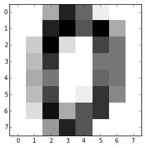
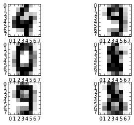

第11章　识别手写体数字　　271
11.1　手写体识别　　271
11.2　用scikit-learn识别手写体数字　　271
11.3　Digits数据集　　272
11.4　学习和预测　　274
11.5　小结　　276


```python
from sklearn import svm
svc = svm.SVC(gamma=0.001, C=100.)
```


```python
from sklearn import datasets

digits = datasets.load_digits()
```


```python
digits.images[0]
```


    array([[  0.,   0.,   5.,  13.,   9.,   1.,   0.,   0.],
           [  0.,   0.,  13.,  15.,  10.,  15.,   5.,   0.],
           [  0.,   3.,  15.,   2.,   0.,  11.,   8.,   0.],
           [  0.,   4.,  12.,   0.,   0.,   8.,   8.,   0.],
           [  0.,   5.,   8.,   0.,   0.,   9.,   8.,   0.],
           [  0.,   4.,  11.,   0.,   1.,  12.,   7.,   0.],
           [  0.,   2.,  14.,   5.,  10.,  12.,   0.,   0.],
           [  0.,   0.,   6.,  13.,  10.,   0.,   0.,   0.]])


```python
digits.target.size
```


    1797


```python
digits.target
```


    array([0, 1, 2, ..., 8, 9, 8])


```python
import matplotlib.pyplot as plt
%matplotlib inline

plt.imshow(digits.images[0], cmap=plt.cm.gray_r, interpolation='nearest')
```


    <matplotlib.image.AxesImage at 0x16657400>





```python
svc.fit(digits.data[1:1790], digits.target[1:1790])
```


    SVC(C=100.0, cache_size=200, class_weight=None, coef0=0.0, degree=3,
      gamma=0.001, kernel='rbf', max_iter=-1, probability=False,
      random_state=None, shrinking=True, tol=0.001, verbose=False)


```python
import matplotlib.pyplot as plt
%matplotlib inline

plt.subplot(321)
plt.imshow(digits.images[1791], cmap=plt.cm.gray_r, interpolation='nearest')
plt.subplot(322)
plt.imshow(digits.images[1792], cmap=plt.cm.gray_r, interpolation='nearest')
plt.subplot(323)
plt.imshow(digits.images[1793], cmap=plt.cm.gray_r, interpolation='nearest')
plt.subplot(324)
plt.imshow(digits.images[1794], cmap=plt.cm.gray_r, interpolation='nearest')
plt.subplot(325)
plt.imshow(digits.images[1795], cmap=plt.cm.gray_r, interpolation='nearest')
plt.subplot(326)
plt.imshow(digits.images[1796], cmap=plt.cm.gray_r, interpolation='nearest')

```


    <matplotlib.image.AxesImage at 0x175e6b00>





```python
svc.predict(digits.data[1791:1976])

```


    array([4, 9, 0, 8, 9, 8])


```python
digits.target[1791:1976]
```


    array([4, 9, 0, 8, 9, 8])


