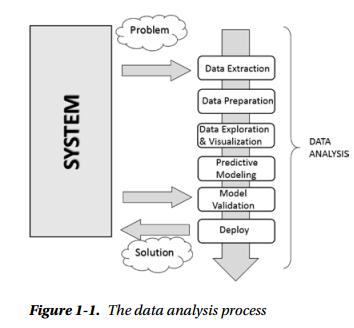
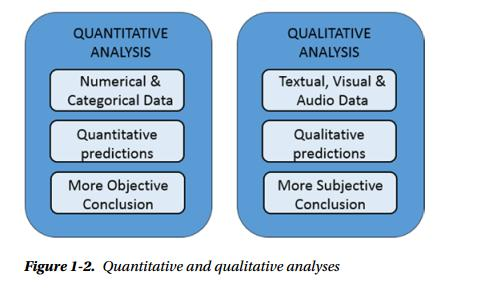

# 1.1数据分析

什么是数据，数据不同于信息。信息实际上是对数据集进行处理，从中提炼出可用于其他场合的结论，也就是说，它是对数据进行处理后得到的结果。从原始数据中抽取信息的这个过程就叫做**数据分析**。

数据分析的目的正是抽取不易推断的信息，而一旦理解了这些信息，就能够对产生数据的系统的运行机制进行研究，从而对系统可能的响应和演变做出预测。

数据分析最初用于数据保护，现在已经发展成为数据建模的方法论，从而完成了到一门真正科学的转变。模型实际上是指将所研究的系统转化为数学形式。一旦建立数学或逻辑模型，对系统的响应能做出不同精度的预测，我们就可以预测在给定输入的情况下，系统会给出怎样的输出。这样看来，数据分析的目的不止是建模，更重要的是其预测能力。

模型的预测能力不仅取决于建模技术的质量，还取决于选择分析使用的优质数据集的能力。因此数据搜索、数据提取、数据准备也是属于数据分析的范畴，他们对最终结果有重要影响。

在数据分析的各个阶段还是有各种各样的数据可视化方法。无论是孤立的看数据，还是将其放到整个数据集来看，理解数据的最好的方法莫过于将其做成可视化的图形，从而传达出数字中蕴含的信息。

数据分析的产出为模型和图形化展示，据此可预测所研究系统的响应。随后进入测试阶段，用已知输出结果的一个数据集对模型进行测试。这些数据不是用来生成模型的，而是用来检验系统给的能否重现实际观察到的输出，从而掌握模型的误差，了解其有效性和局限。

拿新模型的测试结果与既有模型进行对比便可知道优劣。如果新模型胜出，既可尽心该数据分析的最后一步，部署。部署阶段需要根据摩西个给出的预测结果，实现相应的决策，同时还要防范模型预测到的潜在风险。

#  1.2数据分析师的知识范畴
1. 计算机科学
2. 数据和统计学
3. 机器学习和人工智能
4. 数据来源领域

# 1.3理解数据的性质
数据 -> 信息 -> 知识

# 1.4数据分析过程
数据分析过程可以用下图表示

- 问题定义
- 数据抽取
- 数据清洗
- 数据转换
- 数据探索
- 预测模型
- 模型评估/测试
- 结果可视化和阐释
- 解决方案部署

# 1.5 定量和定性数据分析

# 1.6 开放数据源

[开放数据源](https://zhanghaogithub123.github.io/2018/04/11/%E5%BC%80%E6%94%BE%E6%95%B0%E6%8D%AE%E6%BA%90/)

# 1.7 python和数据分析
python大量的库为数据分析和处理提供了完整的工具集，也广泛应用于科学计算领域。

