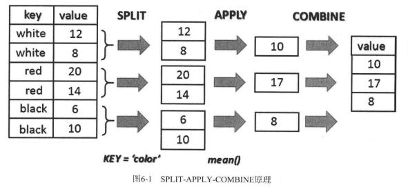

# 第6章　深入pandas：数据处理　　117
# 6.1　数据准备　　117
合并


```python
#merge是两个dataframe共同包含的项
import numpy as np
import pandas as pd
frame1 = pd.DataFrame( {'id':['ball','pencil','pen','mug','ashtray'], 'price': [12.33,11.44,33.21,13.23,33.62]})
print(frame1)
print()
frame2 = pd.DataFrame( {'id':['pencil','pencil','ball','pen'],'color': ['white','red','red','black']})
print(frame2)
print()
temp = pd.merge(frame1,frame2)
print(temp)
```

            id  price
    0     ball  12.33
    1   pencil  11.44
    2      pen  33.21
    3      mug  13.23
    4  ashtray  33.62
    
       color      id
    0  white  pencil
    1    red  pencil
    2    red    ball
    3  black     pen
    
           id  price  color
    0    ball  12.33    red
    1  pencil  11.44  white
    2  pencil  11.44    red
    3     pen  33.21  black
    


```python
frame1 = pd.DataFrame( {'id':['ball','pencil','pen','mug','ashtray'],
 'color': ['white','red','red','black','green'],
 'brand': ['OMG','ABC','ABC','POD','POD']})
print(frame1)
print()
frame2 = pd.DataFrame( {'id':['pencil','pencil','ball','pen'],
 'brand': ['OMG','POD','ABC','POD']})
print(frame2)
print()

temp = pd.merge(frame1,frame2)
print(temp)
print()

temp = pd.merge(frame1,frame2,on='id')
print(temp)
print()

temp = pd.merge(frame1,frame2,on='brand')
print(temp)
```

      brand  color       id
    0   OMG  white     ball
    1   ABC    red   pencil
    2   ABC    red      pen
    3   POD  black      mug
    4   POD  green  ashtray
    
      brand      id
    0   OMG  pencil
    1   POD  pencil
    2   ABC    ball
    3   POD     pen
    
    Empty DataFrame
    Columns: [brand, color, id]
    Index: []
    
      brand_x  color      id brand_y
    0     OMG  white    ball     ABC
    1     ABC    red  pencil     OMG
    2     ABC    red  pencil     POD
    3     ABC    red     pen     POD
    
      brand  color     id_x    id_y
    0   OMG  white     ball  pencil
    1   ABC    red   pencil    ball
    2   ABC    red      pen    ball
    3   POD  black      mug  pencil
    4   POD  black      mug     pen
    5   POD  green  ashtray  pencil
    6   POD  green  ashtray     pen
    


```python
print(frame1)
print()
frame2.columns = ['brand','sid']
print(frame2)
print()

temp = pd.merge(frame1, frame2, left_on='id', right_on='sid')
print(temp)
```

      brand  color       id
    0   OMG  white     ball
    1   ABC    red   pencil
    2   ABC    red      pen
    3   POD  black      mug
    4   POD  green  ashtray
    
      brand     sid
    0   OMG  pencil
    1   POD  pencil
    2   ABC    ball
    3   POD     pen
    
      brand_x  color      id brand_y     sid
    0     OMG  white    ball     ABC    ball
    1     ABC    red  pencil     OMG  pencil
    2     ABC    red  pencil     POD  pencil
    3     ABC    red     pen     POD     pen
    


```python
frame2.columns = ['brand','id']
temp = pd.merge(frame1,frame2,on='id')
print(temp)
```

      brand_x  color      id brand_y
    0     OMG  white    ball     ABC
    1     ABC    red  pencil     OMG
    2     ABC    red  pencil     POD
    3     ABC    red     pen     POD
    


```python
temp = pd.merge(frame1,frame2,on='id',how='outer')
print(temp)
```

      brand_x  color       id brand_y
    0     OMG  white     ball     ABC
    1     ABC    red   pencil     OMG
    2     ABC    red   pencil     POD
    3     ABC    red      pen     POD
    4     POD  black      mug     NaN
    5     POD  green  ashtray     NaN
    


```python
temp = pd.merge(frame1,frame2,on='id',how='left')
print(temp)
```

      brand_x  color       id brand_y
    0     OMG  white     ball     ABC
    1     ABC    red   pencil     OMG
    2     ABC    red   pencil     POD
    3     ABC    red      pen     POD
    4     POD  black      mug     NaN
    5     POD  green  ashtray     NaN
    


```python
temp = pd.merge(frame1,frame2,on='id',how='right')
print(temp)
```

      brand_x  color      id brand_y
    0     OMG  white    ball     ABC
    1     ABC    red  pencil     OMG
    2     ABC    red  pencil     POD
    3     ABC    red     pen     POD
    


```python
temp = pd.merge(frame1,frame2,on=['id','brand'],how='outer')
print(temp)
```

      brand  color       id
    0   OMG  white     ball
    1   ABC    red   pencil
    2   ABC    red      pen
    3   POD  black      mug
    4   POD  green  ashtray
    5   OMG    NaN   pencil
    6   POD    NaN   pencil
    7   ABC    NaN     ball
    8   POD    NaN      pen
    
根据索引合并

```python
temp = pd.merge(frame1,frame2,right_index=True, left_index=True)  
print(temp)
```

      brand_x  color    id_x brand_y    id_y
    0     OMG  white    ball     OMG  pencil
    1     ABC    red  pencil     POD  pencil
    2     ABC    red     pen     ABC    ball
    3     POD  black     mug     POD     pen
    


```python
frame2.columns = ['brand2','id2']
temp = frame1.join(frame2)
print(temp)
```

      brand  color       id brand2     id2
    0   OMG  white     ball    OMG  pencil
    1   ABC    red   pencil    POD  pencil
    2   ABC    red      pen    ABC    ball
    3   POD  black      mug    POD     pen
    4   POD  green  ashtray    NaN     NaN
    

# 6.2　拼接　　122


```python
array1 = np.arange(9).reshape((3,3))
array1
```


    array([[0, 1, 2],
           [3, 4, 5],
           [6, 7, 8]])


```python
array2 = np.arange(9).reshape((3,3))+6
array2
```


    array([[ 6,  7,  8],
           [ 9, 10, 11],
           [12, 13, 14]])


```python
np.concatenate([array1,array2],axis=1)
```


    array([[ 0,  1,  2,  6,  7,  8],
           [ 3,  4,  5,  9, 10, 11],
           [ 6,  7,  8, 12, 13, 14]])


```python
np.concatenate([array1,array2],axis=0)
```


    array([[ 0,  1,  2],
           [ 3,  4,  5],
           [ 6,  7,  8],
           [ 6,  7,  8],
           [ 9, 10, 11],
           [12, 13, 14]])


```python
ser1 = pd.Series(np.random.rand(4), index=[1,2,3,4])
ser1
```


    1    0.480270
    2    0.440535
    3    0.378281
    4    0.799113
    dtype: float64


```python
ser2 = pd.Series(np.random.rand(4), index=[5,6,7,8])
ser2
```


    5    0.134120
    6    0.703728
    7    0.657262
    8    0.020803
    dtype: float64


```python
temp = pd.concat([ser1,ser2])
print(temp)
```

    1    0.444507
    2    0.690626
    3    0.595412
    4    0.030619
    5    0.134120
    6    0.703728
    7    0.657262
    8    0.020803
    dtype: float64
    


```python
ser3 = pd.concat([ser1,ser2],axis=1)
print(ser3)
```

              0         1
    1  0.444507       NaN
    2  0.690626       NaN
    3  0.595412       NaN
    4  0.030619       NaN
    5       NaN  0.134120
    6       NaN  0.703728
    7       NaN  0.657262
    8       NaN  0.020803
    


```python
temp = pd.concat([ser1,ser3],axis=1,join='inner')
print(temp)
```

              0         0   1
    1  0.444507  0.444507 NaN
    2  0.690626  0.690626 NaN
    3  0.595412  0.595412 NaN
    4  0.030619  0.030619 NaN
    


```python
temp = pd.concat([ser1,ser2], keys=[1,2])
print(temp)
```

    1  1    0.444507
       2    0.690626
       3    0.595412
       4    0.030619
    2  5    0.134120
       6    0.703728
       7    0.657262
       8    0.020803
    dtype: float64
    


```python
temp = pd.concat([ser1,ser2], axis=1, keys=[1,2])
print(temp)
```

              1         2
    1  0.444507       NaN
    2  0.690626       NaN
    3  0.595412       NaN
    4  0.030619       NaN
    5       NaN  0.134120
    6       NaN  0.703728
    7       NaN  0.657262
    8       NaN  0.020803
    


```python
frame1 = pd.DataFrame(np.random.rand(9).reshape(3,3), index=[1,2,3], columns=['A','B','C'])
print(frame1)
print()
frame2 = pd.DataFrame(np.random.rand(9).reshape(3,3), index=[4,5,6], columns=['A','B','C'])
print(frame2)
print()
temp = pd.concat([frame1, frame2])
print(temp)
```

              A         B         C
    1  0.918894  0.884497  0.451266
    2  0.990586  0.412664  0.289380
    3  0.058831  0.746895  0.911668
    
              A         B         C
    4  0.256936  0.837374  0.677940
    5  0.379119  0.453602  0.858519
    6  0.832512  0.736023  0.583485
    
              A         B         C
    1  0.918894  0.884497  0.451266
    2  0.990586  0.412664  0.289380
    3  0.058831  0.746895  0.911668
    4  0.256936  0.837374  0.677940
    5  0.379119  0.453602  0.858519
    6  0.832512  0.736023  0.583485
    


```python
temp = pd.concat([frame1, frame2], axis=1)
print(temp)
```

              A         B         C         A         B         C
    1  0.918894  0.884497  0.451266       NaN       NaN       NaN
    2  0.990586  0.412664  0.289380       NaN       NaN       NaN
    3  0.058831  0.746895  0.911668       NaN       NaN       NaN
    4       NaN       NaN       NaN  0.256936  0.837374  0.677940
    5       NaN       NaN       NaN  0.379119  0.453602  0.858519
    6       NaN       NaN       NaN  0.832512  0.736023  0.583485
    

## 6.2.1　组合　　124


```python
ser1 = pd.Series(np.random.rand(5),index=[1,2,3,4,5])
print(ser1)
print()
ser2 = pd.Series(np.random.rand(4),index=[2,4,5,6])
print(ser2)
print()
temp = ser1.combine_first(ser2)
print(temp)
```

    1    0.598971
    2    0.143975
    3    0.080446
    4    0.437893
    5    0.033583
    dtype: float64
    
    2    0.326416
    4    0.732483
    5    0.476231
    6    0.468597
    dtype: float64
    
    1    0.598971
    2    0.143975
    3    0.080446
    4    0.437893
    5    0.033583
    6    0.468597
    dtype: float64
    


```python
temp = ser2.combine_first(ser1)
print(temp)
```

    1    0.598971
    2    0.326416
    3    0.080446
    4    0.732483
    5    0.476231
    6    0.468597
    dtype: float64
    


```python
temp = ser1[:3].combine_first(ser2[:3])
print(temp)
```

    1    0.598971
    2    0.143975
    3    0.080446
    4    0.732483
    5    0.476231
    dtype: float64
    

## 6.2.2　轴向旋转　　125
### 按等级索引旋转


```python
frame1 = pd.DataFrame(np.arange(9).reshape(3,3),
index=['white','black','red'],
columns=['ball','pen','pencil'])
print(frame1)
ser5 = frame1.stack()
ser5
```

           ball  pen  pencil
    white     0    1       2
    black     3    4       5
    red       6    7       8
    


    white  ball      0
           pen       1
           pencil    2
    black  ball      3
           pen       4
           pencil    5
    red    ball      6
           pen       7
           pencil    8
    dtype: int32


```python
temp = ser5.unstack()
print(temp)
```

           ball  pen  pencil
    white     0    1       2
    black     3    4       5
    red       6    7       8
    


```python
temp = ser5.unstack(0)
print(temp)
```

            white  black  red
    ball        0      3    6
    pen         1      4    7
    pencil      2      5    8
    

### 从长格式向宽格式旋转


```python
longframe = pd.DataFrame({ 'color':['white','white','white',
 'red','red','red',
 'black','black','black'],
 'item':['ball','pen','mug',
 'ball','pen','mug',
 'ball','pen','mug'],
 'value': np.random.rand(9)})
print(longframe)
```

       color  item     value
    0  white  ball  0.905908
    1  white   pen  0.476735
    2  white   mug  0.569165
    3    red  ball  0.483042
    4    red   pen  0.663438
    5    red   mug  0.866178
    6  black  ball  0.752131
    7  black   pen  0.616940
    8  black   mug  0.713100
    


```python
wideframe = longframe.pivot('color','item')
print(wideframe)
```

              value                    
    item       ball       mug       pen
    color                              
    black  0.752131  0.713100  0.616940
    red    0.483042  0.866178  0.663438
    white  0.905908  0.569165  0.476735
    

## 6.2.3　删除　　127


```python
frame1 = pd.DataFrame(np.arange(9).reshape(3,3),
 index=['white','black','red'],
 columns=['ball','pen','pencil'])
print(frame1)
del frame1['ball']
print(frame1)
temp = frame1.drop('white')
print(temp)
print(frame1)
```

           ball  pen  pencil
    white     0    1       2
    black     3    4       5
    red       6    7       8
           pen  pencil
    white    1       2
    black    4       5
    red      7       8
           pen  pencil
    black    4       5
    red      7       8
           pen  pencil
    white    1       2
    black    4       5
    red      7       8
    

# 6.3　数据转换　　128
## 6.3.1　删除重复元素　　128


```python
dframe = pd.DataFrame({ 'color': ['white','white','red','red','white'],
 'value': [2,1,3,3,2]})
print(dframe)
temp = dframe.duplicated()
print(temp)
temp = dframe[dframe.duplicated()]
print(temp)
```

       color  value
    0  white      2
    1  white      1
    2    red      3
    3    red      3
    4  white      2
    0    False
    1    False
    2    False
    3     True
    4     True
    dtype: bool
       color  value
    3    red      3
    4  white      2
    

## 6.3.2　映射　　129
### 用映射替换元素


```python
frame = pd.DataFrame({ 'item':['ball','mug','pen','pencil','ashtray'],
 'color':['white','rosso','verde','black','yellow'],
'price':[5.56,4.20,1.30,0.56,2.75]})
print(frame)
newcolors = {
 'rosso': 'red',
 'verde': 'green'
 }
temp = frame.replace(newcolors)
print(temp)
```

        color     item  price
    0   white     ball   5.56
    1   rosso      mug   4.20
    2   verde      pen   1.30
    3   black   pencil   0.56
    4  yellow  ashtray   2.75
        color     item  price
    0   white     ball   5.56
    1     red      mug   4.20
    2   green      pen   1.30
    3   black   pencil   0.56
    4  yellow  ashtray   2.75
    


```python
ser = pd.Series([1,3,np.nan,4,6,np.nan,3])
print(ser)
temp = ser.replace(np.nan,0)
print(temp)
```

    0    1.0
    1    3.0
    2    NaN
    3    4.0
    4    6.0
    5    NaN
    6    3.0
    dtype: float64
    0    1.0
    1    3.0
    2    0.0
    3    4.0
    4    6.0
    5    0.0
    6    3.0
    dtype: float64
    

### 用映射添加元素


```python
frame = pd.DataFrame({ 'item':['ball','mug','pen','pencil','ashtray'],
 'color':['white','red','green','black','yellow']})
print(frame)
price = {
 'ball' : 5.56,
 'mug' : 4.20,
 'bottle' : 1.30,
 'scissors' : 3.41,
 'pen' : 1.30,
 'pencil' : 0.56,
 'ashtray' : 2.75
 }
frame['price'] = frame['item'].map(price)
print(frame)
```

        color     item
    0   white     ball
    1     red      mug
    2   green      pen
    3   black   pencil
    4  yellow  ashtray
        color     item  price
    0   white     ball   5.56
    1     red      mug   4.20
    2   green      pen   1.30
    3   black   pencil   0.56
    4  yellow  ashtray   2.75
    

### 重命名轴索引


```python
reindex = {
 0: 'first',
 1: 'second',
 2: 'third',
 3: 'fourth',
 4: 'fifth'}
temp = frame.rename(reindex)
print(temp)
```

             color     item  price
    first    white     ball   5.56
    second     red      mug   4.20
    third    green      pen   1.30
    fourth   black   pencil   0.56
    fifth   yellow  ashtray   2.75
    


```python
recolumn = {
 'item':'object',
 'price': 'value'}
temp = frame.rename(index=reindex, columns=recolumn)
print(temp)
```

             color   object  value
    first    white     ball   5.56
    second     red      mug   4.20
    third    green      pen   1.30
    fourth   black   pencil   0.56
    fifth   yellow  ashtray   2.75
    


```python
temp = frame.rename(index={1:'first'}, columns={'item':'object'})
print(temp)
```

            color   object  price
    0       white     ball   5.56
    first     red      mug   4.20
    2       green      pen   1.30
    3       black   pencil   0.56
    4      yellow  ashtray   2.75
    

# 6.4　离散化和面元划分　　132


```python
results = [12,34,67,55,28,90,99,12,3,56,74,44,87,23,49,89,87]
bins = [0,25,50,75,100]
cat = pd.cut(results, bins)
cat
```


    [(0, 25], (25, 50], (50, 75], (50, 75], (25, 50], ..., (75, 100], (0, 25], (25, 50], (75, 100], (75, 100]]
    Length: 17
    Categories (4, interval[int64]): [(0, 25] < (25, 50] < (50, 75] < (75, 100]]


```python
cat.labels
```

    D:\ProgramData\Anaconda3_32\lib\site-packages\ipykernel_launcher.py:1: FutureWarning: 'labels' is deprecated. Use 'codes' instead
      """Entry point for launching an IPython kernel.
    


    array([0, 1, 2, 2, 1, 3, 3, 0, 0, 2, 2, 1, 3, 0, 1, 3, 3], dtype=int8)


```python
pd.value_counts(cat)
```


    (75, 100]    5
    (50, 75]     4
    (25, 50]     4
    (0, 25]      4
    dtype: int64


```python
bin_names = ['unlikely','less likely','likely','highly likely']
pd.cut(results, bins, labels=bin_names)
```


    [unlikely, less likely, likely, likely, less likely, ..., highly likely, unlikely, less likely, highly likely, highly likely]
    Length: 17
    Categories (4, object): [unlikely < less likely < likely < highly likely]


```python
pd.cut(results, 5)
```


    [(2.904, 22.2], (22.2, 41.4], (60.6, 79.8], (41.4, 60.6], (22.2, 41.4], ..., (79.8, 99.0], (22.2, 41.4], (41.4, 60.6], (79.8, 99.0], (79.8, 99.0]]
    Length: 17
    Categories (5, interval[float64]): [(2.904, 22.2] < (22.2, 41.4] < (41.4, 60.6] < (60.6, 79.8] < (79.8, 99.0]]


```python
quintiles = pd.qcut(results, 5)
quintiles
```


    [(2.999, 24.0], (24.0, 46.0], (62.6, 87.0], (46.0, 62.6], (24.0, 46.0], ..., (62.6, 87.0], (2.999, 24.0], (46.0, 62.6], (87.0, 99.0], (62.6, 87.0]]
    Length: 17
    Categories (5, interval[float64]): [(2.999, 24.0] < (24.0, 46.0] < (46.0, 62.6] < (62.6, 87.0] < (87.0, 99.0]]


```python
pd.value_counts(quintiles)
```


    (62.6, 87.0]     4
    (2.999, 24.0]    4
    (87.0, 99.0]     3
    (46.0, 62.6]     3
    (24.0, 46.0]     3
    dtype: int64


### 异常值检测和过滤


```python
randframe = pd.DataFrame(np.random.randn(1000,3))
temp = randframe.describe()
print(temp)
```

                     0            1            2
    count  1000.000000  1000.000000  1000.000000
    mean     -0.017081     0.009233    -0.016035
    std       0.983899     0.986440     0.961825
    min      -3.834283    -3.725847    -2.810249
    25%      -0.651448    -0.645679    -0.674606
    50%      -0.031185     0.004074    -0.006893
    75%       0.633531     0.721898     0.669395
    max       3.006011     3.018671     3.290535
    


```python
randframe.std()
```


    0    0.983899
    1    0.986440
    2    0.961825
    dtype: float64


```python
temp = randframe[(np.abs(randframe) > (3*randframe.std())).any(1)]
print(temp)
```

                0         1         2
    66  -1.552807  1.813374  3.141080
    169 -1.154864 -3.725847 -0.647544
    226 -3.411732  1.907356 -0.004208
    426  3.006011  0.554358  0.687883
    457 -1.282513 -1.312958  3.290535
    465 -3.834283 -0.310886  1.280224
    748  2.977327 -0.937580  0.361383
    764 -0.000591  3.018671 -1.180475
    

# 6.5　排序　　136


```python
nframe = pd.DataFrame(np.arange(25).reshape(5,5))
print(nframe)
```

        0   1   2   3   4
    0   0   1   2   3   4
    1   5   6   7   8   9
    2  10  11  12  13  14
    3  15  16  17  18  19
    4  20  21  22  23  24
    


```python
new_order = np.random.permutation(5)
print(new_order)
```

    [4 2 1 3 0]
    


```python
temp = nframe.take(new_order)
print(temp)
```

        0   1   2   3   4
    4  20  21  22  23  24
    2  10  11  12  13  14
    1   5   6   7   8   9
    3  15  16  17  18  19
    0   0   1   2   3   4
    


```python
new_order = [3,4,2]
temp = nframe.take(new_order)
print(temp)
```

        0   1   2   3   4
    3  15  16  17  18  19
    4  20  21  22  23  24
    2  10  11  12  13  14
    

### 随机取样


```python
sample = np.random.randint(0, len(nframe), size=3)
sample
```


    array([3, 3, 3])


```python
temp = nframe.take(sample)
print(temp)
```

        0   1   2   3   4
    3  15  16  17  18  19
    3  15  16  17  18  19
    3  15  16  17  18  19
    

# 6.6　字符串处理　　137
## 6.6.1　内置的字符串处理方法　　137


```python
text = '16 Bolton Avenue , Boston'
text.split(',')
```


    ['16 Bolton Avenue ', ' Boston']


```python
tokens = [s.strip() for s in text.split(',')]
tokens
```


    ['16 Bolton Avenue', 'Boston']


```python
address, city = [s.strip() for s in text.split(',')]
print(address)
print(city)
```

    16 Bolton Avenue
    Boston
    


```python
address + ',' + city
```


    '16 Bolton Avenue,Boston'


```python
strings = ['A+','A','A-','B','BB','BBB','C+']
';'.join(strings)
```


    'A+;A;A-;B;BB;BBB;C+'


```python
'Boston' in text
```


    True


```python
text.index('Boston')
```


    19


```python
text.find('Boston')
```


    19


```python
text.index('New York')
```


    ---------------------------------------------------------------------------

    ValueError                                Traceback (most recent call last)

    <ipython-input-113-e44f5210d36c> in <module>()
    ----> 1 text.index('New York')
    

    ValueError: substring not found


```python
text.count('e')
```


    2


```python
text.count('Avenue')
```


    1


```python
text.replace('Avenue','Street')
```


    '16 Bolton Street , Boston'


```python
text.replace('1','')
```


    '6 Bolton Avenue , Boston'


## 6.6.2　正则表达式　　139


```python
import re
text = "This is an\t odd \n text!"
re.split('\s+', text)
```


    ['This', 'is', 'an', 'odd', 'text!']


```python
regex = re.compile('\s+')
regex.split(text)
```


    ['This', 'is', 'an', 'odd', 'text!']


```python
text = 'This is my address: 16 Bolton Avenue, Boston'
re.findall('A\w+',text)
```


    ['Avenue']


```python
re.findall('[A,a]\w+',text)
```


    ['address', 'Avenue']


```python
re.search('[A,a]\w+',text)
```


    <_sre.SRE_Match object; span=(11, 18), match='address'>


```python
search = re.search('[A,a]\w+',text)
search.start()
```


    11


```python
search.end()
```


    18


```python
text[search.start():search.end()]
```


    'address'


```python
re.match('[A,a]\w+',text)
```


```python
re.match('T\w+',text)
```


    <_sre.SRE_Match object; span=(0, 4), match='This'>


```python
match = re.match('T\w+',text)
text[match.start():match.end()]
```


    'This'


# 6.7　数据聚合　　140
## 6.7.1　GroupBy　　141



## 6.7.2　实例　　141


```python
frame = pd.DataFrame({ 'color': ['white','red','green','red','green'],
 'object': ['pen','pencil','pencil','ashtray','pen'],
 'price1' : [5.56,4.20,1.30,0.56,2.75],
 'price2' : [4.75,4.12,1.60,0.75,3.15]})
print(frame)
```

       color   object  price1  price2
    0  white      pen    5.56    4.75
    1    red   pencil    4.20    4.12
    2  green   pencil    1.30    1.60
    3    red  ashtray    0.56    0.75
    4  green      pen    2.75    3.15
    


```python
group = frame['price1'].groupby(frame['color'])
group
```


    <pandas.core.groupby.SeriesGroupBy object at 0x06923E30>


```python
group.groups
```


    {'green': Int64Index([2, 4], dtype='int64'),
     'red': Int64Index([1, 3], dtype='int64'),
     'white': Int64Index([0], dtype='int64')}


```python
group.mean()
```


    color
    green    2.025
    red      2.380
    white    5.560
    Name: price1, dtype: float64


```python
group.sum()
```


    color
    green    4.05
    red      4.76
    white    5.56
    Name: price1, dtype: float64


```python
ggroup = frame['price1'].groupby([frame['color'],frame['object']])
ggroup.groups
```


    {('green', 'pen'): Int64Index([4], dtype='int64'),
     ('green', 'pencil'): Int64Index([2], dtype='int64'),
     ('red', 'ashtray'): Int64Index([3], dtype='int64'),
     ('red', 'pencil'): Int64Index([1], dtype='int64'),
     ('white', 'pen'): Int64Index([0], dtype='int64')}


```python
ggroup.sum()
```


    color  object 
    green  pen        2.75
           pencil     1.30
    red    ashtray    0.56
           pencil     4.20
    white  pen        5.56
    Name: price1, dtype: float64


## 6.7.3　等级分组　　142


```python
temp = frame[['price1','price2']].groupby(frame['color']).mean()
print(temp)
```

           price1  price2
    color                
    green   2.025   2.375
    red     2.380   2.435
    white   5.560   4.750
    


```python
temp = frame.groupby(frame['color']).mean()
print(temp)
```

           price1  price2
    color                
    green   2.025   2.375
    red     2.380   2.435
    white   5.560   4.750
    

# 6.8　组迭代　　143


```python
for name, group in frame.groupby('color'):
    print(name)
    print(group)
```

    green
       color  object  price1  price2
    2  green  pencil    1.30    1.60
    4  green     pen    2.75    3.15
    red
      color   object  price1  price2
    1   red   pencil    4.20    4.12
    3   red  ashtray    0.56    0.75
    white
       color object  price1  price2
    0  white    pen    5.56    4.75
    

## 6.8.1　链式转换　　144


```python
result1 = frame['price1'].groupby(frame['color']).mean()
type(result1)
```


    pandas.core.series.Series


```python
result2 = frame.groupby(frame['color']).mean()
type(result2)
```


    pandas.core.frame.DataFrame


```python
frame['price1'].groupby(frame['color']).mean()
```


    color
    green    2.025
    red      2.380
    white    5.560
    Name: price1, dtype: float64


```python
frame.groupby(frame['color'])['price1'].mean()
```


    color
    green    2.025
    red      2.380
    white    5.560
    Name: price1, dtype: float64


```python
(frame.groupby(frame['color']).mean())['price1']
```


    color
    green    2.025
    red      2.380
    white    5.560
    Name: price1, dtype: float64


```python
means = frame.groupby('color').mean().add_prefix('mean_')
print(means)
```

           mean_price1  mean_price2
    color                          
    green        2.025        2.375
    red          2.380        2.435
    white        5.560        4.750
    

## 6.8.2　分组函数　　145


```python
group = frame.groupby('color')
group['price1'].quantile(0.6)
```


    color
    green    2.170
    red      2.744
    white    5.560
    Name: price1, dtype: float64


```python
def myrange(series):
    return series.max() - series.min()
```


```python
group['price1'].agg(myrange)
```


    color
    green    1.45
    red      3.64
    white    0.00
    Name: price1, dtype: float64


```python
temp = group.agg(myrange)
print(temp)
```

           price1  price2
    color                
    green    1.45    1.55
    red      3.64    3.37
    white    0.00    0.00
    


```python
temp = group['price1'].agg(['mean','std',myrange])
print(temp)
```

            mean       std  myrange
    color                          
    green  2.025  1.025305     1.45
    red    2.380  2.573869     3.64
    white  5.560       NaN     0.00
    

# 6.9　高级数据聚合　　145


```python
frame = pd.DataFrame({ 'color':['white','red','green','red','green'],
 'price1':[5.56,4.20,1.30,0.56,2.75],
 'price2':[4.75,4.12,1.60,0.75,3.15]})
print(frame)
```

       color  price1  price2
    0  white    5.56    4.75
    1    red    4.20    4.12
    2  green    1.30    1.60
    3    red    0.56    0.75
    4  green    2.75    3.15
    


```python
sums = frame.groupby('color').sum().add_prefix('tot_')
print(sums)
```

           tot_price1  tot_price2
    color                        
    green        4.05        4.75
    red          4.76        4.87
    white        5.56        4.75
    


```python
temp = pd.merge(frame,sums,left_on='color',right_index=True)
print(temp)
```

       color  price1  price2  tot_price1  tot_price2
    0  white    5.56    4.75        5.56        4.75
    1    red    4.20    4.12        4.76        4.87
    3    red    0.56    0.75        4.76        4.87
    2  green    1.30    1.60        4.05        4.75
    4  green    2.75    3.15        4.05        4.75
    


```python
temp = frame.groupby('color').transform(np.sum).add_prefix('tot_')
print(temp)
```

       tot_price1  tot_price2
    0        5.56        4.75
    1        4.76        4.87
    2        4.05        4.75
    3        4.76        4.87
    4        4.05        4.75
    


```python
frame = pd.DataFrame( { 'color':['white','black','white','white','black','black'],
 'status':['up','up','down','down','down','up'],
 'value1':[12.33,14.55,22.34,27.84,23.40,18.33],
 'value2':[11.23,31.80,29.99,31.18,18.25,22.44]})
print(frame)
```

       color status  value1  value2
    0  white     up   12.33   11.23
    1  black     up   14.55   31.80
    2  white   down   22.34   29.99
    3  white   down   27.84   31.18
    4  black   down   23.40   18.25
    5  black     up   18.33   22.44
    


```python
temp = frame.groupby(['color','status']).apply( lambda x: x.max())
print(temp)
```

                  color status  value1  value2
    color status                              
    black down    black   down   23.40   18.25
          up      black     up   18.33   31.80
    white down    white   down   27.84   31.18
          up      white     up   12.33   11.23
    


```python
temp = frame.rename(index=reindex, columns=recolumn)
print(temp)
```

            color status  value1  value2
    first   white     up   12.33   11.23
    second  black     up   14.55   31.80
    third   white   down   22.34   29.99
    fourth  white   down   27.84   31.18
    fifth   black   down   23.40   18.25
    5       black     up   18.33   22.44
    


```python
temp = pd.date_range('1/1/2015', periods=10, freq= 'H')
print(temp)
```

    DatetimeIndex(['2015-01-01 00:00:00', '2015-01-01 01:00:00',
                   '2015-01-01 02:00:00', '2015-01-01 03:00:00',
                   '2015-01-01 04:00:00', '2015-01-01 05:00:00',
                   '2015-01-01 06:00:00', '2015-01-01 07:00:00',
                   '2015-01-01 08:00:00', '2015-01-01 09:00:00'],
                  dtype='datetime64[ns]', freq='H')
    


```python
timeseries = pd.Series(np.random.rand(10), index=temp)
timeseries
```


    2015-01-01 00:00:00    0.463135
    2015-01-01 01:00:00    0.170738
    2015-01-01 02:00:00    0.542155
    2015-01-01 03:00:00    0.536056
    2015-01-01 04:00:00    0.606624
    2015-01-01 05:00:00    0.011034
    2015-01-01 06:00:00    0.277493
    2015-01-01 07:00:00    0.301076
    2015-01-01 08:00:00    0.170235
    2015-01-01 09:00:00    0.165120
    Freq: H, dtype: float64


```python
timetable = pd.DataFrame( {'date': temp, 'value1' : np.random.rand(10),
 'value2' : np.random.rand(10)})
print(timetable)
```

                     date    value1    value2
    0 2015-01-01 00:00:00  0.783525  0.025861
    1 2015-01-01 01:00:00  0.829443  0.642484
    2 2015-01-01 02:00:00  0.260990  0.350753
    3 2015-01-01 03:00:00  0.699793  0.118472
    4 2015-01-01 04:00:00  0.349411  0.228708
    5 2015-01-01 05:00:00  0.382496  0.902575
    6 2015-01-01 06:00:00  0.896227  0.934669
    7 2015-01-01 07:00:00  0.829987  0.941199
    8 2015-01-01 08:00:00  0.479027  0.203317
    9 2015-01-01 09:00:00  0.132429  0.102593
    


```python
timetable['cat'] = ['up','down','left','left','up','up','down','right','right','up']
print(timetable)
```

                     date    value1    value2    cat
    0 2015-01-01 00:00:00  0.783525  0.025861     up
    1 2015-01-01 01:00:00  0.829443  0.642484   down
    2 2015-01-01 02:00:00  0.260990  0.350753   left
    3 2015-01-01 03:00:00  0.699793  0.118472   left
    4 2015-01-01 04:00:00  0.349411  0.228708     up
    5 2015-01-01 05:00:00  0.382496  0.902575     up
    6 2015-01-01 06:00:00  0.896227  0.934669   down
    7 2015-01-01 07:00:00  0.829987  0.941199  right
    8 2015-01-01 08:00:00  0.479027  0.203317  right
    9 2015-01-01 09:00:00  0.132429  0.102593     up
    

# 6.10　小结　　148
