# 第7章　用matplotlib实现数据可视化　　149
# 7.1　matplotlib库　　149
# 7.2　安装　　150
# 7.3　IPython和IPython QtConsole　　150
# 7.4　matplotlib架构　　151


## 7.4.1　Backend层　　152
## 7.4.2　Artist层　　152

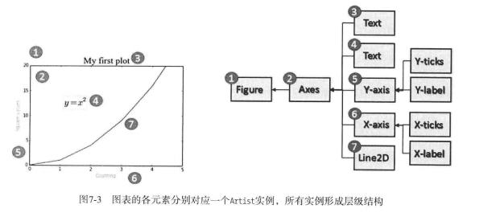

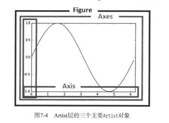

## 7.4.3　Scripting层（pyplot）　　153
## 7.4.4　pylab和pyplot　　153
# 7.5　pyplot　　154
## 7.5.1　生成一幅简单的交互式图表　　154


```python
import matplotlib.pyplot as plt
%matplotlib inline
plt.plot([1,2,3,4])
```


    [<matplotlib.lines.Line2D at 0xb50aa10>]


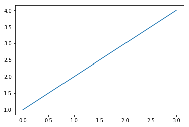


## 7.5.2　设置图形的属性　　156


```python
plt.plot([1,2,3,4],[1,4,9,16],'ro')
```


    [<matplotlib.lines.Line2D at 0xc78c450>]


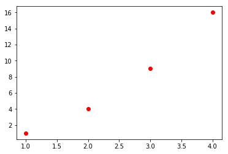


```python
plt.axis([0,5,0,20])
plt.title('My first plot')
plt.plot([1,2,3,4],[1,4,9,16],'ro')
```


    [<matplotlib.lines.Line2D at 0xc7ab610>]


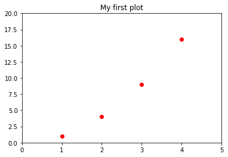


## 7.5.3　matplotlib和NumPy　　158


```python
import math
import numpy as np
t = np.arange(0,2.5,0.1)
y1 = list(map(math.sin,math.pi*t))
y2 = list(map(math.sin,math.pi*t+math.pi/2))
y3 = list(map(math.sin,math.pi*t-math.pi/2))
plt.plot(t,y1,'b*',t,y2,'g^',t,y3,'ys')
```


    [<matplotlib.lines.Line2D at 0xc9e7ff0>,
     <matplotlib.lines.Line2D at 0xc9f3110>,
     <matplotlib.lines.Line2D at 0xc9f3430>]


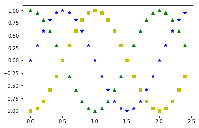


```python
plt.plot(t,y1,'b--',t,y2,'g',t,y3,'r-.')
```


    [<matplotlib.lines.Line2D at 0xca757b0>,
     <matplotlib.lines.Line2D at 0xca758b0>,
     <matplotlib.lines.Line2D at 0xca75bd0>]


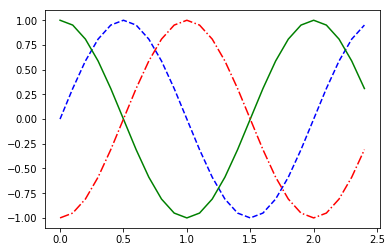


# 7.6　使用kwargs　　160


```python
plt.plot([1,2,4,2,1,0,1,2,1,4],linewidth=2.0)
```


    [<matplotlib.lines.Line2D at 0xcaba9d0>]


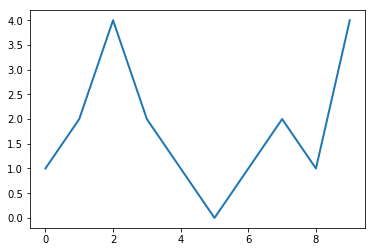

处理多个Figure和Axes对象

```python
t = np.arange(0,5,0.1)
y1 = np.sin(2*np.pi*t)
y2 = np.sin(2*np.pi*t)

plt.subplot(211)
plt.plot(t,y1,'b-.')
plt.subplot(212)
plt.plot(t,y2,'r--')
```


    [<matplotlib.lines.Line2D at 0xcb219b0>]


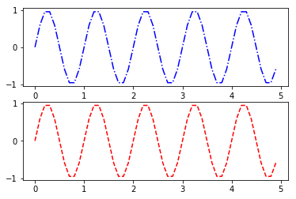


```python
t = np.arange(0.,1.,0.05)
y1 = np.sin(2*np.pi*t)
y2 = np.cos(2*np.pi*t)

plt.subplot(121)
plt.plot(t,y1,'b-.')
plt.subplot(122)
plt.plot(t,y2,'r--')
```


    [<matplotlib.lines.Line2D at 0xcb8c670>]


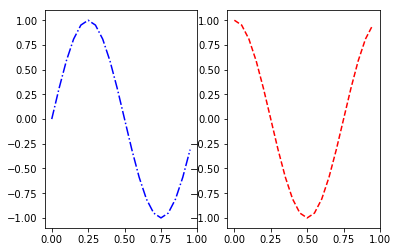


# 7.7　为图表添加更多元素　　162
## 7.7.1　添加文本　　162


```python
plt.axis([0,5,0,20])
plt.title('My first plot')
plt.xlabel('Counting')
plt.ylabel('Square values')
plt.plot([1,2,3,4],[1,4,9,16],'ro')
```


    [<matplotlib.lines.Line2D at 0xcbdf930>]


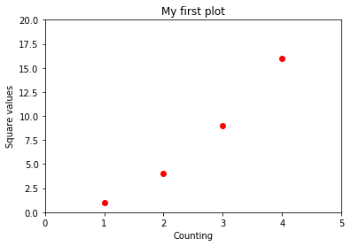


```python
plt.axis([0,5,0,20])
plt.title('My first plot',fontsize=20,fontname='Times New Roman')
plt.xlabel('Counting',color='gray')
plt.ylabel('Square values',color='gray')
plt.plot([1,2,3,4],[1,4,9,16],'ro')
```


    [<matplotlib.lines.Line2D at 0xcc19fb0>]


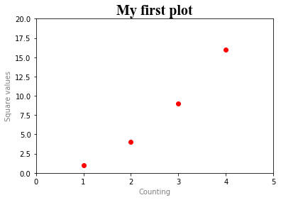


```python
plt.axis([0,5,0,20])
plt.title('My first plot',fontsize=20,fontname='Times New Roman')
plt.xlabel('Counting',color='gray')
plt.ylabel('Square values',color='gray')
plt.text(1,1.5,'First')
plt.text(2,4.5,'Second')
plt.text(3,9.5,'Third')
plt.text(4,16.5,'Fourth')
plt.plot([1,2,3,4],[1,4,9,16],'ro')
```


    [<matplotlib.lines.Line2D at 0xcc5ca50>]


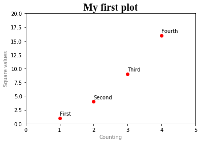


```python
plt.axis([0,5,0,20])
plt.title('My first plot',fontsize=20,fontname='Times New Roman')
plt.xlabel('Counting',color='gray')
plt.ylabel('Square values',color='gray')
plt.text(1,1.5,'First')
plt.text(2,4.5,'Second')
plt.text(3,9.5,'Third')
plt.text(4,16.5,'Fourth')
plt.text(1.1,12,r'$y = x^2$',fontsize=20,bbox={'facecolor':'yellow','alpha':0.2})
plt.plot([1,2,3,4],[1,4,9,16],'ro')
```


    [<matplotlib.lines.Line2D at 0xcca15f0>]


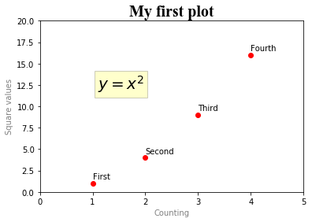


## 7.7.2　添加网格　　165


```python
plt.axis([0,5,0,20])
plt.title('My first plot',fontsize=20,fontname='Times New Roman')
plt.xlabel('Counting',color='gray')
plt.ylabel('Square values',color='gray')
plt.text(1,1.5,'First')
plt.text(2,4.5,'Second')
plt.text(3,9.5,'Third')
plt.text(4,16.5,'Fourth')
plt.text(1.1,12,r'$y = x^2$',fontsize=20,bbox={'facecolor':'yellow','alpha':0.2})
plt.grid(True)
plt.plot([1,2,3,4],[1,4,9,16],'ro')
```


    [<matplotlib.lines.Line2D at 0xcd2e6b0>]


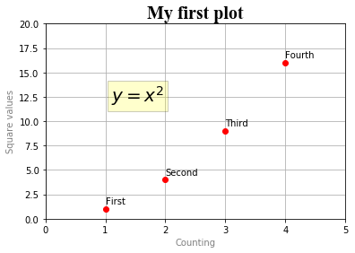


## 7.7.3　添加图例　　166


```python
plt.axis([0,5,0,20])
plt.title('My first plot',fontsize=20,fontname='Times New Roman')
plt.xlabel('Counting',color='gray')
plt.ylabel('Square values',color='gray')
plt.text(2,4.5,'Second')
plt.text(3,9.5,'Third')
plt.text(4,16.5,'Fourth')
plt.text(1.1,12,'$y = x^2$',fontsize=20,bbox={'facecolor':'yellow','alpha':0.2})
plt.grid(True)
plt.plot([1,2,3,4],[1,4,9,16],'ro')
plt.legend(['First series'])
```


    <matplotlib.legend.Legend at 0xcd71750>


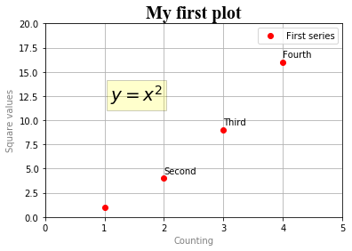


```python
import matplotlib.pyplot as plt
plt.axis([0,5,0,20])
plt.title('My first plot',fontsize=20,fontname='Times New Roman')
plt.xlabel('Counting',color='gray')
plt.ylabel('Square values',color='gray')
plt.text(1,1.5,'First')
plt.text(2,4.5,'Second')
plt.text(3,9.5,'Third')
plt.text(4,16.5,'Fourth')
plt.text(1.1,12,'$y = x^2$',fontsize=20,bbox={'facecolor':'yellow','alpha':0.2})
plt.grid(True)
plt.plot([1,2,3,4],[1,4,9,16],'ro')
plt.plot([1,2,3,4],[0.8,3.5,8,15],'g^')
plt.plot([1,2,3,4],[0.5,2.5,4,12],'b*')
plt.legend(['First series','Second series','Third series'],loc=2)
```


    <matplotlib.legend.Legend at 0xcdca450>


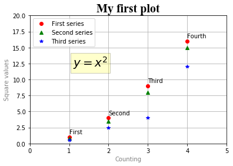

Location Code Location String
0 best
1 upper-right
2 upper-left
3 lower-right
4 lower-left
5 right
6 center-left
7 center-right
8 lower-center
9 upper-center
10 centerChapter 
# 7.8　保存图表　　168
## 7.8.1　保存代码　　169
## 7.8.2　将会话转换为HTML文件　　170
## 7.8.3　将图表直接保存为图片　　171


```python
plt.axis([0,5,0,20])
plt.title('My first plot',fontsize=20,fontname='Times New Roman')
plt.xlabel('Counting',color='gray')
plt.ylabel('Square values',color='gray')
plt.text(1,1.5,'First')
plt.text(2,4.5,'Second')
plt.text(3,9.5,'Third')
plt.text(4,16.5,'Fourth')
plt.text(1.1,12,'$y = x^2$',fontsize=20,bbox={'facecolor':'yellow','alpha':0.2})
plt.grid(True)
plt.plot([1,2,3,4],[1,4,9,16],'ro')
plt.plot([1,2,3,4],[0.8,3.5,8,15],'g^')
plt.plot([1,2,3,4],[0.5,2.5,4,12],'b*')
plt.legend(['First series','Second series','Third series'],loc=2)
plt.savefig('my_chart.png')
```


# 7.9　处理日期值　　171


```python
import datetime
import numpy as np
import matplotlib.pyplot as plt
events = [datetime.date(2015,1,23),datetime.date(2015,1,28),datetime.
date(2015,2,3),datetime.date(2015,2,21),datetime.date(2015,3,15),datetime.
date(2015,3,24),datetime.date(2015,4,8),datetime.date(2015,4,24)]
readings = [12,22,25,20,18,15,17,14]
plt.plot(events,readings)
```


    [<matplotlib.lines.Line2D at 0xcdfa2d0>]


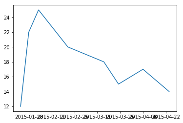


```python
import datetime
import numpy as np
import matplotlib.pyplot as plt
import matplotlib.dates as mdates
months = mdates.MonthLocator()
days = mdates.DayLocator()
timeFmt = mdates.DateFormatter('%Y-%m')
events = [datetime.date(2015,1,23),datetime.date(2015,1,28),datetime.
date(2015,2,3),datetime.date(2015,2,21),datetime.date(2015,3,15),datetime.
date(2015,3,24),datetime.date(2015,4,8),datetime.date(2015,4,24)]
readings = [12,22,25,20,18,15,17,14]
fig, ax = plt.subplots()
plt.plot(events,readings)
ax.xaxis.set_major_locator(months)
ax.xaxis.set_major_formatter(timeFmt)
ax.xaxis.set_minor_locator(days)
```


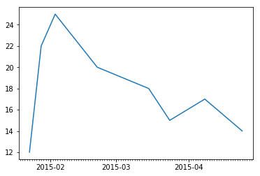


# 7.10　图表类型　　173
# 7.11　线性图　　173


```python
import matplotlib.pyplot as plt
import numpy as np
x = np.arange(-2*np.pi,2*np.pi,0.01)
y = np.sin(3*x)/x
plt.plot(x,y)
```


    [<matplotlib.lines.Line2D at 0xcf9eab0>]


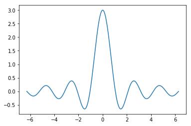


```python
import matplotlib.pyplot as plt
import numpy as np
x = np.arange(-2*np.pi,2*np.pi,0.01)
y = np.sin(x)/x
y2 = np.sin(2*x)/x
y3 = np.sin(3*x)/x
plt.plot(x,y)
plt.plot(x,y2)
plt.plot(x,y3)
```


    [<matplotlib.lines.Line2D at 0xcdc4ff0>]


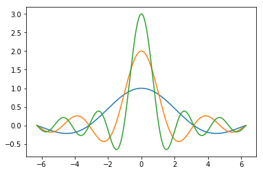


```python
import matplotlib.pyplot as plt
import numpy as np
x = np.arange(-2*np.pi,2*np.pi,0.01)
y = np.sin(x)/x
y2 = np.sin(2*x)/x
y3 = np.sin(3*x)/x
plt.plot(x,y,'k--',linewidth=3)
plt.plot(x,y2,'m-.')
plt.plot(x,y3,color='#87a3cc',linestyle='--')
```


    [<matplotlib.lines.Line2D at 0xe00f2d0>]


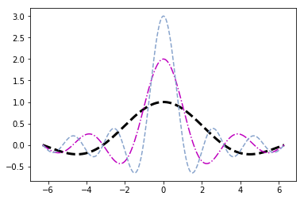

Code Color
b blue
g green
r red
c cyan
m magenta
y yellow
k black
w white

```python
import matplotlib.pyplot as plt
import numpy as np
x = np.arange(-2*np.pi,2*np.pi,0.01)
y = np.sin(3*x)/x
y2 = np.sin(2*x)/x
y3 = np.sin(x)/x
plt.plot(x,y,color='b')
plt.plot(x,y2,color='r')
plt.plot(x,y3,color='g')
plt.xticks([-2*np.pi, -np.pi, 0, np.pi, 2*np.pi],
[r'$-2\pi$',r'$-\pi$',r'$0$',r'$+\pi$',r'$+2\pi$'])
plt.yticks([-1,0,+1,+2,+3],
[r'$-1$',r'$0$',r'$+1$',r'$+2$',r'$+3$'])
```


    ([<matplotlib.axis.YTick at 0xe0358f0>,
      <matplotlib.axis.YTick at 0xe00f7f0>,
      <matplotlib.axis.YTick at 0xe035eb0>,
      <matplotlib.axis.YTick at 0xe05b430>,
      <matplotlib.axis.YTick at 0xe05b8b0>],
     <a list of 5 Text yticklabel objects>)


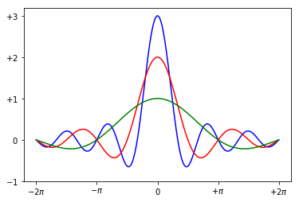


```python
import matplotlib.pyplot as plt
import numpy as np
x = np.arange(-2*np.pi,2*np.pi,0.01)
y = np.sin(3*x)/x
y2 = np.sin(2*x)/x
y3 = np.sin(x)/x
plt.plot(x,y,color='b')
plt.plot(x,y2,color='r')
plt.plot(x,y3,color='g')
plt.xticks([-2*np.pi, -np.pi, 0, np.pi, 2*np.pi],
[r'$-2\pi$',r'$-\pi$',r'$0$',r'$+\pi$',r'$+2\pi$'])
plt.yticks([-1,0,+1,+2,+3],
[r'$-1$',r'$0$',r'$+1$',r'$+2$',r'$+3$'])
ax = plt.gca()
ax.spines['right'].set_color('none')
ax.spines['top'].set_color('none')
ax.xaxis.set_ticks_position('bottom')
ax.spines['bottom'].set_position(('data',0))
ax.yaxis.set_ticks_position('left')
ax.spines['left'].set_position(('data',0))
```


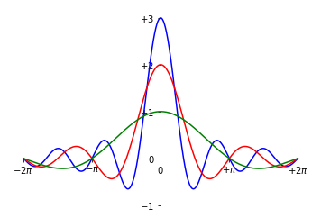


```python
import matplotlib.pyplot as plt
import numpy as np
x = np.arange(-2*np.pi,2*np.pi,0.01)
y = np.sin(3*x)/x
y2 = np.sin(2*x)/x
y3 = np.sin(x)/x
plt.plot(x,y,color='b')
plt.plot(x,y2,color='r')
plt.plot(x,y3,color='g')
plt.xticks([-2*np.pi, -np.pi, 0, np.pi, 2*np.pi],
[r'$-2\pi$',r'$-\pi$',r'$0$',r'$+\pi$',r'$+2\pi$'])
plt.yticks([-1,0,+1,+2,+3],
[r'$-1$',r'$0$',r'$+1$',r'$+2$',r'$+3$'])
plt.annotate(r'$\lim_{x\to 0}\frac{\sin(x)}{x}= 1$', xy=[0,1],xycoords='data',
xytext=[30,30],fontsize=16,textcoords='offset points',arrowprops=dict(arrowstyle="->",
connectionstyle="arc3,rad=.2"))
ax = plt.gca()
ax.spines['right'].set_color('none')
ax.spines['top'].set_color('none')
ax.xaxis.set_ticks_position('bottom')
ax.spines['bottom'].set_position(('data',0))
ax.yaxis.set_ticks_position('left')
ax.spines['left'].set_position(('data',0))
```


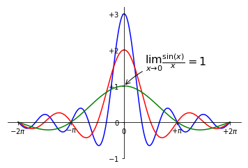


```python
import matplotlib.pyplot as plt
import numpy as np
import pandas as pd
data = {'series1':[1,3,4,3,5],
'series2':[2,4,5,2,4],
'series3':[3,2,3,1,3]}
df = pd.DataFrame(data)
x = np.arange(5)
plt.axis([0,5,0,7])
plt.plot(x,df)
plt.legend(data, loc=2)
```


    <matplotlib.legend.Legend at 0xf047270>


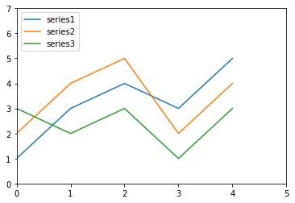


# 7.12　直方图　　180


```python
import matplotlib.pyplot as plt
import numpy as np
pop = np.random.randint(0,100,100)
pop
```


    array([32, 29, 53,  8, 43, 91, 54, 31, 81, 54, 28, 56, 43, 39, 96, 44,  6,
           71, 29, 26, 34, 41, 78, 45,  1, 22, 94, 89, 19,  6, 95,  3, 86, 10,
            1, 54, 51,  5, 20, 18, 87, 12, 92, 50, 82,  3, 56, 23, 57, 92, 25,
            2, 86, 32, 75, 13, 85, 90,  8, 77, 91,  5, 31, 34, 44, 67, 30, 15,
           42, 63, 15, 38, 56, 83,  2, 18, 94, 49, 31, 47, 25,  5, 20, 70, 47,
           65, 29, 44, 23, 35, 73, 96, 34, 27, 11, 70, 96, 21, 71, 69])


```python
n,bins,patches = plt.hist(pop,bins=20)
```


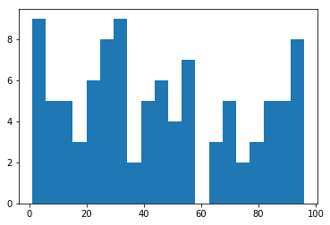


# 7.13　条状图　　181


```python
import matplotlib.pyplot as plt
index = [0,1,2,3,4]
values = [5,7,3,4,6]
plt.bar(index,values)
```


    <Container object of 5 artists>


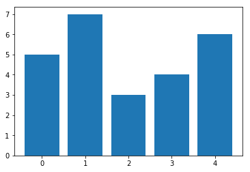


```python
import numpy as np
index = np.arange(5)
values1 = [5,7,3,4,6]
plt.bar(index,values1)
plt.xticks(index+0.4,['A','B','C','D','E'])
```


    ([<matplotlib.axis.XTick at 0xf3246f0>,
      <matplotlib.axis.XTick at 0xf261bd0>,
      <matplotlib.axis.XTick at 0xf31c310>,
      <matplotlib.axis.XTick at 0xf3423f0>,
      <matplotlib.axis.XTick at 0xf342790>],
     <a list of 5 Text xticklabel objects>)


```python
import numpy as np
index = np.arange(5)
values1 = [5,7,3,4,6]
std1 = [0.8,1,0.4,0.9,1.3]
plt.title('A Bar Chart')
plt.bar(index,values1,yerr=std1,error_kw={'ecolor':'0.1',
'capsize':6},alpha=0.7,label='First')
plt.xticks(index+0.4,['A','B','C','D','E'])
plt.legend(loc=2)
```


    <matplotlib.legend.Legend at 0xf389970>


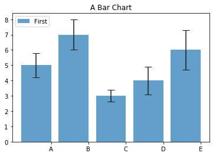


## 7.13.1　水平条状图　　183


```python
import matplotlib.pyplot as plt
import numpy as np
index = np.arange(5)
values1 = [5,7,3,4,6]
std1 = [0.8,1,0.4,0.9,1.3]
plt.title('A Horizontal Bar Chart')
plt.barh(index,values1,xerr=std1,error_kw={'ecolor':'0.1','capsize':6},alpha=0.7,
label='First')
plt.yticks(index+0.4,['A','B','C','D','E'])
plt.legend(loc=5)
```


    <matplotlib.legend.Legend at 0xf3c9630>


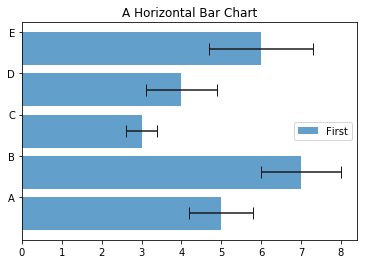


## 7.13.2　多序列条状图　　184


```python
import matplotlib.pyplot as plt
import numpy as np
index = np.arange(5)
values1 = [5,7,3,4,6]
values2 = [6,6,4,5,7]
values3 = [5,6,5,4,6]
bw = 0.3
plt.axis([0,5,0,8])
plt.title('A Multiseries Bar Chart',fontsize=20)
plt.bar(index,values1,bw,color='b')
plt.bar(index+bw,values2,bw,color='g')
plt.bar(index+2*bw,values3,bw,color='r')
plt.xticks(index+1.5*bw,['A','B','C','D','E'])
```


    ([<matplotlib.axis.XTick at 0xf39dcd0>,
      <matplotlib.axis.XTick at 0xf39ded0>,
      <matplotlib.axis.XTick at 0xf3ef4b0>,
      <matplotlib.axis.XTick at 0xf42d230>,
      <matplotlib.axis.XTick at 0xf42d5d0>],
     <a list of 5 Text xticklabel objects>)


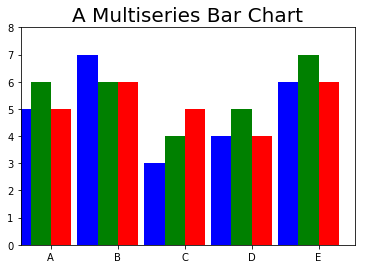


```python
import matplotlib.pyplot as plt
import numpy as np
index = np.arange(5)
values1 = [5,7,3,4,6]
values2 = [6,6,4,5,7]
values3 = [5,6,5,4,6]
bw = 0.3
plt.axis([0,8,0,5])
plt.title('A Multiseries Horizontal Bar Chart',fontsize=20)
plt.barh(index,values1,bw,color='b')
plt.barh(index+bw,values2,bw,color='g')
plt.barh(index+2*bw,values3,bw,color='r')
plt.yticks(index+0.4,['A','B','C','D','E'])
```


    ([<matplotlib.axis.YTick at 0xf43e810>,
      <matplotlib.axis.YTick at 0xf43e0f0>,
      <matplotlib.axis.YTick at 0xf44f330>,
      <matplotlib.axis.YTick at 0xf473f50>,
      <matplotlib.axis.YTick at 0xf47d310>],
     <a list of 5 Text yticklabel objects>)


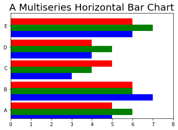


## 7.13.3　为pandas DataFrame生成多序列条状图　　185


```python
import matplotlib.pyplot as plt
import numpy as np
import pandas as pd
data = {'series1':[1,3,4,3,5],
'series2':[2,4,5,2,4],
'series3':[3,2,3,1,3]}
df = pd.DataFrame(data)
df.plot(kind='bar')
```


    <matplotlib.axes._subplots.AxesSubplot at 0xf3a3330>


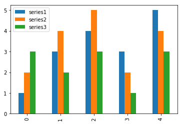


```python
import matplotlib.pyplot as plt
import numpy as np
import pandas as pd
data = {'series1':[1,3,4,3,5],
'series2':[2,4,5,2,4],
'series3':[3,2,3,1,3]}
df = pd.DataFrame(data)
df.plot(kind='barh')
```


    <matplotlib.axes._subplots.AxesSubplot at 0xf3bf030>


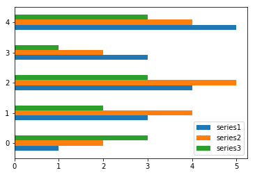


## 7.13.4　多序列堆积条状图　　186


```python
import matplotlib.pyplot as plt
import numpy as np
series1 = np.array([3,4,5,3])
series2 = np.array([1,2,2,5])
series3 = np.array([2,3,3,4])
index = np.arange(4)
plt.axis([0,4,0,15])
plt.bar(index,series1,color='r')
plt.bar(index,series2,color='b',bottom=series1)
plt.bar(index,series3,color='g',bottom=(series2+series1))
plt.xticks(index+0.4,['Jan15','Feb15','Mar15','Apr15'])
```


    ([<matplotlib.axis.XTick at 0xf53e9f0>,
      <matplotlib.axis.XTick at 0xf549250>,
      <matplotlib.axis.XTick at 0xf53ef70>,
      <matplotlib.axis.XTick at 0xf5790b0>],
     <a list of 4 Text xticklabel objects>)


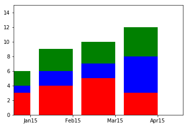


```python
import matplotlib.pyplot as plt
import numpy as np
index = np.arange(4)
series1 = np.array([3,4,5,3])
series2 = np.array([1,2,2,5])
series3 = np.array([2,3,3,4])
plt.axis([0,15,0,4])
plt.title('A Multiseries Horizontal Stacked Bar Chart')
plt.barh(index,series1,color='r')
plt.barh(index,series2,color='g',left=series1)
plt.barh(index,series3,color='b',left=(series1+series2))
plt.yticks(index+0.4,['Jan15','Feb15','Mar15','Apr15'])
```


    ([<matplotlib.axis.YTick at 0xf58b1d0>,
      <matplotlib.axis.YTick at 0xf549ff0>,
      <matplotlib.axis.YTick at 0xf58bcf0>,
      <matplotlib.axis.YTick at 0xf5bf2b0>],
     <a list of 4 Text yticklabel objects>)


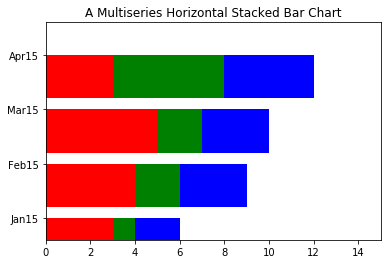


```python
import matplotlib.pyplot as plt
import numpy as np
index = np.arange(4)
series1 = np.array([3,4,5,3])
series2 = np.array([1,2,2,5])
series3 = np.array([2,3,3,4])
plt.axis([0,15,0,4])
plt.title('A Multiseries Horizontal Stacked Bar Chart')
plt.barh(index,series1,color='w',hatch='xx')
plt.barh(index,series2,color='w',hatch='///', left=series1)
plt.barh(index,series3,color='w',hatch='\\\\\\',left=(series1+series2))
plt.yticks(index+0.4,['Jan15','Feb15','Mar15','Apr15'])
```


    ([<matplotlib.axis.YTick at 0xf5d0c10>,
      <matplotlib.axis.YTick at 0xf5b6790>,
      <matplotlib.axis.YTick at 0xf5dc170>,
      <matplotlib.axis.YTick at 0xf6066b0>],
     <a list of 4 Text yticklabel objects>)


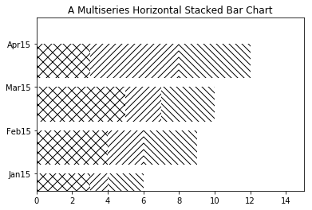


## 7.13.5　为pandas DataFrame绘制堆积条状图　　189


```python
import matplotlib.pyplot as plt
import pandas as pd
data = {'series1':[1,3,4,3,5],
'series2':[2,4,5,2,4],
'series3':[3,2,3,1,3]}
df = pd.DataFrame(data)
df.plot(kind='bar', stacked=True)
```


    <matplotlib.axes._subplots.AxesSubplot at 0xf5e74f0>


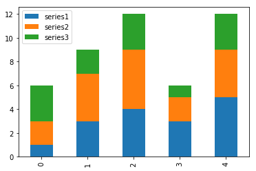


## 7.13.6　其他条状图　　190


```python
import matplotlib.pyplot as plt
x0 = np.arange(8)
y1 = np.array([1,3,4,6,4,3,2,1])
y2 = np.array([1,2,5,4,3,3,2,1])
plt.ylim(-7,7)
plt.bar(x0,y1,0.9,facecolor='r',edgecolor='w')
plt.bar(x0,-y2,0.9,facecolor='b',edgecolor='w')
plt.xticks(())
plt.grid(True)
for x, y in zip(x0, y1):
    plt.text(x + 0.4, y + 0.05, '%d' % y, ha='center', va= 'bottom')
for x, y in zip(x0, y2):
    plt.text(x + 0.4, (-y) - 0.05, '%d' % y, ha='center', va= 'top')
```


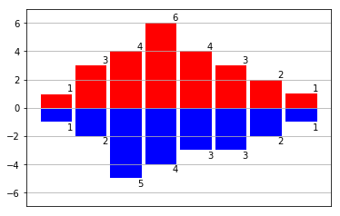


# 7.14　饼图　　190


```python
import matplotlib.pyplot as plt
labels = ['Nokia','Samsung','Apple','Lumia']
values = [10,30,45,15]
colors = ['yellow','green','red','blue']
plt.pie(values,labels=labels,colors=colors)
plt.axis('equal')
```


    (-1.11637372803214,
     1.1007797090739162,
     -1.1163737124158366,
     1.1007797083302826)


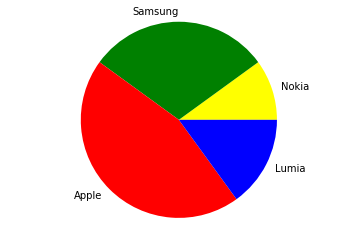


```python
import matplotlib.pyplot as plt
labels = ['Nokia','Samsung','Apple','Lumia']
values = [10,30,45,15]
colors = ['yellow','green','red','blue']
explode = [0.3,0,0,0]
plt.title('A Pie Chart')
plt.pie(values,labels=labels,colors=colors,explode=explode,startangle=180)
plt.axis('equal')
```


    (-1.4003625034945653,
     1.130639575385504,
     -1.1007797083302826,
     1.1163737124158366)


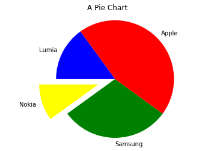


```python
import matplotlib.pyplot as plt
labels = ['Nokia','Samsung','Apple','Lumia']
values = [10,30,45,15]
colors = ['yellow','green','red','blue']
explode = [0.3,0,0,0]
plt.title('A Pie Chart')
plt.pie(values,labels=labels,colors=colors,explode=explode,
shadow=True,autopct='%1.1f%%',startangle=180)
plt.axis('equal')
```


    (-1.4003625034945653,
     1.130639575385504,
     -1.1007797083302826,
     1.1163737124158366)


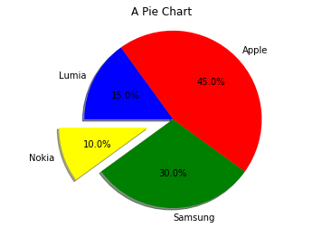


```python
import matplotlib.pyplot as plt
import pandas as pd
data = {'series1':[1,3,4,3,5],
'series2':[2,4,5,2,4],
'series3':[3,2,3,1,3]}
df = pd.DataFrame(data)
df['series1'].plot(kind='pie',figsize=(6,6))
```


    <matplotlib.axes._subplots.AxesSubplot at 0xf7d2ed0>


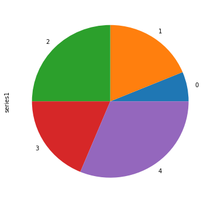


# 7.15　高级图表　　193
## 7.15.1　等值线图　　193


```python
import matplotlib.pyplot as plt
import numpy as np
dx = 0.01; dy = 0.01
x = np.arange(-2.0,2.0,dx)
y = np.arange(-2.0,2.0,dy)
X,Y = np.meshgrid(x,y)
def f(x,y):
    return (1 - y**5 + x**5)*np.exp(-x**2-y**2)
C = plt.contour(X,Y,f(X,Y),8,colors='black')
plt.contourf(X,Y,f(X,Y),8)
plt.clabel(C, inline=1, fontsize=10)
```


    <a list of 16 text.Text objects>


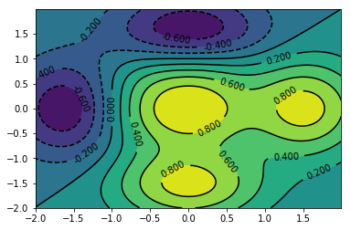


```python
import matplotlib.pyplot as plt
import numpy as np
dx = 0.01; dy = 0.01
x = np.arange(-2.0,2.0,dx)
y = np.arange(-2.0,2.0,dy)
X,Y = np.meshgrid(x,y)
C = plt.contour(X,Y,f(X,Y),8,colors='black')
plt.contourf(X,Y,f(X,Y),8,cmap=plt.cm.hot)
plt.clabel(C, inline=1, fontsize=10)
plt.colorbar()
```


    <matplotlib.colorbar.Colorbar at 0x1100f0b0>


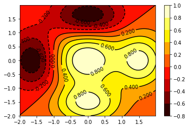


## 7.15.2　极区图　　195


```python
import matplotlib.pyplot as plt
import numpy as np
N = 8
theta = np.arange(0.,2 * np.pi, 2 * np.pi / N)
radii = np.array([4,7,5,3,1,5,6,7])
plt.axes([0.025, 0.025, 0.95, 0.95], polar=True)
colors = np.array(['#4bb2c5', '#c5b47f', '#EAA228', '#579575', '#839557', '#958c12',
'#953579', '#4b5de4'])
bars = plt.bar(theta, radii, width=(2*np.pi/N), bottom=0.0, color=colors)
```


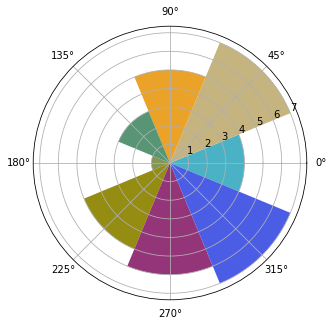


```python
import matplotlib.pyplot as plt
import numpy as np
N = 8
theta = np.arange(0.,2 * np.pi, 2 * np.pi / N)
radii = np.array([4,7,5,3,1,5,6,7])
plt.axes([0.025, 0.025, 0.95, 0.95], polar=True)
colors = np.array(['lightgreen', 'darkred', 'navy', 'brown', 'violet', 'plum',
'yellow', 'darkgreen'])
bars = plt.bar(theta, radii, width=(2*np.pi/N), bottom=0.0, color=colors)
```


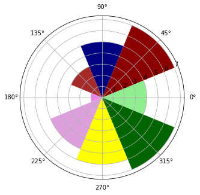


# 7.16　mplot3d　　197
## 7.16.1　3D曲面　　197


```python
from mpl_toolkits.mplot3d import Axes3D
import matplotlib.pyplot as plt
fig = plt.figure()
ax = Axes3D(fig)
X = np.arange(-2,2,0.1)
Y = np.arange(-2,2,0.1)
X,Y = np.meshgrid(X,Y)
def f(x,y):
    return (1 - y**5 + x**5)*np.exp(-x**2-y**2)
ax.plot_surface(X,Y,f(X,Y), rstride=1, cstride=1)
```


    <mpl_toolkits.mplot3d.art3d.Poly3DCollection at 0x11eade50>


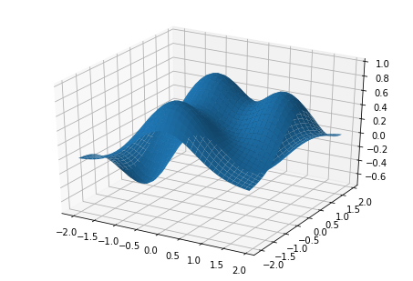


```python
from mpl_toolkits.mplot3d import Axes3D
import matplotlib.pyplot as plt
fig = plt.figure()
ax = Axes3D(fig)
X = np.arange(-2,2,0.1)
Y = np.arange(-2,2,0.1)
X,Y = np.meshgrid(X,Y)
def f(x,y):
    return (1 - y**5 + x**5)*np.exp(-x**2-y**2)
ax.plot_surface(X,Y,f(X,Y), rstride=1, cstride=1, cmap=plt.cm.hot)
ax.view_init(elev=30,azim=125)
```


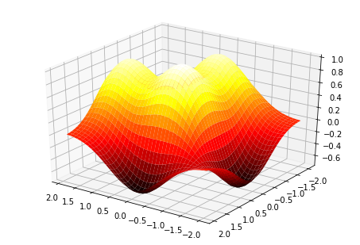


## 7.16.2　3D散点图　　198


```python
import matplotlib.pyplot as plt
import numpy as np
from mpl_toolkits.mplot3d import Axes3D
xs = np.random.randint(30,40,100)
ys = np.random.randint(20,30,100)
zs = np.random.randint(10,20,100)
xs2 = np.random.randint(50,60,100)
ys2 = np.random.randint(30,40,100)
zs2 = np.random.randint(50,70,100)
xs3 = np.random.randint(10,30,100)
ys3 = np.random.randint(40,50,100)
zs3 = np.random.randint(40,50,100)
fig = plt.figure()
ax = Axes3D(fig)
ax.scatter(xs,ys,zs)
ax.scatter(xs2,ys2,zs2,c='r',marker='^')
ax.scatter(xs3,ys3,zs3,c='g',marker='*')
ax.set_xlabel('X Label')
ax.set_ylabel('Y Label')
ax.set_zlabel('Z Label')
```


    Text(0.5,0,'Z Label')


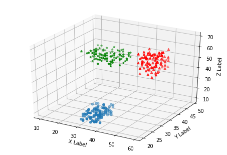


## 7.16.3　3D条状图　　199


```python
import matplotlib.pyplot as plt
import numpy as np
from mpl_toolkits.mplot3d import Axes3D
x = np.arange(8)
y = np.random.randint(0,10,8)
y2 = y + np.random.randint(0,3,8)
y3 = y2 + np.random.randint(0,3,8)
y4 = y3 + np.random.randint(0,3,8)
y5 = y4 + np.random.randint(0,3,8)
clr = ['#4bb2c5', '#c5b47f', '#EAA228', '#579575', '#839557', '#958c12', '#953579',
'#4b5de4']
fig = plt.figure()
ax = Axes3D(fig)
ax.bar(x,y,0,zdir='y',color=clr)
ax.bar(x,y2,10,zdir='y',color=clr)
ax.bar(x,y3,20,zdir='y',color=clr)
ax.bar(x,y4,30,zdir='y',color=clr)
ax.bar(x,y5,40,zdir='y',color=clr)
ax.set_xlabel('X Axis')
ax.set_ylabel('Y Axis')
ax.set_zlabel('Z Axis')
ax.view_init(elev=40)
```


# 7.17　多面板图形　　200
## 7.17.1　在其他子图中显示子图　　200


```python
import matplotlib.pyplot as plt
fig = plt.figure()
ax = fig.add_axes([0.1,0.1,0.8,0.8])
inner_ax = fig.add_axes([0.6,0.6,0.25,0.25])
```


```python
import matplotlib.pyplot as plt
import numpy as np
fig = plt.figure()
ax = fig.add_axes([0.1,0.1,0.8,0.8])
inner_ax = fig.add_axes([0.6,0.6,0.25,0.25])
x1 = np.arange(10)
y1 = np.array([1,2,7,1,5,2,4,2,3,1])
x2 = np.arange(10)
y2 = np.array([1,3,4,5,4,5,2,6,4,3])
ax.plot(x1,y1)
inner_ax.plot(x2,y2)
```


    [<matplotlib.lines.Line2D at 0x12144fd0>]


## 7.17.2　子图网格　　202


```python
import matplotlib.pyplot as plt
gs = plt.GridSpec(3,3)
fig = plt.figure(figsize=(6,6))
fig.add_subplot(gs[1,:2])
fig.add_subplot(gs[0,:2])
fig.add_subplot(gs[2,0])
fig.add_subplot(gs[:2,2])
fig.add_subplot(gs[2,1:])
```


    <matplotlib.axes._subplots.AxesSubplot at 0x12177a70>


```python
import matplotlib.pyplot as plt
import numpy as np
gs = plt.GridSpec(3,3)
fig = plt.figure(figsize=(6,6))
x1 = np.array([1,3,2,5])
y1 = np.array([4,3,7,2])
x2 = np.arange(5)
y2 = np.array([3,2,4,6,4])
s1 = fig.add_subplot(gs[1,:2])
s1.plot(x,y,'r')
s2 = fig.add_subplot(gs[0,:2])
s2.bar(x2,y2)
s3 = fig.add_subplot(gs[2,0])
s3.barh(x2,y2,color='g')
s4 = fig.add_subplot(gs[:2,2])
s4.plot(x2,y2,'k')
s5 = fig.add_subplot(gs[2,1:])
s5.plot(x1,y1,'b^',x2,y2,'yo')
```


    [<matplotlib.lines.Line2D at 0x1238a410>,
     <matplotlib.lines.Line2D at 0x1238a4d0>]


# 7.18　小结　　204
