第9章　数据分析实例——气象数据　　230
9.1　待检验的假设：靠海对气候的影响　　230
9.2　数据源　　233
9.3　用IPython Notebook做数据分析　　234
9.4　风向频率玫瑰图　　246
9.5　小结　　251

```python
import numpy as np
import pandas as pd
import datetime
```


```python
ferrara = pd.read_json('http://api.openweathermap.org/data/2.5/history/city?q=Ferrara,IT')
```


```python
torino = pd.read_json('http://api.openweathermap.org/data/2.5/history/city?q=Torino,IT')
```


```python
mantova = pd.read_json('http://api.openweathermap.org/data/2.5/history/city?q=Mantova,IT')
```


```python
milano = pd.read_json('http://api.openweathermap.org/data/2.5/history/city?q=Milano,IT')
```


```python
ravenna = pd.read_json('http://api.openweathermap.org/data/2.5/history/city?q=Ravenna,IT')  
```


```python
asti = pd.read_json('http://api.openweathermap.org/data/2.5/history/city?q=Asti,IT')
```


```python
bologna = pd.read_json('http://api.openweathermap.org/data/2.5/history/city?q=Bologna,IT')
```


```python
piacenza = pd.read_json('http://api.openweathermap.org/data/2.5/history/city?q=Piacenza,IT')
```


```python
cesena = pd.read_json('http://api.openweathermap.org/data/2.5/history/city?q=Cesena,IT')
```


```python
faenza = pd.read_json('http://api.openweathermap.org/data/2.5/history/city?q=Faenza,IT')
```


```python
def prepare(city_list,city_name):
    temp = [ ]
    humidity = [ ]
    pressure = [ ]
    description = [ ]
    dt = [ ]
    wind_speed = [ ]
    wind_deg = [ ]
    for row in city_list:
       temp.append(row['main']['temp']-273.15)
       humidity.append(row['main']['humidity'])
       pressure.append(row['main']['pressure'])
       description.append(row['weather'][0]['description'])
       dt.append(row['dt'])
       wind_speed.append(row['wind']['speed'])
       wind_deg.append(row['wind']['deg'])
    headings = ['temp','humidity','pressure','description','dt','wind_speed','wind_deg']
    data = [temp,humidity,pressure,description,dt,wind_speed,wind_deg]
    df = pd.DataFrame(data,index=headings)
    city = df.T
    city['city'] = city_name
    city['day'] = city['dt'].apply(datetime.datetime.fromtimestamp)
    return city
```


```python
df_ferrara = prepare(ferrara.list,'Ferrara')
df_milano = prepare(milano.list,'Milano')
df_mantova = prepare(mantova.list,'Mantova')
df_ravenna = prepare(ravenna.list,'Ravenna')
df_torino = prepare(torino.list,'Torino')
#df_alessandria = prepare(alessandria.list,'Alessandria')
df_asti = prepare(asti.list,'Asti')
df_bologna = prepare(bologna.list,'Bologna')
df_piacenza = prepare(piacenza.list,'Piacenza')
df_cesena = prepare(cesena.list,'Cesena')
df_faenza = prepare(faenza.list,'Faenza')
```


```python
print df_ferrara.shape
print df_milano.shape
print df_mantova.shape
print df_ravenna.shape
print df_torino.shape
print df_asti.shape
print df_bologna.shape
print df_piacenza.shape
print df_cesena.shape
print df_faenza.shape

```

    (24, 9)
    (24, 9)
    (24, 9)
    (24, 9)
    (24, 9)
    (24, 9)
    (24, 9)
    (24, 9)
    (24, 9)
    (24, 9)
    


```python
#http://it.thetimenow.com/distance-calculator.php
#(Comacchio)
df_ravenna['dist'] = 8
df_cesena['dist'] = 14
df_faenza['dist'] = 37
df_ferrara['dist'] = 47
df_bologna['dist'] = 71
df_mantova['dist'] = 121 
df_piacenza['dist'] = 200
df_milano['dist'] = 250
df_asti['dist'] = 315
df_torino['dist'] = 357

```


```python
import pandas as pd
#df_ferrara.to_csv('ferrara_270615.csv')
#df_milano.to_csv('milano_270615.csv')
#df_mantova.to_csv('mantova_270615.csv')
#df_ravenna.to_csv('ravenna_270615.csv')
#df_torino.to_csv('torino_270615.csv')
#df_asti.to_csv('asti_270615.csv')
#df_bologna.to_csv('bologna_270615.csv')
#df_piacenza.to_csv('piacenza_270615.csv')
#df_cesena.to_csv('cesena_270615.csv')
#df_faenza.to_csv('faenza_270615.csv')
df_ferrara = pd.read_csv('ferrara_270615.csv')
df_milano = pd.read_csv('milano_270615.csv')
df_mantova = pd.read_csv('mantova_270615.csv')
df_ravenna = pd.read_csv('ravenna_270615.csv')
df_torino = pd.read_csv('torino_270615.csv')
df_asti = pd.read_csv('asti_270615.csv')
df_bologna = pd.read_csv('bologna_270615.csv')
df_piacenza = pd.read_csv('piacenza_270615.csv')
df_cesena = pd.read_csv('cesena_270615.csv')
df_faenza = pd.read_csv('faenza_270615.csv')
```


```python
df_cesena.columns
```


    Index(['Unnamed: 0', 'temp', 'humidity', 'pressure', 'description', 'dt',
           'wind_speed', 'wind_deg', 'city', 'day', 'dist'],
          dtype='object')


```python
dist = [df_ravenna['dist'][0],
     df_cesena['dist'][0],
     df_faenza['dist'][0],
     df_ferrara['dist'][0],
     df_bologna['dist'][0],
     df_mantova['dist'][0],
     df_piacenza['dist'][0],
     df_milano['dist'][0],
     df_asti['dist'][0],
     df_torino['dist'][0]
]
temp_max = [df_ravenna['temp'].max(),
     df_cesena['temp'].max(),
     df_faenza['temp'].max(),
     df_ferrara['temp'].max(),
     df_bologna['temp'].max(),
     df_mantova['temp'].max(),
     df_piacenza['temp'].max(),
     df_milano['temp'].max(),
     df_asti['temp'].max(),
     df_torino['temp'].max()
]
temp_min = [df_ravenna['temp'].min(),
     df_cesena['temp'].min(),
     df_faenza['temp'].min(),
     df_ferrara['temp'].min(),
     df_bologna['temp'].min(),
     df_mantova['temp'].min(),
     df_piacenza['temp'].min(),
     df_milano['temp'].min(),
     df_asti['temp'].min(),
     df_torino['temp'].min()
]
hum_min = [df_ravenna['humidity'].min(),
     df_cesena['humidity'].min(),
     df_faenza['humidity'].min(),
     df_ferrara['humidity'].min(),
     df_bologna['humidity'].min(),
     df_mantova['humidity'].min(),
     df_piacenza['humidity'].min(),
     df_milano['humidity'].min(),
     df_asti['humidity'].min(),
     df_torino['humidity'].min()
]
hum_max = [df_ravenna['humidity'].max(),
     df_cesena['humidity'].max(),
     df_faenza['humidity'].max(),
     df_ferrara['humidity'].max(),
     df_bologna['humidity'].max(),
     df_mantova['humidity'].max(),
     df_piacenza['humidity'].max(),
     df_milano['humidity'].max(),
     df_asti['humidity'].max(),
     df_torino['humidity'].max()
]
```


```python
%matplotlib inline
import matplotlib.pyplot as plt
import matplotlib.dates as mdates
```


```python
#temperatura massima
plt.plot(dist,temp_max,'ro')
```


    [<matplotlib.lines.Line2D at 0xd697650>]


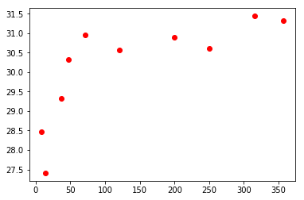


```python
x = np.array(dist)
y = np.array(temp_max)
x1 = x[x<100]
x1 = x1.reshape((x1.size,1))
y1 = y[x<100]
x2 = x[x>50]
x2 = x2.reshape((x2.size,1))
y2 = y[x>50]
```


```python
from sklearn.svm import SVR
svr_lin1 = SVR(kernel='linear', C=1e3)
svr_lin2 = SVR(kernel='linear', C=1e3)
svr_lin1.fit(x1, y1)
svr_lin2.fit(x2, y2)
xp1 = np.arange(10,100,10).reshape((9,1))
xp2 = np.arange(50,400,50).reshape((7,1))
yp1 = svr_lin1.predict(xp1)
yp2 = svr_lin2.predict(xp2)

```


```python
plt.plot(xp1, yp1, c='r', label='Strong sea effect')
plt.plot(xp2, yp2, c='b', label='Light sea effect')
plt.axis((0,400,20,40))
plt.scatter(x, y, c='k', label='data')
```


    <matplotlib.collections.PathCollection at 0x18627cf8>


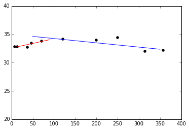


```python
from scipy.optimize import fsolve

def line1(x):
    a1 = svr_lin1.coef_[0][0]
    b1 = svr_lin1.intercept_[0]
    return -a1*x + b1
def line2(x):
    a2 = svr_lin2.coef_[0][0]
    b2 = svr_lin2.intercept_[0]
    return -a2*x + b2
def findIntersection(fun1,fun2,x0):
 return fsolve(lambda x : fun1(x) - fun2(x),x0)

result = findIntersection(line1,line2,0.0)
print "[x,y] = [ %d , %d ]" % (result,line1(result))
x = numpy.linspace(0,300,31)
plt.plot(x,line1(x),x,line2(x),result,line1(result),'ro')
```

    [x,y] = [ 101 , 34 ]
    


    ---------------------------------------------------------------------------

    NameError                                 Traceback (most recent call last)

    <ipython-input-25-389f5c694cae> in <module>()
         14 result = findIntersection(line1,line2,0.0)
         15 print "[x,y] = [ %d , %d ]" % (result,line1(result))
    ---> 16 x = numpy.linspace(0,300,31)
         17 plt.plot(x,line1(x),x,line2(x),result,line1(result),'ro')
    

    NameError: name 'numpy' is not defined


```python
#temperatures min
plt.axis((0,400,15,25))
plt.plot(dist,temp_min,'bo')
```


    [<matplotlib.lines.Line2D at 0x18716320>]


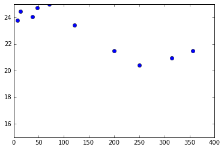


```python
#min humidity
plt.plot(dist,hum_min,'bo')
```


    [<matplotlib.lines.Line2D at 0x18b3de80>]


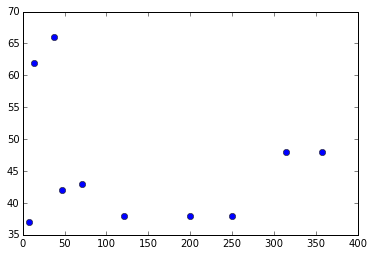


```python
#max humidity
plt.plot(dist,hum_max,'bo')
```


    [<matplotlib.lines.Line2D at 0x18bc8080>]


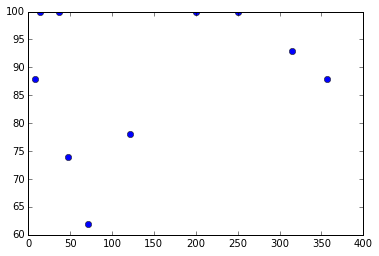


```python
#temperature
y1 = df_milano['temp']
x1 = df_milano['day']
fig, ax = plt.subplots()
plt.xticks(rotation=70)
hours = mdates.DateFormatter('%H:%M')
ax.xaxis.set_major_formatter(hours)
ax.plot(x1,y1,'r')
```


    [<matplotlib.lines.Line2D at 0x1a109f28>]


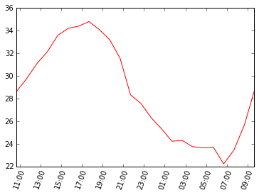


```python
#humidity
y1 = df_milano['humidity']
x1 = df_milano['day']
fig, ax = plt.subplots()
plt.xticks(rotation=70)
hours = mdates.DateFormatter('%H:%M')
ax.xaxis.set_major_formatter(hours)
ax.plot(x1,y1,'r')
```


    [<matplotlib.lines.Line2D at 0x1a2f47f0>]


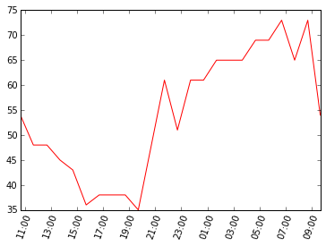


```python
y1 = df_ravenna['temp']
x1 = df_ravenna['day']
y2 = df_ferrara['temp']
x2 = df_ferrara['day']
y3 = df_milano['temp']
x3 = df_milano['day']
fig, ax = plt.subplots()
plt.xticks(rotation=70)
hours = mdates.DateFormatter('%H:%M')
ax.xaxis.set_major_formatter(hours)
plt.plot(x1,y1,'r',x2,y2,'b',x3,y3,'g')
```


    [<matplotlib.lines.Line2D at 0x1a432e10>,
     <matplotlib.lines.Line2D at 0x1a586748>,
     <matplotlib.lines.Line2D at 0x1a586b38>]


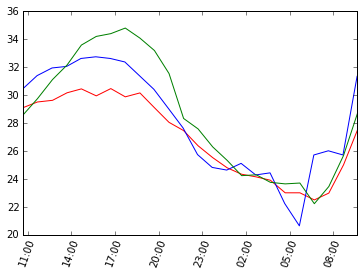


```python
y1 = df_ravenna['humidity']
x1 = df_ravenna['day']
y2 = df_ferrara['humidity']
x2 = df_ferrara['day']
y3 = df_milano['humidity']
x3 = df_milano['day']
fig, ax = plt.subplots()
plt.xticks(rotation=70)
hours = mdates.DateFormatter('%H:%M')
ax.xaxis.set_major_formatter(hours)
plt.plot(x1,y1,'r',x2,y2,'b',x3,y3,'g')
```


    [<matplotlib.lines.Line2D at 0x1a5d6f60>,
     <matplotlib.lines.Line2D at 0x1a7fb9b0>,
     <matplotlib.lines.Line2D at 0x1a7fbda0>]


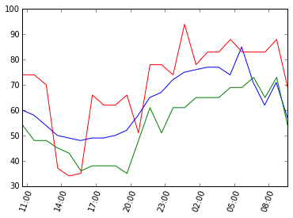


```python
y1 = df_ravenna['humidity']
x1 = df_ravenna['day']
y2 = df_faenza['humidity']
x2 = df_faenza['day']
y3 = df_cesena['humidity']
x3 = df_cesena['day']
y4 = df_milano['humidity']
x4 = df_milano['day']
y5 = df_asti['humidity']
x5 = df_asti['day']
y6 = df_torino['humidity']
x6 = df_torino['day']
fig, ax = plt.subplots()
plt.xticks(rotation=70)
hours = mdates.DateFormatter('%H:%M')
ax.xaxis.set_major_formatter(hours)
plt.plot(x1,y1,'r',x2,y2,'r',x3,y3,'r')
plt.plot(x4,y4,'g',x5,y5,'g',x6,y6,'g')
```


    [<matplotlib.lines.Line2D at 0x18606668>,
     <matplotlib.lines.Line2D at 0x1a86ec18>,
     <matplotlib.lines.Line2D at 0x1a861470>]


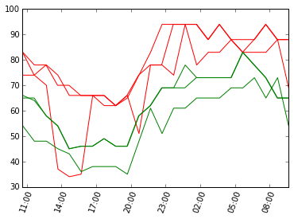


```python
y1 = df_ravenna['temp']
x1 = df_ravenna['day']
y2 = df_faenza['temp']
x2 = df_faenza['day']
y3 = df_cesena['temp']
x3 = df_cesena['day']
y4 = df_milano['temp']
x4 = df_milano['day']
y5 = df_asti['temp']
x5 = df_asti['day']
y6 = df_torino['temp']
x6 = df_torino['day']
fig, ax = plt.subplots()
plt.xticks(rotation=70)
hours = mdates.DateFormatter('%H:%M')
ax.xaxis.set_major_formatter(hours)
plt.plot(x1,y1,'r',x2,y2,'r',x3,y3,'r')
plt.plot(x4,y4,'g',x5,y5,'g',x6,y6,'g')
```


    [<matplotlib.lines.Line2D at 0x1aa22a90>,
     <matplotlib.lines.Line2D at 0x1ac54ba8>,
     <matplotlib.lines.Line2D at 0x1ac49518>]


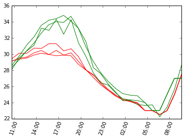


```python
hum_mean = [df_ravenna['humidity'].mean(),
     df_cesena['humidity'].mean(),
     df_faenza['humidity'].mean(),
     df_ferrara['humidity'].mean(),
     df_bologna['humidity'].mean(),
     df_mantova['humidity'].mean(),
     df_piacenza['humidity'].mean(),
     df_milano['humidity'].mean(),
     df_asti['humidity'].mean(),
     df_torino['humidity'].mean()
]
plt.plot(dist,hum_mean,'bo')
```


    [<matplotlib.lines.Line2D at 0x1acbfb70>]


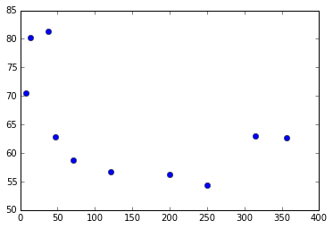


```python
y1 = df_ravenna['wind_speed']*20
y2 = df_ravenna['humidity']
x = df_ravenna['day']
fig, ax = plt.subplots()
plt.xticks(rotation=70)
hours = mdates.DateFormatter('%H:%M')
ax.xaxis.set_major_formatter(hours)
plt.plot(x,y1,'r',x,y2,'b')
```


    [<matplotlib.lines.Line2D at 0x1ab2ee80>,
     <matplotlib.lines.Line2D at 0x1b0a0668>]


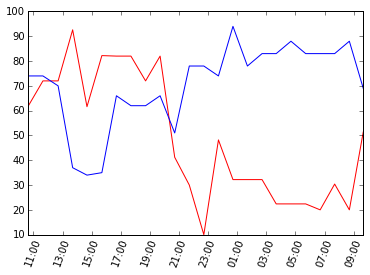


```python
plt.plot(df_ravenna['wind_deg'],df_ravenna['wind_speed'],'ro')
```


    [<matplotlib.lines.Line2D at 0x1b11c4e0>]


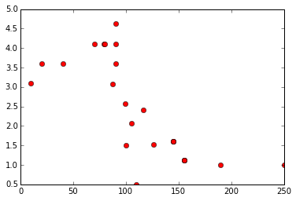


```python
plt.subplot(211)
plt.plot(df_cesena['wind_deg'],df_cesena['humidity'],'bo')
plt.subplot(212)
plt.plot(df_cesena['wind_deg'],df_cesena['wind_speed'],'bo')
```


    [<matplotlib.lines.Line2D at 0x1b4db6d8>]


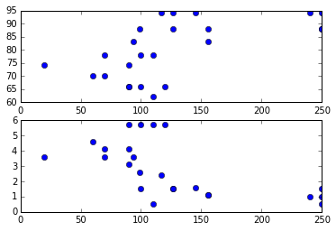


```python
hist, bins = np.histogram(df_ravenna['wind_deg'],8,[0,360])
print hist
print bins
```

    [3 4 9 6 1 1 0 0]
    [   0.   45.   90.  135.  180.  225.  270.  315.  360.]
    


```python
def showRoseWind(values,city_name,max_value):
   N = 8
   theta = np.arange(0.,2 * np.pi, 2 * np.pi / N)
   radii = np.array(values)
   plt.axes([0.025, 0.025, 0.95, 0.95], polar=True)
   colors = [(1-x/max_value, 1-x/max_value, 0.75) for x in radii]
   plt.bar(theta, radii, width=(2*np.pi/N), bottom=0.0, color=colors)
   plt.title(city_name,x=0.2, fontsize=20)
```


```python
hist, bin = np.histogram(df_ravenna['wind_deg'],8,[0,360])
print hist
showRoseWind(hist,'Ravenna', 15.0)
```

    [3 4 9 6 1 1 0 0]
    


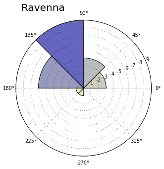


```python
hist, bin = np.histogram(df_piacenza['wind_deg'],8,[0,360])
print hist
showRoseWind(hist,'Piacenza', 15.0)

```

    [8 3 4 2 4 1 1 1]
    


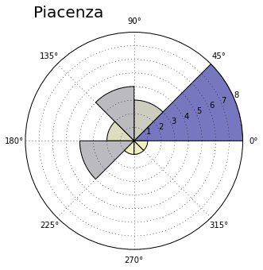


```python
print df_milano[df_milano['wind_deg']<45]['wind_speed']
print df_milano[df_milano['wind_deg']<45]['wind_speed'].mean()

```

    1     2.6
    3     2.1
    5     2.1
    13    0.5
    14      1
    18      1
    21      1
    Name: wind_speed, dtype: object
    1.47142857143
    


```python
print df_milano[df_milano['wind_deg']<45]['wind_speed'].mean()
#print df_milano[(df_milano['wind_deg']>0) & (df_milano['wind_deg']<45)]['wind_speed'].mean()
print df_milano[(df_milano['wind_deg']>44) & (df_milano['wind_deg']<90)]['wind_speed'].mean()
print df_milano[(df_milano['wind_deg']>89) & (df_milano['wind_deg']<135)]['wind_speed'].mean()
print df_milano[(df_milano['wind_deg']>134) & (df_milano['wind_deg']<180)]['wind_speed'].mean()
print df_milano[(df_milano['wind_deg']>179) & (df_milano['wind_deg']<225)]['wind_speed'].mean()
print df_milano[(df_milano['wind_deg']>224) & (df_milano['wind_deg']<270)]['wind_speed'].mean()
print df_milano[(df_milano['wind_deg']>269) & (df_milano['wind_deg']<315)]['wind_speed'].mean()
#print df_milano[(df_milano['wind_deg']>314) & (df_milano['wind_deg']<360)]['wind_speed'].mean()
print df_milano[df_milano['wind_deg']>314]['wind_speed'].mean()
```

    1.47142857143
    2.04
    2.06666666667
    2.05
    2.68333333333
    2.1
    nan
    nan
    


```python
degs = np.arange(45,361,45)
print degs
```

    [ 45  90 135 180 225 270 315 360]
    


```python
tmp =  []
for deg in degs:
    #print df_milano[(df_milano['wind_deg']>(deg-46)) & (df_milano['wind_deg']<deg)]['wind_speed'].mean()
    tmp.append(df_milano[(df_milano['wind_deg']>(deg-46)) & (df_milano['wind_deg']<deg)]['wind_speed'].mean())
speeds = np.array(tmp)
print speeds
```

    [ 1.675              nan         nan         nan  2.93333333  3.13636364
      2.58               nan]
    


```python
N = 8
theta = np.arange(0.,2 * np.pi, 2 * np.pi / N)
radii = np.array(speeds)
plt.axes([0.025, 0.025, 0.95, 0.95], polar=True)
colors = [(1-x/10.0, 1-x/10.0, 0.75) for x in radii]
bars = plt.bar(theta, radii, width=(2*np.pi/N), bottom=0.0, color=colors)
plt.title('Milano',x=0.2, fontsize=20)

```


    <matplotlib.text.Text at 0x1be13ef0>


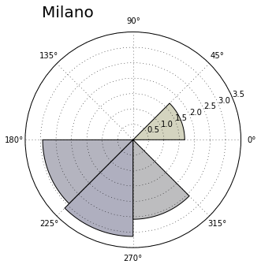


```python
def RoseWind_Speed(df_city):
   degs = np.arange(45,361,45)
   tmp =  []
   for deg in degs:
      tmp.append(df_city[(df_city['wind_deg']>(deg-46)) & (df_city['wind_deg']<deg)]['wind_speed'].mean())
   return np.array(tmp)
```


```python
def showRoseWind_Speed(speeds,city_name):
   N = 8
   theta = np.arange(0.,2 * np.pi, 2 * np.pi / N)
   radii = np.array(speeds)
   plt.axes([0.025, 0.025, 0.95, 0.95], polar=True)
   colors = [(1-x/10.0, 1-x/10.0, 0.75) for x in radii]
   bars = plt.bar(theta, radii, width=(2*np.pi/N), bottom=0.0, color=colors)
   plt.title(city_name,x=0.2, fontsize=20)
```


```python
showRoseWind(RoseWind_Speed(df_milano),'Milano',10)
```


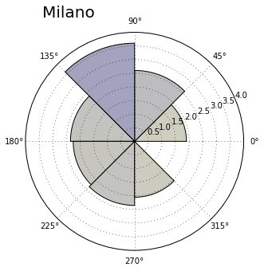


```python
showRoseWind_Speed(RoseWind_Speed(df_ravenna),'Ravenna')
```


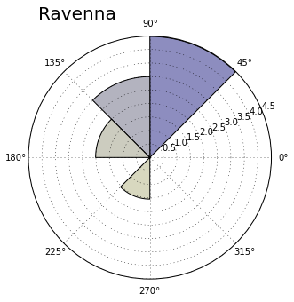


```python
showRoseWind_Speed(RoseWind_Speed(df_faenza),'Faenza')
```


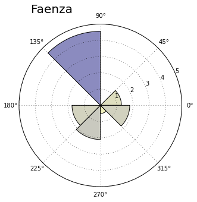


```python
showRoseWind_Speed(RoseWind_Speed(df_cesena),'Cesena')
```


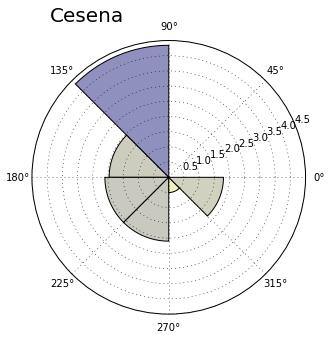


```python
showRoseWind_Speed(RoseWind_Speed(df_ferrara),'Ferrara')
```


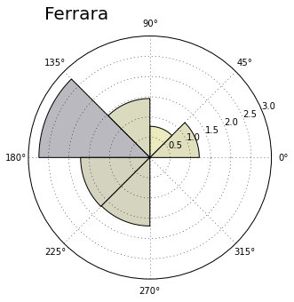


```python
showRoseWind_Speed(RoseWind_Speed(df_torino),'Torino')
```


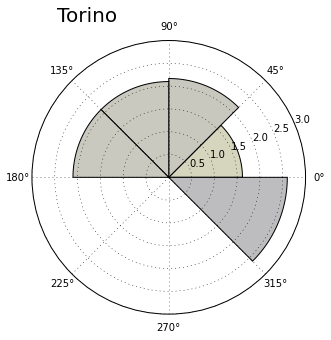


```python
showRoseWind_Speed(RoseWind_Speed(df_mantova),'Mantova')
```


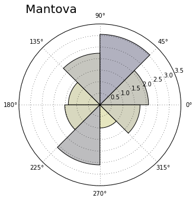


```python
ferrara = pd.read_json('http://api.openweathermap.org/data/2.5/history/city?q=Ferrara,IT')
```


```python
df_ferrara.to_csv('ferrara.csv')
df_milano.to_csv('milano.csv')
df_mantova.to_csv('mantova.csv')
df_ravenna.to_csv('ravenna.csv')
df_torino.to_csv('torino.csv')
df_asti.to_csv('asti.csv')
df_bologna.to_csv('bologna.csv')
df_piacenza.to_csv('piacenza.csv')
df_cesena.to_csv('cesena.csv')
df_faenza.to_csv('faenza.csv')
```
